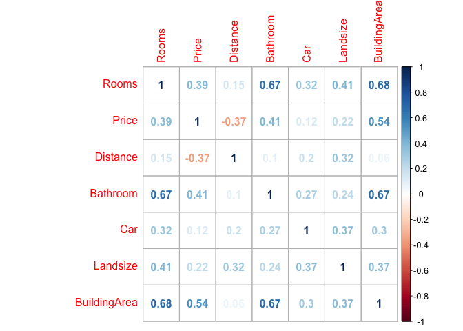
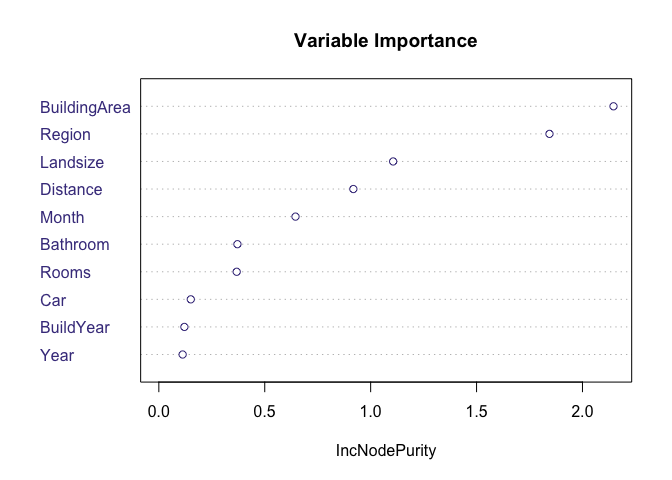

melbourneTown
================

R Markdown
----------

This is an R Markdown document. Markdown is a simple formatting syntax for authoring HTML, PDF, and MS Word documents. For more details on using R Markdown see <http://rmarkdown.rstudio.com>.

When you click the **Knit** button a document will be generated that includes both content as well as the output of any embedded R code chunks within the document. You can embed an R code chunk like this:

``` r
summary(cars)
```

    ##      speed           dist       
    ##  Min.   : 4.0   Min.   :  2.00  
    ##  1st Qu.:12.0   1st Qu.: 26.00  
    ##  Median :15.0   Median : 36.00  
    ##  Mean   :15.4   Mean   : 42.98  
    ##  3rd Qu.:19.0   3rd Qu.: 56.00  
    ##  Max.   :25.0   Max.   :120.00

``` r
melHouseStart <- read.csv("~/Desktop/Melbourne data project/melbourne-housing-market/Melbourne_housing_FULL.csv")


library(tidyverse)
```

    ## ── Attaching packages ────────────────────────────────────────────── tidyverse 1.2.1 ──

    ## ✔ ggplot2 2.2.1     ✔ purrr   0.2.4
    ## ✔ tibble  1.4.2     ✔ dplyr   0.7.4
    ## ✔ tidyr   0.8.0     ✔ stringr 1.2.0
    ## ✔ readr   1.1.1     ✔ forcats 0.3.0

    ## ── Conflicts ───────────────────────────────────────────────── tidyverse_conflicts() ──
    ## ✖ dplyr::filter() masks stats::filter()
    ## ✖ dplyr::lag()    masks stats::lag()

``` r
#----------------

melHouseStart <- as.tibble(melHouseStart)

# check the structure
str(melHouseStart)
```

    ## Classes 'tbl_df', 'tbl' and 'data.frame':    34857 obs. of  21 variables:
    ##  $ Suburb       : Factor w/ 351 levels "Abbotsford","Aberfeldie",..: 1 1 1 1 1 1 1 1 1 1 ...
    ##  $ Address      : Factor w/ 34009 levels "1 Abercrombie St",..: 29459 32513 15390 9769 25129 23201 27095 8333 26797 33959 ...
    ##  $ Rooms        : int  2 2 2 3 3 3 4 4 2 2 ...
    ##  $ Type         : Factor w/ 3 levels "h","t","u": 1 1 1 3 1 1 1 1 1 1 ...
    ##  $ Price        : int  NA 1480000 1035000 NA 1465000 850000 1600000 NA NA NA ...
    ##  $ Method       : Factor w/ 9 levels "PI","PN","S",..: 7 3 3 8 6 1 8 5 3 3 ...
    ##  $ SellerG      : Factor w/ 388 levels "@Realty","A",..: 171 34 34 313 34 34 246 246 34 76 ...
    ##  $ Date         : Factor w/ 78 levels "1/07/2017","10/02/2018",..: 59 61 64 64 65 65 66 70 70 70 ...
    ##  $ Distance     : Factor w/ 216 levels "#N/A","0","0.7",..: 82 82 82 82 82 82 82 82 82 82 ...
    ##  $ Postcode     : Factor w/ 212 levels "#N/A","3000",..: 55 55 55 55 55 55 55 55 55 55 ...
    ##  $ Bedroom2     : int  2 2 2 3 3 3 3 3 4 3 ...
    ##  $ Bathroom     : int  1 1 1 2 2 2 1 2 1 2 ...
    ##  $ Car          : int  1 1 0 1 0 1 2 2 2 1 ...
    ##  $ Landsize     : int  126 202 156 0 134 94 120 400 201 202 ...
    ##  $ BuildingArea : num  NA NA 79 NA 150 NA 142 220 NA NA ...
    ##  $ YearBuilt    : int  NA NA 1900 NA 1900 NA 2014 2006 1900 1900 ...
    ##  $ CouncilArea  : Factor w/ 34 levels "#N/A","Banyule City Council",..: 33 33 33 33 33 33 33 33 33 33 ...
    ##  $ Lattitude    : num  -37.8 -37.8 -37.8 -37.8 -37.8 ...
    ##  $ Longtitude   : num  145 145 145 145 145 ...
    ##  $ Regionname   : Factor w/ 9 levels "#N/A","Eastern Metropolitan",..: 4 4 4 4 4 4 4 4 4 4 ...
    ##  $ Propertycount: Factor w/ 343 levels "#N/A","1008",..: 191 191 191 191 191 191 191 191 191 191 ...

Including Plots
---------------

You can also embed plots, for example:

``` r
# Fix data types
# changing Distance to numeric, Propertycount to numeric, Date to date /d/m/y date format


melHouseStart$Distance <- as.numeric(as.character(melHouseStart$Distance))
```

    ## Warning: NAs introduced by coercion

``` r
melHouseStart$Propertycount <- as.numeric(as.character(melHouseStart$Propertycount))
```

    ## Warning: NAs introduced by coercion

``` r
melHouseStart$Date <- as.Date(melHouseStart$Date, "%d/%m/%Y")

#confirming the changes
glimpse(melHouseStart)
```

    ## Observations: 34,857
    ## Variables: 21
    ## $ Suburb        <fct> Abbotsford, Abbotsford, Abbotsford, Abbotsford, ...
    ## $ Address       <fct> 68 Studley St, 85 Turner St, 25 Bloomburg St, 18...
    ## $ Rooms         <int> 2, 2, 2, 3, 3, 3, 4, 4, 2, 2, 2, 3, 2, 4, 2, 3, ...
    ## $ Type          <fct> h, h, h, u, h, h, h, h, h, h, h, h, u, h, h, h, ...
    ## $ Price         <int> NA, 1480000, 1035000, NA, 1465000, 850000, 16000...
    ## $ Method        <fct> SS, S, S, VB, SP, PI, VB, SN, S, S, S, S, PI, W,...
    ## $ SellerG       <fct> Jellis, Biggin, Biggin, Rounds, Biggin, Biggin, ...
    ## $ Date          <date> 2016-09-03, 2016-12-03, 2016-02-04, 2016-02-04,...
    ## $ Distance      <dbl> 2.5, 2.5, 2.5, 2.5, 2.5, 2.5, 2.5, 2.5, 2.5, 2.5...
    ## $ Postcode      <fct> 3067, 3067, 3067, 3067, 3067, 3067, 3067, 3067, ...
    ## $ Bedroom2      <int> 2, 2, 2, 3, 3, 3, 3, 3, 4, 3, 2, 4, 2, 6, 2, NA,...
    ## $ Bathroom      <int> 1, 1, 1, 2, 2, 2, 1, 2, 1, 2, 1, 2, 2, 2, 1, NA,...
    ## $ Car           <int> 1, 1, 0, 1, 0, 1, 2, 2, 2, 1, 0, 0, 1, 0, 2, NA,...
    ## $ Landsize      <int> 126, 202, 156, 0, 134, 94, 120, 400, 201, 202, 1...
    ## $ BuildingArea  <dbl> NA, NA, 79, NA, 150, NA, 142, 220, NA, NA, NA, 2...
    ## $ YearBuilt     <int> NA, NA, 1900, NA, 1900, NA, 2014, 2006, 1900, 19...
    ## $ CouncilArea   <fct> Yarra City Council, Yarra City Council, Yarra Ci...
    ## $ Lattitude     <dbl> -37.8014, -37.7996, -37.8079, -37.8114, -37.8093...
    ## $ Longtitude    <dbl> 144.9958, 144.9984, 144.9934, 145.0116, 144.9944...
    ## $ Regionname    <fct> Northern Metropolitan, Northern Metropolitan, No...
    ## $ Propertycount <dbl> 4019, 4019, 4019, 4019, 4019, 4019, 4019, 4019, ...

Note that the `echo = FALSE` parameter was added to the code chunk to prevent printing of the R code that generated the plot.

``` r
# Adding month and year to the columns & correcting spelling on 

melHouse <- melHouseStart %>%
  mutate(Month = as.factor(strftime(Date, "%m")),
         Year = as.factor(strftime(Date, "%y"))) %>%
  rename("Lat" = "Lattitude", "Long" = "Longtitude", "Region" = "Regionname", "PropertyCount" = "Propertycount")

glimpse(melHouse) # verifying that the columns were created and renamed
```

    ## Observations: 34,857
    ## Variables: 23
    ## $ Suburb        <fct> Abbotsford, Abbotsford, Abbotsford, Abbotsford, ...
    ## $ Address       <fct> 68 Studley St, 85 Turner St, 25 Bloomburg St, 18...
    ## $ Rooms         <int> 2, 2, 2, 3, 3, 3, 4, 4, 2, 2, 2, 3, 2, 4, 2, 3, ...
    ## $ Type          <fct> h, h, h, u, h, h, h, h, h, h, h, h, u, h, h, h, ...
    ## $ Price         <int> NA, 1480000, 1035000, NA, 1465000, 850000, 16000...
    ## $ Method        <fct> SS, S, S, VB, SP, PI, VB, SN, S, S, S, S, PI, W,...
    ## $ SellerG       <fct> Jellis, Biggin, Biggin, Rounds, Biggin, Biggin, ...
    ## $ Date          <date> 2016-09-03, 2016-12-03, 2016-02-04, 2016-02-04,...
    ## $ Distance      <dbl> 2.5, 2.5, 2.5, 2.5, 2.5, 2.5, 2.5, 2.5, 2.5, 2.5...
    ## $ Postcode      <fct> 3067, 3067, 3067, 3067, 3067, 3067, 3067, 3067, ...
    ## $ Bedroom2      <int> 2, 2, 2, 3, 3, 3, 3, 3, 4, 3, 2, 4, 2, 6, 2, NA,...
    ## $ Bathroom      <int> 1, 1, 1, 2, 2, 2, 1, 2, 1, 2, 1, 2, 2, 2, 1, NA,...
    ## $ Car           <int> 1, 1, 0, 1, 0, 1, 2, 2, 2, 1, 0, 0, 1, 0, 2, NA,...
    ## $ Landsize      <int> 126, 202, 156, 0, 134, 94, 120, 400, 201, 202, 1...
    ## $ BuildingArea  <dbl> NA, NA, 79, NA, 150, NA, 142, 220, NA, NA, NA, 2...
    ## $ YearBuilt     <int> NA, NA, 1900, NA, 1900, NA, 2014, 2006, 1900, 19...
    ## $ CouncilArea   <fct> Yarra City Council, Yarra City Council, Yarra Ci...
    ## $ Lat           <dbl> -37.8014, -37.7996, -37.8079, -37.8114, -37.8093...
    ## $ Long          <dbl> 144.9958, 144.9984, 144.9934, 145.0116, 144.9944...
    ## $ Region        <fct> Northern Metropolitan, Northern Metropolitan, No...
    ## $ PropertyCount <dbl> 4019, 4019, 4019, 4019, 4019, 4019, 4019, 4019, ...
    ## $ Month         <fct> 09, 12, 02, 02, 03, 03, 06, 08, 08, 08, 05, 05, ...
    ## $ Year          <fct> 16, 16, 16, 16, 17, 17, 16, 16, 16, 16, 16, 16, ...

``` r
# Finding the descriptive statistics

summary(melHouse) # descriptive statistics with out standard deviation
```

    ##             Suburb                  Address          Rooms       
    ##  Reservoir     :  844   5 Charles St    :    6   Min.   : 1.000  
    ##  Bentleigh East:  583   25 William St   :    4   1st Qu.: 2.000  
    ##  Richmond      :  552   1 Bruce St      :    3   Median : 3.000  
    ##  Glen Iris     :  491   1 Daisy St      :    3   Mean   : 3.031  
    ##  Preston       :  485   1/1 Clarendon St:    3   3rd Qu.: 4.000  
    ##  Kew           :  467   1088 Toorak Rd  :    3   Max.   :16.000  
    ##  (Other)       :31435   (Other)         :34835                   
    ##  Type          Price              Method               SellerG     
    ##  h:23980   Min.   :   85000   S      :19744   Jellis       : 3359  
    ##  t: 3580   1st Qu.:  635000   SP     : 5095   Nelson       : 3236  
    ##  u: 7297   Median :  870000   PI     : 4850   Barry        : 3235  
    ##            Mean   : 1050173   VB     : 3108   hockingstuart: 2623  
    ##            3rd Qu.: 1295000   SN     : 1317   Marshall     : 2027  
    ##            Max.   :11200000   PN     :  308   Ray          : 1950  
    ##            NA's   :7610       (Other):  435   (Other)      :18427  
    ##       Date               Distance        Postcode        Bedroom2     
    ##  Min.   :2016-01-28   Min.   : 0.00   3073   :  844   Min.   : 0.000  
    ##  1st Qu.:2016-11-19   1st Qu.: 6.40   3046   :  638   1st Qu.: 2.000  
    ##  Median :2017-07-08   Median :10.30   3020   :  617   Median : 3.000  
    ##  Mean   :2017-05-23   Mean   :11.18   3121   :  612   Mean   : 3.085  
    ##  3rd Qu.:2017-10-28   3rd Qu.:14.00   3165   :  583   3rd Qu.: 4.000  
    ##  Max.   :2018-03-17   Max.   :48.10   3058   :  556   Max.   :30.000  
    ##                       NA's   :1       (Other):31007   NA's   :8217    
    ##     Bathroom           Car            Landsize         BuildingArea    
    ##  Min.   : 0.000   Min.   : 0.000   Min.   :     0.0   Min.   :    0.0  
    ##  1st Qu.: 1.000   1st Qu.: 1.000   1st Qu.:   224.0   1st Qu.:  102.0  
    ##  Median : 2.000   Median : 2.000   Median :   521.0   Median :  136.0  
    ##  Mean   : 1.625   Mean   : 1.729   Mean   :   593.6   Mean   :  160.3  
    ##  3rd Qu.: 2.000   3rd Qu.: 2.000   3rd Qu.:   670.0   3rd Qu.:  188.0  
    ##  Max.   :12.000   Max.   :26.000   Max.   :433014.0   Max.   :44515.0  
    ##  NA's   :8226     NA's   :8728     NA's   :11810      NA's   :21115    
    ##    YearBuilt                      CouncilArea         Lat        
    ##  Min.   :1196    Boroondara City Council: 3675   Min.   :-38.19  
    ##  1st Qu.:1940    Darebin City Council   : 2851   1st Qu.:-37.86  
    ##  Median :1970    Moreland City Council  : 2122   Median :-37.81  
    ##  Mean   :1965    Glen Eira City Council : 2006   Mean   :-37.81  
    ##  3rd Qu.:2000    Melbourne City Council : 1952   3rd Qu.:-37.75  
    ##  Max.   :2106    Banyule City Council   : 1861   Max.   :-37.39  
    ##  NA's   :19306   (Other)                :20390   NA's   :7976    
    ##       Long                              Region      PropertyCount  
    ##  Min.   :144.4   Southern Metropolitan     :11836   Min.   :   83  
    ##  1st Qu.:144.9   Northern Metropolitan     : 9557   1st Qu.: 4385  
    ##  Median :145.0   Western Metropolitan      : 6799   Median : 6763  
    ##  Mean   :145.0   Eastern Metropolitan      : 4377   Mean   : 7573  
    ##  3rd Qu.:145.1   South-Eastern Metropolitan: 1739   3rd Qu.:10412  
    ##  Max.   :145.5   Eastern Victoria          :  228   Max.   :21650  
    ##  NA's   :7976    (Other)                   :  321   NA's   :3      
    ##      Month       Year      
    ##  11     : 4387   16:10292  
    ##  09     : 4128   17:19852  
    ##  10     : 3900   18: 4713  
    ##  05     : 3416             
    ##  06     : 3175             
    ##  03     : 3094             
    ##  (Other):12757

``` r
# getting standard deviation for each variable

melHouseSD <- melHouse %>%
  summarise_all(funs(sd(., na.rm=TRUE)))
```

    ## Warning in var(if (is.vector(x) || is.factor(x)) x else as.double(x), na.rm = na.rm): Calling var(x) on a factor x is deprecated and will become an error.
    ##   Use something like 'all(duplicated(x)[-1L])' to test for a constant vector.

    ## Warning in var(if (is.vector(x) || is.factor(x)) x else as.double(x), na.rm = na.rm): Calling var(x) on a factor x is deprecated and will become an error.
    ##   Use something like 'all(duplicated(x)[-1L])' to test for a constant vector.

    ## Warning in var(if (is.vector(x) || is.factor(x)) x else as.double(x), na.rm = na.rm): Calling var(x) on a factor x is deprecated and will become an error.
    ##   Use something like 'all(duplicated(x)[-1L])' to test for a constant vector.

    ## Warning in var(if (is.vector(x) || is.factor(x)) x else as.double(x), na.rm = na.rm): Calling var(x) on a factor x is deprecated and will become an error.
    ##   Use something like 'all(duplicated(x)[-1L])' to test for a constant vector.

    ## Warning in var(if (is.vector(x) || is.factor(x)) x else as.double(x), na.rm = na.rm): Calling var(x) on a factor x is deprecated and will become an error.
    ##   Use something like 'all(duplicated(x)[-1L])' to test for a constant vector.

    ## Warning in var(if (is.vector(x) || is.factor(x)) x else as.double(x), na.rm = na.rm): Calling var(x) on a factor x is deprecated and will become an error.
    ##   Use something like 'all(duplicated(x)[-1L])' to test for a constant vector.

    ## Warning in var(if (is.vector(x) || is.factor(x)) x else as.double(x), na.rm = na.rm): Calling var(x) on a factor x is deprecated and will become an error.
    ##   Use something like 'all(duplicated(x)[-1L])' to test for a constant vector.

    ## Warning in var(if (is.vector(x) || is.factor(x)) x else as.double(x), na.rm = na.rm): Calling var(x) on a factor x is deprecated and will become an error.
    ##   Use something like 'all(duplicated(x)[-1L])' to test for a constant vector.

    ## Warning in var(if (is.vector(x) || is.factor(x)) x else as.double(x), na.rm = na.rm): Calling var(x) on a factor x is deprecated and will become an error.
    ##   Use something like 'all(duplicated(x)[-1L])' to test for a constant vector.

    ## Warning in var(if (is.vector(x) || is.factor(x)) x else as.double(x), na.rm = na.rm): Calling var(x) on a factor x is deprecated and will become an error.
    ##   Use something like 'all(duplicated(x)[-1L])' to test for a constant vector.

``` r
glimpse(melHouseSD) # getting a clean print out of the SD values
```

    ## Observations: 1
    ## Variables: 23
    ## $ Suburb        <dbl> 100.9935
    ## $ Address       <dbl> 9812.989
    ## $ Rooms         <dbl> 0.9699329
    ## $ Type          <dbl> 0.8174618
    ## $ Price         <dbl> 641467.1
    ## $ Method        <dbl> 1.988551
    ## $ SellerG       <dbl> 103.9511
    ## $ Date          <date> 1970-07-22
    ## $ Distance      <dbl> 6.788892
    ## $ Postcode      <dbl> 51.63254
    ## $ Bedroom2      <dbl> 0.9806897
    ## $ Bathroom      <dbl> 0.724212
    ## $ Car           <dbl> 1.010771
    ## $ Landsize      <dbl> 3398.842
    ## $ BuildingArea  <dbl> 401.2671
    ## $ YearBuilt     <dbl> 37.32818
    ## $ CouncilArea   <dbl> 9.936106
    ## $ Lat           <dbl> 0.0902789
    ## $ Long          <dbl> 0.1201688
    ## $ Region        <dbl> 2.051519
    ## $ PropertyCount <dbl> 4428.09
    ## $ Month         <dbl> 3.158799
    ## $ Year          <dbl> 0.6362919

``` r
# checking NA values

library(Amelia)
```

    ## Loading required package: Rcpp

    ## ## 
    ## ## Amelia II: Multiple Imputation
    ## ## (Version 1.7.4, built: 2015-12-05)
    ## ## Copyright (C) 2005-2018 James Honaker, Gary King and Matthew Blackwell
    ## ## Refer to http://gking.harvard.edu/amelia/ for more information
    ## ##

``` r
missmap(melHouse) # visualise missing values
```

    ## Warning in if (class(obj) == "amelia") {: the condition has length > 1 and
    ## only the first element will be used

    ## Warning: Unknown or uninitialised column: 'arguments'.

    ## Warning: Unknown or uninitialised column: 'arguments'.

    ## Warning: Unknown or uninitialised column: 'imputations'.


``` r
# Actual NA values followed by percentage of NA values

colSums(is.na(melHouse))
```

    ##        Suburb       Address         Rooms          Type         Price 
    ##             0             0             0             0          7610 
    ##        Method       SellerG          Date      Distance      Postcode 
    ##             0             0             0             1             0 
    ##      Bedroom2      Bathroom           Car      Landsize  BuildingArea 
    ##          8217          8226          8728         11810         21115 
    ##     YearBuilt   CouncilArea           Lat          Long        Region 
    ##         19306             0          7976          7976             0 
    ## PropertyCount         Month          Year 
    ##             3             0             0

``` r
# Finding the percentage of NA values per variable

colMeans(is.na(melHouse))*100
```

    ##        Suburb       Address         Rooms          Type         Price 
    ##   0.000000000   0.000000000   0.000000000   0.000000000  21.832056689 
    ##        Method       SellerG          Date      Distance      Postcode 
    ##   0.000000000   0.000000000   0.000000000   0.002868864   0.000000000 
    ##      Bedroom2      Bathroom           Car      Landsize  BuildingArea 
    ##  23.573457268  23.599277046  25.039446883  33.881286399  60.576067935 
    ##     YearBuilt   CouncilArea           Lat          Long        Region 
    ##  55.386292567   0.000000000  22.882060992  22.882060992   0.000000000 
    ## PropertyCount         Month          Year 
    ##   0.008606593   0.000000000   0.000000000

``` r
# inspecting rooms vs bedroom2 as Bedroom2 was scraped from a different source

melHouse %>%
  select(Rooms, Bedroom2)
```

    ## # A tibble: 34,857 x 2
    ##    Rooms Bedroom2
    ##    <int>    <int>
    ##  1     2        2
    ##  2     2        2
    ##  3     2        2
    ##  4     3        3
    ##  5     3        3
    ##  6     3        3
    ##  7     4        3
    ##  8     4        3
    ##  9     2        4
    ## 10     2        3
    ## # ... with 34,847 more rows

``` r
# inspecting the rows that are not equal to each other
melHouse %>%
  select(Rooms, Bedroom2) %>%
  filter(Rooms != Bedroom2)
```

    ## # A tibble: 948 x 2
    ##    Rooms Bedroom2
    ##    <int>    <int>
    ##  1     4        3
    ##  2     4        3
    ##  3     2        4
    ##  4     2        3
    ##  5     3        4
    ##  6     4        6
    ##  7     2        3
    ##  8     3        2
    ##  9     3        2
    ## 10     3        2
    ## # ... with 938 more rows

``` r
# getting a count of how many rows contain the same values
melHouse %>%
  select(Rooms, Bedroom2) %>%
  count(Rooms == Bedroom2)
```

    ## # A tibble: 3 x 2
    ##   `Rooms == Bedroom2`     n
    ##   <lgl>               <int>
    ## 1 F                     948
    ## 2 T                   25692
    ## 3 NA                   8217

``` r
# checking the correlation
cor.test(melHouse$Rooms, melHouse$Bedroom2)
```

    ## 
    ##  Pearson's product-moment correlation
    ## 
    ## data:  melHouse$Rooms and melHouse$Bedroom2
    ## t = 479.95, df = 26638, p-value < 2.2e-16
    ## alternative hypothesis: true correlation is not equal to 0
    ## 95 percent confidence interval:
    ##  0.9454956 0.9479854
    ## sample estimates:
    ##       cor 
    ## 0.9467546

``` r
# Drop Bedroom2 due to multicolinearity issues
```

``` r
(melExtended <- select(melHouse, - SellerG, - Lat, - Long, 
                           - Method, - Suburb, -Postcode, -Address, 
                           - PropertyCount, - CouncilArea, - Bedroom2, - Date))
```

    ## # A tibble: 34,857 x 12
    ##    Rooms Type    Price Distance Bathroom   Car Landsize BuildingArea
    ##    <int> <fct>   <int>    <dbl>    <int> <int>    <int>        <dbl>
    ##  1     2 h          NA     2.50        1     1      126         NA  
    ##  2     2 h     1480000     2.50        1     1      202         NA  
    ##  3     2 h     1035000     2.50        1     0      156         79.0
    ##  4     3 u          NA     2.50        2     1        0         NA  
    ##  5     3 h     1465000     2.50        2     0      134        150  
    ##  6     3 h      850000     2.50        2     1       94         NA  
    ##  7     4 h     1600000     2.50        1     2      120        142  
    ##  8     4 h          NA     2.50        2     2      400        220  
    ##  9     2 h          NA     2.50        1     2      201         NA  
    ## 10     2 h          NA     2.50        2     1      202         NA  
    ## # ... with 34,847 more rows, and 4 more variables: YearBuilt <int>,
    ## #   Region <fct>, Month <fct>, Year <fct>

``` r
# Getting rid of any NA values

melExtended <- na.omit(melExtended)
str(melExtended)
```

    ## Classes 'tbl_df', 'tbl' and 'data.frame':    8895 obs. of  12 variables:
    ##  $ Rooms       : int  2 3 4 3 2 2 3 2 2 3 ...
    ##  $ Type        : Factor w/ 3 levels "h","t","u": 1 1 1 1 1 1 1 3 1 1 ...
    ##  $ Price       : int  1035000 1465000 1600000 1876000 1636000 1097000 1350000 750000 1310000 1200000 ...
    ##  $ Distance    : num  2.5 2.5 2.5 2.5 2.5 2.5 2.5 2.5 2.5 2.5 ...
    ##  $ Bathroom    : int  1 2 1 2 1 1 2 2 1 2 ...
    ##  $ Car         : int  0 0 2 0 2 2 2 1 2 1 ...
    ##  $ Landsize    : int  156 134 120 245 256 220 214 0 238 113 ...
    ##  $ BuildingArea: num  79 150 142 210 107 75 190 94 97 110 ...
    ##  $ YearBuilt   : int  1900 1900 2014 1910 1890 1900 2005 2009 1890 1880 ...
    ##  $ Region      : Factor w/ 9 levels "#N/A","Eastern Metropolitan",..: 4 4 4 4 4 4 4 4 4 4 ...
    ##  $ Month       : Factor w/ 12 levels "01","02","03",..: 2 3 6 5 10 10 11 11 10 7 ...
    ##  $ Year        : Factor w/ 3 levels "16","17","18": 1 2 1 1 1 1 1 1 1 1 ...
    ##  - attr(*, "na.action")=Class 'omit'  Named int [1:25962] 1 2 4 6 8 9 10 11 13 14 ...
    ##   .. ..- attr(*, "names")= chr [1:25962] "1" "2" "4" "6" ...

``` r
summary(melExtended)
```

    ##      Rooms        Type         Price            Distance   
    ##  Min.   : 1.000   h:6628   Min.   : 131000   Min.   : 0.0  
    ##  1st Qu.: 2.000   t: 726   1st Qu.: 640500   1st Qu.: 6.4  
    ##  Median : 3.000   u:1541   Median : 900000   Median :10.2  
    ##  Mean   : 3.099            Mean   :1092524   Mean   :11.2  
    ##  3rd Qu.: 4.000            3rd Qu.:1345000   3rd Qu.:13.9  
    ##  Max.   :12.000            Max.   :9000000   Max.   :47.4  
    ##                                                            
    ##     Bathroom          Car            Landsize        BuildingArea   
    ##  Min.   :1.000   Min.   : 0.000   Min.   :    0.0   Min.   :   0.0  
    ##  1st Qu.:1.000   1st Qu.: 1.000   1st Qu.:  212.0   1st Qu.: 100.0  
    ##  Median :2.000   Median : 2.000   Median :  478.0   Median : 132.0  
    ##  Mean   :1.647   Mean   : 1.693   Mean   :  523.4   Mean   : 149.3  
    ##  3rd Qu.:2.000   3rd Qu.: 2.000   3rd Qu.:  652.0   3rd Qu.: 180.0  
    ##  Max.   :9.000   Max.   :10.000   Max.   :42800.0   Max.   :3112.0  
    ##                                                                     
    ##    YearBuilt                           Region         Month      Year     
    ##  Min.   :1196   Southern Metropolitan     :2707   07     : 996   16:3484  
    ##  1st Qu.:1945   Northern Metropolitan     :2618   05     : 984   17:4379  
    ##  Median :1970   Western Metropolitan      :2060   09     : 930   18:1032  
    ##  Mean   :1966   Eastern Metropolitan      : 982   11     : 913            
    ##  3rd Qu.:2000   South-Eastern Metropolitan: 372   06     : 882            
    ##  Max.   :2019   Northern Victoria         :  62   10     : 875            
    ##                 (Other)                   :  94   (Other):3315

``` r
# YearBuilt 2019 does not exist yet, might be a presale, but will be removed

# seeing how many homes claim to be built after 2018 & deleting anything greater than 2018

melExtended %>%
  select(YearBuilt) %>%
  filter(YearBuilt > 2018)
```

    ## # A tibble: 1 x 1
    ##   YearBuilt
    ##       <int>
    ## 1      2019

``` r
melExtended <- melExtended %>%
  filter(YearBuilt <= 2018)

summary(melExtended$YearBuilt) # veridying max is no greater than 2018
```

    ##    Min. 1st Qu.  Median    Mean 3rd Qu.    Max. 
    ##    1196    1945    1970    1966    2000    2018

``` r
# checking for homes built before 1800

melExtended %>%
  select(YearBuilt) %>%
  filter(YearBuilt < 1800)
```

    ## # A tibble: 1 x 1
    ##   YearBuilt
    ##       <int>
    ## 1      1196

``` r
# unsure of anything built in 1196, therefore it is being removed

melExtended <- melExtended %>%
  filter(YearBuilt > 1800)

summary(melExtended$YearBuilt)
```

    ##    Min. 1st Qu.  Median    Mean 3rd Qu.    Max. 
    ##    1830    1945    1970    1966    2000    2018

``` r
# Turning YearBuilt into a range of factors
# 1 = 1800 -1899
# 2 = 1900 - 1949
# 3 = 1950 - 1999
# 4 = 1999 - 2018


# adding column BuildYear for range of years built
melExtended$BuildYear  = 0

melExtended$BuildYear[melExtended$YearBuilt <= 1899] = 1
melExtended$BuildYear[melExtended$YearBuilt >= 1900 & melExtended$YearBuilt<= 1949] = 2
melExtended$BuildYear[melExtended$YearBuilt >= 1950 & melExtended$YearBuilt<= 1999] = 3
melExtended$BuildYear[melExtended$YearBuilt >= 2000 & melExtended$YearBuilt<= 2018] = 4

glimpse(melExtended) #verifying BuildYear is created
```

    ## Observations: 8,893
    ## Variables: 13
    ## $ Rooms        <int> 2, 3, 4, 3, 2, 2, 3, 2, 2, 3, 3, 2, 4, 2, 2, 2, 3...
    ## $ Type         <fct> h, h, h, h, h, h, h, u, h, h, h, h, h, u, h, h, h...
    ## $ Price        <int> 1035000, 1465000, 1600000, 1876000, 1636000, 1097...
    ## $ Distance     <dbl> 2.5, 2.5, 2.5, 2.5, 2.5, 2.5, 2.5, 2.5, 2.5, 2.5,...
    ## $ Bathroom     <int> 1, 2, 1, 2, 1, 1, 2, 2, 1, 2, 1, 1, 2, 1, 2, 1, 3...
    ## $ Car          <int> 0, 0, 2, 0, 2, 2, 2, 1, 2, 1, 1, 1, 2, 1, 1, 0, 1...
    ## $ Landsize     <int> 156, 134, 120, 245, 256, 220, 214, 0, 238, 113, 1...
    ## $ BuildingArea <dbl> 79, 150, 142, 210, 107, 75, 190, 94, 97, 110, 105...
    ## $ YearBuilt    <int> 1900, 1900, 2014, 1910, 1890, 1900, 2005, 2009, 1...
    ## $ Region       <fct> Northern Metropolitan, Northern Metropolitan, Nor...
    ## $ Month        <fct> 02, 03, 06, 05, 10, 10, 11, 11, 10, 07, 07, 09, 0...
    ## $ Year         <fct> 16, 17, 16, 16, 16, 16, 16, 16, 16, 16, 16, 16, 1...
    ## $ BuildYear    <dbl> 2, 2, 4, 2, 1, 2, 4, 4, 1, 1, 1, 3, 2, 3, 4, 2, 4...

``` r
# turn BuildYear into a factor
melExtended$BuildYear <- as.factor(melExtended$BuildYear)

# drop year built

melExtended <- melExtended %>%
  select(- YearBuilt)

glimpse(melExtended)
```

    ## Observations: 8,893
    ## Variables: 12
    ## $ Rooms        <int> 2, 3, 4, 3, 2, 2, 3, 2, 2, 3, 3, 2, 4, 2, 2, 2, 3...
    ## $ Type         <fct> h, h, h, h, h, h, h, u, h, h, h, h, h, u, h, h, h...
    ## $ Price        <int> 1035000, 1465000, 1600000, 1876000, 1636000, 1097...
    ## $ Distance     <dbl> 2.5, 2.5, 2.5, 2.5, 2.5, 2.5, 2.5, 2.5, 2.5, 2.5,...
    ## $ Bathroom     <int> 1, 2, 1, 2, 1, 1, 2, 2, 1, 2, 1, 1, 2, 1, 2, 1, 3...
    ## $ Car          <int> 0, 0, 2, 0, 2, 2, 2, 1, 2, 1, 1, 1, 2, 1, 1, 0, 1...
    ## $ Landsize     <int> 156, 134, 120, 245, 256, 220, 214, 0, 238, 113, 1...
    ## $ BuildingArea <dbl> 79, 150, 142, 210, 107, 75, 190, 94, 97, 110, 105...
    ## $ Region       <fct> Northern Metropolitan, Northern Metropolitan, Nor...
    ## $ Month        <fct> 02, 03, 06, 05, 10, 10, 11, 11, 10, 07, 07, 09, 0...
    ## $ Year         <fct> 16, 17, 16, 16, 16, 16, 16, 16, 16, 16, 16, 16, 1...
    ## $ BuildYear    <fct> 2, 2, 4, 2, 1, 2, 4, 4, 1, 1, 1, 3, 2, 3, 4, 2, 4...

``` r
# Eliminate any home where it is claimed it has more bathrooms than rooms

melExtended <- melExtended %>%
    filter(Bathroom < Rooms)

# Elinimate any home claiming to have 0 bathrooms or more and 5 (Reason to believe more than 5 is a building of units sold as a whole in most cases)
melExtended <- melExtended %>%
  filter(Bathroom > 0 & Bathroom <= 5)

# Eliminate any home with 0 Landsize
melExtended<- melExtended %>%
    filter(Landsize > 0)

# using this link https://www.smh.com.au/business/melbournes-apartment-sizes-face-more-scrutiny-20150414-1mkuj4.html
# setting a lowest value of 40, this 10 square meters lower than 2002 requirements

melExtended <- melExtended %>%
    filter(Landsize >= 40)


# eliminating any lot over 1500

melExtended <- melExtended %>%
  filter(Landsize < 1500)

melExtended <- melExtended %>%
  filter(BuildingArea >= 40) # same as above with relation to landsize

summary(melExtended)
```

    ##      Rooms        Type         Price            Distance    
    ##  Min.   : 2.000   h:6192   Min.   : 131000   Min.   : 0.00  
    ##  1st Qu.: 3.000   t: 519   1st Qu.: 702000   1st Qu.: 7.45  
    ##  Median : 3.000   u: 476   Median : 970000   Median :11.20  
    ##  Mean   : 3.302            Mean   :1154151   Mean   :12.02  
    ##  3rd Qu.: 4.000            3rd Qu.:1410000   3rd Qu.:14.70  
    ##  Max.   :12.000            Max.   :9000000   Max.   :47.40  
    ##                                                             
    ##     Bathroom          Car           Landsize       BuildingArea 
    ##  Min.   :1.000   Min.   : 0.00   Min.   :  43.0   Min.   :  40  
    ##  1st Qu.:1.000   1st Qu.: 1.00   1st Qu.: 300.0   1st Qu.: 111  
    ##  Median :2.000   Median : 2.00   Median : 536.0   Median : 141  
    ##  Mean   :1.656   Mean   : 1.78   Mean   : 502.3   Mean   : 161  
    ##  3rd Qu.:2.000   3rd Qu.: 2.00   3rd Qu.: 660.0   3rd Qu.: 189  
    ##  Max.   :5.000   Max.   :10.00   Max.   :1491.0   Max.   :3112  
    ##                                                                 
    ##                         Region         Month      Year      BuildYear
    ##  Northern Metropolitan     :2068   07     : 786   16:2587   1: 337   
    ##  Southern Metropolitan     :1949   05     : 773   17:3625   2:1687   
    ##  Western Metropolitan      :1775   10     : 772   18: 975   3:3592   
    ##  Eastern Metropolitan      : 902   09     : 762             4:1571   
    ##  South-Eastern Metropolitan: 350   11     : 734                      
    ##  Northern Victoria         :  58   06     : 670                      
    ##  (Other)                   :  85   (Other):2690

``` r
# Eliminate any property where building area is > land size

melExtended <- melExtended %>%
  filter(BuildingArea < Landsize)

summary(melExtended)
```

    ##      Rooms        Type         Price            Distance    
    ##  Min.   : 2.000   h:6036   Min.   : 131000   Min.   : 0.00  
    ##  1st Qu.: 3.000   t: 451   1st Qu.: 700000   1st Qu.: 7.50  
    ##  Median : 3.000   u: 454   Median : 965000   Median :11.20  
    ##  Mean   : 3.313            Mean   :1152489   Mean   :12.21  
    ##  3rd Qu.: 4.000            3rd Qu.:1405000   3rd Qu.:14.70  
    ##  Max.   :12.000            Max.   :9000000   Max.   :47.40  
    ##                                                             
    ##     Bathroom          Car            Landsize       BuildingArea  
    ##  Min.   :1.000   Min.   : 0.000   Min.   :  69.0   Min.   : 40.0  
    ##  1st Qu.:1.000   1st Qu.: 1.000   1st Qu.: 316.0   1st Qu.:111.0  
    ##  Median :2.000   Median : 2.000   Median : 544.0   Median :141.0  
    ##  Mean   :1.654   Mean   : 1.796   Mean   : 513.4   Mean   :158.4  
    ##  3rd Qu.:2.000   3rd Qu.: 2.000   3rd Qu.: 665.0   3rd Qu.:188.0  
    ##  Max.   :5.000   Max.   :10.000   Max.   :1491.0   Max.   :789.0  
    ##                                                                   
    ##                         Region         Month      Year      BuildYear
    ##  Northern Metropolitan     :1971   10     : 758   16:2461   1: 301   
    ##  Southern Metropolitan     :1857   07     : 756   17:3520   2:1659   
    ##  Western Metropolitan      :1729   05     : 744   18: 960   3:3512   
    ##  Eastern Metropolitan      : 895   09     : 732             4:1469   
    ##  South-Eastern Metropolitan: 347   11     : 703                      
    ##  Northern Victoria         :  58   06     : 643                      
    ##  (Other)                   :  84   (Other):2605

``` r
# remove categorical to get numeric only

melExCorr <- melExtended %>%
   select(- Type, - Month, - Year, - Region, - BuildYear)

library(corrplot)
```

    ## corrplot 0.84 loaded

``` r
corrplot(cor(melExCorr), method = 'number')
```



``` r
# Nothing as of now will be dropped as there is no correlation above 80
```

``` r
#separate into 4 groups, all, house, unit, townhouse (h/u/t) while dropping 'Type'


mxapartment <- melExtended %>%
   filter(Type == 'u') %>%
   select(- Type)

mxhouse <- melExtended %>%
    filter(Type == 'h') %>%
    select(- Type)

mxtownhouse <- melExtended %>%
    filter(Type == 't') %>%
    select( - Type)

# the forth group will remain using melExtended
```

``` r
# checking strength of variables & models adjusted R-squared prior to inspecting and normalizing variables

# note these models are useless if they do not meet the assumptions

set.seed(99)

(summary(lm(Price ~., data = mxapartment))) 
```

    ## 
    ## Call:
    ## lm(formula = Price ~ ., data = mxapartment)
    ## 
    ## Residuals:
    ##     Min      1Q  Median      3Q     Max 
    ## -397294  -76715   -7248   67302  624462 
    ## 
    ## Coefficients:
    ##                                    Estimate Std. Error t value Pr(>|t|)
    ## (Intercept)                       279215.41  142934.88   1.953  0.05142
    ## Rooms                              56092.54   19115.61   2.934  0.00352
    ## Distance                          -13390.91    1935.36  -6.919 1.68e-11
    ## Bathroom                           59918.60   24233.27   2.473  0.01380
    ## Car                                31828.64   11837.34   2.689  0.00745
    ## Landsize                            -111.95      21.65  -5.171 3.58e-07
    ## BuildingArea                        2551.77     339.17   7.524 3.19e-13
    ## RegionEastern Victoria             84422.22  142550.70   0.592  0.55401
    ## RegionNorthern Metropolitan      -167218.47   23411.27  -7.143 3.99e-12
    ## RegionNorthern Victoria          -134113.67  151266.18  -0.887  0.37579
    ## RegionSouth-Eastern Metropolitan   47225.34   47745.22   0.989  0.32317
    ## RegionSouthern Metropolitan        65917.96   21803.22   3.023  0.00265
    ## RegionWestern Metropolitan       -162822.63   24357.11  -6.685 7.27e-11
    ## Month03                            31551.81   39832.88   0.792  0.42874
    ## Month04                            66432.86   39397.51   1.686  0.09249
    ## Month05                            80574.28   34432.16   2.340  0.01974
    ## Month06                            74751.85   36471.45   2.050  0.04102
    ## Month07                            60798.95   35059.53   1.734  0.08361
    ## Month08                           121271.88   38184.91   3.176  0.00160
    ## Month09                           103316.51   39454.77   2.619  0.00914
    ## Month10                           126902.35   43002.71   2.951  0.00334
    ## Month11                           107904.33   39865.51   2.707  0.00707
    ## Month12                            83252.59   44679.66   1.863  0.06310
    ## Year17                             74522.27   16583.44   4.494 9.03e-06
    ## Year18                            106767.75   71700.14   1.489  0.13720
    ## BuildYear2                         14442.55  135080.83   0.107  0.91490
    ## BuildYear3                          5173.47  131865.06   0.039  0.96872
    ## BuildYear4                        -29316.93  132461.13  -0.221  0.82495
    ##                                     
    ## (Intercept)                      .  
    ## Rooms                            ** 
    ## Distance                         ***
    ## Bathroom                         *  
    ## Car                              ** 
    ## Landsize                         ***
    ## BuildingArea                     ***
    ## RegionEastern Victoria              
    ## RegionNorthern Metropolitan      ***
    ## RegionNorthern Victoria             
    ## RegionSouth-Eastern Metropolitan    
    ## RegionSouthern Metropolitan      ** 
    ## RegionWestern Metropolitan       ***
    ## Month03                             
    ## Month04                          .  
    ## Month05                          *  
    ## Month06                          *  
    ## Month07                          .  
    ## Month08                          ** 
    ## Month09                          ** 
    ## Month10                          ** 
    ## Month11                          ** 
    ## Month12                          .  
    ## Year17                           ***
    ## Year18                              
    ## BuildYear2                          
    ## BuildYear3                          
    ## BuildYear4                          
    ## ---
    ## Signif. codes:  0 '***' 0.001 '**' 0.01 '*' 0.05 '.' 0.1 ' ' 1
    ## 
    ## Residual standard error: 130500 on 426 degrees of freedom
    ## Multiple R-squared:  0.6058, Adjusted R-squared:  0.5809 
    ## F-statistic: 24.25 on 27 and 426 DF,  p-value: < 2.2e-16

``` r
(summary(lm(Price ~., data = mxtownhouse))) 
```

    ## 
    ## Call:
    ## lm(formula = Price ~ ., data = mxtownhouse)
    ## 
    ## Residuals:
    ##     Min      1Q  Median      3Q     Max 
    ## -659493 -114265  -13400   84159 1668719 
    ## 
    ## Coefficients:
    ##                                    Estimate Std. Error t value Pr(>|t|)
    ## (Intercept)                       801336.32  199208.17   4.023 6.81e-05
    ## Rooms                              -4600.37   25329.29  -0.182    0.856
    ## Distance                          -29263.42    2804.14 -10.436  < 2e-16
    ## Bathroom                           27332.74   26883.40   1.017    0.310
    ## Car                                 6153.15   20880.57   0.295    0.768
    ## Landsize                             -14.67      68.07  -0.216    0.829
    ## BuildingArea                        4426.99     334.35  13.241  < 2e-16
    ## RegionNorthern Metropolitan      -189723.37   36579.08  -5.187 3.32e-07
    ## RegionSouth-Eastern Metropolitan  314827.91   69966.95   4.500 8.80e-06
    ## RegionSouthern Metropolitan       184756.52   34577.73   5.343 1.49e-07
    ## RegionWestern Metropolitan       -250986.78   36818.70  -6.817 3.21e-11
    ## Month02                           -63126.62  112446.49  -0.561    0.575
    ## Month03                          -116009.57  113720.14  -1.020    0.308
    ## Month04                          -154257.26  125089.04  -1.233    0.218
    ## Month05                          -175232.73  119511.38  -1.466    0.143
    ## Month06                           -76541.40  120335.92  -0.636    0.525
    ## Month07                          -165779.10  118676.26  -1.397    0.163
    ## Month08                          -131327.49  120699.03  -1.088    0.277
    ## Month09                           -99881.92  121345.19  -0.823    0.411
    ## Month10                           -65330.02  122300.40  -0.534    0.593
    ## Month11                           -60967.73  122374.77  -0.498    0.619
    ## Month12                          -122782.14  130375.09  -0.942    0.347
    ## Year17                            104815.93   24494.72   4.279 2.32e-05
    ## Year18                             21764.18   54345.33   0.400    0.689
    ## BuildYear2                         92952.46  185447.37   0.501    0.616
    ## BuildYear3                       -162197.33  154237.17  -1.052    0.294
    ## BuildYear4                       -163312.01  154234.10  -1.059    0.290
    ##                                     
    ## (Intercept)                      ***
    ## Rooms                               
    ## Distance                         ***
    ## Bathroom                            
    ## Car                                 
    ## Landsize                            
    ## BuildingArea                     ***
    ## RegionNorthern Metropolitan      ***
    ## RegionSouth-Eastern Metropolitan ***
    ## RegionSouthern Metropolitan      ***
    ## RegionWestern Metropolitan       ***
    ## Month02                             
    ## Month03                             
    ## Month04                             
    ## Month05                             
    ## Month06                             
    ## Month07                             
    ## Month08                             
    ## Month09                             
    ## Month10                             
    ## Month11                             
    ## Month12                             
    ## Year17                           ***
    ## Year18                              
    ## BuildYear2                          
    ## BuildYear3                          
    ## BuildYear4                          
    ## ---
    ## Signif. codes:  0 '***' 0.001 '**' 0.01 '*' 0.05 '.' 0.1 ' ' 1
    ## 
    ## Residual standard error: 209600 on 424 degrees of freedom
    ## Multiple R-squared:  0.7227, Adjusted R-squared:  0.7057 
    ## F-statistic:  42.5 on 26 and 424 DF,  p-value: < 2.2e-16

``` r
(summary(lm(Price ~., data = mxhouse))) 
```

    ## 
    ## Call:
    ## lm(formula = Price ~ ., data = mxhouse)
    ## 
    ## Residuals:
    ##      Min       1Q   Median       3Q      Max 
    ## -1713538  -199232   -32554   143841  7935762 
    ## 
    ## Coefficients:
    ##                                   Estimate Std. Error t value Pr(>|t|)    
    ## (Intercept)                      1002242.4    55734.7  17.982  < 2e-16 ***
    ## Rooms                              13793.1     8886.9   1.552 0.120697    
    ## Distance                          -45842.3     1139.8 -40.221  < 2e-16 ***
    ## Bathroom                          106912.4    10780.6   9.917  < 2e-16 ***
    ## Car                                 8324.4     5269.5   1.580 0.114222    
    ## Landsize                             660.8       32.0  20.647  < 2e-16 ***
    ## BuildingArea                        2776.1      109.5  25.364  < 2e-16 ***
    ## RegionEastern Victoria            408269.2    62664.0   6.515 7.85e-11 ***
    ## RegionNorthern Metropolitan      -210193.6    17468.2 -12.033  < 2e-16 ***
    ## RegionNorthern Victoria           160020.1    54746.4   2.923 0.003480 ** 
    ## RegionSouth-Eastern Metropolitan  319803.5    27545.9  11.610  < 2e-16 ***
    ## RegionSouthern Metropolitan       383238.5    17861.6  21.456  < 2e-16 ***
    ## RegionWestern Metropolitan       -271063.2    17506.0 -15.484  < 2e-16 ***
    ## RegionWestern Victoria            120725.7    63474.2   1.902 0.057223 .  
    ## Month02                             1775.2    38896.4   0.046 0.963600    
    ## Month03                            41442.1    38623.7   1.073 0.283328    
    ## Month04                           -10870.4    49327.4  -0.220 0.825589    
    ## Month05                             5182.9    46422.2   0.112 0.911107    
    ## Month06                            -1463.3    46679.4  -0.031 0.974993    
    ## Month07                             -903.1    46229.0  -0.020 0.984415    
    ## Month08                            22192.2    46764.1   0.475 0.635120    
    ## Month09                            33781.2    46237.0   0.731 0.465046    
    ## Month10                            30293.5    45879.2   0.660 0.509094    
    ## Month11                            81351.4    46567.7   1.747 0.080697 .  
    ## Month12                            58637.5    48612.0   1.206 0.227774    
    ## Year17                            100534.7    12001.6   8.377  < 2e-16 ***
    ## Year18                            114749.9    29918.9   3.835 0.000127 ***
    ## BuildYear2                       -188158.4    24150.2  -7.791 7.77e-15 ***
    ## BuildYear3                       -468655.1    25491.5 -18.385  < 2e-16 ***
    ## BuildYear4                       -425665.6    27537.5 -15.458  < 2e-16 ***
    ## ---
    ## Signif. codes:  0 '***' 0.001 '**' 0.01 '*' 0.05 '.' 0.1 ' ' 1
    ## 
    ## Residual standard error: 376200 on 6006 degrees of freedom
    ## Multiple R-squared:  0.6947, Adjusted R-squared:  0.6932 
    ## F-statistic: 471.3 on 29 and 6006 DF,  p-value: < 2.2e-16

``` r
melHouseStart <- read.csv("~/Desktop/Melbourne data project/melbourne-housing-market/Melbourne_housing_FULL.csv")


library(tidyverse)

#----------------

melHouseStart <- as.tibble(melHouseStart)

# check the structure
str(melHouseStart)
```

    ## Classes 'tbl_df', 'tbl' and 'data.frame':    34857 obs. of  21 variables:
    ##  $ Suburb       : Factor w/ 351 levels "Abbotsford","Aberfeldie",..: 1 1 1 1 1 1 1 1 1 1 ...
    ##  $ Address      : Factor w/ 34009 levels "1 Abercrombie St",..: 29459 32513 15390 9769 25129 23201 27095 8333 26797 33959 ...
    ##  $ Rooms        : int  2 2 2 3 3 3 4 4 2 2 ...
    ##  $ Type         : Factor w/ 3 levels "h","t","u": 1 1 1 3 1 1 1 1 1 1 ...
    ##  $ Price        : int  NA 1480000 1035000 NA 1465000 850000 1600000 NA NA NA ...
    ##  $ Method       : Factor w/ 9 levels "PI","PN","S",..: 7 3 3 8 6 1 8 5 3 3 ...
    ##  $ SellerG      : Factor w/ 388 levels "@Realty","A",..: 171 34 34 313 34 34 246 246 34 76 ...
    ##  $ Date         : Factor w/ 78 levels "1/07/2017","10/02/2018",..: 59 61 64 64 65 65 66 70 70 70 ...
    ##  $ Distance     : Factor w/ 216 levels "#N/A","0","0.7",..: 82 82 82 82 82 82 82 82 82 82 ...
    ##  $ Postcode     : Factor w/ 212 levels "#N/A","3000",..: 55 55 55 55 55 55 55 55 55 55 ...
    ##  $ Bedroom2     : int  2 2 2 3 3 3 3 3 4 3 ...
    ##  $ Bathroom     : int  1 1 1 2 2 2 1 2 1 2 ...
    ##  $ Car          : int  1 1 0 1 0 1 2 2 2 1 ...
    ##  $ Landsize     : int  126 202 156 0 134 94 120 400 201 202 ...
    ##  $ BuildingArea : num  NA NA 79 NA 150 NA 142 220 NA NA ...
    ##  $ YearBuilt    : int  NA NA 1900 NA 1900 NA 2014 2006 1900 1900 ...
    ##  $ CouncilArea  : Factor w/ 34 levels "#N/A","Banyule City Council",..: 33 33 33 33 33 33 33 33 33 33 ...
    ##  $ Lattitude    : num  -37.8 -37.8 -37.8 -37.8 -37.8 ...
    ##  $ Longtitude   : num  145 145 145 145 145 ...
    ##  $ Regionname   : Factor w/ 9 levels "#N/A","Eastern Metropolitan",..: 4 4 4 4 4 4 4 4 4 4 ...
    ##  $ Propertycount: Factor w/ 343 levels "#N/A","1008",..: 191 191 191 191 191 191 191 191 191 191 ...

Including Plots
---------------

You can also embed plots, for example:

``` r
# Fix data types
# changing Distance to numeric, Propertycount to numeric, Date to date /d/m/y date format


melHouseStart$Distance <- as.numeric(as.character(melHouseStart$Distance))
```

    ## Warning: NAs introduced by coercion

``` r
melHouseStart$Propertycount <- as.numeric(as.character(melHouseStart$Propertycount))
```

    ## Warning: NAs introduced by coercion

``` r
melHouseStart$Date <- as.Date(melHouseStart$Date, "%d/%m/%Y")

#confirming the changes
glimpse(melHouseStart)
```

    ## Observations: 34,857
    ## Variables: 21
    ## $ Suburb        <fct> Abbotsford, Abbotsford, Abbotsford, Abbotsford, ...
    ## $ Address       <fct> 68 Studley St, 85 Turner St, 25 Bloomburg St, 18...
    ## $ Rooms         <int> 2, 2, 2, 3, 3, 3, 4, 4, 2, 2, 2, 3, 2, 4, 2, 3, ...
    ## $ Type          <fct> h, h, h, u, h, h, h, h, h, h, h, h, u, h, h, h, ...
    ## $ Price         <int> NA, 1480000, 1035000, NA, 1465000, 850000, 16000...
    ## $ Method        <fct> SS, S, S, VB, SP, PI, VB, SN, S, S, S, S, PI, W,...
    ## $ SellerG       <fct> Jellis, Biggin, Biggin, Rounds, Biggin, Biggin, ...
    ## $ Date          <date> 2016-09-03, 2016-12-03, 2016-02-04, 2016-02-04,...
    ## $ Distance      <dbl> 2.5, 2.5, 2.5, 2.5, 2.5, 2.5, 2.5, 2.5, 2.5, 2.5...
    ## $ Postcode      <fct> 3067, 3067, 3067, 3067, 3067, 3067, 3067, 3067, ...
    ## $ Bedroom2      <int> 2, 2, 2, 3, 3, 3, 3, 3, 4, 3, 2, 4, 2, 6, 2, NA,...
    ## $ Bathroom      <int> 1, 1, 1, 2, 2, 2, 1, 2, 1, 2, 1, 2, 2, 2, 1, NA,...
    ## $ Car           <int> 1, 1, 0, 1, 0, 1, 2, 2, 2, 1, 0, 0, 1, 0, 2, NA,...
    ## $ Landsize      <int> 126, 202, 156, 0, 134, 94, 120, 400, 201, 202, 1...
    ## $ BuildingArea  <dbl> NA, NA, 79, NA, 150, NA, 142, 220, NA, NA, NA, 2...
    ## $ YearBuilt     <int> NA, NA, 1900, NA, 1900, NA, 2014, 2006, 1900, 19...
    ## $ CouncilArea   <fct> Yarra City Council, Yarra City Council, Yarra Ci...
    ## $ Lattitude     <dbl> -37.8014, -37.7996, -37.8079, -37.8114, -37.8093...
    ## $ Longtitude    <dbl> 144.9958, 144.9984, 144.9934, 145.0116, 144.9944...
    ## $ Regionname    <fct> Northern Metropolitan, Northern Metropolitan, No...
    ## $ Propertycount <dbl> 4019, 4019, 4019, 4019, 4019, 4019, 4019, 4019, ...

Note that the `echo = FALSE` parameter was added to the code chunk to prevent printing of the R code that generated the plot.

``` r
# Adding month and year to the columns & correcting spelling on 

melHouse <- melHouseStart %>%
  mutate(Month = as.factor(strftime(Date, "%m")),
         Year = as.factor(strftime(Date, "%y"))) %>%
  rename("Lat" = "Lattitude", "Long" = "Longtitude", "Region" = "Regionname", "PropertyCount" = "Propertycount")

glimpse(melHouse) # verifying that the columns were created and renamed
```

    ## Observations: 34,857
    ## Variables: 23
    ## $ Suburb        <fct> Abbotsford, Abbotsford, Abbotsford, Abbotsford, ...
    ## $ Address       <fct> 68 Studley St, 85 Turner St, 25 Bloomburg St, 18...
    ## $ Rooms         <int> 2, 2, 2, 3, 3, 3, 4, 4, 2, 2, 2, 3, 2, 4, 2, 3, ...
    ## $ Type          <fct> h, h, h, u, h, h, h, h, h, h, h, h, u, h, h, h, ...
    ## $ Price         <int> NA, 1480000, 1035000, NA, 1465000, 850000, 16000...
    ## $ Method        <fct> SS, S, S, VB, SP, PI, VB, SN, S, S, S, S, PI, W,...
    ## $ SellerG       <fct> Jellis, Biggin, Biggin, Rounds, Biggin, Biggin, ...
    ## $ Date          <date> 2016-09-03, 2016-12-03, 2016-02-04, 2016-02-04,...
    ## $ Distance      <dbl> 2.5, 2.5, 2.5, 2.5, 2.5, 2.5, 2.5, 2.5, 2.5, 2.5...
    ## $ Postcode      <fct> 3067, 3067, 3067, 3067, 3067, 3067, 3067, 3067, ...
    ## $ Bedroom2      <int> 2, 2, 2, 3, 3, 3, 3, 3, 4, 3, 2, 4, 2, 6, 2, NA,...
    ## $ Bathroom      <int> 1, 1, 1, 2, 2, 2, 1, 2, 1, 2, 1, 2, 2, 2, 1, NA,...
    ## $ Car           <int> 1, 1, 0, 1, 0, 1, 2, 2, 2, 1, 0, 0, 1, 0, 2, NA,...
    ## $ Landsize      <int> 126, 202, 156, 0, 134, 94, 120, 400, 201, 202, 1...
    ## $ BuildingArea  <dbl> NA, NA, 79, NA, 150, NA, 142, 220, NA, NA, NA, 2...
    ## $ YearBuilt     <int> NA, NA, 1900, NA, 1900, NA, 2014, 2006, 1900, 19...
    ## $ CouncilArea   <fct> Yarra City Council, Yarra City Council, Yarra Ci...
    ## $ Lat           <dbl> -37.8014, -37.7996, -37.8079, -37.8114, -37.8093...
    ## $ Long          <dbl> 144.9958, 144.9984, 144.9934, 145.0116, 144.9944...
    ## $ Region        <fct> Northern Metropolitan, Northern Metropolitan, No...
    ## $ PropertyCount <dbl> 4019, 4019, 4019, 4019, 4019, 4019, 4019, 4019, ...
    ## $ Month         <fct> 09, 12, 02, 02, 03, 03, 06, 08, 08, 08, 05, 05, ...
    ## $ Year          <fct> 16, 16, 16, 16, 17, 17, 16, 16, 16, 16, 16, 16, ...

``` r
# Finding the descriptive statistics

summary(melHouse) # descriptive statistics with out standard deviation
```

    ##             Suburb                  Address          Rooms       
    ##  Reservoir     :  844   5 Charles St    :    6   Min.   : 1.000  
    ##  Bentleigh East:  583   25 William St   :    4   1st Qu.: 2.000  
    ##  Richmond      :  552   1 Bruce St      :    3   Median : 3.000  
    ##  Glen Iris     :  491   1 Daisy St      :    3   Mean   : 3.031  
    ##  Preston       :  485   1/1 Clarendon St:    3   3rd Qu.: 4.000  
    ##  Kew           :  467   1088 Toorak Rd  :    3   Max.   :16.000  
    ##  (Other)       :31435   (Other)         :34835                   
    ##  Type          Price              Method               SellerG     
    ##  h:23980   Min.   :   85000   S      :19744   Jellis       : 3359  
    ##  t: 3580   1st Qu.:  635000   SP     : 5095   Nelson       : 3236  
    ##  u: 7297   Median :  870000   PI     : 4850   Barry        : 3235  
    ##            Mean   : 1050173   VB     : 3108   hockingstuart: 2623  
    ##            3rd Qu.: 1295000   SN     : 1317   Marshall     : 2027  
    ##            Max.   :11200000   PN     :  308   Ray          : 1950  
    ##            NA's   :7610       (Other):  435   (Other)      :18427  
    ##       Date               Distance        Postcode        Bedroom2     
    ##  Min.   :2016-01-28   Min.   : 0.00   3073   :  844   Min.   : 0.000  
    ##  1st Qu.:2016-11-19   1st Qu.: 6.40   3046   :  638   1st Qu.: 2.000  
    ##  Median :2017-07-08   Median :10.30   3020   :  617   Median : 3.000  
    ##  Mean   :2017-05-23   Mean   :11.18   3121   :  612   Mean   : 3.085  
    ##  3rd Qu.:2017-10-28   3rd Qu.:14.00   3165   :  583   3rd Qu.: 4.000  
    ##  Max.   :2018-03-17   Max.   :48.10   3058   :  556   Max.   :30.000  
    ##                       NA's   :1       (Other):31007   NA's   :8217    
    ##     Bathroom           Car            Landsize         BuildingArea    
    ##  Min.   : 0.000   Min.   : 0.000   Min.   :     0.0   Min.   :    0.0  
    ##  1st Qu.: 1.000   1st Qu.: 1.000   1st Qu.:   224.0   1st Qu.:  102.0  
    ##  Median : 2.000   Median : 2.000   Median :   521.0   Median :  136.0  
    ##  Mean   : 1.625   Mean   : 1.729   Mean   :   593.6   Mean   :  160.3  
    ##  3rd Qu.: 2.000   3rd Qu.: 2.000   3rd Qu.:   670.0   3rd Qu.:  188.0  
    ##  Max.   :12.000   Max.   :26.000   Max.   :433014.0   Max.   :44515.0  
    ##  NA's   :8226     NA's   :8728     NA's   :11810      NA's   :21115    
    ##    YearBuilt                      CouncilArea         Lat        
    ##  Min.   :1196    Boroondara City Council: 3675   Min.   :-38.19  
    ##  1st Qu.:1940    Darebin City Council   : 2851   1st Qu.:-37.86  
    ##  Median :1970    Moreland City Council  : 2122   Median :-37.81  
    ##  Mean   :1965    Glen Eira City Council : 2006   Mean   :-37.81  
    ##  3rd Qu.:2000    Melbourne City Council : 1952   3rd Qu.:-37.75  
    ##  Max.   :2106    Banyule City Council   : 1861   Max.   :-37.39  
    ##  NA's   :19306   (Other)                :20390   NA's   :7976    
    ##       Long                              Region      PropertyCount  
    ##  Min.   :144.4   Southern Metropolitan     :11836   Min.   :   83  
    ##  1st Qu.:144.9   Northern Metropolitan     : 9557   1st Qu.: 4385  
    ##  Median :145.0   Western Metropolitan      : 6799   Median : 6763  
    ##  Mean   :145.0   Eastern Metropolitan      : 4377   Mean   : 7573  
    ##  3rd Qu.:145.1   South-Eastern Metropolitan: 1739   3rd Qu.:10412  
    ##  Max.   :145.5   Eastern Victoria          :  228   Max.   :21650  
    ##  NA's   :7976    (Other)                   :  321   NA's   :3      
    ##      Month       Year      
    ##  11     : 4387   16:10292  
    ##  09     : 4128   17:19852  
    ##  10     : 3900   18: 4713  
    ##  05     : 3416             
    ##  06     : 3175             
    ##  03     : 3094             
    ##  (Other):12757

``` r
# getting standard deviation for each variable

melHouseSD <- melHouse %>%
  summarise_all(funs(sd(., na.rm=TRUE)))
```

    ## Warning in var(if (is.vector(x) || is.factor(x)) x else as.double(x), na.rm = na.rm): Calling var(x) on a factor x is deprecated and will become an error.
    ##   Use something like 'all(duplicated(x)[-1L])' to test for a constant vector.

    ## Warning in var(if (is.vector(x) || is.factor(x)) x else as.double(x), na.rm = na.rm): Calling var(x) on a factor x is deprecated and will become an error.
    ##   Use something like 'all(duplicated(x)[-1L])' to test for a constant vector.

    ## Warning in var(if (is.vector(x) || is.factor(x)) x else as.double(x), na.rm = na.rm): Calling var(x) on a factor x is deprecated and will become an error.
    ##   Use something like 'all(duplicated(x)[-1L])' to test for a constant vector.

    ## Warning in var(if (is.vector(x) || is.factor(x)) x else as.double(x), na.rm = na.rm): Calling var(x) on a factor x is deprecated and will become an error.
    ##   Use something like 'all(duplicated(x)[-1L])' to test for a constant vector.

    ## Warning in var(if (is.vector(x) || is.factor(x)) x else as.double(x), na.rm = na.rm): Calling var(x) on a factor x is deprecated and will become an error.
    ##   Use something like 'all(duplicated(x)[-1L])' to test for a constant vector.

    ## Warning in var(if (is.vector(x) || is.factor(x)) x else as.double(x), na.rm = na.rm): Calling var(x) on a factor x is deprecated and will become an error.
    ##   Use something like 'all(duplicated(x)[-1L])' to test for a constant vector.

    ## Warning in var(if (is.vector(x) || is.factor(x)) x else as.double(x), na.rm = na.rm): Calling var(x) on a factor x is deprecated and will become an error.
    ##   Use something like 'all(duplicated(x)[-1L])' to test for a constant vector.

    ## Warning in var(if (is.vector(x) || is.factor(x)) x else as.double(x), na.rm = na.rm): Calling var(x) on a factor x is deprecated and will become an error.
    ##   Use something like 'all(duplicated(x)[-1L])' to test for a constant vector.

    ## Warning in var(if (is.vector(x) || is.factor(x)) x else as.double(x), na.rm = na.rm): Calling var(x) on a factor x is deprecated and will become an error.
    ##   Use something like 'all(duplicated(x)[-1L])' to test for a constant vector.

    ## Warning in var(if (is.vector(x) || is.factor(x)) x else as.double(x), na.rm = na.rm): Calling var(x) on a factor x is deprecated and will become an error.
    ##   Use something like 'all(duplicated(x)[-1L])' to test for a constant vector.

``` r
glimpse(melHouseSD) # getting a clean print out of the SD values
```

    ## Observations: 1
    ## Variables: 23
    ## $ Suburb        <dbl> 100.9935
    ## $ Address       <dbl> 9812.989
    ## $ Rooms         <dbl> 0.9699329
    ## $ Type          <dbl> 0.8174618
    ## $ Price         <dbl> 641467.1
    ## $ Method        <dbl> 1.988551
    ## $ SellerG       <dbl> 103.9511
    ## $ Date          <date> 1970-07-22
    ## $ Distance      <dbl> 6.788892
    ## $ Postcode      <dbl> 51.63254
    ## $ Bedroom2      <dbl> 0.9806897
    ## $ Bathroom      <dbl> 0.724212
    ## $ Car           <dbl> 1.010771
    ## $ Landsize      <dbl> 3398.842
    ## $ BuildingArea  <dbl> 401.2671
    ## $ YearBuilt     <dbl> 37.32818
    ## $ CouncilArea   <dbl> 9.936106
    ## $ Lat           <dbl> 0.0902789
    ## $ Long          <dbl> 0.1201688
    ## $ Region        <dbl> 2.051519
    ## $ PropertyCount <dbl> 4428.09
    ## $ Month         <dbl> 3.158799
    ## $ Year          <dbl> 0.6362919

``` r
# checking NA values

library(Amelia)
missmap(melHouse) # visualise missing values
```

    ## Warning in if (class(obj) == "amelia") {: the condition has length > 1 and
    ## only the first element will be used

    ## Warning: Unknown or uninitialised column: 'arguments'.

    ## Warning: Unknown or uninitialised column: 'arguments'.

    ## Warning: Unknown or uninitialised column: 'imputations'.


``` r
# Actual NA values followed by percentage of NA values

colSums(is.na(melHouse))
```

    ##        Suburb       Address         Rooms          Type         Price 
    ##             0             0             0             0          7610 
    ##        Method       SellerG          Date      Distance      Postcode 
    ##             0             0             0             1             0 
    ##      Bedroom2      Bathroom           Car      Landsize  BuildingArea 
    ##          8217          8226          8728         11810         21115 
    ##     YearBuilt   CouncilArea           Lat          Long        Region 
    ##         19306             0          7976          7976             0 
    ## PropertyCount         Month          Year 
    ##             3             0             0

``` r
# Finding the percentage of NA values per variable

colMeans(is.na(melHouse))*100
```

    ##        Suburb       Address         Rooms          Type         Price 
    ##   0.000000000   0.000000000   0.000000000   0.000000000  21.832056689 
    ##        Method       SellerG          Date      Distance      Postcode 
    ##   0.000000000   0.000000000   0.000000000   0.002868864   0.000000000 
    ##      Bedroom2      Bathroom           Car      Landsize  BuildingArea 
    ##  23.573457268  23.599277046  25.039446883  33.881286399  60.576067935 
    ##     YearBuilt   CouncilArea           Lat          Long        Region 
    ##  55.386292567   0.000000000  22.882060992  22.882060992   0.000000000 
    ## PropertyCount         Month          Year 
    ##   0.008606593   0.000000000   0.000000000

``` r
# inspecting rooms vs bedroom2 as Bedroom2 was scraped from a different source

melHouse %>%
  select(Rooms, Bedroom2)
```

    ## # A tibble: 34,857 x 2
    ##    Rooms Bedroom2
    ##    <int>    <int>
    ##  1     2        2
    ##  2     2        2
    ##  3     2        2
    ##  4     3        3
    ##  5     3        3
    ##  6     3        3
    ##  7     4        3
    ##  8     4        3
    ##  9     2        4
    ## 10     2        3
    ## # ... with 34,847 more rows

``` r
# inspecting the rows that are not equal to each other
melHouse %>%
  select(Rooms, Bedroom2) %>%
  filter(Rooms != Bedroom2)
```

    ## # A tibble: 948 x 2
    ##    Rooms Bedroom2
    ##    <int>    <int>
    ##  1     4        3
    ##  2     4        3
    ##  3     2        4
    ##  4     2        3
    ##  5     3        4
    ##  6     4        6
    ##  7     2        3
    ##  8     3        2
    ##  9     3        2
    ## 10     3        2
    ## # ... with 938 more rows

``` r
# getting a count of how many rows contain the same values
melHouse %>%
  select(Rooms, Bedroom2) %>%
  count(Rooms == Bedroom2)
```

    ## # A tibble: 3 x 2
    ##   `Rooms == Bedroom2`     n
    ##   <lgl>               <int>
    ## 1 F                     948
    ## 2 T                   25692
    ## 3 NA                   8217

``` r
# checking the correlation
cor.test(melHouse$Rooms, melHouse$Bedroom2)
```

    ## 
    ##  Pearson's product-moment correlation
    ## 
    ## data:  melHouse$Rooms and melHouse$Bedroom2
    ## t = 479.95, df = 26638, p-value < 2.2e-16
    ## alternative hypothesis: true correlation is not equal to 0
    ## 95 percent confidence interval:
    ##  0.9454956 0.9479854
    ## sample estimates:
    ##       cor 
    ## 0.9467546

``` r
# Drop Bedroom2 due to multicolinearity issues
```

``` r
(melExtended <- select(melHouse, - SellerG, - Lat, - Long, 
                           - Method, - Suburb, -Postcode, -Address, 
                           - PropertyCount, - CouncilArea, - Bedroom2, - Date))
```

    ## # A tibble: 34,857 x 12
    ##    Rooms Type    Price Distance Bathroom   Car Landsize BuildingArea
    ##    <int> <fct>   <int>    <dbl>    <int> <int>    <int>        <dbl>
    ##  1     2 h          NA     2.50        1     1      126         NA  
    ##  2     2 h     1480000     2.50        1     1      202         NA  
    ##  3     2 h     1035000     2.50        1     0      156         79.0
    ##  4     3 u          NA     2.50        2     1        0         NA  
    ##  5     3 h     1465000     2.50        2     0      134        150  
    ##  6     3 h      850000     2.50        2     1       94         NA  
    ##  7     4 h     1600000     2.50        1     2      120        142  
    ##  8     4 h          NA     2.50        2     2      400        220  
    ##  9     2 h          NA     2.50        1     2      201         NA  
    ## 10     2 h          NA     2.50        2     1      202         NA  
    ## # ... with 34,847 more rows, and 4 more variables: YearBuilt <int>,
    ## #   Region <fct>, Month <fct>, Year <fct>

``` r
# Getting rid of any NA values

melExtended <- na.omit(melExtended)
str(melExtended)
```

    ## Classes 'tbl_df', 'tbl' and 'data.frame':    8895 obs. of  12 variables:
    ##  $ Rooms       : int  2 3 4 3 2 2 3 2 2 3 ...
    ##  $ Type        : Factor w/ 3 levels "h","t","u": 1 1 1 1 1 1 1 3 1 1 ...
    ##  $ Price       : int  1035000 1465000 1600000 1876000 1636000 1097000 1350000 750000 1310000 1200000 ...
    ##  $ Distance    : num  2.5 2.5 2.5 2.5 2.5 2.5 2.5 2.5 2.5 2.5 ...
    ##  $ Bathroom    : int  1 2 1 2 1 1 2 2 1 2 ...
    ##  $ Car         : int  0 0 2 0 2 2 2 1 2 1 ...
    ##  $ Landsize    : int  156 134 120 245 256 220 214 0 238 113 ...
    ##  $ BuildingArea: num  79 150 142 210 107 75 190 94 97 110 ...
    ##  $ YearBuilt   : int  1900 1900 2014 1910 1890 1900 2005 2009 1890 1880 ...
    ##  $ Region      : Factor w/ 9 levels "#N/A","Eastern Metropolitan",..: 4 4 4 4 4 4 4 4 4 4 ...
    ##  $ Month       : Factor w/ 12 levels "01","02","03",..: 2 3 6 5 10 10 11 11 10 7 ...
    ##  $ Year        : Factor w/ 3 levels "16","17","18": 1 2 1 1 1 1 1 1 1 1 ...
    ##  - attr(*, "na.action")=Class 'omit'  Named int [1:25962] 1 2 4 6 8 9 10 11 13 14 ...
    ##   .. ..- attr(*, "names")= chr [1:25962] "1" "2" "4" "6" ...

``` r
summary(melExtended)
```

    ##      Rooms        Type         Price            Distance   
    ##  Min.   : 1.000   h:6628   Min.   : 131000   Min.   : 0.0  
    ##  1st Qu.: 2.000   t: 726   1st Qu.: 640500   1st Qu.: 6.4  
    ##  Median : 3.000   u:1541   Median : 900000   Median :10.2  
    ##  Mean   : 3.099            Mean   :1092524   Mean   :11.2  
    ##  3rd Qu.: 4.000            3rd Qu.:1345000   3rd Qu.:13.9  
    ##  Max.   :12.000            Max.   :9000000   Max.   :47.4  
    ##                                                            
    ##     Bathroom          Car            Landsize        BuildingArea   
    ##  Min.   :1.000   Min.   : 0.000   Min.   :    0.0   Min.   :   0.0  
    ##  1st Qu.:1.000   1st Qu.: 1.000   1st Qu.:  212.0   1st Qu.: 100.0  
    ##  Median :2.000   Median : 2.000   Median :  478.0   Median : 132.0  
    ##  Mean   :1.647   Mean   : 1.693   Mean   :  523.4   Mean   : 149.3  
    ##  3rd Qu.:2.000   3rd Qu.: 2.000   3rd Qu.:  652.0   3rd Qu.: 180.0  
    ##  Max.   :9.000   Max.   :10.000   Max.   :42800.0   Max.   :3112.0  
    ##                                                                     
    ##    YearBuilt                           Region         Month      Year     
    ##  Min.   :1196   Southern Metropolitan     :2707   07     : 996   16:3484  
    ##  1st Qu.:1945   Northern Metropolitan     :2618   05     : 984   17:4379  
    ##  Median :1970   Western Metropolitan      :2060   09     : 930   18:1032  
    ##  Mean   :1966   Eastern Metropolitan      : 982   11     : 913            
    ##  3rd Qu.:2000   South-Eastern Metropolitan: 372   06     : 882            
    ##  Max.   :2019   Northern Victoria         :  62   10     : 875            
    ##                 (Other)                   :  94   (Other):3315

``` r
# YearBuilt 2019 does not exist yet, might be a presale, but will be removed

# seeing how many homes claim to be built after 2018 & deleting anything greater than 2018

melExtended %>%
  select(YearBuilt) %>%
  filter(YearBuilt > 2018)
```

    ## # A tibble: 1 x 1
    ##   YearBuilt
    ##       <int>
    ## 1      2019

``` r
melExtended <- melExtended %>%
  filter(YearBuilt <= 2018)

summary(melExtended$YearBuilt) # veridying max is no greater than 2018
```

    ##    Min. 1st Qu.  Median    Mean 3rd Qu.    Max. 
    ##    1196    1945    1970    1966    2000    2018

``` r
# checking for homes built before 1800

melExtended %>%
  select(YearBuilt) %>%
  filter(YearBuilt < 1800)
```

    ## # A tibble: 1 x 1
    ##   YearBuilt
    ##       <int>
    ## 1      1196

``` r
# unsure of anything built in 1196, therefore it is being removed

melExtended <- melExtended %>%
  filter(YearBuilt > 1800)

summary(melExtended$YearBuilt)
```

    ##    Min. 1st Qu.  Median    Mean 3rd Qu.    Max. 
    ##    1830    1945    1970    1966    2000    2018

``` r
# Turning YearBuilt into a range of factors
# 1 = 1800 -1899
# 2 = 1900 - 1949
# 3 = 1950 - 1999
# 4 = 1999 - 2018


# adding column BuildYear for range of years built
melExtended$BuildYear  = 0

melExtended$BuildYear[melExtended$YearBuilt <= 1899] = 1
melExtended$BuildYear[melExtended$YearBuilt >= 1900 & melExtended$YearBuilt<= 1949] = 2
melExtended$BuildYear[melExtended$YearBuilt >= 1950 & melExtended$YearBuilt<= 1999] = 3
melExtended$BuildYear[melExtended$YearBuilt >= 2000 & melExtended$YearBuilt<= 2018] = 4

glimpse(melExtended) #verifying BuildYear is created
```

    ## Observations: 8,893
    ## Variables: 13
    ## $ Rooms        <int> 2, 3, 4, 3, 2, 2, 3, 2, 2, 3, 3, 2, 4, 2, 2, 2, 3...
    ## $ Type         <fct> h, h, h, h, h, h, h, u, h, h, h, h, h, u, h, h, h...
    ## $ Price        <int> 1035000, 1465000, 1600000, 1876000, 1636000, 1097...
    ## $ Distance     <dbl> 2.5, 2.5, 2.5, 2.5, 2.5, 2.5, 2.5, 2.5, 2.5, 2.5,...
    ## $ Bathroom     <int> 1, 2, 1, 2, 1, 1, 2, 2, 1, 2, 1, 1, 2, 1, 2, 1, 3...
    ## $ Car          <int> 0, 0, 2, 0, 2, 2, 2, 1, 2, 1, 1, 1, 2, 1, 1, 0, 1...
    ## $ Landsize     <int> 156, 134, 120, 245, 256, 220, 214, 0, 238, 113, 1...
    ## $ BuildingArea <dbl> 79, 150, 142, 210, 107, 75, 190, 94, 97, 110, 105...
    ## $ YearBuilt    <int> 1900, 1900, 2014, 1910, 1890, 1900, 2005, 2009, 1...
    ## $ Region       <fct> Northern Metropolitan, Northern Metropolitan, Nor...
    ## $ Month        <fct> 02, 03, 06, 05, 10, 10, 11, 11, 10, 07, 07, 09, 0...
    ## $ Year         <fct> 16, 17, 16, 16, 16, 16, 16, 16, 16, 16, 16, 16, 1...
    ## $ BuildYear    <dbl> 2, 2, 4, 2, 1, 2, 4, 4, 1, 1, 1, 3, 2, 3, 4, 2, 4...

``` r
# turn BuildYear into a factor
melExtended$BuildYear <- as.factor(melExtended$BuildYear)

# drop year built

melExtended <- melExtended %>%
  select(- YearBuilt)

glimpse(melExtended)
```

    ## Observations: 8,893
    ## Variables: 12
    ## $ Rooms        <int> 2, 3, 4, 3, 2, 2, 3, 2, 2, 3, 3, 2, 4, 2, 2, 2, 3...
    ## $ Type         <fct> h, h, h, h, h, h, h, u, h, h, h, h, h, u, h, h, h...
    ## $ Price        <int> 1035000, 1465000, 1600000, 1876000, 1636000, 1097...
    ## $ Distance     <dbl> 2.5, 2.5, 2.5, 2.5, 2.5, 2.5, 2.5, 2.5, 2.5, 2.5,...
    ## $ Bathroom     <int> 1, 2, 1, 2, 1, 1, 2, 2, 1, 2, 1, 1, 2, 1, 2, 1, 3...
    ## $ Car          <int> 0, 0, 2, 0, 2, 2, 2, 1, 2, 1, 1, 1, 2, 1, 1, 0, 1...
    ## $ Landsize     <int> 156, 134, 120, 245, 256, 220, 214, 0, 238, 113, 1...
    ## $ BuildingArea <dbl> 79, 150, 142, 210, 107, 75, 190, 94, 97, 110, 105...
    ## $ Region       <fct> Northern Metropolitan, Northern Metropolitan, Nor...
    ## $ Month        <fct> 02, 03, 06, 05, 10, 10, 11, 11, 10, 07, 07, 09, 0...
    ## $ Year         <fct> 16, 17, 16, 16, 16, 16, 16, 16, 16, 16, 16, 16, 1...
    ## $ BuildYear    <fct> 2, 2, 4, 2, 1, 2, 4, 4, 1, 1, 1, 3, 2, 3, 4, 2, 4...

``` r
# Eliminate any home where it is claimed it has more bathrooms than rooms

melExtended <- melExtended %>%
    filter(Bathroom < Rooms)

# Elinimate any home claiming to have 0 bathrooms or more and 5 (Reason to believe more than 5 is a building of units sold as a whole in most cases)
melExtended <- melExtended %>%
  filter(Bathroom > 0 & Bathroom <= 5)

# Eliminate any home with 0 Landsize
melExtended<- melExtended %>%
    filter(Landsize > 0)

# using this link https://www.smh.com.au/business/melbournes-apartment-sizes-face-more-scrutiny-20150414-1mkuj4.html
# setting a lowest value of 40, this 10 square meters lower than 2002 requirements

melExtended <- melExtended %>%
    filter(Landsize >= 40)


# eliminating any lot over 1500

melExtended <- melExtended %>%
  filter(Landsize < 1500)

melExtended <- melExtended %>%
  filter(BuildingArea >= 40) # same as above with relation to landsize

summary(melExtended)
```

    ##      Rooms        Type         Price            Distance    
    ##  Min.   : 2.000   h:6192   Min.   : 131000   Min.   : 0.00  
    ##  1st Qu.: 3.000   t: 519   1st Qu.: 702000   1st Qu.: 7.45  
    ##  Median : 3.000   u: 476   Median : 970000   Median :11.20  
    ##  Mean   : 3.302            Mean   :1154151   Mean   :12.02  
    ##  3rd Qu.: 4.000            3rd Qu.:1410000   3rd Qu.:14.70  
    ##  Max.   :12.000            Max.   :9000000   Max.   :47.40  
    ##                                                             
    ##     Bathroom          Car           Landsize       BuildingArea 
    ##  Min.   :1.000   Min.   : 0.00   Min.   :  43.0   Min.   :  40  
    ##  1st Qu.:1.000   1st Qu.: 1.00   1st Qu.: 300.0   1st Qu.: 111  
    ##  Median :2.000   Median : 2.00   Median : 536.0   Median : 141  
    ##  Mean   :1.656   Mean   : 1.78   Mean   : 502.3   Mean   : 161  
    ##  3rd Qu.:2.000   3rd Qu.: 2.00   3rd Qu.: 660.0   3rd Qu.: 189  
    ##  Max.   :5.000   Max.   :10.00   Max.   :1491.0   Max.   :3112  
    ##                                                                 
    ##                         Region         Month      Year      BuildYear
    ##  Northern Metropolitan     :2068   07     : 786   16:2587   1: 337   
    ##  Southern Metropolitan     :1949   05     : 773   17:3625   2:1687   
    ##  Western Metropolitan      :1775   10     : 772   18: 975   3:3592   
    ##  Eastern Metropolitan      : 902   09     : 762             4:1571   
    ##  South-Eastern Metropolitan: 350   11     : 734                      
    ##  Northern Victoria         :  58   06     : 670                      
    ##  (Other)                   :  85   (Other):2690

``` r
# Eliminate any property where building area is > land size

melExtended <- melExtended %>%
  filter(BuildingArea < Landsize)

summary(melExtended)
```

    ##      Rooms        Type         Price            Distance    
    ##  Min.   : 2.000   h:6036   Min.   : 131000   Min.   : 0.00  
    ##  1st Qu.: 3.000   t: 451   1st Qu.: 700000   1st Qu.: 7.50  
    ##  Median : 3.000   u: 454   Median : 965000   Median :11.20  
    ##  Mean   : 3.313            Mean   :1152489   Mean   :12.21  
    ##  3rd Qu.: 4.000            3rd Qu.:1405000   3rd Qu.:14.70  
    ##  Max.   :12.000            Max.   :9000000   Max.   :47.40  
    ##                                                             
    ##     Bathroom          Car            Landsize       BuildingArea  
    ##  Min.   :1.000   Min.   : 0.000   Min.   :  69.0   Min.   : 40.0  
    ##  1st Qu.:1.000   1st Qu.: 1.000   1st Qu.: 316.0   1st Qu.:111.0  
    ##  Median :2.000   Median : 2.000   Median : 544.0   Median :141.0  
    ##  Mean   :1.654   Mean   : 1.796   Mean   : 513.4   Mean   :158.4  
    ##  3rd Qu.:2.000   3rd Qu.: 2.000   3rd Qu.: 665.0   3rd Qu.:188.0  
    ##  Max.   :5.000   Max.   :10.000   Max.   :1491.0   Max.   :789.0  
    ##                                                                   
    ##                         Region         Month      Year      BuildYear
    ##  Northern Metropolitan     :1971   10     : 758   16:2461   1: 301   
    ##  Southern Metropolitan     :1857   07     : 756   17:3520   2:1659   
    ##  Western Metropolitan      :1729   05     : 744   18: 960   3:3512   
    ##  Eastern Metropolitan      : 895   09     : 732             4:1469   
    ##  South-Eastern Metropolitan: 347   11     : 703                      
    ##  Northern Victoria         :  58   06     : 643                      
    ##  (Other)                   :  84   (Other):2605

``` r
# remove categorical to get numeric only

melExCorr <- melExtended %>%
   select(- Type, - Month, - Year, - Region, - BuildYear)

library(corrplot)
corrplot(cor(melExCorr), method = 'number')
```


``` r
# Nothing as of now will be dropped as there is no correlation above 80
```

``` r
#separate into 4 groups, all, house, unit, townhouse (h/u/t) while dropping 'Type'


mxapartment <- melExtended %>%
   filter(Type == 'u') %>%
   select(- Type)

mxhouse <- melExtended %>%
    filter(Type == 'h') %>%
    select(- Type)

mxtownhouse <- melExtended %>%
    filter(Type == 't') %>%
    select( - Type)

# the forth group will remain using melExtended
```

``` r
summary(mxtownhouse)
```

    ##      Rooms           Price            Distance        Bathroom    
    ##  Min.   :2.000   Min.   : 345000   Min.   : 2.00   Min.   :1.000  
    ##  1st Qu.:3.000   1st Qu.: 663500   1st Qu.: 8.20   1st Qu.:1.000  
    ##  Median :3.000   Median : 830000   Median :11.20   Median :2.000  
    ##  Mean   :3.044   Mean   : 907611   Mean   :11.24   Mean   :1.814  
    ##  3rd Qu.:3.000   3rd Qu.:1065000   3rd Qu.:13.60   3rd Qu.:2.000  
    ##  Max.   :5.000   Max.   :3820000   Max.   :35.40   Max.   :3.000  
    ##                                                                   
    ##       Car           Landsize       BuildingArea  
    ##  Min.   :0.000   Min.   :  85.0   Min.   : 70.0  
    ##  1st Qu.:1.000   1st Qu.: 175.5   1st Qu.:115.0  
    ##  Median :2.000   Median : 238.0   Median :138.0  
    ##  Mean   :1.632   Mean   : 270.6   Mean   :147.7  
    ##  3rd Qu.:2.000   3rd Qu.: 312.5   3rd Qu.:170.0  
    ##  Max.   :4.000   Max.   :1405.0   Max.   :351.0  
    ##                                                  
    ##                         Region        Month     Year     BuildYear
    ##  Southern Metropolitan     :153   07     : 73   16:190   1:  2    
    ##  Northern Metropolitan     :115   05     : 56   17:217   2:  4    
    ##  Western Metropolitan      :111   06     : 50   18: 44   3:102    
    ##  Eastern Metropolitan      : 58   08     : 43            4:343    
    ##  South-Eastern Metropolitan: 14   09     : 41                     
    ##  #N/A                      :  0   02     : 40                     
    ##  (Other)                   :  0   (Other):148

Note that the `echo = FALSE` parameter was added to the code chunk to prevent printing of the R code that generated the plot.

``` r
# applying Log10 to variables in need for houses only preparing for regressions
# loading packeages needed

library(caret)
```

    ## Loading required package: lattice

    ## 
    ## Attaching package: 'caret'

    ## The following object is masked from 'package:purrr':
    ## 
    ##     lift

``` r
library(psych)
```

    ## 
    ## Attaching package: 'psych'

    ## The following objects are masked from 'package:ggplot2':
    ## 
    ##     %+%, alpha

``` r
library(glmnet)
```

    ## Warning: package 'glmnet' was built under R version 3.4.4

    ## Loading required package: Matrix

    ## 
    ## Attaching package: 'Matrix'

    ## The following object is masked from 'package:tidyr':
    ## 
    ##     expand

    ## Loading required package: foreach

    ## 
    ## Attaching package: 'foreach'

    ## The following objects are masked from 'package:purrr':
    ## 
    ##     accumulate, when

    ## Loaded glmnet 2.0-16

``` r
library(mlbench)
```

``` r
# inpspecting Price variable and applying log10 transformation

# price
hist(mxtownhouse$Price)
```


``` r
plot(mxtownhouse$Price)
```


``` r
# price

tp1 <- log10(mxtownhouse$Price)
hist(tp1, main = 'Histogram of Log10(Price)', xlab = 'Log10(Price)')
```


``` r
# price
plot(tp1)
```


``` r
# Rooms
summary(mxtownhouse$Rooms) 
```

    ##    Min. 1st Qu.  Median    Mean 3rd Qu.    Max. 
    ##   2.000   3.000   3.000   3.044   3.000   5.000

``` r
hist(mxtownhouse$Rooms) 
```


``` r
# Distance

hist(mxtownhouse$Distance) #skewed
```


``` r
# check Distance for min distance to determine if it can be log10 without addition
summary(mxtownhouse)
```

    ##      Rooms           Price            Distance        Bathroom    
    ##  Min.   :2.000   Min.   : 345000   Min.   : 2.00   Min.   :1.000  
    ##  1st Qu.:3.000   1st Qu.: 663500   1st Qu.: 8.20   1st Qu.:1.000  
    ##  Median :3.000   Median : 830000   Median :11.20   Median :2.000  
    ##  Mean   :3.044   Mean   : 907611   Mean   :11.24   Mean   :1.814  
    ##  3rd Qu.:3.000   3rd Qu.:1065000   3rd Qu.:13.60   3rd Qu.:2.000  
    ##  Max.   :5.000   Max.   :3820000   Max.   :35.40   Max.   :3.000  
    ##                                                                   
    ##       Car           Landsize       BuildingArea  
    ##  Min.   :0.000   Min.   :  85.0   Min.   : 70.0  
    ##  1st Qu.:1.000   1st Qu.: 175.5   1st Qu.:115.0  
    ##  Median :2.000   Median : 238.0   Median :138.0  
    ##  Mean   :1.632   Mean   : 270.6   Mean   :147.7  
    ##  3rd Qu.:2.000   3rd Qu.: 312.5   3rd Qu.:170.0  
    ##  Max.   :4.000   Max.   :1405.0   Max.   :351.0  
    ##                                                  
    ##                         Region        Month     Year     BuildYear
    ##  Southern Metropolitan     :153   07     : 73   16:190   1:  2    
    ##  Northern Metropolitan     :115   05     : 56   17:217   2:  4    
    ##  Western Metropolitan      :111   06     : 50   18: 44   3:102    
    ##  Eastern Metropolitan      : 58   08     : 43            4:343    
    ##  South-Eastern Metropolitan: 14   09     : 41                     
    ##  #N/A                      :  0   02     : 40                     
    ##  (Other)                   :  0   (Other):148

``` r
td1 <- mxtownhouse$Distance  
td2 <- log10(td1)
hist(td2)
```


``` r
qqnorm(y = tp1, x = td2) 
```


``` r
plot(td2)
```


``` r
# Bathrooms

hist(mxtownhouse$Bathroom)
```


``` r
# Parking spots
hist(mxtownhouse$Car) 
```


``` r
# LandSize

hist(mxtownhouse$Landsize) #skewed
```


``` r
tland <- log10(mxtownhouse$Landsize)
hist(tland) # still seems skewed
```


``` r
#builing Area
hist(mxtownhouse$BuildingArea)
```


``` r
tba <- log10(mxtownhouse$BuildingArea)
hist(tba, main = 'Histogram Log10(BuildingArea)') # better
```


``` r
#correlation, scatterplots, histograms
pairs.panels(mxapartment) # prior to setting anything to log10
```


``` r
# pretesting simple regression with log10 variables, just to get an idea of the best fitting model
# before separating into folds for training and testing

set.seed(99)
# only price is logged

totrial <- lm(log10(Price) ~., data = mxtownhouse)
summary(totrial) 
```

    ## 
    ## Call:
    ## lm(formula = log10(Price) ~ ., data = mxtownhouse)
    ## 
    ## Residuals:
    ##       Min        1Q    Median        3Q       Max 
    ## -0.257279 -0.051260 -0.001888  0.045691  0.256262 
    ## 
    ## Coefficients:
    ##                                    Estimate Std. Error t value Pr(>|t|)
    ## (Intercept)                       5.921e+00  7.384e-02  80.187  < 2e-16
    ## Rooms                             7.921e-03  9.389e-03   0.844 0.399354
    ## Distance                         -1.573e-02  1.039e-03 -15.136  < 2e-16
    ## Bathroom                          2.977e-02  9.965e-03   2.988 0.002973
    ## Car                               7.240e-03  7.740e-03   0.935 0.350103
    ## Landsize                          1.675e-05  2.523e-05   0.664 0.507130
    ## BuildingArea                      1.515e-03  1.239e-04  12.226  < 2e-16
    ## RegionNorthern Metropolitan      -1.249e-01  1.356e-02  -9.211  < 2e-16
    ## RegionSouth-Eastern Metropolitan  1.520e-01  2.594e-02   5.862 9.20e-09
    ## RegionSouthern Metropolitan       6.135e-02  1.282e-02   4.787 2.35e-06
    ## RegionWestern Metropolitan       -1.335e-01  1.365e-02  -9.782  < 2e-16
    ## Month02                          -2.345e-03  4.168e-02  -0.056 0.955153
    ## Month03                          -2.159e-02  4.215e-02  -0.512 0.608858
    ## Month04                          -4.074e-02  4.637e-02  -0.879 0.380058
    ## Month05                          -4.531e-02  4.430e-02  -1.023 0.306964
    ## Month06                          -1.167e-02  4.461e-02  -0.262 0.793687
    ## Month07                          -4.426e-02  4.399e-02  -1.006 0.314969
    ## Month08                          -3.251e-02  4.474e-02  -0.727 0.467900
    ## Month09                          -1.832e-02  4.498e-02  -0.407 0.684085
    ## Month10                          -1.753e-02  4.534e-02  -0.387 0.699206
    ## Month11                           2.782e-03  4.536e-02   0.061 0.951126
    ## Month12                          -1.678e-02  4.833e-02  -0.347 0.728635
    ## Year17                            3.432e-02  9.080e-03   3.780 0.000179
    ## Year18                            1.288e-02  2.015e-02   0.639 0.522851
    ## BuildYear2                        9.018e-03  6.874e-02   0.131 0.895690
    ## BuildYear3                       -9.084e-02  5.717e-02  -1.589 0.112851
    ## BuildYear4                       -9.352e-02  5.717e-02  -1.636 0.102636
    ##                                     
    ## (Intercept)                      ***
    ## Rooms                               
    ## Distance                         ***
    ## Bathroom                         ** 
    ## Car                                 
    ## Landsize                            
    ## BuildingArea                     ***
    ## RegionNorthern Metropolitan      ***
    ## RegionSouth-Eastern Metropolitan ***
    ## RegionSouthern Metropolitan      ***
    ## RegionWestern Metropolitan       ***
    ## Month02                             
    ## Month03                             
    ## Month04                             
    ## Month05                             
    ## Month06                             
    ## Month07                             
    ## Month08                             
    ## Month09                             
    ## Month10                             
    ## Month11                             
    ## Month12                             
    ## Year17                           ***
    ## Year18                              
    ## BuildYear2                          
    ## BuildYear3                          
    ## BuildYear4                          
    ## ---
    ## Signif. codes:  0 '***' 0.001 '**' 0.01 '*' 0.05 '.' 0.1 ' ' 1
    ## 
    ## Residual standard error: 0.0777 on 424 degrees of freedom
    ## Multiple R-squared:  0.7907, Adjusted R-squared:  0.7779 
    ## F-statistic: 61.61 on 26 and 424 DF,  p-value: < 2.2e-16

``` r
# using a log10 on Price and Distance

tdata <- mxtownhouse
tdata$Distance <- mxtownhouse$Distance 
tdata$Distance <- log10(tdata$Distance)

totrial2 <- lm(log10(Price) ~., data = tdata)
summary(totrial2) # improves on above model
```

    ## 
    ## Call:
    ## lm(formula = log10(Price) ~ ., data = tdata)
    ## 
    ## Residuals:
    ##       Min        1Q    Median        3Q       Max 
    ## -0.249081 -0.052520 -0.001263  0.044896  0.261496 
    ## 
    ## Coefficients:
    ##                                    Estimate Std. Error t value Pr(>|t|)
    ## (Intercept)                       6.104e+00  7.479e-02  81.614  < 2e-16
    ## Rooms                             1.265e-02  9.259e-03   1.366 0.172746
    ## Distance                         -3.690e-01  2.331e-02 -15.831  < 2e-16
    ## Bathroom                          2.363e-02  9.803e-03   2.410 0.016359
    ## Car                               9.160e-03  7.603e-03   1.205 0.228927
    ## Landsize                          1.851e-05  2.481e-05   0.746 0.456125
    ## BuildingArea                      1.549e-03  1.219e-04  12.712  < 2e-16
    ## RegionNorthern Metropolitan      -1.305e-01  1.341e-02  -9.735  < 2e-16
    ## RegionSouth-Eastern Metropolitan  8.889e-02  2.413e-02   3.685 0.000259
    ## RegionSouthern Metropolitan       6.383e-02  1.259e-02   5.071 5.93e-07
    ## RegionWestern Metropolitan       -1.300e-01  1.333e-02  -9.752  < 2e-16
    ## Month02                          -9.199e-03  4.103e-02  -0.224 0.822698
    ## Month03                          -1.953e-02  4.147e-02  -0.471 0.637914
    ## Month04                          -4.273e-02  4.562e-02  -0.937 0.349498
    ## Month05                          -5.566e-02  4.361e-02  -1.276 0.202490
    ## Month06                          -2.593e-02  4.390e-02  -0.591 0.555039
    ## Month07                          -5.782e-02  4.328e-02  -1.336 0.182309
    ## Month08                          -4.241e-02  4.404e-02  -0.963 0.336103
    ## Month09                          -3.166e-02  4.428e-02  -0.715 0.475025
    ## Month10                          -2.920e-02  4.461e-02  -0.655 0.513120
    ## Month11                          -1.430e-02  4.465e-02  -0.320 0.749001
    ## Month12                          -2.471e-02  4.755e-02  -0.520 0.603560
    ## Year17                            2.644e-02  8.915e-03   2.965 0.003193
    ## Year18                           -4.967e-03  1.971e-02  -0.252 0.801157
    ## BuildYear2                        1.283e-02  6.764e-02   0.190 0.849622
    ## BuildYear3                       -7.308e-02  5.635e-02  -1.297 0.195374
    ## BuildYear4                       -7.140e-02  5.639e-02  -1.266 0.206146
    ##                                     
    ## (Intercept)                      ***
    ## Rooms                               
    ## Distance                         ***
    ## Bathroom                         *  
    ## Car                                 
    ## Landsize                            
    ## BuildingArea                     ***
    ## RegionNorthern Metropolitan      ***
    ## RegionSouth-Eastern Metropolitan ***
    ## RegionSouthern Metropolitan      ***
    ## RegionWestern Metropolitan       ***
    ## Month02                             
    ## Month03                             
    ## Month04                             
    ## Month05                             
    ## Month06                             
    ## Month07                             
    ## Month08                             
    ## Month09                             
    ## Month10                             
    ## Month11                             
    ## Month12                             
    ## Year17                           ** 
    ## Year18                              
    ## BuildYear2                          
    ## BuildYear3                          
    ## BuildYear4                          
    ## ---
    ## Signif. codes:  0 '***' 0.001 '**' 0.01 '*' 0.05 '.' 0.1 ' ' 1
    ## 
    ## Residual standard error: 0.07645 on 424 degrees of freedom
    ## Multiple R-squared:  0.7974, Adjusted R-squared:  0.785 
    ## F-statistic: 64.18 on 26 and 424 DF,  p-value: < 2.2e-16

``` r
tdata2 <- tdata
tdata2$BuildingArea <- log10(tdata2$BuildingArea)

totrial3 <- lm(log10(Price) ~., data = tdata2)
summary(totrial3) # miniscule improvement
```

    ## 
    ## Call:
    ## lm(formula = log10(Price) ~ ., data = tdata2)
    ## 
    ## Residuals:
    ##       Min        1Q    Median        3Q       Max 
    ## -0.229909 -0.054083  0.000958  0.042693  0.281135 
    ## 
    ## Coefficients:
    ##                                    Estimate Std. Error t value Pr(>|t|)
    ## (Intercept)                       5.094e+00  1.101e-01  46.249  < 2e-16
    ## Rooms                             5.851e-03  9.420e-03   0.621 0.534888
    ## Distance                         -3.703e-01  2.327e-02 -15.917  < 2e-16
    ## Bathroom                          2.070e-02  9.840e-03   2.104 0.036006
    ## Car                               6.465e-03  7.620e-03   0.848 0.396676
    ## Landsize                          2.009e-05  2.475e-05   0.812 0.417443
    ## BuildingArea                      5.985e-01  4.680e-02  12.788  < 2e-16
    ## RegionNorthern Metropolitan      -1.265e-01  1.341e-02  -9.439  < 2e-16
    ## RegionSouth-Eastern Metropolitan  8.821e-02  2.409e-02   3.662 0.000282
    ## RegionSouthern Metropolitan       6.636e-02  1.253e-02   5.295 1.92e-07
    ## RegionWestern Metropolitan       -1.317e-01  1.332e-02  -9.882  < 2e-16
    ## Month02                          -1.012e-02  4.096e-02  -0.247 0.805052
    ## Month03                          -2.202e-02  4.140e-02  -0.532 0.595097
    ## Month04                          -4.457e-02  4.555e-02  -0.979 0.328379
    ## Month05                          -5.848e-02  4.353e-02  -1.343 0.179832
    ## Month06                          -2.950e-02  4.383e-02  -0.673 0.501295
    ## Month07                          -6.312e-02  4.321e-02  -1.461 0.144813
    ## Month08                          -4.440e-02  4.397e-02  -1.010 0.313177
    ## Month09                          -3.177e-02  4.421e-02  -0.719 0.472722
    ## Month10                          -3.088e-02  4.454e-02  -0.693 0.488419
    ## Month11                          -1.891e-02  4.457e-02  -0.424 0.671587
    ## Month12                          -2.719e-02  4.748e-02  -0.573 0.567225
    ## Year17                            2.762e-02  8.908e-03   3.101 0.002059
    ## Year18                           -6.717e-03  1.967e-02  -0.341 0.732972
    ## BuildYear2                       -7.167e-03  6.773e-02  -0.106 0.915780
    ## BuildYear3                       -9.014e-02  5.626e-02  -1.602 0.109839
    ## BuildYear4                       -8.775e-02  5.633e-02  -1.558 0.120033
    ##                                     
    ## (Intercept)                      ***
    ## Rooms                               
    ## Distance                         ***
    ## Bathroom                         *  
    ## Car                                 
    ## Landsize                            
    ## BuildingArea                     ***
    ## RegionNorthern Metropolitan      ***
    ## RegionSouth-Eastern Metropolitan ***
    ## RegionSouthern Metropolitan      ***
    ## RegionWestern Metropolitan       ***
    ## Month02                             
    ## Month03                             
    ## Month04                             
    ## Month05                             
    ## Month06                             
    ## Month07                             
    ## Month08                             
    ## Month09                             
    ## Month10                             
    ## Month11                             
    ## Month12                             
    ## Year17                           ** 
    ## Year18                              
    ## BuildYear2                          
    ## BuildYear3                          
    ## BuildYear4                          
    ## ---
    ## Signif. codes:  0 '***' 0.001 '**' 0.01 '*' 0.05 '.' 0.1 ' ' 1
    ## 
    ## Residual standard error: 0.07632 on 424 degrees of freedom
    ## Multiple R-squared:  0.7981, Adjusted R-squared:  0.7857 
    ## F-statistic: 64.45 on 26 and 424 DF,  p-value: < 2.2e-16

``` r
# testing selection methods

# backwards selection
summary(step(totrial3, direction = 'backward', trace = 0)) 
```

    ## 
    ## Call:
    ## lm(formula = log10(Price) ~ Distance + Bathroom + BuildingArea + 
    ##     Region + Year, data = tdata2)
    ## 
    ## Residuals:
    ##      Min       1Q   Median       3Q      Max 
    ## -0.25082 -0.05260 -0.00414  0.04328  0.33257 
    ## 
    ## Coefficients:
    ##                                   Estimate Std. Error t value Pr(>|t|)    
    ## (Intercept)                       4.908232   0.082555  59.454  < 2e-16 ***
    ## Distance                         -0.382250   0.022831 -16.742  < 2e-16 ***
    ## Bathroom                          0.023771   0.008423   2.822 0.004988 ** 
    ## BuildingArea                      0.644238   0.040544  15.890  < 2e-16 ***
    ## RegionNorthern Metropolitan      -0.123317   0.013128  -9.393  < 2e-16 ***
    ## RegionSouth-Eastern Metropolitan  0.085900   0.023798   3.610 0.000342 ***
    ## RegionSouthern Metropolitan       0.068903   0.012340   5.584 4.12e-08 ***
    ## RegionWestern Metropolitan       -0.131264   0.013172  -9.965  < 2e-16 ***
    ## Year17                            0.025961   0.007856   3.305 0.001029 ** 
    ## Year18                            0.018410   0.013117   1.404 0.161168    
    ## ---
    ## Signif. codes:  0 '***' 0.001 '**' 0.01 '*' 0.05 '.' 0.1 ' ' 1
    ## 
    ## Residual standard error: 0.0772 on 441 degrees of freedom
    ## Multiple R-squared:  0.7851, Adjusted R-squared:  0.7807 
    ## F-statistic:   179 on 9 and 441 DF,  p-value: < 2.2e-16

``` r
# forwards selection
summary(step(totrial3, direction = 'forward', trace = 0)) 
```

    ## 
    ## Call:
    ## lm(formula = log10(Price) ~ Rooms + Distance + Bathroom + Car + 
    ##     Landsize + BuildingArea + Region + Month + Year + BuildYear, 
    ##     data = tdata2)
    ## 
    ## Residuals:
    ##       Min        1Q    Median        3Q       Max 
    ## -0.229909 -0.054083  0.000958  0.042693  0.281135 
    ## 
    ## Coefficients:
    ##                                    Estimate Std. Error t value Pr(>|t|)
    ## (Intercept)                       5.094e+00  1.101e-01  46.249  < 2e-16
    ## Rooms                             5.851e-03  9.420e-03   0.621 0.534888
    ## Distance                         -3.703e-01  2.327e-02 -15.917  < 2e-16
    ## Bathroom                          2.070e-02  9.840e-03   2.104 0.036006
    ## Car                               6.465e-03  7.620e-03   0.848 0.396676
    ## Landsize                          2.009e-05  2.475e-05   0.812 0.417443
    ## BuildingArea                      5.985e-01  4.680e-02  12.788  < 2e-16
    ## RegionNorthern Metropolitan      -1.265e-01  1.341e-02  -9.439  < 2e-16
    ## RegionSouth-Eastern Metropolitan  8.821e-02  2.409e-02   3.662 0.000282
    ## RegionSouthern Metropolitan       6.636e-02  1.253e-02   5.295 1.92e-07
    ## RegionWestern Metropolitan       -1.317e-01  1.332e-02  -9.882  < 2e-16
    ## Month02                          -1.012e-02  4.096e-02  -0.247 0.805052
    ## Month03                          -2.202e-02  4.140e-02  -0.532 0.595097
    ## Month04                          -4.457e-02  4.555e-02  -0.979 0.328379
    ## Month05                          -5.848e-02  4.353e-02  -1.343 0.179832
    ## Month06                          -2.950e-02  4.383e-02  -0.673 0.501295
    ## Month07                          -6.312e-02  4.321e-02  -1.461 0.144813
    ## Month08                          -4.440e-02  4.397e-02  -1.010 0.313177
    ## Month09                          -3.177e-02  4.421e-02  -0.719 0.472722
    ## Month10                          -3.088e-02  4.454e-02  -0.693 0.488419
    ## Month11                          -1.891e-02  4.457e-02  -0.424 0.671587
    ## Month12                          -2.719e-02  4.748e-02  -0.573 0.567225
    ## Year17                            2.762e-02  8.908e-03   3.101 0.002059
    ## Year18                           -6.717e-03  1.967e-02  -0.341 0.732972
    ## BuildYear2                       -7.167e-03  6.773e-02  -0.106 0.915780
    ## BuildYear3                       -9.014e-02  5.626e-02  -1.602 0.109839
    ## BuildYear4                       -8.775e-02  5.633e-02  -1.558 0.120033
    ##                                     
    ## (Intercept)                      ***
    ## Rooms                               
    ## Distance                         ***
    ## Bathroom                         *  
    ## Car                                 
    ## Landsize                            
    ## BuildingArea                     ***
    ## RegionNorthern Metropolitan      ***
    ## RegionSouth-Eastern Metropolitan ***
    ## RegionSouthern Metropolitan      ***
    ## RegionWestern Metropolitan       ***
    ## Month02                             
    ## Month03                             
    ## Month04                             
    ## Month05                             
    ## Month06                             
    ## Month07                             
    ## Month08                             
    ## Month09                             
    ## Month10                             
    ## Month11                             
    ## Month12                             
    ## Year17                           ** 
    ## Year18                              
    ## BuildYear2                          
    ## BuildYear3                          
    ## BuildYear4                          
    ## ---
    ## Signif. codes:  0 '***' 0.001 '**' 0.01 '*' 0.05 '.' 0.1 ' ' 1
    ## 
    ## Residual standard error: 0.07632 on 424 degrees of freedom
    ## Multiple R-squared:  0.7981, Adjusted R-squared:  0.7857 
    ## F-statistic: 64.45 on 26 and 424 DF,  p-value: < 2.2e-16

``` r
# stepwise selection (both)
summary(step(totrial3, direction = 'both', trace = 0))
```

    ## 
    ## Call:
    ## lm(formula = log10(Price) ~ Distance + Bathroom + BuildingArea + 
    ##     Region + Year, data = tdata2)
    ## 
    ## Residuals:
    ##      Min       1Q   Median       3Q      Max 
    ## -0.25082 -0.05260 -0.00414  0.04328  0.33257 
    ## 
    ## Coefficients:
    ##                                   Estimate Std. Error t value Pr(>|t|)    
    ## (Intercept)                       4.908232   0.082555  59.454  < 2e-16 ***
    ## Distance                         -0.382250   0.022831 -16.742  < 2e-16 ***
    ## Bathroom                          0.023771   0.008423   2.822 0.004988 ** 
    ## BuildingArea                      0.644238   0.040544  15.890  < 2e-16 ***
    ## RegionNorthern Metropolitan      -0.123317   0.013128  -9.393  < 2e-16 ***
    ## RegionSouth-Eastern Metropolitan  0.085900   0.023798   3.610 0.000342 ***
    ## RegionSouthern Metropolitan       0.068903   0.012340   5.584 4.12e-08 ***
    ## RegionWestern Metropolitan       -0.131264   0.013172  -9.965  < 2e-16 ***
    ## Year17                            0.025961   0.007856   3.305 0.001029 ** 
    ## Year18                            0.018410   0.013117   1.404 0.161168    
    ## ---
    ## Signif. codes:  0 '***' 0.001 '**' 0.01 '*' 0.05 '.' 0.1 ' ' 1
    ## 
    ## Residual standard error: 0.0772 on 441 degrees of freedom
    ## Multiple R-squared:  0.7851, Adjusted R-squared:  0.7807 
    ## F-statistic:   179 on 9 and 441 DF,  p-value: < 2.2e-16

``` r
# forward selection in minimally more efficient here
# forward uses all 10 variables,
# backwards and step use 5 variables
```

``` r
# Log10 of Price into data prior to setting training and testing sets

# log10 to Price

tdata3 <- tdata2
tdata3$Price <- log10(tdata2$Price)
glimpse(tdata3) # verifying it was logged
```

    ## Observations: 451
    ## Variables: 11
    ## $ Rooms        <int> 3, 3, 2, 3, 3, 3, 2, 3, 3, 3, 4, 2, 3, 3, 2, 2, 3...
    ## $ Price        <dbl> 5.924279, 5.845098, 5.653213, 5.845098, 5.732394,...
    ## $ Distance     <dbl> 1.1303338, 1.1303338, 1.1303338, 1.1303338, 1.130...
    ## $ Bathroom     <int> 2, 2, 1, 2, 2, 2, 1, 2, 2, 2, 2, 1, 2, 1, 1, 1, 2...
    ## $ Car          <int> 1, 2, 1, 2, 1, 1, 2, 2, 2, 2, 2, 2, 2, 2, 1, 1, 2...
    ## $ Landsize     <int> 303, 239, 110, 165, 161, 293, 292, 318, 200, 153,...
    ## $ BuildingArea <dbl> 2.352183, 2.127105, 1.954243, 2.123852, 2.004321,...
    ## $ Region       <fct> Western Metropolitan, Western Metropolitan, Weste...
    ## $ Month        <fct> 09, 03, 05, 10, 06, 11, 02, 11, 11, 11, 11, 11, 1...
    ## $ Year         <fct> 16, 17, 16, 16, 16, 16, 16, 16, 16, 16, 16, 16, 1...
    ## $ BuildYear    <fct> 4, 4, 4, 4, 4, 3, 4, 4, 4, 3, 4, 3, 4, 4, 4, 3, 4...

``` r
#correlation with log10 features

pairs.panels(tdata3, cex.cor = 2) # with log10 data, cex.cor =2 makes correlation #'s larger
```


``` r
# setting up training and test sets

set.seed(99)

# creating the index for the split to occur
tIndex <- sample(2, nrow(tdata3), replace = T, prob = c(0.7, 0.3))


toTrain <- tdata3[tIndex == 1, ] # create training set, 70%
toTest <- tdata3[tIndex == 2, ] # create test set, 30%

library(caret)

# creating cross validation, 10 fold, ran 5 times
# control parameters

tControls <- trainControl(method = 'repeatedcv', number = 10,  repeats = 5, verboseIter = F) #verboseIter shows iterations running on screen
```

``` r
# Linear Regression

tLinTrain <- train(Price ~., toTrain, method = 'lm', trControl = tControls)
```

    ## Warning in predict.lm(modelFit, newdata): prediction from a rank-deficient
    ## fit may be misleading

    ## Warning in predict.lm(modelFit, newdata): prediction from a rank-deficient
    ## fit may be misleading

    ## Warning in predict.lm(modelFit, newdata): prediction from a rank-deficient
    ## fit may be misleading

    ## Warning in predict.lm(modelFit, newdata): prediction from a rank-deficient
    ## fit may be misleading

    ## Warning in predict.lm(modelFit, newdata): prediction from a rank-deficient
    ## fit may be misleading

    ## Warning in predict.lm(modelFit, newdata): prediction from a rank-deficient
    ## fit may be misleading

    ## Warning in predict.lm(modelFit, newdata): prediction from a rank-deficient
    ## fit may be misleading

    ## Warning in predict.lm(modelFit, newdata): prediction from a rank-deficient
    ## fit may be misleading

    ## Warning in predict.lm(modelFit, newdata): prediction from a rank-deficient
    ## fit may be misleading

    ## Warning in predict.lm(modelFit, newdata): prediction from a rank-deficient
    ## fit may be misleading

    ## Warning in predict.lm(modelFit, newdata): prediction from a rank-deficient
    ## fit may be misleading

    ## Warning in predict.lm(modelFit, newdata): prediction from a rank-deficient
    ## fit may be misleading

    ## Warning in predict.lm(modelFit, newdata): prediction from a rank-deficient
    ## fit may be misleading

    ## Warning in predict.lm(modelFit, newdata): prediction from a rank-deficient
    ## fit may be misleading

    ## Warning in predict.lm(modelFit, newdata): prediction from a rank-deficient
    ## fit may be misleading

    ## Warning in predict.lm(modelFit, newdata): prediction from a rank-deficient
    ## fit may be misleading

    ## Warning in predict.lm(modelFit, newdata): prediction from a rank-deficient
    ## fit may be misleading

    ## Warning in predict.lm(modelFit, newdata): prediction from a rank-deficient
    ## fit may be misleading

    ## Warning in predict.lm(modelFit, newdata): prediction from a rank-deficient
    ## fit may be misleading

    ## Warning in predict.lm(modelFit, newdata): prediction from a rank-deficient
    ## fit may be misleading

    ## Warning in predict.lm(modelFit, newdata): prediction from a rank-deficient
    ## fit may be misleading

    ## Warning in predict.lm(modelFit, newdata): prediction from a rank-deficient
    ## fit may be misleading

    ## Warning in predict.lm(modelFit, newdata): prediction from a rank-deficient
    ## fit may be misleading

    ## Warning in predict.lm(modelFit, newdata): prediction from a rank-deficient
    ## fit may be misleading

    ## Warning in predict.lm(modelFit, newdata): prediction from a rank-deficient
    ## fit may be misleading

    ## Warning in predict.lm(modelFit, newdata): prediction from a rank-deficient
    ## fit may be misleading

    ## Warning in predict.lm(modelFit, newdata): prediction from a rank-deficient
    ## fit may be misleading

    ## Warning in predict.lm(modelFit, newdata): prediction from a rank-deficient
    ## fit may be misleading

    ## Warning in predict.lm(modelFit, newdata): prediction from a rank-deficient
    ## fit may be misleading

    ## Warning in predict.lm(modelFit, newdata): prediction from a rank-deficient
    ## fit may be misleading

    ## Warning in predict.lm(modelFit, newdata): prediction from a rank-deficient
    ## fit may be misleading

    ## Warning in predict.lm(modelFit, newdata): prediction from a rank-deficient
    ## fit may be misleading

    ## Warning in predict.lm(modelFit, newdata): prediction from a rank-deficient
    ## fit may be misleading

    ## Warning in predict.lm(modelFit, newdata): prediction from a rank-deficient
    ## fit may be misleading

    ## Warning in predict.lm(modelFit, newdata): prediction from a rank-deficient
    ## fit may be misleading

    ## Warning in predict.lm(modelFit, newdata): prediction from a rank-deficient
    ## fit may be misleading

    ## Warning in predict.lm(modelFit, newdata): prediction from a rank-deficient
    ## fit may be misleading

    ## Warning in predict.lm(modelFit, newdata): prediction from a rank-deficient
    ## fit may be misleading

    ## Warning in predict.lm(modelFit, newdata): prediction from a rank-deficient
    ## fit may be misleading

    ## Warning in predict.lm(modelFit, newdata): prediction from a rank-deficient
    ## fit may be misleading

    ## Warning in predict.lm(modelFit, newdata): prediction from a rank-deficient
    ## fit may be misleading

    ## Warning in predict.lm(modelFit, newdata): prediction from a rank-deficient
    ## fit may be misleading

    ## Warning in predict.lm(modelFit, newdata): prediction from a rank-deficient
    ## fit may be misleading

    ## Warning in predict.lm(modelFit, newdata): prediction from a rank-deficient
    ## fit may be misleading

    ## Warning in predict.lm(modelFit, newdata): prediction from a rank-deficient
    ## fit may be misleading

    ## Warning in predict.lm(modelFit, newdata): prediction from a rank-deficient
    ## fit may be misleading

    ## Warning in predict.lm(modelFit, newdata): prediction from a rank-deficient
    ## fit may be misleading

    ## Warning in predict.lm(modelFit, newdata): prediction from a rank-deficient
    ## fit may be misleading

    ## Warning in predict.lm(modelFit, newdata): prediction from a rank-deficient
    ## fit may be misleading

    ## Warning in predict.lm(modelFit, newdata): prediction from a rank-deficient
    ## fit may be misleading

``` r
tLinTrain$results
```

    ##   intercept      RMSE  Rsquared        MAE     RMSESD RsquaredSD
    ## 1      TRUE 0.0789718 0.7691969 0.06165853 0.01351155 0.07506974
    ##         MAESD
    ## 1 0.009190069

``` r
summary(tLinTrain)
```

    ## 
    ## Call:
    ## lm(formula = .outcome ~ ., data = dat)
    ## 
    ## Residuals:
    ##       Min        1Q    Median        3Q       Max 
    ## -0.229699 -0.050566  0.001107  0.038997  0.261791 
    ## 
    ## Coefficients: (4 not defined because of singularities)
    ##                                      Estimate Std. Error t value Pr(>|t|)
    ## (Intercept)                         4.793e+00  1.218e-01  39.364  < 2e-16
    ## Rooms                              -4.663e-03  1.189e-02  -0.392  0.69524
    ## Distance                           -3.687e-01  2.913e-02 -12.656  < 2e-16
    ## Bathroom                            2.092e-02  1.209e-02   1.731  0.08460
    ## Car                                -6.039e-04  9.065e-03  -0.067  0.94693
    ## Landsize                            2.073e-05  3.331e-05   0.622  0.53422
    ## BuildingArea                        7.020e-01  5.444e-02  12.894  < 2e-16
    ## `RegionEastern Metropolitan`        1.363e-01  1.607e-02   8.481 1.29e-15
    ## `RegionEastern Victoria`                   NA         NA      NA       NA
    ## `RegionNorthern Metropolitan`       1.158e-03  1.318e-02   0.088  0.93007
    ## `RegionNorthern Victoria`                  NA         NA      NA       NA
    ## `RegionSouth-Eastern Metropolitan`  2.110e-01  3.011e-02   7.007 1.81e-11
    ## `RegionSouthern Metropolitan`       1.906e-01  1.214e-02  15.703  < 2e-16
    ## `RegionWestern Metropolitan`               NA         NA      NA       NA
    ## `RegionWestern Victoria`                   NA         NA      NA       NA
    ## Month02                            -1.109e-04  4.175e-02  -0.003  0.99788
    ## Month03                            -1.379e-02  4.173e-02  -0.330  0.74137
    ## Month04                            -4.992e-02  4.825e-02  -1.035  0.30177
    ## Month05                            -6.009e-02  4.482e-02  -1.341  0.18115
    ## Month06                            -4.759e-02  4.532e-02  -1.050  0.29464
    ## Month07                            -6.610e-02  4.452e-02  -1.485  0.13874
    ## Month08                            -4.349e-02  4.562e-02  -0.953  0.34124
    ## Month09                            -3.709e-02  4.571e-02  -0.811  0.41781
    ## Month10                            -1.849e-02  4.620e-02  -0.400  0.68927
    ## Month11                            -2.124e-02  4.591e-02  -0.463  0.64403
    ## Month12                            -4.043e-02  4.885e-02  -0.828  0.40865
    ## Year17                              2.807e-02  1.076e-02   2.609  0.00957
    ## Year18                             -5.588e-03  2.324e-02  -0.240  0.81015
    ## BuildYear2                         -1.164e-01  7.101e-02  -1.639  0.10225
    ## BuildYear3                         -9.380e-02  5.667e-02  -1.655  0.09900
    ## BuildYear4                         -9.772e-02  5.663e-02  -1.725  0.08556
    ##                                       
    ## (Intercept)                        ***
    ## Rooms                                 
    ## Distance                           ***
    ## Bathroom                           .  
    ## Car                                   
    ## Landsize                              
    ## BuildingArea                       ***
    ## `RegionEastern Metropolitan`       ***
    ## `RegionEastern Victoria`              
    ## `RegionNorthern Metropolitan`         
    ## `RegionNorthern Victoria`             
    ## `RegionSouth-Eastern Metropolitan` ***
    ## `RegionSouthern Metropolitan`      ***
    ## `RegionWestern Metropolitan`          
    ## `RegionWestern Victoria`              
    ## Month02                               
    ## Month03                               
    ## Month04                               
    ## Month05                               
    ## Month06                               
    ## Month07                               
    ## Month08                               
    ## Month09                               
    ## Month10                               
    ## Month11                               
    ## Month12                               
    ## Year17                             ** 
    ## Year18                                
    ## BuildYear2                            
    ## BuildYear3                         .  
    ## BuildYear4                         .  
    ## ---
    ## Signif. codes:  0 '***' 0.001 '**' 0.01 '*' 0.05 '.' 0.1 ' ' 1
    ## 
    ## Residual standard error: 0.07505 on 281 degrees of freedom
    ## Multiple R-squared:  0.8057, Adjusted R-squared:  0.7878 
    ## F-statistic: 44.83 on 26 and 281 DF,  p-value: < 2.2e-16

``` r
plot(tLinTrain$finalModel)
```


``` r
#seems to be an issue at cooks distance
```

``` r
set.seed(99)


library(glmnet) 
# Setting up Ridge regression

tRidge <- train(Price ~., 
                  toTrain, 
                  method = 'glmnet', 
                  tuneGrid = expand.grid(alpha = 0,
                                         lambda = seq(0.0001, 1, length = 5)),
                  trControl = tControls)
```

``` r
plot(tRidge) # Showing RMSE responding to increase in Lambda values
```


``` r
print(tRidge)
```

    ## glmnet 
    ## 
    ## 308 samples
    ##  10 predictor
    ## 
    ## No pre-processing
    ## Resampling: Cross-Validated (10 fold, repeated 5 times) 
    ## Summary of sample sizes: 278, 276, 278, 277, 278, 278, ... 
    ## Resampling results across tuning parameters:
    ## 
    ##   lambda    RMSE        Rsquared   MAE       
    ##   0.000100  0.07889593  0.7713694  0.06103472
    ##   0.250075  0.10543609  0.6892348  0.08087739
    ##   0.500050  0.11895915  0.6599875  0.09173318
    ##   0.750025  0.12713527  0.6462875  0.09877940
    ##   1.000000  0.13268094  0.6382949  0.10351922
    ## 
    ## Tuning parameter 'alpha' was held constant at a value of 0
    ## RMSE was used to select the optimal model using the smallest value.
    ## The final values used for the model were alpha = 0 and lambda = 1e-04.

``` r
# plot showing importance of variables for Ridge Regression

plot(varImp(tRidge, scale = F)) 
```


``` r
# Lasso Regression

set.seed(99)

tLasso <- train(Price ~., 
                         toTrain, 
                         method = 'glmnet', 
                         tuneGrid = expand.grid(alpha = 1,
                                                lambda = seq(0.0001, 1, length = 5)),
                         trControl = tControls)
```

    ## Warning in nominalTrainWorkflow(x = x, y = y, wts = weights, info =
    ## trainInfo, : There were missing values in resampled performance measures.

``` r
plot(tLasso) # lowest lambda is best for lasso as well
```


``` r
plot(varImp(tLasso, scale = F)) # importance level of variables for Lasso
```


``` r
plot(tLasso$finalModel, xvar = 'dev', label = T) # 4 variables explain 60%
```


``` r
# Elastic Net

set.seed(99)

tElastic <- train(Price ~., 
                         toTrain, 
                         method = 'glmnet', 
                         tuneGrid = expand.grid(alpha = seq(0, 1, length =10),
                                                lambda = seq(0.0001, 1, length = 5)),
                         trControl = tControls)
```

    ## Warning in nominalTrainWorkflow(x = x, y = y, wts = weights, info =
    ## trainInfo, : There were missing values in resampled performance measures.

``` r
# best fit for Lamba and Alpha graph

plot(tElastic) #lambda is coloured lines, alpha along bottom, run again with length 3 for alpha for clarity
```


``` r
tElastic$bestTune #finding optimal lambda & alpha values in a separate way
```

    ##        alpha lambda
    ## 36 0.7777778  1e-04

``` r
# Comparing models - MAE, RMSE, Rsquared

tModelList <- list(Ridge = tRidge, Lasso = tLasso, Elastic = tElastic)
tResample <- resamples(tModelList)
summary(tResample)
```

    ## 
    ## Call:
    ## summary.resamples(object = tResample)
    ## 
    ## Models: Ridge, Lasso, Elastic 
    ## Number of resamples: 50 
    ## 
    ## MAE 
    ##               Min.    1st Qu.     Median       Mean    3rd Qu.       Max.
    ## Ridge   0.04158153 0.05386868 0.06048758 0.06103472 0.06750770 0.08319375
    ## Lasso   0.04315901 0.05370193 0.06068422 0.06123037 0.06728548 0.08216985
    ## Elastic 0.04324945 0.05368092 0.06068004 0.06124670 0.06728759 0.08214336
    ##         NA's
    ## Ridge      0
    ## Lasso      0
    ## Elastic    0
    ## 
    ## RMSE 
    ##               Min.    1st Qu.     Median       Mean    3rd Qu.      Max.
    ## Ridge   0.05522437 0.07044067 0.07750866 0.07889593 0.09005148 0.1108115
    ## Lasso   0.05680593 0.07057129 0.07566268 0.07872098 0.08721165 0.1103737
    ## Elastic 0.05687169 0.07057045 0.07563251 0.07871516 0.08719074 0.1103814
    ##         NA's
    ## Ridge      0
    ## Lasso      0
    ## Elastic    0
    ## 
    ## Rsquared 
    ##              Min.   1st Qu.    Median      Mean   3rd Qu.      Max. NA's
    ## Ridge   0.5798846 0.7332020 0.7809086 0.7713694 0.8146891 0.8938620    0
    ## Lasso   0.5607861 0.7285792 0.7834920 0.7722995 0.8202207 0.8916646    0
    ## Elastic 0.5609414 0.7288594 0.7837882 0.7723545 0.8210376 0.8914751    0

``` r
# Predictions with Training & Test data
# all models performed closely however the  Elastic net regression have the best mean RMSE
# So Elastic will be used here, as RMSE is the main measure of this study


# training data prediction & RMSE
tPredict1 <- predict(tElastic, toTrain)
sqrt(mean((toTrain$Price - tPredict1)^2)) # RMSE - lower the better
```

    ## [1] 0.07172026

``` r
# Test data prediction RMSE
tPredict2 <- predict(tElastic, toTest)
sqrt(mean((toTest$Price - tPredict2)^2))
```

    ## [1] 0.08312948

``` r
# comparing accuracy

#comparing actual vs predicted values 
tCompare <- cbind(actual = toTest$Price, tPredict2) # combining actual and predicted

head(tCompare)
```

    ##     actual tPredict2
    ## 1 5.845098  5.781106
    ## 2 5.916454  5.705506
    ## 3 6.156852  6.113483
    ## 4 6.095866  6.174457
    ## 5 6.082785  6.116769
    ## 6 6.019116  6.046274

``` r
# calculating accuracy
mean (apply(tCompare, 1, min)/apply(tCompare, 1, max))
```

    ## [1] 0.9892346

``` r
# The model is very accurate
```

``` r
# For the Log10(Distance variable) the percent increase is computed as follows

# (Distance1/ Distance2) ^ Distance Coefficient
```

``` r
# Decision Tree

library(rpart)
set.seed(99)

toTree <- rpart(Price ~., data = toTrain, method = "anova")
summary(toTree)
```

    ## Call:
    ## rpart(formula = Price ~ ., data = toTrain, method = "anova")
    ##   n= 308 
    ## 
    ##            CP nsplit rel error    xerror       xstd
    ## 1  0.35581211      0 1.0000000 1.0073225 0.08724843
    ## 2  0.10426480      1 0.6441879 0.7573700 0.06783897
    ## 3  0.09645583      2 0.5399231 0.6423331 0.06571667
    ## 4  0.09160563      3 0.4434673 0.5396137 0.05657317
    ## 5  0.03301434      4 0.3518616 0.4525504 0.05121474
    ## 6  0.02775721      5 0.3188473 0.4428995 0.05013961
    ## 7  0.01553806      6 0.2910901 0.4294912 0.04861663
    ## 8  0.01376863      8 0.2600140 0.4042088 0.04428133
    ## 9  0.01375022      9 0.2462453 0.4007601 0.04430712
    ## 10 0.01350599     10 0.2324951 0.3992136 0.04424215
    ## 11 0.01193656     11 0.2189891 0.3870113 0.03980612
    ## 12 0.01000000     12 0.2070526 0.3791975 0.03928867
    ## 
    ## Variable importance
    ## BuildingArea       Region        Rooms     Distance     Landsize 
    ##           31           16           13           13           10 
    ##     Bathroom        Month          Car    BuildYear 
    ##            7            4            4            3 
    ## 
    ## Node number 1: 308 observations,    complexity param=0.3558121
    ##   mean=5.923406, MSE=0.02645477 
    ##   left son=2 (205 obs) right son=3 (103 obs)
    ##   Primary splits:
    ##       BuildingArea < 2.202759  to the left,  improve=0.3558121, (0 missing)
    ##       Region       splits as  -L-L-LRL-, improve=0.3200274, (0 missing)
    ##       Landsize     < 259       to the left,  improve=0.2409162, (0 missing)
    ##       Rooms        < 3.5       to the left,  improve=0.1925818, (0 missing)
    ##       Bathroom     < 1.5       to the left,  improve=0.1801101, (0 missing)
    ##   Surrogate splits:
    ##       Rooms    < 3.5       to the left,  agree=0.802, adj=0.408, (0 split)
    ##       Bathroom < 2.5       to the left,  agree=0.740, adj=0.223, (0 split)
    ##       Landsize < 269       to the left,  agree=0.737, adj=0.214, (0 split)
    ##       Month    splits as  LLLLLLLLRLLR, agree=0.688, adj=0.068, (0 split)
    ##       Car      < 2.5       to the left,  agree=0.679, adj=0.039, (0 split)
    ## 
    ## Node number 2: 205 observations,    complexity param=0.1042648
    ##   mean=5.854635, MSE=0.01591152 
    ##   left son=4 (120 obs) right son=5 (85 obs)
    ##   Primary splits:
    ##       Region       splits as  -R-L-RRL-, improve=0.26045150, (0 missing)
    ##       BuildingArea < 2.054534  to the left,  improve=0.12659810, (0 missing)
    ##       Landsize     < 248.5     to the left,  improve=0.12089550, (0 missing)
    ##       Bathroom     < 1.5       to the left,  improve=0.08165684, (0 missing)
    ##       Distance     < 0.8892927 to the right, improve=0.08129187, (0 missing)
    ##   Surrogate splits:
    ##       Distance     < 1.131936  to the left,  agree=0.673, adj=0.212, (0 split)
    ##       BuildYear    splits as  L-RL, agree=0.659, adj=0.176, (0 split)
    ##       Landsize     < 246       to the left,  agree=0.649, adj=0.153, (0 split)
    ##       BuildingArea < 2.16286   to the left,  agree=0.605, adj=0.047, (0 split)
    ##       Month        splits as  LRLLLLLLLLLR, agree=0.600, adj=0.035, (0 split)
    ## 
    ## Node number 3: 103 observations,    complexity param=0.09160563
    ##   mean=6.06028, MSE=0.01929151 
    ##   left son=6 (47 obs) right son=7 (56 obs)
    ##   Primary splits:
    ##       Region       splits as  -L-L-RRL-, improve=0.37564140, (0 missing)
    ##       Landsize     < 333.5     to the left,  improve=0.13701140, (0 missing)
    ##       BuildingArea < 2.365484  to the left,  improve=0.13660570, (0 missing)
    ##       Car          < 1.5       to the left,  improve=0.09098309, (0 missing)
    ##       Month        splits as  LRRLLRLRLLLL, improve=0.07123987, (0 missing)
    ##   Surrogate splits:
    ##       Car      < 1.5       to the left,  agree=0.680, adj=0.298, (0 split)
    ##       Distance < 0.9190466 to the left,  agree=0.660, adj=0.255, (0 split)
    ##       Landsize < 239.5     to the left,  agree=0.641, adj=0.213, (0 split)
    ##       Rooms    < 3.5       to the left,  agree=0.612, adj=0.149, (0 split)
    ##       Month    splits as  RRRRLRRRLLRR, agree=0.602, adj=0.128, (0 split)
    ## 
    ## Node number 4: 120 observations,    complexity param=0.09645583
    ##   mean=5.800455, MSE=0.0129234 
    ##   left son=8 (68 obs) right son=9 (52 obs)
    ##   Primary splits:
    ##       Distance     < 0.9614146 to the right, improve=0.50678670, (0 missing)
    ##       BuildingArea < 2.054534  to the left,  improve=0.15381620, (0 missing)
    ##       Landsize     < 118.5     to the left,  improve=0.08143504, (0 missing)
    ##       BuildYear    splits as  R-RL, improve=0.05686342, (0 missing)
    ##       Rooms        < 2.5       to the left,  improve=0.04915651, (0 missing)
    ##   Surrogate splits:
    ##       BuildYear    splits as  R-RL, agree=0.633, adj=0.154, (0 split)
    ##       Landsize     < 133.5     to the right, agree=0.608, adj=0.096, (0 split)
    ##       BuildingArea < 2.156849  to the left,  agree=0.608, adj=0.096, (0 split)
    ##       Car          < 0.5       to the right, agree=0.583, adj=0.038, (0 split)
    ##       Region       splits as  ---L---R-, agree=0.583, adj=0.038, (0 split)
    ## 
    ## Node number 5: 85 observations,    complexity param=0.03301434
    ##   mean=5.931124, MSE=0.01013526 
    ##   left son=10 (41 obs) right son=11 (44 obs)
    ##   Primary splits:
    ##       BuildingArea < 2.091663  to the left,  improve=0.3122506, (0 missing)
    ##       Landsize     < 203.5     to the left,  improve=0.2252249, (0 missing)
    ##       Bathroom     < 1.5       to the left,  improve=0.2047581, (0 missing)
    ##       Rooms        < 2.5       to the left,  improve=0.1679168, (0 missing)
    ##       Month        splits as  -LRLLLLLRRLL, improve=0.0930946, (0 missing)
    ##   Surrogate splits:
    ##       Bathroom < 1.5       to the left,  agree=0.765, adj=0.512, (0 split)
    ##       Rooms    < 2.5       to the left,  agree=0.753, adj=0.488, (0 split)
    ##       Car      < 1.5       to the left,  agree=0.694, adj=0.366, (0 split)
    ##       Landsize < 199       to the left,  agree=0.682, adj=0.341, (0 split)
    ##       Month    splits as  -LRRLRRLRRLL, agree=0.671, adj=0.317, (0 split)
    ## 
    ## Node number 6: 47 observations,    complexity param=0.01553806
    ##   mean=5.967358, MSE=0.0118621 
    ##   left son=12 (31 obs) right son=13 (16 obs)
    ##   Primary splits:
    ##       Distance     < 0.9084519 to the right, improve=0.21553370, (0 missing)
    ##       Landsize     < 309       to the left,  improve=0.15228880, (0 missing)
    ##       Month        splits as  LRRRLLLRRLRR, improve=0.14567710, (0 missing)
    ##       BuildingArea < 2.249155  to the left,  improve=0.09183291, (0 missing)
    ##       Region       splits as  -R-L---L-, improve=0.07826672, (0 missing)
    ##   Surrogate splits:
    ##       BuildingArea < 2.418222  to the left,  agree=0.723, adj=0.188, (0 split)
    ##       BuildYear    splits as  -RLL, agree=0.702, adj=0.125, (0 split)
    ##       Region       splits as  -L-R---L-, agree=0.681, adj=0.063, (0 split)
    ##       Month        splits as  LLLRLLLLLLLL, agree=0.681, adj=0.063, (0 split)
    ## 
    ## Node number 7: 56 observations,    complexity param=0.02775721
    ##   mean=6.138267, MSE=0.01219817 
    ##   left son=14 (44 obs) right son=15 (12 obs)
    ##   Primary splits:
    ##       BuildingArea < 2.365484  to the left,  improve=0.33109130, (0 missing)
    ##       Landsize     < 359.5     to the left,  improve=0.24457060, (0 missing)
    ##       Month        splits as  RRRLLRLLLRLL, improve=0.16473330, (0 missing)
    ##       Distance     < 1.062545  to the right, improve=0.13831800, (0 missing)
    ##       Year         splits as  LRR, improve=0.08291367, (0 missing)
    ##   Surrogate splits:
    ##       Distance < 1.173098  to the left,  agree=0.804, adj=0.083, (0 split)
    ##       Landsize < 415.5     to the left,  agree=0.804, adj=0.083, (0 split)
    ##       Month    splits as  LLLLLLLLLRLL, agree=0.804, adj=0.083, (0 split)
    ## 
    ## Node number 8: 68 observations,    complexity param=0.01350599
    ##   mean=5.729685, MSE=0.00620761 
    ##   left son=16 (19 obs) right son=17 (49 obs)
    ##   Primary splits:
    ##       BuildingArea < 2.035425  to the left,  improve=0.26070400, (0 missing)
    ##       Distance     < 1.143004  to the right, improve=0.19807220, (0 missing)
    ##       Landsize     < 236.5     to the left,  improve=0.15974210, (0 missing)
    ##       Month        splits as  LRRRRRLRLRR-, improve=0.12886410, (0 missing)
    ##       Region       splits as  ---L---R-, improve=0.04299079, (0 missing)
    ##   Surrogate splits:
    ##       Landsize < 155.5     to the left,  agree=0.853, adj=0.474, (0 split)
    ##       Rooms    < 2.5       to the left,  agree=0.794, adj=0.263, (0 split)
    ##       Month    splits as  LRRRRRRRLRR-, agree=0.765, adj=0.158, (0 split)
    ## 
    ## Node number 9: 52 observations,    complexity param=0.01193656
    ##   mean=5.893, MSE=0.006591565 
    ##   left son=18 (7 obs) right son=19 (45 obs)
    ##   Primary splits:
    ##       BuildingArea < 2.008517  to the left,  improve=0.2837539, (0 missing)
    ##       Month        splits as  RLLLLRLLLRRL, improve=0.2419407, (0 missing)
    ##       Rooms        < 2.5       to the left,  improve=0.2117009, (0 missing)
    ##       Distance     < 0.7816219 to the right, improve=0.1921794, (0 missing)
    ##       Bathroom     < 1.5       to the left,  improve=0.1678008, (0 missing)
    ##   Surrogate splits:
    ##       Landsize  < 116       to the left,  agree=0.923, adj=0.429, (0 split)
    ##       Rooms     < 2.5       to the left,  agree=0.904, adj=0.286, (0 split)
    ##       Month     splits as  RRRRRRRLRRRR, agree=0.885, adj=0.143, (0 split)
    ##       BuildYear splits as  L-RR, agree=0.885, adj=0.143, (0 split)
    ## 
    ## Node number 10: 41 observations,    complexity param=0.01375022
    ##   mean=5.872846, MSE=0.007980825 
    ##   left son=20 (14 obs) right son=21 (27 obs)
    ##   Primary splits:
    ##       Region       splits as  -L---RR--, improve=0.3423990, (0 missing)
    ##       Landsize     < 237       to the left,  improve=0.2752210, (0 missing)
    ##       BuildingArea < 1.9777    to the left,  improve=0.1767407, (0 missing)
    ##       Month        splits as  -RRLLLLL-LRL, improve=0.1280410, (0 missing)
    ##       Bathroom     < 1.5       to the left,  improve=0.1136527, (0 missing)
    ##   Surrogate splits:
    ##       Landsize     < 142       to the left,  agree=0.780, adj=0.357, (0 split)
    ##       Distance     < 1.033349  to the left,  agree=0.732, adj=0.214, (0 split)
    ##       BuildingArea < 1.966085  to the left,  agree=0.707, adj=0.143, (0 split)
    ##       Month        splits as  -RRRRRRL-LRR, agree=0.707, adj=0.143, (0 split)
    ## 
    ## Node number 11: 44 observations
    ##   mean=5.985429, MSE=0.006029103 
    ## 
    ## Node number 12: 31 observations,    complexity param=0.01553806
    ##   mean=5.931032, MSE=0.01028591 
    ##   left son=24 (21 obs) right son=25 (10 obs)
    ##   Primary splits:
    ##       Region       splits as  -R-L---L-, improve=0.41725180, (0 missing)
    ##       Landsize     < 286       to the left,  improve=0.16566910, (0 missing)
    ##       Month        splits as  LRR-LRRRRLRL, improve=0.16032590, (0 missing)
    ##       BuildingArea < 2.289983  to the left,  improve=0.10693370, (0 missing)
    ##       Distance     < 1.136674  to the left,  improve=0.06429563, (0 missing)
    ##   Surrogate splits:
    ##       Distance < 1.136674  to the left,  agree=0.839, adj=0.5, (0 split)
    ##       Rooms    < 3.5       to the left,  agree=0.710, adj=0.1, (0 split)
    ##       Landsize < 331.5     to the left,  agree=0.710, adj=0.1, (0 split)
    ##       Year     splits as  LRL, agree=0.710, adj=0.1, (0 split)
    ## 
    ## Node number 13: 16 observations
    ##   mean=6.03774, MSE=0.007405724 
    ## 
    ## Node number 14: 44 observations,    complexity param=0.01376863
    ##   mean=6.105079, MSE=0.005697516 
    ##   left son=28 (16 obs) right son=29 (28 obs)
    ##   Primary splits:
    ##       Distance     < 1.077334  to the right, improve=0.44751460, (0 missing)
    ##       Month        splits as  RRRLRRLLLLRL, improve=0.30147070, (0 missing)
    ##       Landsize     < 255.5     to the left,  improve=0.12171250, (0 missing)
    ##       BuildingArea < 2.276456  to the left,  improve=0.07858801, (0 missing)
    ##       Year         splits as  LRR, improve=0.06061158, (0 missing)
    ##   Surrogate splits:
    ##       Month    splits as  RRRRRRLLRLRR, agree=0.727, adj=0.250, (0 split)
    ##       Rooms    < 3.5       to the right, agree=0.659, adj=0.062, (0 split)
    ##       Bathroom < 2.5       to the right, agree=0.659, adj=0.062, (0 split)
    ##       Car      < 2.5       to the right, agree=0.659, adj=0.062, (0 split)
    ##       Landsize < 255.5     to the left,  agree=0.659, adj=0.062, (0 split)
    ## 
    ## Node number 15: 12 observations
    ##   mean=6.259958, MSE=0.01718659 
    ## 
    ## Node number 16: 19 observations
    ##   mean=5.665082, MSE=0.003908769 
    ## 
    ## Node number 17: 49 observations
    ##   mean=5.754736, MSE=0.004853125 
    ## 
    ## Node number 18: 7 observations
    ##   mean=5.783347, MSE=0.004833639 
    ## 
    ## Node number 19: 45 observations
    ##   mean=5.910057, MSE=0.004703689 
    ## 
    ## Node number 20: 14 observations
    ##   mean=5.800251, MSE=0.005610311 
    ## 
    ## Node number 21: 27 observations
    ##   mean=5.910488, MSE=0.005060436 
    ## 
    ## Node number 24: 21 observations
    ##   mean=5.885825, MSE=0.007863442 
    ## 
    ## Node number 25: 10 observations
    ##   mean=6.025968, MSE=0.002068461 
    ## 
    ## Node number 28: 16 observations
    ##   mean=6.03828, MSE=0.002448469 
    ## 
    ## Node number 29: 28 observations
    ##   mean=6.143249, MSE=0.003547408

``` r
#RMSE for Decision Tree Training set

toTreeP1 <- predict(toTree, toTrain )
RMSE(toTreeP1, toTrain$Price)
```

    ## [1] 0.07401032

``` r
# done on test data

toTreeP2 <- predict(toTree, toTest )
RMSE(toTreeP2, toTest$Price)
```

    ## [1] 0.1090442

``` r
# Using random forest

library(randomForest)
```

    ## Warning: package 'randomForest' was built under R version 3.4.4

    ## randomForest 4.6-14

    ## Type rfNews() to see new features/changes/bug fixes.

    ## 
    ## Attaching package: 'randomForest'

    ## The following object is masked from 'package:psych':
    ## 
    ##     outlier

    ## The following object is masked from 'package:dplyr':
    ## 
    ##     combine

    ## The following object is masked from 'package:ggplot2':
    ## 
    ##     margin

``` r
set.seed(99)

tForestTry <- randomForest(Price~., data = toTrain)
attributes(tForestTry) # gives a list of attributes that can go after $
```

    ## $names
    ##  [1] "call"            "type"            "predicted"      
    ##  [4] "mse"             "rsq"             "oob.times"      
    ##  [7] "importance"      "importanceSD"    "localImportance"
    ## [10] "proximity"       "ntree"           "mtry"           
    ## [13] "forest"          "coefs"           "y"              
    ## [16] "test"            "inbag"           "terms"          
    ## 
    ## $class
    ## [1] "randomForest.formula" "randomForest"

``` r
tForestTry$importance # gives importance of each variable
```

    ##              IncNodePurity
    ## Rooms            0.3675848
    ## Distance         0.9183182
    ## Bathroom         0.3709910
    ## Car              0.1508495
    ## Landsize         1.1061722
    ## BuildingArea     2.1464533
    ## Region           1.8442088
    ## Month            0.6452017
    ## Year             0.1123604
    ## BuildYear        0.1206436

``` r
tForestTry$type # regression
```

    ## [1] "regression"

``` r
plot(tForestTry) # graph on error as it reduces and becomes constant for number of trees
```


``` r
# histogram of the number of nodes per tree
hist(treesize(tForestTry),
     main = '# of Nodes per Tree',
     col = 'azure2')
```


``` r
# graphical display of ForestTry$importance
varImpPlot(tForestTry, main = 'Variable Importance', col = 'slateblue4') 
```



``` r
# Number of times a variable appeared in random forest, printed in relation to the variable column number
varUsed(tForestTry)
```

    ##  [1] 2068 8566 2038 2318 8271 8780 4326 8285 3201 1917

``` r
# print out of ForestTry and results
tForestTry
```

    ## 
    ## Call:
    ##  randomForest(formula = Price ~ ., data = toTrain) 
    ##                Type of random forest: regression
    ##                      Number of trees: 500
    ## No. of variables tried at each split: 3
    ## 
    ##           Mean of squared residuals: 0.007255964
    ##                     % Var explained: 72.57

``` r
# Prediction for RMSE on Train data

tPreTry <- predict(tForestTry, toTrain) # default
(RMSE(tPreTry, toTrain$Price))       # default
```

    ## [1] 0.03965577

``` r
# prediction RMSE for Test data

tPreTest <- predict(tForestTry, toTest)  
(RMSE(tPreTest, toTest$Price))
```

    ## [1] 0.09229418

``` r
# attempting to tune the Random Forest, finding best mtry and oob error

toTuneForest<- tuneRF(y = toTrain$Price, x = toTrain[,-1], 
                    mtryStart = 3, #using default, same as above to start
                    ntreeTry = 350, # on plot error seems to stabilize a 350
                    stepFactor = 1,
                    improve = 0.05,
                    trace = T,
                    plot = T,
                    doBest = T)
```

    ## mtry = 3  OOB error = 0.001390477 
    ## Searching left ...
    ## Searching right ...


``` r
tForest <- randomForest(Price ~., data = toTrain,
                          ntree = 500,
                           # default for regression
                          importance = T)

tForest
```

    ## 
    ## Call:
    ##  randomForest(formula = Price ~ ., data = toTrain, ntree = 500,      importance = T) 
    ##                Type of random forest: regression
    ##                      Number of trees: 500
    ## No. of variables tried at each split: 3
    ## 
    ##           Mean of squared residuals: 0.007297403
    ##                     % Var explained: 72.42

``` r
plot(tForest)
```


``` r
# getting RMSE for training data

tForestP1 <- predict(tForest, toTrain)

plot(tForestP1)
```


``` r
# RMSE for training data

RMSE(tForestP1, toTrain$Price)
```

    ## [1] 0.03941126

``` r
# plot for Test data

tForestP2 <- predict(tForest, toTest)
plot(tForestP2)
```


``` r
# RMSE for Test data
RMSE(tForestP2, toTest$Price)
```

    ## [1] 0.09414875
