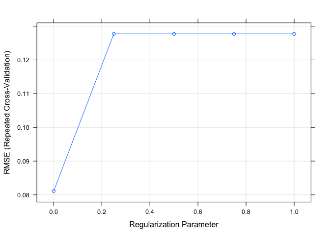

melbapart
================

``` r
melHouseStart <- read.csv("~/Desktop/Melbourne data project/melbourne-housing-market/Melbourne_housing_FULL.csv")


library(tidyverse)
```

    ## ── Attaching packages ────────────────────────────────────────────── tidyverse 1.2.1 ──

    ## ✔ ggplot2 2.2.1     ✔ purrr   0.2.4
    ## ✔ tibble  1.4.2     ✔ dplyr   0.7.4
    ## ✔ tidyr   0.8.0     ✔ stringr 1.2.0
    ## ✔ readr   1.1.1     ✔ forcats 0.3.0

    ## ── Conflicts ───────────────────────────────────────────────── tidyverse_conflicts() ──
    ## ✖ dplyr::filter() masks stats::filter()
    ## ✖ dplyr::lag()    masks stats::lag()

``` r
#----------------

melHouseStart <- as.tibble(melHouseStart)

# check the structure
str(melHouseStart)
```

    ## Classes 'tbl_df', 'tbl' and 'data.frame':    34857 obs. of  21 variables:
    ##  $ Suburb       : Factor w/ 351 levels "Abbotsford","Aberfeldie",..: 1 1 1 1 1 1 1 1 1 1 ...
    ##  $ Address      : Factor w/ 34009 levels "1 Abercrombie St",..: 29459 32513 15390 9769 25129 23201 27095 8333 26797 33959 ...
    ##  $ Rooms        : int  2 2 2 3 3 3 4 4 2 2 ...
    ##  $ Type         : Factor w/ 3 levels "h","t","u": 1 1 1 3 1 1 1 1 1 1 ...
    ##  $ Price        : int  NA 1480000 1035000 NA 1465000 850000 1600000 NA NA NA ...
    ##  $ Method       : Factor w/ 9 levels "PI","PN","S",..: 7 3 3 8 6 1 8 5 3 3 ...
    ##  $ SellerG      : Factor w/ 388 levels "@Realty","A",..: 171 34 34 313 34 34 246 246 34 76 ...
    ##  $ Date         : Factor w/ 78 levels "1/07/2017","10/02/2018",..: 59 61 64 64 65 65 66 70 70 70 ...
    ##  $ Distance     : Factor w/ 216 levels "#N/A","0","0.7",..: 82 82 82 82 82 82 82 82 82 82 ...
    ##  $ Postcode     : Factor w/ 212 levels "#N/A","3000",..: 55 55 55 55 55 55 55 55 55 55 ...
    ##  $ Bedroom2     : int  2 2 2 3 3 3 3 3 4 3 ...
    ##  $ Bathroom     : int  1 1 1 2 2 2 1 2 1 2 ...
    ##  $ Car          : int  1 1 0 1 0 1 2 2 2 1 ...
    ##  $ Landsize     : int  126 202 156 0 134 94 120 400 201 202 ...
    ##  $ BuildingArea : num  NA NA 79 NA 150 NA 142 220 NA NA ...
    ##  $ YearBuilt    : int  NA NA 1900 NA 1900 NA 2014 2006 1900 1900 ...
    ##  $ CouncilArea  : Factor w/ 34 levels "#N/A","Banyule City Council",..: 33 33 33 33 33 33 33 33 33 33 ...
    ##  $ Lattitude    : num  -37.8 -37.8 -37.8 -37.8 -37.8 ...
    ##  $ Longtitude   : num  145 145 145 145 145 ...
    ##  $ Regionname   : Factor w/ 9 levels "#N/A","Eastern Metropolitan",..: 4 4 4 4 4 4 4 4 4 4 ...
    ##  $ Propertycount: Factor w/ 343 levels "#N/A","1008",..: 191 191 191 191 191 191 191 191 191 191 ...

Including Plots
---------------

You can also embed plots, for example:

``` r
# Fix data types
# changing Distance to numeric, Propertycount to numeric, Date to date /d/m/y date format


melHouseStart$Distance <- as.numeric(as.character(melHouseStart$Distance))
```

    ## Warning: NAs introduced by coercion

``` r
melHouseStart$Propertycount <- as.numeric(as.character(melHouseStart$Propertycount))
```

    ## Warning: NAs introduced by coercion

``` r
melHouseStart$Date <- as.Date(melHouseStart$Date, "%d/%m/%Y")

#confirming the changes
glimpse(melHouseStart)
```

    ## Observations: 34,857
    ## Variables: 21
    ## $ Suburb        <fct> Abbotsford, Abbotsford, Abbotsford, Abbotsford, ...
    ## $ Address       <fct> 68 Studley St, 85 Turner St, 25 Bloomburg St, 18...
    ## $ Rooms         <int> 2, 2, 2, 3, 3, 3, 4, 4, 2, 2, 2, 3, 2, 4, 2, 3, ...
    ## $ Type          <fct> h, h, h, u, h, h, h, h, h, h, h, h, u, h, h, h, ...
    ## $ Price         <int> NA, 1480000, 1035000, NA, 1465000, 850000, 16000...
    ## $ Method        <fct> SS, S, S, VB, SP, PI, VB, SN, S, S, S, S, PI, W,...
    ## $ SellerG       <fct> Jellis, Biggin, Biggin, Rounds, Biggin, Biggin, ...
    ## $ Date          <date> 2016-09-03, 2016-12-03, 2016-02-04, 2016-02-04,...
    ## $ Distance      <dbl> 2.5, 2.5, 2.5, 2.5, 2.5, 2.5, 2.5, 2.5, 2.5, 2.5...
    ## $ Postcode      <fct> 3067, 3067, 3067, 3067, 3067, 3067, 3067, 3067, ...
    ## $ Bedroom2      <int> 2, 2, 2, 3, 3, 3, 3, 3, 4, 3, 2, 4, 2, 6, 2, NA,...
    ## $ Bathroom      <int> 1, 1, 1, 2, 2, 2, 1, 2, 1, 2, 1, 2, 2, 2, 1, NA,...
    ## $ Car           <int> 1, 1, 0, 1, 0, 1, 2, 2, 2, 1, 0, 0, 1, 0, 2, NA,...
    ## $ Landsize      <int> 126, 202, 156, 0, 134, 94, 120, 400, 201, 202, 1...
    ## $ BuildingArea  <dbl> NA, NA, 79, NA, 150, NA, 142, 220, NA, NA, NA, 2...
    ## $ YearBuilt     <int> NA, NA, 1900, NA, 1900, NA, 2014, 2006, 1900, 19...
    ## $ CouncilArea   <fct> Yarra City Council, Yarra City Council, Yarra Ci...
    ## $ Lattitude     <dbl> -37.8014, -37.7996, -37.8079, -37.8114, -37.8093...
    ## $ Longtitude    <dbl> 144.9958, 144.9984, 144.9934, 145.0116, 144.9944...
    ## $ Regionname    <fct> Northern Metropolitan, Northern Metropolitan, No...
    ## $ Propertycount <dbl> 4019, 4019, 4019, 4019, 4019, 4019, 4019, 4019, ...

Note that the `echo = FALSE` parameter was added to the code chunk to prevent printing of the R code that generated the plot.

``` r
# Adding month and year to the columns & correcting spelling on 

melHouse <- melHouseStart %>%
  mutate(Month = as.factor(strftime(Date, "%m")),
         Year = as.factor(strftime(Date, "%y"))) %>%
  rename("Lat" = "Lattitude", "Long" = "Longtitude", "Region" = "Regionname", "PropertyCount" = "Propertycount")

glimpse(melHouse) # verifying that the columns were created and renamed
```

    ## Observations: 34,857
    ## Variables: 23
    ## $ Suburb        <fct> Abbotsford, Abbotsford, Abbotsford, Abbotsford, ...
    ## $ Address       <fct> 68 Studley St, 85 Turner St, 25 Bloomburg St, 18...
    ## $ Rooms         <int> 2, 2, 2, 3, 3, 3, 4, 4, 2, 2, 2, 3, 2, 4, 2, 3, ...
    ## $ Type          <fct> h, h, h, u, h, h, h, h, h, h, h, h, u, h, h, h, ...
    ## $ Price         <int> NA, 1480000, 1035000, NA, 1465000, 850000, 16000...
    ## $ Method        <fct> SS, S, S, VB, SP, PI, VB, SN, S, S, S, S, PI, W,...
    ## $ SellerG       <fct> Jellis, Biggin, Biggin, Rounds, Biggin, Biggin, ...
    ## $ Date          <date> 2016-09-03, 2016-12-03, 2016-02-04, 2016-02-04,...
    ## $ Distance      <dbl> 2.5, 2.5, 2.5, 2.5, 2.5, 2.5, 2.5, 2.5, 2.5, 2.5...
    ## $ Postcode      <fct> 3067, 3067, 3067, 3067, 3067, 3067, 3067, 3067, ...
    ## $ Bedroom2      <int> 2, 2, 2, 3, 3, 3, 3, 3, 4, 3, 2, 4, 2, 6, 2, NA,...
    ## $ Bathroom      <int> 1, 1, 1, 2, 2, 2, 1, 2, 1, 2, 1, 2, 2, 2, 1, NA,...
    ## $ Car           <int> 1, 1, 0, 1, 0, 1, 2, 2, 2, 1, 0, 0, 1, 0, 2, NA,...
    ## $ Landsize      <int> 126, 202, 156, 0, 134, 94, 120, 400, 201, 202, 1...
    ## $ BuildingArea  <dbl> NA, NA, 79, NA, 150, NA, 142, 220, NA, NA, NA, 2...
    ## $ YearBuilt     <int> NA, NA, 1900, NA, 1900, NA, 2014, 2006, 1900, 19...
    ## $ CouncilArea   <fct> Yarra City Council, Yarra City Council, Yarra Ci...
    ## $ Lat           <dbl> -37.8014, -37.7996, -37.8079, -37.8114, -37.8093...
    ## $ Long          <dbl> 144.9958, 144.9984, 144.9934, 145.0116, 144.9944...
    ## $ Region        <fct> Northern Metropolitan, Northern Metropolitan, No...
    ## $ PropertyCount <dbl> 4019, 4019, 4019, 4019, 4019, 4019, 4019, 4019, ...
    ## $ Month         <fct> 09, 12, 02, 02, 03, 03, 06, 08, 08, 08, 05, 05, ...
    ## $ Year          <fct> 16, 16, 16, 16, 17, 17, 16, 16, 16, 16, 16, 16, ...

``` r
# Finding the descriptive statistics

summary(melHouse) # descriptive statistics with out standard deviation
```

    ##             Suburb                  Address          Rooms       
    ##  Reservoir     :  844   5 Charles St    :    6   Min.   : 1.000  
    ##  Bentleigh East:  583   25 William St   :    4   1st Qu.: 2.000  
    ##  Richmond      :  552   1 Bruce St      :    3   Median : 3.000  
    ##  Glen Iris     :  491   1 Daisy St      :    3   Mean   : 3.031  
    ##  Preston       :  485   1/1 Clarendon St:    3   3rd Qu.: 4.000  
    ##  Kew           :  467   1088 Toorak Rd  :    3   Max.   :16.000  
    ##  (Other)       :31435   (Other)         :34835                   
    ##  Type          Price              Method               SellerG     
    ##  h:23980   Min.   :   85000   S      :19744   Jellis       : 3359  
    ##  t: 3580   1st Qu.:  635000   SP     : 5095   Nelson       : 3236  
    ##  u: 7297   Median :  870000   PI     : 4850   Barry        : 3235  
    ##            Mean   : 1050173   VB     : 3108   hockingstuart: 2623  
    ##            3rd Qu.: 1295000   SN     : 1317   Marshall     : 2027  
    ##            Max.   :11200000   PN     :  308   Ray          : 1950  
    ##            NA's   :7610       (Other):  435   (Other)      :18427  
    ##       Date               Distance        Postcode        Bedroom2     
    ##  Min.   :2016-01-28   Min.   : 0.00   3073   :  844   Min.   : 0.000  
    ##  1st Qu.:2016-11-19   1st Qu.: 6.40   3046   :  638   1st Qu.: 2.000  
    ##  Median :2017-07-08   Median :10.30   3020   :  617   Median : 3.000  
    ##  Mean   :2017-05-23   Mean   :11.18   3121   :  612   Mean   : 3.085  
    ##  3rd Qu.:2017-10-28   3rd Qu.:14.00   3165   :  583   3rd Qu.: 4.000  
    ##  Max.   :2018-03-17   Max.   :48.10   3058   :  556   Max.   :30.000  
    ##                       NA's   :1       (Other):31007   NA's   :8217    
    ##     Bathroom           Car            Landsize         BuildingArea    
    ##  Min.   : 0.000   Min.   : 0.000   Min.   :     0.0   Min.   :    0.0  
    ##  1st Qu.: 1.000   1st Qu.: 1.000   1st Qu.:   224.0   1st Qu.:  102.0  
    ##  Median : 2.000   Median : 2.000   Median :   521.0   Median :  136.0  
    ##  Mean   : 1.625   Mean   : 1.729   Mean   :   593.6   Mean   :  160.3  
    ##  3rd Qu.: 2.000   3rd Qu.: 2.000   3rd Qu.:   670.0   3rd Qu.:  188.0  
    ##  Max.   :12.000   Max.   :26.000   Max.   :433014.0   Max.   :44515.0  
    ##  NA's   :8226     NA's   :8728     NA's   :11810      NA's   :21115    
    ##    YearBuilt                      CouncilArea         Lat        
    ##  Min.   :1196    Boroondara City Council: 3675   Min.   :-38.19  
    ##  1st Qu.:1940    Darebin City Council   : 2851   1st Qu.:-37.86  
    ##  Median :1970    Moreland City Council  : 2122   Median :-37.81  
    ##  Mean   :1965    Glen Eira City Council : 2006   Mean   :-37.81  
    ##  3rd Qu.:2000    Melbourne City Council : 1952   3rd Qu.:-37.75  
    ##  Max.   :2106    Banyule City Council   : 1861   Max.   :-37.39  
    ##  NA's   :19306   (Other)                :20390   NA's   :7976    
    ##       Long                              Region      PropertyCount  
    ##  Min.   :144.4   Southern Metropolitan     :11836   Min.   :   83  
    ##  1st Qu.:144.9   Northern Metropolitan     : 9557   1st Qu.: 4385  
    ##  Median :145.0   Western Metropolitan      : 6799   Median : 6763  
    ##  Mean   :145.0   Eastern Metropolitan      : 4377   Mean   : 7573  
    ##  3rd Qu.:145.1   South-Eastern Metropolitan: 1739   3rd Qu.:10412  
    ##  Max.   :145.5   Eastern Victoria          :  228   Max.   :21650  
    ##  NA's   :7976    (Other)                   :  321   NA's   :3      
    ##      Month       Year      
    ##  11     : 4387   16:10292  
    ##  09     : 4128   17:19852  
    ##  10     : 3900   18: 4713  
    ##  05     : 3416             
    ##  06     : 3175             
    ##  03     : 3094             
    ##  (Other):12757

``` r
# getting standard deviation for each variable

melHouseSD <- melHouse %>%
  summarise_all(funs(sd(., na.rm=TRUE)))
```

    ## Warning in var(if (is.vector(x) || is.factor(x)) x else as.double(x), na.rm = na.rm): Calling var(x) on a factor x is deprecated and will become an error.
    ##   Use something like 'all(duplicated(x)[-1L])' to test for a constant vector.

    ## Warning in var(if (is.vector(x) || is.factor(x)) x else as.double(x), na.rm = na.rm): Calling var(x) on a factor x is deprecated and will become an error.
    ##   Use something like 'all(duplicated(x)[-1L])' to test for a constant vector.

    ## Warning in var(if (is.vector(x) || is.factor(x)) x else as.double(x), na.rm = na.rm): Calling var(x) on a factor x is deprecated and will become an error.
    ##   Use something like 'all(duplicated(x)[-1L])' to test for a constant vector.

    ## Warning in var(if (is.vector(x) || is.factor(x)) x else as.double(x), na.rm = na.rm): Calling var(x) on a factor x is deprecated and will become an error.
    ##   Use something like 'all(duplicated(x)[-1L])' to test for a constant vector.

    ## Warning in var(if (is.vector(x) || is.factor(x)) x else as.double(x), na.rm = na.rm): Calling var(x) on a factor x is deprecated and will become an error.
    ##   Use something like 'all(duplicated(x)[-1L])' to test for a constant vector.

    ## Warning in var(if (is.vector(x) || is.factor(x)) x else as.double(x), na.rm = na.rm): Calling var(x) on a factor x is deprecated and will become an error.
    ##   Use something like 'all(duplicated(x)[-1L])' to test for a constant vector.

    ## Warning in var(if (is.vector(x) || is.factor(x)) x else as.double(x), na.rm = na.rm): Calling var(x) on a factor x is deprecated and will become an error.
    ##   Use something like 'all(duplicated(x)[-1L])' to test for a constant vector.

    ## Warning in var(if (is.vector(x) || is.factor(x)) x else as.double(x), na.rm = na.rm): Calling var(x) on a factor x is deprecated and will become an error.
    ##   Use something like 'all(duplicated(x)[-1L])' to test for a constant vector.

    ## Warning in var(if (is.vector(x) || is.factor(x)) x else as.double(x), na.rm = na.rm): Calling var(x) on a factor x is deprecated and will become an error.
    ##   Use something like 'all(duplicated(x)[-1L])' to test for a constant vector.

    ## Warning in var(if (is.vector(x) || is.factor(x)) x else as.double(x), na.rm = na.rm): Calling var(x) on a factor x is deprecated and will become an error.
    ##   Use something like 'all(duplicated(x)[-1L])' to test for a constant vector.

``` r
glimpse(melHouseSD) # getting a clean print out of the SD values
```

    ## Observations: 1
    ## Variables: 23
    ## $ Suburb        <dbl> 100.9935
    ## $ Address       <dbl> 9812.989
    ## $ Rooms         <dbl> 0.9699329
    ## $ Type          <dbl> 0.8174618
    ## $ Price         <dbl> 641467.1
    ## $ Method        <dbl> 1.988551
    ## $ SellerG       <dbl> 103.9511
    ## $ Date          <date> 1970-07-22
    ## $ Distance      <dbl> 6.788892
    ## $ Postcode      <dbl> 51.63254
    ## $ Bedroom2      <dbl> 0.9806897
    ## $ Bathroom      <dbl> 0.724212
    ## $ Car           <dbl> 1.010771
    ## $ Landsize      <dbl> 3398.842
    ## $ BuildingArea  <dbl> 401.2671
    ## $ YearBuilt     <dbl> 37.32818
    ## $ CouncilArea   <dbl> 9.936106
    ## $ Lat           <dbl> 0.0902789
    ## $ Long          <dbl> 0.1201688
    ## $ Region        <dbl> 2.051519
    ## $ PropertyCount <dbl> 4428.09
    ## $ Month         <dbl> 3.158799
    ## $ Year          <dbl> 0.6362919

``` r
# checking NA values

library(Amelia)
```

    ## Loading required package: Rcpp

    ## ## 
    ## ## Amelia II: Multiple Imputation
    ## ## (Version 1.7.4, built: 2015-12-05)
    ## ## Copyright (C) 2005-2018 James Honaker, Gary King and Matthew Blackwell
    ## ## Refer to http://gking.harvard.edu/amelia/ for more information
    ## ##

``` r
missmap(melHouse) # visualise missing values
```

    ## Warning in if (class(obj) == "amelia") {: the condition has length > 1 and
    ## only the first element will be used

    ## Warning: Unknown or uninitialised column: 'arguments'.

    ## Warning: Unknown or uninitialised column: 'arguments'.

    ## Warning: Unknown or uninitialised column: 'imputations'.


``` r
# Actual NA values followed by percentage of NA values

colSums(is.na(melHouse))
```

    ##        Suburb       Address         Rooms          Type         Price 
    ##             0             0             0             0          7610 
    ##        Method       SellerG          Date      Distance      Postcode 
    ##             0             0             0             1             0 
    ##      Bedroom2      Bathroom           Car      Landsize  BuildingArea 
    ##          8217          8226          8728         11810         21115 
    ##     YearBuilt   CouncilArea           Lat          Long        Region 
    ##         19306             0          7976          7976             0 
    ## PropertyCount         Month          Year 
    ##             3             0             0

``` r
# Finding the percentage of NA values per variable

colMeans(is.na(melHouse))*100
```

    ##        Suburb       Address         Rooms          Type         Price 
    ##   0.000000000   0.000000000   0.000000000   0.000000000  21.832056689 
    ##        Method       SellerG          Date      Distance      Postcode 
    ##   0.000000000   0.000000000   0.000000000   0.002868864   0.000000000 
    ##      Bedroom2      Bathroom           Car      Landsize  BuildingArea 
    ##  23.573457268  23.599277046  25.039446883  33.881286399  60.576067935 
    ##     YearBuilt   CouncilArea           Lat          Long        Region 
    ##  55.386292567   0.000000000  22.882060992  22.882060992   0.000000000 
    ## PropertyCount         Month          Year 
    ##   0.008606593   0.000000000   0.000000000

``` r
# inspecting rooms vs bedroom2 as Bedroom2 was scraped from a different source

melHouse %>%
  select(Rooms, Bedroom2)
```

    ## # A tibble: 34,857 x 2
    ##    Rooms Bedroom2
    ##    <int>    <int>
    ##  1     2        2
    ##  2     2        2
    ##  3     2        2
    ##  4     3        3
    ##  5     3        3
    ##  6     3        3
    ##  7     4        3
    ##  8     4        3
    ##  9     2        4
    ## 10     2        3
    ## # ... with 34,847 more rows

``` r
# inspecting the rows that are not equal to each other
melHouse %>%
  select(Rooms, Bedroom2) %>%
  filter(Rooms != Bedroom2)
```

    ## # A tibble: 948 x 2
    ##    Rooms Bedroom2
    ##    <int>    <int>
    ##  1     4        3
    ##  2     4        3
    ##  3     2        4
    ##  4     2        3
    ##  5     3        4
    ##  6     4        6
    ##  7     2        3
    ##  8     3        2
    ##  9     3        2
    ## 10     3        2
    ## # ... with 938 more rows

``` r
# getting a count of how many rows contain the same values
melHouse %>%
  select(Rooms, Bedroom2) %>%
  count(Rooms == Bedroom2)
```

    ## # A tibble: 3 x 2
    ##   `Rooms == Bedroom2`     n
    ##   <lgl>               <int>
    ## 1 F                     948
    ## 2 T                   25692
    ## 3 NA                   8217

``` r
# checking the correlation
cor.test(melHouse$Rooms, melHouse$Bedroom2)
```

    ## 
    ##  Pearson's product-moment correlation
    ## 
    ## data:  melHouse$Rooms and melHouse$Bedroom2
    ## t = 479.95, df = 26638, p-value < 2.2e-16
    ## alternative hypothesis: true correlation is not equal to 0
    ## 95 percent confidence interval:
    ##  0.9454956 0.9479854
    ## sample estimates:
    ##       cor 
    ## 0.9467546

``` r
# Drop Bedroom2 due to multicolinearity issues
```

``` r
(melExtended <- select(melHouse, - SellerG, - Lat, - Long, 
                           - Method, - Suburb, -Postcode, -Address, 
                           - PropertyCount, - CouncilArea, - Bedroom2, - Date))
```

    ## # A tibble: 34,857 x 12
    ##    Rooms Type    Price Distance Bathroom   Car Landsize BuildingArea
    ##    <int> <fct>   <int>    <dbl>    <int> <int>    <int>        <dbl>
    ##  1     2 h          NA     2.50        1     1      126         NA  
    ##  2     2 h     1480000     2.50        1     1      202         NA  
    ##  3     2 h     1035000     2.50        1     0      156         79.0
    ##  4     3 u          NA     2.50        2     1        0         NA  
    ##  5     3 h     1465000     2.50        2     0      134        150  
    ##  6     3 h      850000     2.50        2     1       94         NA  
    ##  7     4 h     1600000     2.50        1     2      120        142  
    ##  8     4 h          NA     2.50        2     2      400        220  
    ##  9     2 h          NA     2.50        1     2      201         NA  
    ## 10     2 h          NA     2.50        2     1      202         NA  
    ## # ... with 34,847 more rows, and 4 more variables: YearBuilt <int>,
    ## #   Region <fct>, Month <fct>, Year <fct>

``` r
# Getting rid of any NA values

melExtended <- na.omit(melExtended)
str(melExtended)
```

    ## Classes 'tbl_df', 'tbl' and 'data.frame':    8895 obs. of  12 variables:
    ##  $ Rooms       : int  2 3 4 3 2 2 3 2 2 3 ...
    ##  $ Type        : Factor w/ 3 levels "h","t","u": 1 1 1 1 1 1 1 3 1 1 ...
    ##  $ Price       : int  1035000 1465000 1600000 1876000 1636000 1097000 1350000 750000 1310000 1200000 ...
    ##  $ Distance    : num  2.5 2.5 2.5 2.5 2.5 2.5 2.5 2.5 2.5 2.5 ...
    ##  $ Bathroom    : int  1 2 1 2 1 1 2 2 1 2 ...
    ##  $ Car         : int  0 0 2 0 2 2 2 1 2 1 ...
    ##  $ Landsize    : int  156 134 120 245 256 220 214 0 238 113 ...
    ##  $ BuildingArea: num  79 150 142 210 107 75 190 94 97 110 ...
    ##  $ YearBuilt   : int  1900 1900 2014 1910 1890 1900 2005 2009 1890 1880 ...
    ##  $ Region      : Factor w/ 9 levels "#N/A","Eastern Metropolitan",..: 4 4 4 4 4 4 4 4 4 4 ...
    ##  $ Month       : Factor w/ 12 levels "01","02","03",..: 2 3 6 5 10 10 11 11 10 7 ...
    ##  $ Year        : Factor w/ 3 levels "16","17","18": 1 2 1 1 1 1 1 1 1 1 ...
    ##  - attr(*, "na.action")=Class 'omit'  Named int [1:25962] 1 2 4 6 8 9 10 11 13 14 ...
    ##   .. ..- attr(*, "names")= chr [1:25962] "1" "2" "4" "6" ...

``` r
summary(melExtended)
```

    ##      Rooms        Type         Price            Distance   
    ##  Min.   : 1.000   h:6628   Min.   : 131000   Min.   : 0.0  
    ##  1st Qu.: 2.000   t: 726   1st Qu.: 640500   1st Qu.: 6.4  
    ##  Median : 3.000   u:1541   Median : 900000   Median :10.2  
    ##  Mean   : 3.099            Mean   :1092524   Mean   :11.2  
    ##  3rd Qu.: 4.000            3rd Qu.:1345000   3rd Qu.:13.9  
    ##  Max.   :12.000            Max.   :9000000   Max.   :47.4  
    ##                                                            
    ##     Bathroom          Car            Landsize        BuildingArea   
    ##  Min.   :1.000   Min.   : 0.000   Min.   :    0.0   Min.   :   0.0  
    ##  1st Qu.:1.000   1st Qu.: 1.000   1st Qu.:  212.0   1st Qu.: 100.0  
    ##  Median :2.000   Median : 2.000   Median :  478.0   Median : 132.0  
    ##  Mean   :1.647   Mean   : 1.693   Mean   :  523.4   Mean   : 149.3  
    ##  3rd Qu.:2.000   3rd Qu.: 2.000   3rd Qu.:  652.0   3rd Qu.: 180.0  
    ##  Max.   :9.000   Max.   :10.000   Max.   :42800.0   Max.   :3112.0  
    ##                                                                     
    ##    YearBuilt                           Region         Month      Year     
    ##  Min.   :1196   Southern Metropolitan     :2707   07     : 996   16:3484  
    ##  1st Qu.:1945   Northern Metropolitan     :2618   05     : 984   17:4379  
    ##  Median :1970   Western Metropolitan      :2060   09     : 930   18:1032  
    ##  Mean   :1966   Eastern Metropolitan      : 982   11     : 913            
    ##  3rd Qu.:2000   South-Eastern Metropolitan: 372   06     : 882            
    ##  Max.   :2019   Northern Victoria         :  62   10     : 875            
    ##                 (Other)                   :  94   (Other):3315

``` r
# YearBuilt 2019 does not exist yet, might be a presale, but will be removed

# seeing how many homes claim to be built after 2018 & deleting anything greater than 2018

melExtended %>%
  select(YearBuilt) %>%
  filter(YearBuilt > 2018)
```

    ## # A tibble: 1 x 1
    ##   YearBuilt
    ##       <int>
    ## 1      2019

``` r
melExtended <- melExtended %>%
  filter(YearBuilt <= 2018)

summary(melExtended$YearBuilt) # veridying max is no greater than 2018
```

    ##    Min. 1st Qu.  Median    Mean 3rd Qu.    Max. 
    ##    1196    1945    1970    1966    2000    2018

``` r
# checking for homes built before 1800

melExtended %>%
  select(YearBuilt) %>%
  filter(YearBuilt < 1800)
```

    ## # A tibble: 1 x 1
    ##   YearBuilt
    ##       <int>
    ## 1      1196

``` r
# unsure of anything built in 1196, therefore it is being removed

melExtended <- melExtended %>%
  filter(YearBuilt > 1800)

summary(melExtended$YearBuilt)
```

    ##    Min. 1st Qu.  Median    Mean 3rd Qu.    Max. 
    ##    1830    1945    1970    1966    2000    2018

``` r
# Turning YearBuilt into a range of factors
# 1 = 1800 -1899
# 2 = 1900 - 1949
# 3 = 1950 - 1999
# 4 = 1999 - 2018


# adding column BuildYear for range of years built
melExtended$BuildYear  = 0

melExtended$BuildYear[melExtended$YearBuilt <= 1899] = 1
melExtended$BuildYear[melExtended$YearBuilt >= 1900 & melExtended$YearBuilt<= 1949] = 2
melExtended$BuildYear[melExtended$YearBuilt >= 1950 & melExtended$YearBuilt<= 1999] = 3
melExtended$BuildYear[melExtended$YearBuilt >= 2000 & melExtended$YearBuilt<= 2018] = 4

glimpse(melExtended) #verifying BuildYear is created
```

    ## Observations: 8,893
    ## Variables: 13
    ## $ Rooms        <int> 2, 3, 4, 3, 2, 2, 3, 2, 2, 3, 3, 2, 4, 2, 2, 2, 3...
    ## $ Type         <fct> h, h, h, h, h, h, h, u, h, h, h, h, h, u, h, h, h...
    ## $ Price        <int> 1035000, 1465000, 1600000, 1876000, 1636000, 1097...
    ## $ Distance     <dbl> 2.5, 2.5, 2.5, 2.5, 2.5, 2.5, 2.5, 2.5, 2.5, 2.5,...
    ## $ Bathroom     <int> 1, 2, 1, 2, 1, 1, 2, 2, 1, 2, 1, 1, 2, 1, 2, 1, 3...
    ## $ Car          <int> 0, 0, 2, 0, 2, 2, 2, 1, 2, 1, 1, 1, 2, 1, 1, 0, 1...
    ## $ Landsize     <int> 156, 134, 120, 245, 256, 220, 214, 0, 238, 113, 1...
    ## $ BuildingArea <dbl> 79, 150, 142, 210, 107, 75, 190, 94, 97, 110, 105...
    ## $ YearBuilt    <int> 1900, 1900, 2014, 1910, 1890, 1900, 2005, 2009, 1...
    ## $ Region       <fct> Northern Metropolitan, Northern Metropolitan, Nor...
    ## $ Month        <fct> 02, 03, 06, 05, 10, 10, 11, 11, 10, 07, 07, 09, 0...
    ## $ Year         <fct> 16, 17, 16, 16, 16, 16, 16, 16, 16, 16, 16, 16, 1...
    ## $ BuildYear    <dbl> 2, 2, 4, 2, 1, 2, 4, 4, 1, 1, 1, 3, 2, 3, 4, 2, 4...

``` r
# turn BuildYear into a factor
melExtended$BuildYear <- as.factor(melExtended$BuildYear)

# drop year built

melExtended <- melExtended %>%
  select(- YearBuilt)

glimpse(melExtended)
```

    ## Observations: 8,893
    ## Variables: 12
    ## $ Rooms        <int> 2, 3, 4, 3, 2, 2, 3, 2, 2, 3, 3, 2, 4, 2, 2, 2, 3...
    ## $ Type         <fct> h, h, h, h, h, h, h, u, h, h, h, h, h, u, h, h, h...
    ## $ Price        <int> 1035000, 1465000, 1600000, 1876000, 1636000, 1097...
    ## $ Distance     <dbl> 2.5, 2.5, 2.5, 2.5, 2.5, 2.5, 2.5, 2.5, 2.5, 2.5,...
    ## $ Bathroom     <int> 1, 2, 1, 2, 1, 1, 2, 2, 1, 2, 1, 1, 2, 1, 2, 1, 3...
    ## $ Car          <int> 0, 0, 2, 0, 2, 2, 2, 1, 2, 1, 1, 1, 2, 1, 1, 0, 1...
    ## $ Landsize     <int> 156, 134, 120, 245, 256, 220, 214, 0, 238, 113, 1...
    ## $ BuildingArea <dbl> 79, 150, 142, 210, 107, 75, 190, 94, 97, 110, 105...
    ## $ Region       <fct> Northern Metropolitan, Northern Metropolitan, Nor...
    ## $ Month        <fct> 02, 03, 06, 05, 10, 10, 11, 11, 10, 07, 07, 09, 0...
    ## $ Year         <fct> 16, 17, 16, 16, 16, 16, 16, 16, 16, 16, 16, 16, 1...
    ## $ BuildYear    <fct> 2, 2, 4, 2, 1, 2, 4, 4, 1, 1, 1, 3, 2, 3, 4, 2, 4...

``` r
# Eliminate any home where it is claimed it has more bathrooms than rooms

melExtended <- melExtended %>%
    filter(Bathroom < Rooms)

# Elinimate any home claiming to have 0 bathrooms or more and 5 (Reason to believe more than 5 is a building of units sold as a whole in most cases)
melExtended <- melExtended %>%
  filter(Bathroom > 0 & Bathroom <= 5)

# Eliminate any home with 0 Landsize
melExtended<- melExtended %>%
    filter(Landsize > 0)

# using this link https://www.smh.com.au/business/melbournes-apartment-sizes-face-more-scrutiny-20150414-1mkuj4.html
# setting a lowest value of 40, this 10 square meters lower than 2002 requirements

melExtended <- melExtended %>%
    filter(Landsize >= 40)


# eliminating any lot over 1500

melExtended <- melExtended %>%
  filter(Landsize < 1500)

melExtended <- melExtended %>%
  filter(BuildingArea >= 40) # same as above with relation to landsize

summary(melExtended)
```

    ##      Rooms        Type         Price            Distance    
    ##  Min.   : 2.000   h:6192   Min.   : 131000   Min.   : 0.00  
    ##  1st Qu.: 3.000   t: 519   1st Qu.: 702000   1st Qu.: 7.45  
    ##  Median : 3.000   u: 476   Median : 970000   Median :11.20  
    ##  Mean   : 3.302            Mean   :1154151   Mean   :12.02  
    ##  3rd Qu.: 4.000            3rd Qu.:1410000   3rd Qu.:14.70  
    ##  Max.   :12.000            Max.   :9000000   Max.   :47.40  
    ##                                                             
    ##     Bathroom          Car           Landsize       BuildingArea 
    ##  Min.   :1.000   Min.   : 0.00   Min.   :  43.0   Min.   :  40  
    ##  1st Qu.:1.000   1st Qu.: 1.00   1st Qu.: 300.0   1st Qu.: 111  
    ##  Median :2.000   Median : 2.00   Median : 536.0   Median : 141  
    ##  Mean   :1.656   Mean   : 1.78   Mean   : 502.3   Mean   : 161  
    ##  3rd Qu.:2.000   3rd Qu.: 2.00   3rd Qu.: 660.0   3rd Qu.: 189  
    ##  Max.   :5.000   Max.   :10.00   Max.   :1491.0   Max.   :3112  
    ##                                                                 
    ##                         Region         Month      Year      BuildYear
    ##  Northern Metropolitan     :2068   07     : 786   16:2587   1: 337   
    ##  Southern Metropolitan     :1949   05     : 773   17:3625   2:1687   
    ##  Western Metropolitan      :1775   10     : 772   18: 975   3:3592   
    ##  Eastern Metropolitan      : 902   09     : 762             4:1571   
    ##  South-Eastern Metropolitan: 350   11     : 734                      
    ##  Northern Victoria         :  58   06     : 670                      
    ##  (Other)                   :  85   (Other):2690

``` r
# Eliminate any property where building area is > land size

melExtended <- melExtended %>%
  filter(BuildingArea < Landsize)

summary(melExtended)
```

    ##      Rooms        Type         Price            Distance    
    ##  Min.   : 2.000   h:6036   Min.   : 131000   Min.   : 0.00  
    ##  1st Qu.: 3.000   t: 451   1st Qu.: 700000   1st Qu.: 7.50  
    ##  Median : 3.000   u: 454   Median : 965000   Median :11.20  
    ##  Mean   : 3.313            Mean   :1152489   Mean   :12.21  
    ##  3rd Qu.: 4.000            3rd Qu.:1405000   3rd Qu.:14.70  
    ##  Max.   :12.000            Max.   :9000000   Max.   :47.40  
    ##                                                             
    ##     Bathroom          Car            Landsize       BuildingArea  
    ##  Min.   :1.000   Min.   : 0.000   Min.   :  69.0   Min.   : 40.0  
    ##  1st Qu.:1.000   1st Qu.: 1.000   1st Qu.: 316.0   1st Qu.:111.0  
    ##  Median :2.000   Median : 2.000   Median : 544.0   Median :141.0  
    ##  Mean   :1.654   Mean   : 1.796   Mean   : 513.4   Mean   :158.4  
    ##  3rd Qu.:2.000   3rd Qu.: 2.000   3rd Qu.: 665.0   3rd Qu.:188.0  
    ##  Max.   :5.000   Max.   :10.000   Max.   :1491.0   Max.   :789.0  
    ##                                                                   
    ##                         Region         Month      Year      BuildYear
    ##  Northern Metropolitan     :1971   10     : 758   16:2461   1: 301   
    ##  Southern Metropolitan     :1857   07     : 756   17:3520   2:1659   
    ##  Western Metropolitan      :1729   05     : 744   18: 960   3:3512   
    ##  Eastern Metropolitan      : 895   09     : 732             4:1469   
    ##  South-Eastern Metropolitan: 347   11     : 703                      
    ##  Northern Victoria         :  58   06     : 643                      
    ##  (Other)                   :  84   (Other):2605

``` r
# remove categorical to get numeric only

melExCorr <- melExtended %>%
   select(- Type, - Month, - Year, - Region, - BuildYear)

library(corrplot)
```

    ## corrplot 0.84 loaded

``` r
corrplot(cor(melExCorr), method = 'number')
```


``` r
# Nothing as of now will be dropped as there is no correlation above 80
```

``` r
#separate into 4 groups, all, house, unit, townhouse (h/u/t) while dropping 'Type'


mxapartment <- melExtended %>%
   filter(Type == 'u') %>%
   select(- Type)

mxhouse <- melExtended %>%
    filter(Type == 'h') %>%
    select(- Type)

mxtownhouse <- melExtended %>%
    filter(Type == 't') %>%
    select( - Type)

# the forth group will remain using melExtended
```

``` r
# checking strength of variables & models adjusted R-squared prior to inspecting and normalizing variables

# note these models are useless if they do not meet the assumptions

set.seed(99)

(summary(lm(Price ~., data = mxapartment))) 
```

    ## 
    ## Call:
    ## lm(formula = Price ~ ., data = mxapartment)
    ## 
    ## Residuals:
    ##     Min      1Q  Median      3Q     Max 
    ## -397294  -76715   -7248   67302  624462 
    ## 
    ## Coefficients:
    ##                                    Estimate Std. Error t value Pr(>|t|)
    ## (Intercept)                       279215.41  142934.88   1.953  0.05142
    ## Rooms                              56092.54   19115.61   2.934  0.00352
    ## Distance                          -13390.91    1935.36  -6.919 1.68e-11
    ## Bathroom                           59918.60   24233.27   2.473  0.01380
    ## Car                                31828.64   11837.34   2.689  0.00745
    ## Landsize                            -111.95      21.65  -5.171 3.58e-07
    ## BuildingArea                        2551.77     339.17   7.524 3.19e-13
    ## RegionEastern Victoria             84422.22  142550.70   0.592  0.55401
    ## RegionNorthern Metropolitan      -167218.47   23411.27  -7.143 3.99e-12
    ## RegionNorthern Victoria          -134113.67  151266.18  -0.887  0.37579
    ## RegionSouth-Eastern Metropolitan   47225.34   47745.22   0.989  0.32317
    ## RegionSouthern Metropolitan        65917.96   21803.22   3.023  0.00265
    ## RegionWestern Metropolitan       -162822.63   24357.11  -6.685 7.27e-11
    ## Month03                            31551.81   39832.88   0.792  0.42874
    ## Month04                            66432.86   39397.51   1.686  0.09249
    ## Month05                            80574.28   34432.16   2.340  0.01974
    ## Month06                            74751.85   36471.45   2.050  0.04102
    ## Month07                            60798.95   35059.53   1.734  0.08361
    ## Month08                           121271.88   38184.91   3.176  0.00160
    ## Month09                           103316.51   39454.77   2.619  0.00914
    ## Month10                           126902.35   43002.71   2.951  0.00334
    ## Month11                           107904.33   39865.51   2.707  0.00707
    ## Month12                            83252.59   44679.66   1.863  0.06310
    ## Year17                             74522.27   16583.44   4.494 9.03e-06
    ## Year18                            106767.75   71700.14   1.489  0.13720
    ## BuildYear2                         14442.55  135080.83   0.107  0.91490
    ## BuildYear3                          5173.47  131865.06   0.039  0.96872
    ## BuildYear4                        -29316.93  132461.13  -0.221  0.82495
    ##                                     
    ## (Intercept)                      .  
    ## Rooms                            ** 
    ## Distance                         ***
    ## Bathroom                         *  
    ## Car                              ** 
    ## Landsize                         ***
    ## BuildingArea                     ***
    ## RegionEastern Victoria              
    ## RegionNorthern Metropolitan      ***
    ## RegionNorthern Victoria             
    ## RegionSouth-Eastern Metropolitan    
    ## RegionSouthern Metropolitan      ** 
    ## RegionWestern Metropolitan       ***
    ## Month03                             
    ## Month04                          .  
    ## Month05                          *  
    ## Month06                          *  
    ## Month07                          .  
    ## Month08                          ** 
    ## Month09                          ** 
    ## Month10                          ** 
    ## Month11                          ** 
    ## Month12                          .  
    ## Year17                           ***
    ## Year18                              
    ## BuildYear2                          
    ## BuildYear3                          
    ## BuildYear4                          
    ## ---
    ## Signif. codes:  0 '***' 0.001 '**' 0.01 '*' 0.05 '.' 0.1 ' ' 1
    ## 
    ## Residual standard error: 130500 on 426 degrees of freedom
    ## Multiple R-squared:  0.6058, Adjusted R-squared:  0.5809 
    ## F-statistic: 24.25 on 27 and 426 DF,  p-value: < 2.2e-16

``` r
(summary(lm(Price ~., data = mxtownhouse))) 
```

    ## 
    ## Call:
    ## lm(formula = Price ~ ., data = mxtownhouse)
    ## 
    ## Residuals:
    ##     Min      1Q  Median      3Q     Max 
    ## -659493 -114265  -13400   84159 1668719 
    ## 
    ## Coefficients:
    ##                                    Estimate Std. Error t value Pr(>|t|)
    ## (Intercept)                       801336.32  199208.17   4.023 6.81e-05
    ## Rooms                              -4600.37   25329.29  -0.182    0.856
    ## Distance                          -29263.42    2804.14 -10.436  < 2e-16
    ## Bathroom                           27332.74   26883.40   1.017    0.310
    ## Car                                 6153.15   20880.57   0.295    0.768
    ## Landsize                             -14.67      68.07  -0.216    0.829
    ## BuildingArea                        4426.99     334.35  13.241  < 2e-16
    ## RegionNorthern Metropolitan      -189723.37   36579.08  -5.187 3.32e-07
    ## RegionSouth-Eastern Metropolitan  314827.91   69966.95   4.500 8.80e-06
    ## RegionSouthern Metropolitan       184756.52   34577.73   5.343 1.49e-07
    ## RegionWestern Metropolitan       -250986.78   36818.70  -6.817 3.21e-11
    ## Month02                           -63126.62  112446.49  -0.561    0.575
    ## Month03                          -116009.57  113720.14  -1.020    0.308
    ## Month04                          -154257.26  125089.04  -1.233    0.218
    ## Month05                          -175232.73  119511.38  -1.466    0.143
    ## Month06                           -76541.40  120335.92  -0.636    0.525
    ## Month07                          -165779.10  118676.26  -1.397    0.163
    ## Month08                          -131327.49  120699.03  -1.088    0.277
    ## Month09                           -99881.92  121345.19  -0.823    0.411
    ## Month10                           -65330.02  122300.40  -0.534    0.593
    ## Month11                           -60967.73  122374.77  -0.498    0.619
    ## Month12                          -122782.14  130375.09  -0.942    0.347
    ## Year17                            104815.93   24494.72   4.279 2.32e-05
    ## Year18                             21764.18   54345.33   0.400    0.689
    ## BuildYear2                         92952.46  185447.37   0.501    0.616
    ## BuildYear3                       -162197.33  154237.17  -1.052    0.294
    ## BuildYear4                       -163312.01  154234.10  -1.059    0.290
    ##                                     
    ## (Intercept)                      ***
    ## Rooms                               
    ## Distance                         ***
    ## Bathroom                            
    ## Car                                 
    ## Landsize                            
    ## BuildingArea                     ***
    ## RegionNorthern Metropolitan      ***
    ## RegionSouth-Eastern Metropolitan ***
    ## RegionSouthern Metropolitan      ***
    ## RegionWestern Metropolitan       ***
    ## Month02                             
    ## Month03                             
    ## Month04                             
    ## Month05                             
    ## Month06                             
    ## Month07                             
    ## Month08                             
    ## Month09                             
    ## Month10                             
    ## Month11                             
    ## Month12                             
    ## Year17                           ***
    ## Year18                              
    ## BuildYear2                          
    ## BuildYear3                          
    ## BuildYear4                          
    ## ---
    ## Signif. codes:  0 '***' 0.001 '**' 0.01 '*' 0.05 '.' 0.1 ' ' 1
    ## 
    ## Residual standard error: 209600 on 424 degrees of freedom
    ## Multiple R-squared:  0.7227, Adjusted R-squared:  0.7057 
    ## F-statistic:  42.5 on 26 and 424 DF,  p-value: < 2.2e-16

``` r
(summary(lm(Price ~., data = mxhouse))) 
```

    ## 
    ## Call:
    ## lm(formula = Price ~ ., data = mxhouse)
    ## 
    ## Residuals:
    ##      Min       1Q   Median       3Q      Max 
    ## -1713538  -199232   -32554   143841  7935762 
    ## 
    ## Coefficients:
    ##                                   Estimate Std. Error t value Pr(>|t|)    
    ## (Intercept)                      1002242.4    55734.7  17.982  < 2e-16 ***
    ## Rooms                              13793.1     8886.9   1.552 0.120697    
    ## Distance                          -45842.3     1139.8 -40.221  < 2e-16 ***
    ## Bathroom                          106912.4    10780.6   9.917  < 2e-16 ***
    ## Car                                 8324.4     5269.5   1.580 0.114222    
    ## Landsize                             660.8       32.0  20.647  < 2e-16 ***
    ## BuildingArea                        2776.1      109.5  25.364  < 2e-16 ***
    ## RegionEastern Victoria            408269.2    62664.0   6.515 7.85e-11 ***
    ## RegionNorthern Metropolitan      -210193.6    17468.2 -12.033  < 2e-16 ***
    ## RegionNorthern Victoria           160020.1    54746.4   2.923 0.003480 ** 
    ## RegionSouth-Eastern Metropolitan  319803.5    27545.9  11.610  < 2e-16 ***
    ## RegionSouthern Metropolitan       383238.5    17861.6  21.456  < 2e-16 ***
    ## RegionWestern Metropolitan       -271063.2    17506.0 -15.484  < 2e-16 ***
    ## RegionWestern Victoria            120725.7    63474.2   1.902 0.057223 .  
    ## Month02                             1775.2    38896.4   0.046 0.963600    
    ## Month03                            41442.1    38623.7   1.073 0.283328    
    ## Month04                           -10870.4    49327.4  -0.220 0.825589    
    ## Month05                             5182.9    46422.2   0.112 0.911107    
    ## Month06                            -1463.3    46679.4  -0.031 0.974993    
    ## Month07                             -903.1    46229.0  -0.020 0.984415    
    ## Month08                            22192.2    46764.1   0.475 0.635120    
    ## Month09                            33781.2    46237.0   0.731 0.465046    
    ## Month10                            30293.5    45879.2   0.660 0.509094    
    ## Month11                            81351.4    46567.7   1.747 0.080697 .  
    ## Month12                            58637.5    48612.0   1.206 0.227774    
    ## Year17                            100534.7    12001.6   8.377  < 2e-16 ***
    ## Year18                            114749.9    29918.9   3.835 0.000127 ***
    ## BuildYear2                       -188158.4    24150.2  -7.791 7.77e-15 ***
    ## BuildYear3                       -468655.1    25491.5 -18.385  < 2e-16 ***
    ## BuildYear4                       -425665.6    27537.5 -15.458  < 2e-16 ***
    ## ---
    ## Signif. codes:  0 '***' 0.001 '**' 0.01 '*' 0.05 '.' 0.1 ' ' 1
    ## 
    ## Residual standard error: 376200 on 6006 degrees of freedom
    ## Multiple R-squared:  0.6947, Adjusted R-squared:  0.6932 
    ## F-statistic: 471.3 on 29 and 6006 DF,  p-value: < 2.2e-16

``` r
melHouseStart <- read.csv("~/Desktop/Melbourne data project/melbourne-housing-market/Melbourne_housing_FULL.csv")


library(tidyverse)

#----------------

melHouseStart <- as.tibble(melHouseStart)

# check the structure
str(melHouseStart)
```

    ## Classes 'tbl_df', 'tbl' and 'data.frame':    34857 obs. of  21 variables:
    ##  $ Suburb       : Factor w/ 351 levels "Abbotsford","Aberfeldie",..: 1 1 1 1 1 1 1 1 1 1 ...
    ##  $ Address      : Factor w/ 34009 levels "1 Abercrombie St",..: 29459 32513 15390 9769 25129 23201 27095 8333 26797 33959 ...
    ##  $ Rooms        : int  2 2 2 3 3 3 4 4 2 2 ...
    ##  $ Type         : Factor w/ 3 levels "h","t","u": 1 1 1 3 1 1 1 1 1 1 ...
    ##  $ Price        : int  NA 1480000 1035000 NA 1465000 850000 1600000 NA NA NA ...
    ##  $ Method       : Factor w/ 9 levels "PI","PN","S",..: 7 3 3 8 6 1 8 5 3 3 ...
    ##  $ SellerG      : Factor w/ 388 levels "@Realty","A",..: 171 34 34 313 34 34 246 246 34 76 ...
    ##  $ Date         : Factor w/ 78 levels "1/07/2017","10/02/2018",..: 59 61 64 64 65 65 66 70 70 70 ...
    ##  $ Distance     : Factor w/ 216 levels "#N/A","0","0.7",..: 82 82 82 82 82 82 82 82 82 82 ...
    ##  $ Postcode     : Factor w/ 212 levels "#N/A","3000",..: 55 55 55 55 55 55 55 55 55 55 ...
    ##  $ Bedroom2     : int  2 2 2 3 3 3 3 3 4 3 ...
    ##  $ Bathroom     : int  1 1 1 2 2 2 1 2 1 2 ...
    ##  $ Car          : int  1 1 0 1 0 1 2 2 2 1 ...
    ##  $ Landsize     : int  126 202 156 0 134 94 120 400 201 202 ...
    ##  $ BuildingArea : num  NA NA 79 NA 150 NA 142 220 NA NA ...
    ##  $ YearBuilt    : int  NA NA 1900 NA 1900 NA 2014 2006 1900 1900 ...
    ##  $ CouncilArea  : Factor w/ 34 levels "#N/A","Banyule City Council",..: 33 33 33 33 33 33 33 33 33 33 ...
    ##  $ Lattitude    : num  -37.8 -37.8 -37.8 -37.8 -37.8 ...
    ##  $ Longtitude   : num  145 145 145 145 145 ...
    ##  $ Regionname   : Factor w/ 9 levels "#N/A","Eastern Metropolitan",..: 4 4 4 4 4 4 4 4 4 4 ...
    ##  $ Propertycount: Factor w/ 343 levels "#N/A","1008",..: 191 191 191 191 191 191 191 191 191 191 ...

Including Plots
---------------

You can also embed plots, for example:

``` r
# Fix data types
# changing Distance to numeric, Propertycount to numeric, Date to date /d/m/y date format


melHouseStart$Distance <- as.numeric(as.character(melHouseStart$Distance))
```

    ## Warning: NAs introduced by coercion

``` r
melHouseStart$Propertycount <- as.numeric(as.character(melHouseStart$Propertycount))
```

    ## Warning: NAs introduced by coercion

``` r
melHouseStart$Date <- as.Date(melHouseStart$Date, "%d/%m/%Y")

#confirming the changes
glimpse(melHouseStart)
```

    ## Observations: 34,857
    ## Variables: 21
    ## $ Suburb        <fct> Abbotsford, Abbotsford, Abbotsford, Abbotsford, ...
    ## $ Address       <fct> 68 Studley St, 85 Turner St, 25 Bloomburg St, 18...
    ## $ Rooms         <int> 2, 2, 2, 3, 3, 3, 4, 4, 2, 2, 2, 3, 2, 4, 2, 3, ...
    ## $ Type          <fct> h, h, h, u, h, h, h, h, h, h, h, h, u, h, h, h, ...
    ## $ Price         <int> NA, 1480000, 1035000, NA, 1465000, 850000, 16000...
    ## $ Method        <fct> SS, S, S, VB, SP, PI, VB, SN, S, S, S, S, PI, W,...
    ## $ SellerG       <fct> Jellis, Biggin, Biggin, Rounds, Biggin, Biggin, ...
    ## $ Date          <date> 2016-09-03, 2016-12-03, 2016-02-04, 2016-02-04,...
    ## $ Distance      <dbl> 2.5, 2.5, 2.5, 2.5, 2.5, 2.5, 2.5, 2.5, 2.5, 2.5...
    ## $ Postcode      <fct> 3067, 3067, 3067, 3067, 3067, 3067, 3067, 3067, ...
    ## $ Bedroom2      <int> 2, 2, 2, 3, 3, 3, 3, 3, 4, 3, 2, 4, 2, 6, 2, NA,...
    ## $ Bathroom      <int> 1, 1, 1, 2, 2, 2, 1, 2, 1, 2, 1, 2, 2, 2, 1, NA,...
    ## $ Car           <int> 1, 1, 0, 1, 0, 1, 2, 2, 2, 1, 0, 0, 1, 0, 2, NA,...
    ## $ Landsize      <int> 126, 202, 156, 0, 134, 94, 120, 400, 201, 202, 1...
    ## $ BuildingArea  <dbl> NA, NA, 79, NA, 150, NA, 142, 220, NA, NA, NA, 2...
    ## $ YearBuilt     <int> NA, NA, 1900, NA, 1900, NA, 2014, 2006, 1900, 19...
    ## $ CouncilArea   <fct> Yarra City Council, Yarra City Council, Yarra Ci...
    ## $ Lattitude     <dbl> -37.8014, -37.7996, -37.8079, -37.8114, -37.8093...
    ## $ Longtitude    <dbl> 144.9958, 144.9984, 144.9934, 145.0116, 144.9944...
    ## $ Regionname    <fct> Northern Metropolitan, Northern Metropolitan, No...
    ## $ Propertycount <dbl> 4019, 4019, 4019, 4019, 4019, 4019, 4019, 4019, ...

Note that the `echo = FALSE` parameter was added to the code chunk to prevent printing of the R code that generated the plot.

``` r
# Adding month and year to the columns & correcting spelling on 

melHouse <- melHouseStart %>%
  mutate(Month = as.factor(strftime(Date, "%m")),
         Year = as.factor(strftime(Date, "%y"))) %>%
  rename("Lat" = "Lattitude", "Long" = "Longtitude", "Region" = "Regionname", "PropertyCount" = "Propertycount")

glimpse(melHouse) # verifying that the columns were created and renamed
```

    ## Observations: 34,857
    ## Variables: 23
    ## $ Suburb        <fct> Abbotsford, Abbotsford, Abbotsford, Abbotsford, ...
    ## $ Address       <fct> 68 Studley St, 85 Turner St, 25 Bloomburg St, 18...
    ## $ Rooms         <int> 2, 2, 2, 3, 3, 3, 4, 4, 2, 2, 2, 3, 2, 4, 2, 3, ...
    ## $ Type          <fct> h, h, h, u, h, h, h, h, h, h, h, h, u, h, h, h, ...
    ## $ Price         <int> NA, 1480000, 1035000, NA, 1465000, 850000, 16000...
    ## $ Method        <fct> SS, S, S, VB, SP, PI, VB, SN, S, S, S, S, PI, W,...
    ## $ SellerG       <fct> Jellis, Biggin, Biggin, Rounds, Biggin, Biggin, ...
    ## $ Date          <date> 2016-09-03, 2016-12-03, 2016-02-04, 2016-02-04,...
    ## $ Distance      <dbl> 2.5, 2.5, 2.5, 2.5, 2.5, 2.5, 2.5, 2.5, 2.5, 2.5...
    ## $ Postcode      <fct> 3067, 3067, 3067, 3067, 3067, 3067, 3067, 3067, ...
    ## $ Bedroom2      <int> 2, 2, 2, 3, 3, 3, 3, 3, 4, 3, 2, 4, 2, 6, 2, NA,...
    ## $ Bathroom      <int> 1, 1, 1, 2, 2, 2, 1, 2, 1, 2, 1, 2, 2, 2, 1, NA,...
    ## $ Car           <int> 1, 1, 0, 1, 0, 1, 2, 2, 2, 1, 0, 0, 1, 0, 2, NA,...
    ## $ Landsize      <int> 126, 202, 156, 0, 134, 94, 120, 400, 201, 202, 1...
    ## $ BuildingArea  <dbl> NA, NA, 79, NA, 150, NA, 142, 220, NA, NA, NA, 2...
    ## $ YearBuilt     <int> NA, NA, 1900, NA, 1900, NA, 2014, 2006, 1900, 19...
    ## $ CouncilArea   <fct> Yarra City Council, Yarra City Council, Yarra Ci...
    ## $ Lat           <dbl> -37.8014, -37.7996, -37.8079, -37.8114, -37.8093...
    ## $ Long          <dbl> 144.9958, 144.9984, 144.9934, 145.0116, 144.9944...
    ## $ Region        <fct> Northern Metropolitan, Northern Metropolitan, No...
    ## $ PropertyCount <dbl> 4019, 4019, 4019, 4019, 4019, 4019, 4019, 4019, ...
    ## $ Month         <fct> 09, 12, 02, 02, 03, 03, 06, 08, 08, 08, 05, 05, ...
    ## $ Year          <fct> 16, 16, 16, 16, 17, 17, 16, 16, 16, 16, 16, 16, ...

``` r
# Finding the descriptive statistics

summary(melHouse) # descriptive statistics with out standard deviation
```

    ##             Suburb                  Address          Rooms       
    ##  Reservoir     :  844   5 Charles St    :    6   Min.   : 1.000  
    ##  Bentleigh East:  583   25 William St   :    4   1st Qu.: 2.000  
    ##  Richmond      :  552   1 Bruce St      :    3   Median : 3.000  
    ##  Glen Iris     :  491   1 Daisy St      :    3   Mean   : 3.031  
    ##  Preston       :  485   1/1 Clarendon St:    3   3rd Qu.: 4.000  
    ##  Kew           :  467   1088 Toorak Rd  :    3   Max.   :16.000  
    ##  (Other)       :31435   (Other)         :34835                   
    ##  Type          Price              Method               SellerG     
    ##  h:23980   Min.   :   85000   S      :19744   Jellis       : 3359  
    ##  t: 3580   1st Qu.:  635000   SP     : 5095   Nelson       : 3236  
    ##  u: 7297   Median :  870000   PI     : 4850   Barry        : 3235  
    ##            Mean   : 1050173   VB     : 3108   hockingstuart: 2623  
    ##            3rd Qu.: 1295000   SN     : 1317   Marshall     : 2027  
    ##            Max.   :11200000   PN     :  308   Ray          : 1950  
    ##            NA's   :7610       (Other):  435   (Other)      :18427  
    ##       Date               Distance        Postcode        Bedroom2     
    ##  Min.   :2016-01-28   Min.   : 0.00   3073   :  844   Min.   : 0.000  
    ##  1st Qu.:2016-11-19   1st Qu.: 6.40   3046   :  638   1st Qu.: 2.000  
    ##  Median :2017-07-08   Median :10.30   3020   :  617   Median : 3.000  
    ##  Mean   :2017-05-23   Mean   :11.18   3121   :  612   Mean   : 3.085  
    ##  3rd Qu.:2017-10-28   3rd Qu.:14.00   3165   :  583   3rd Qu.: 4.000  
    ##  Max.   :2018-03-17   Max.   :48.10   3058   :  556   Max.   :30.000  
    ##                       NA's   :1       (Other):31007   NA's   :8217    
    ##     Bathroom           Car            Landsize         BuildingArea    
    ##  Min.   : 0.000   Min.   : 0.000   Min.   :     0.0   Min.   :    0.0  
    ##  1st Qu.: 1.000   1st Qu.: 1.000   1st Qu.:   224.0   1st Qu.:  102.0  
    ##  Median : 2.000   Median : 2.000   Median :   521.0   Median :  136.0  
    ##  Mean   : 1.625   Mean   : 1.729   Mean   :   593.6   Mean   :  160.3  
    ##  3rd Qu.: 2.000   3rd Qu.: 2.000   3rd Qu.:   670.0   3rd Qu.:  188.0  
    ##  Max.   :12.000   Max.   :26.000   Max.   :433014.0   Max.   :44515.0  
    ##  NA's   :8226     NA's   :8728     NA's   :11810      NA's   :21115    
    ##    YearBuilt                      CouncilArea         Lat        
    ##  Min.   :1196    Boroondara City Council: 3675   Min.   :-38.19  
    ##  1st Qu.:1940    Darebin City Council   : 2851   1st Qu.:-37.86  
    ##  Median :1970    Moreland City Council  : 2122   Median :-37.81  
    ##  Mean   :1965    Glen Eira City Council : 2006   Mean   :-37.81  
    ##  3rd Qu.:2000    Melbourne City Council : 1952   3rd Qu.:-37.75  
    ##  Max.   :2106    Banyule City Council   : 1861   Max.   :-37.39  
    ##  NA's   :19306   (Other)                :20390   NA's   :7976    
    ##       Long                              Region      PropertyCount  
    ##  Min.   :144.4   Southern Metropolitan     :11836   Min.   :   83  
    ##  1st Qu.:144.9   Northern Metropolitan     : 9557   1st Qu.: 4385  
    ##  Median :145.0   Western Metropolitan      : 6799   Median : 6763  
    ##  Mean   :145.0   Eastern Metropolitan      : 4377   Mean   : 7573  
    ##  3rd Qu.:145.1   South-Eastern Metropolitan: 1739   3rd Qu.:10412  
    ##  Max.   :145.5   Eastern Victoria          :  228   Max.   :21650  
    ##  NA's   :7976    (Other)                   :  321   NA's   :3      
    ##      Month       Year      
    ##  11     : 4387   16:10292  
    ##  09     : 4128   17:19852  
    ##  10     : 3900   18: 4713  
    ##  05     : 3416             
    ##  06     : 3175             
    ##  03     : 3094             
    ##  (Other):12757

``` r
# getting standard deviation for each variable

melHouseSD <- melHouse %>%
  summarise_all(funs(sd(., na.rm=TRUE)))
```

    ## Warning in var(if (is.vector(x) || is.factor(x)) x else as.double(x), na.rm = na.rm): Calling var(x) on a factor x is deprecated and will become an error.
    ##   Use something like 'all(duplicated(x)[-1L])' to test for a constant vector.

    ## Warning in var(if (is.vector(x) || is.factor(x)) x else as.double(x), na.rm = na.rm): Calling var(x) on a factor x is deprecated and will become an error.
    ##   Use something like 'all(duplicated(x)[-1L])' to test for a constant vector.

    ## Warning in var(if (is.vector(x) || is.factor(x)) x else as.double(x), na.rm = na.rm): Calling var(x) on a factor x is deprecated and will become an error.
    ##   Use something like 'all(duplicated(x)[-1L])' to test for a constant vector.

    ## Warning in var(if (is.vector(x) || is.factor(x)) x else as.double(x), na.rm = na.rm): Calling var(x) on a factor x is deprecated and will become an error.
    ##   Use something like 'all(duplicated(x)[-1L])' to test for a constant vector.

    ## Warning in var(if (is.vector(x) || is.factor(x)) x else as.double(x), na.rm = na.rm): Calling var(x) on a factor x is deprecated and will become an error.
    ##   Use something like 'all(duplicated(x)[-1L])' to test for a constant vector.

    ## Warning in var(if (is.vector(x) || is.factor(x)) x else as.double(x), na.rm = na.rm): Calling var(x) on a factor x is deprecated and will become an error.
    ##   Use something like 'all(duplicated(x)[-1L])' to test for a constant vector.

    ## Warning in var(if (is.vector(x) || is.factor(x)) x else as.double(x), na.rm = na.rm): Calling var(x) on a factor x is deprecated and will become an error.
    ##   Use something like 'all(duplicated(x)[-1L])' to test for a constant vector.

    ## Warning in var(if (is.vector(x) || is.factor(x)) x else as.double(x), na.rm = na.rm): Calling var(x) on a factor x is deprecated and will become an error.
    ##   Use something like 'all(duplicated(x)[-1L])' to test for a constant vector.

    ## Warning in var(if (is.vector(x) || is.factor(x)) x else as.double(x), na.rm = na.rm): Calling var(x) on a factor x is deprecated and will become an error.
    ##   Use something like 'all(duplicated(x)[-1L])' to test for a constant vector.

    ## Warning in var(if (is.vector(x) || is.factor(x)) x else as.double(x), na.rm = na.rm): Calling var(x) on a factor x is deprecated and will become an error.
    ##   Use something like 'all(duplicated(x)[-1L])' to test for a constant vector.

``` r
glimpse(melHouseSD) # getting a clean print out of the SD values
```

    ## Observations: 1
    ## Variables: 23
    ## $ Suburb        <dbl> 100.9935
    ## $ Address       <dbl> 9812.989
    ## $ Rooms         <dbl> 0.9699329
    ## $ Type          <dbl> 0.8174618
    ## $ Price         <dbl> 641467.1
    ## $ Method        <dbl> 1.988551
    ## $ SellerG       <dbl> 103.9511
    ## $ Date          <date> 1970-07-22
    ## $ Distance      <dbl> 6.788892
    ## $ Postcode      <dbl> 51.63254
    ## $ Bedroom2      <dbl> 0.9806897
    ## $ Bathroom      <dbl> 0.724212
    ## $ Car           <dbl> 1.010771
    ## $ Landsize      <dbl> 3398.842
    ## $ BuildingArea  <dbl> 401.2671
    ## $ YearBuilt     <dbl> 37.32818
    ## $ CouncilArea   <dbl> 9.936106
    ## $ Lat           <dbl> 0.0902789
    ## $ Long          <dbl> 0.1201688
    ## $ Region        <dbl> 2.051519
    ## $ PropertyCount <dbl> 4428.09
    ## $ Month         <dbl> 3.158799
    ## $ Year          <dbl> 0.6362919

``` r
# checking NA values

library(Amelia)
missmap(melHouse) # visualise missing values
```

    ## Warning in if (class(obj) == "amelia") {: the condition has length > 1 and
    ## only the first element will be used

    ## Warning: Unknown or uninitialised column: 'arguments'.

    ## Warning: Unknown or uninitialised column: 'arguments'.

    ## Warning: Unknown or uninitialised column: 'imputations'.


``` r
# Actual NA values followed by percentage of NA values

colSums(is.na(melHouse))
```

    ##        Suburb       Address         Rooms          Type         Price 
    ##             0             0             0             0          7610 
    ##        Method       SellerG          Date      Distance      Postcode 
    ##             0             0             0             1             0 
    ##      Bedroom2      Bathroom           Car      Landsize  BuildingArea 
    ##          8217          8226          8728         11810         21115 
    ##     YearBuilt   CouncilArea           Lat          Long        Region 
    ##         19306             0          7976          7976             0 
    ## PropertyCount         Month          Year 
    ##             3             0             0

``` r
# Finding the percentage of NA values per variable

colMeans(is.na(melHouse))*100
```

    ##        Suburb       Address         Rooms          Type         Price 
    ##   0.000000000   0.000000000   0.000000000   0.000000000  21.832056689 
    ##        Method       SellerG          Date      Distance      Postcode 
    ##   0.000000000   0.000000000   0.000000000   0.002868864   0.000000000 
    ##      Bedroom2      Bathroom           Car      Landsize  BuildingArea 
    ##  23.573457268  23.599277046  25.039446883  33.881286399  60.576067935 
    ##     YearBuilt   CouncilArea           Lat          Long        Region 
    ##  55.386292567   0.000000000  22.882060992  22.882060992   0.000000000 
    ## PropertyCount         Month          Year 
    ##   0.008606593   0.000000000   0.000000000

``` r
# inspecting rooms vs bedroom2 as Bedroom2 was scraped from a different source

melHouse %>%
  select(Rooms, Bedroom2)
```

    ## # A tibble: 34,857 x 2
    ##    Rooms Bedroom2
    ##    <int>    <int>
    ##  1     2        2
    ##  2     2        2
    ##  3     2        2
    ##  4     3        3
    ##  5     3        3
    ##  6     3        3
    ##  7     4        3
    ##  8     4        3
    ##  9     2        4
    ## 10     2        3
    ## # ... with 34,847 more rows

``` r
# inspecting the rows that are not equal to each other
melHouse %>%
  select(Rooms, Bedroom2) %>%
  filter(Rooms != Bedroom2)
```

    ## # A tibble: 948 x 2
    ##    Rooms Bedroom2
    ##    <int>    <int>
    ##  1     4        3
    ##  2     4        3
    ##  3     2        4
    ##  4     2        3
    ##  5     3        4
    ##  6     4        6
    ##  7     2        3
    ##  8     3        2
    ##  9     3        2
    ## 10     3        2
    ## # ... with 938 more rows

``` r
# getting a count of how many rows contain the same values
melHouse %>%
  select(Rooms, Bedroom2) %>%
  count(Rooms == Bedroom2)
```

    ## # A tibble: 3 x 2
    ##   `Rooms == Bedroom2`     n
    ##   <lgl>               <int>
    ## 1 F                     948
    ## 2 T                   25692
    ## 3 NA                   8217

``` r
# checking the correlation
cor.test(melHouse$Rooms, melHouse$Bedroom2)
```

    ## 
    ##  Pearson's product-moment correlation
    ## 
    ## data:  melHouse$Rooms and melHouse$Bedroom2
    ## t = 479.95, df = 26638, p-value < 2.2e-16
    ## alternative hypothesis: true correlation is not equal to 0
    ## 95 percent confidence interval:
    ##  0.9454956 0.9479854
    ## sample estimates:
    ##       cor 
    ## 0.9467546

``` r
# Drop Bedroom2 due to multicolinearity issues
```

``` r
(melExtended <- select(melHouse, - SellerG, - Lat, - Long, 
                           - Method, - Suburb, -Postcode, -Address, 
                           - PropertyCount, - CouncilArea, - Bedroom2, - Date))
```

    ## # A tibble: 34,857 x 12
    ##    Rooms Type    Price Distance Bathroom   Car Landsize BuildingArea
    ##    <int> <fct>   <int>    <dbl>    <int> <int>    <int>        <dbl>
    ##  1     2 h          NA     2.50        1     1      126         NA  
    ##  2     2 h     1480000     2.50        1     1      202         NA  
    ##  3     2 h     1035000     2.50        1     0      156         79.0
    ##  4     3 u          NA     2.50        2     1        0         NA  
    ##  5     3 h     1465000     2.50        2     0      134        150  
    ##  6     3 h      850000     2.50        2     1       94         NA  
    ##  7     4 h     1600000     2.50        1     2      120        142  
    ##  8     4 h          NA     2.50        2     2      400        220  
    ##  9     2 h          NA     2.50        1     2      201         NA  
    ## 10     2 h          NA     2.50        2     1      202         NA  
    ## # ... with 34,847 more rows, and 4 more variables: YearBuilt <int>,
    ## #   Region <fct>, Month <fct>, Year <fct>

``` r
# Getting rid of any NA values

melExtended <- na.omit(melExtended)
str(melExtended)
```

    ## Classes 'tbl_df', 'tbl' and 'data.frame':    8895 obs. of  12 variables:
    ##  $ Rooms       : int  2 3 4 3 2 2 3 2 2 3 ...
    ##  $ Type        : Factor w/ 3 levels "h","t","u": 1 1 1 1 1 1 1 3 1 1 ...
    ##  $ Price       : int  1035000 1465000 1600000 1876000 1636000 1097000 1350000 750000 1310000 1200000 ...
    ##  $ Distance    : num  2.5 2.5 2.5 2.5 2.5 2.5 2.5 2.5 2.5 2.5 ...
    ##  $ Bathroom    : int  1 2 1 2 1 1 2 2 1 2 ...
    ##  $ Car         : int  0 0 2 0 2 2 2 1 2 1 ...
    ##  $ Landsize    : int  156 134 120 245 256 220 214 0 238 113 ...
    ##  $ BuildingArea: num  79 150 142 210 107 75 190 94 97 110 ...
    ##  $ YearBuilt   : int  1900 1900 2014 1910 1890 1900 2005 2009 1890 1880 ...
    ##  $ Region      : Factor w/ 9 levels "#N/A","Eastern Metropolitan",..: 4 4 4 4 4 4 4 4 4 4 ...
    ##  $ Month       : Factor w/ 12 levels "01","02","03",..: 2 3 6 5 10 10 11 11 10 7 ...
    ##  $ Year        : Factor w/ 3 levels "16","17","18": 1 2 1 1 1 1 1 1 1 1 ...
    ##  - attr(*, "na.action")=Class 'omit'  Named int [1:25962] 1 2 4 6 8 9 10 11 13 14 ...
    ##   .. ..- attr(*, "names")= chr [1:25962] "1" "2" "4" "6" ...

``` r
summary(melExtended)
```

    ##      Rooms        Type         Price            Distance   
    ##  Min.   : 1.000   h:6628   Min.   : 131000   Min.   : 0.0  
    ##  1st Qu.: 2.000   t: 726   1st Qu.: 640500   1st Qu.: 6.4  
    ##  Median : 3.000   u:1541   Median : 900000   Median :10.2  
    ##  Mean   : 3.099            Mean   :1092524   Mean   :11.2  
    ##  3rd Qu.: 4.000            3rd Qu.:1345000   3rd Qu.:13.9  
    ##  Max.   :12.000            Max.   :9000000   Max.   :47.4  
    ##                                                            
    ##     Bathroom          Car            Landsize        BuildingArea   
    ##  Min.   :1.000   Min.   : 0.000   Min.   :    0.0   Min.   :   0.0  
    ##  1st Qu.:1.000   1st Qu.: 1.000   1st Qu.:  212.0   1st Qu.: 100.0  
    ##  Median :2.000   Median : 2.000   Median :  478.0   Median : 132.0  
    ##  Mean   :1.647   Mean   : 1.693   Mean   :  523.4   Mean   : 149.3  
    ##  3rd Qu.:2.000   3rd Qu.: 2.000   3rd Qu.:  652.0   3rd Qu.: 180.0  
    ##  Max.   :9.000   Max.   :10.000   Max.   :42800.0   Max.   :3112.0  
    ##                                                                     
    ##    YearBuilt                           Region         Month      Year     
    ##  Min.   :1196   Southern Metropolitan     :2707   07     : 996   16:3484  
    ##  1st Qu.:1945   Northern Metropolitan     :2618   05     : 984   17:4379  
    ##  Median :1970   Western Metropolitan      :2060   09     : 930   18:1032  
    ##  Mean   :1966   Eastern Metropolitan      : 982   11     : 913            
    ##  3rd Qu.:2000   South-Eastern Metropolitan: 372   06     : 882            
    ##  Max.   :2019   Northern Victoria         :  62   10     : 875            
    ##                 (Other)                   :  94   (Other):3315

``` r
# YearBuilt 2019 does not exist yet, might be a presale, but will be removed

# seeing how many homes claim to be built after 2018 & deleting anything greater than 2018

melExtended %>%
  select(YearBuilt) %>%
  filter(YearBuilt > 2018)
```

    ## # A tibble: 1 x 1
    ##   YearBuilt
    ##       <int>
    ## 1      2019

``` r
melExtended <- melExtended %>%
  filter(YearBuilt <= 2018)

summary(melExtended$YearBuilt) # veridying max is no greater than 2018
```

    ##    Min. 1st Qu.  Median    Mean 3rd Qu.    Max. 
    ##    1196    1945    1970    1966    2000    2018

``` r
# checking for homes built before 1800

melExtended %>%
  select(YearBuilt) %>%
  filter(YearBuilt < 1800)
```

    ## # A tibble: 1 x 1
    ##   YearBuilt
    ##       <int>
    ## 1      1196

``` r
# unsure of anything built in 1196, therefore it is being removed

melExtended <- melExtended %>%
  filter(YearBuilt > 1800)

summary(melExtended$YearBuilt)
```

    ##    Min. 1st Qu.  Median    Mean 3rd Qu.    Max. 
    ##    1830    1945    1970    1966    2000    2018

``` r
# Turning YearBuilt into a range of factors
# 1 = 1800 -1899
# 2 = 1900 - 1949
# 3 = 1950 - 1999
# 4 = 1999 - 2018


# adding column BuildYear for range of years built
melExtended$BuildYear  = 0

melExtended$BuildYear[melExtended$YearBuilt <= 1899] = 1
melExtended$BuildYear[melExtended$YearBuilt >= 1900 & melExtended$YearBuilt<= 1949] = 2
melExtended$BuildYear[melExtended$YearBuilt >= 1950 & melExtended$YearBuilt<= 1999] = 3
melExtended$BuildYear[melExtended$YearBuilt >= 2000 & melExtended$YearBuilt<= 2018] = 4

glimpse(melExtended) #verifying BuildYear is created
```

    ## Observations: 8,893
    ## Variables: 13
    ## $ Rooms        <int> 2, 3, 4, 3, 2, 2, 3, 2, 2, 3, 3, 2, 4, 2, 2, 2, 3...
    ## $ Type         <fct> h, h, h, h, h, h, h, u, h, h, h, h, h, u, h, h, h...
    ## $ Price        <int> 1035000, 1465000, 1600000, 1876000, 1636000, 1097...
    ## $ Distance     <dbl> 2.5, 2.5, 2.5, 2.5, 2.5, 2.5, 2.5, 2.5, 2.5, 2.5,...
    ## $ Bathroom     <int> 1, 2, 1, 2, 1, 1, 2, 2, 1, 2, 1, 1, 2, 1, 2, 1, 3...
    ## $ Car          <int> 0, 0, 2, 0, 2, 2, 2, 1, 2, 1, 1, 1, 2, 1, 1, 0, 1...
    ## $ Landsize     <int> 156, 134, 120, 245, 256, 220, 214, 0, 238, 113, 1...
    ## $ BuildingArea <dbl> 79, 150, 142, 210, 107, 75, 190, 94, 97, 110, 105...
    ## $ YearBuilt    <int> 1900, 1900, 2014, 1910, 1890, 1900, 2005, 2009, 1...
    ## $ Region       <fct> Northern Metropolitan, Northern Metropolitan, Nor...
    ## $ Month        <fct> 02, 03, 06, 05, 10, 10, 11, 11, 10, 07, 07, 09, 0...
    ## $ Year         <fct> 16, 17, 16, 16, 16, 16, 16, 16, 16, 16, 16, 16, 1...
    ## $ BuildYear    <dbl> 2, 2, 4, 2, 1, 2, 4, 4, 1, 1, 1, 3, 2, 3, 4, 2, 4...

``` r
# turn BuildYear into a factor
melExtended$BuildYear <- as.factor(melExtended$BuildYear)

# drop year built

melExtended <- melExtended %>%
  select(- YearBuilt)

glimpse(melExtended)
```

    ## Observations: 8,893
    ## Variables: 12
    ## $ Rooms        <int> 2, 3, 4, 3, 2, 2, 3, 2, 2, 3, 3, 2, 4, 2, 2, 2, 3...
    ## $ Type         <fct> h, h, h, h, h, h, h, u, h, h, h, h, h, u, h, h, h...
    ## $ Price        <int> 1035000, 1465000, 1600000, 1876000, 1636000, 1097...
    ## $ Distance     <dbl> 2.5, 2.5, 2.5, 2.5, 2.5, 2.5, 2.5, 2.5, 2.5, 2.5,...
    ## $ Bathroom     <int> 1, 2, 1, 2, 1, 1, 2, 2, 1, 2, 1, 1, 2, 1, 2, 1, 3...
    ## $ Car          <int> 0, 0, 2, 0, 2, 2, 2, 1, 2, 1, 1, 1, 2, 1, 1, 0, 1...
    ## $ Landsize     <int> 156, 134, 120, 245, 256, 220, 214, 0, 238, 113, 1...
    ## $ BuildingArea <dbl> 79, 150, 142, 210, 107, 75, 190, 94, 97, 110, 105...
    ## $ Region       <fct> Northern Metropolitan, Northern Metropolitan, Nor...
    ## $ Month        <fct> 02, 03, 06, 05, 10, 10, 11, 11, 10, 07, 07, 09, 0...
    ## $ Year         <fct> 16, 17, 16, 16, 16, 16, 16, 16, 16, 16, 16, 16, 1...
    ## $ BuildYear    <fct> 2, 2, 4, 2, 1, 2, 4, 4, 1, 1, 1, 3, 2, 3, 4, 2, 4...

``` r
# Eliminate any home where it is claimed it has more bathrooms than rooms

melExtended <- melExtended %>%
    filter(Bathroom < Rooms)

# Elinimate any home claiming to have 0 bathrooms or more and 5 (Reason to believe more than 5 is a building of units sold as a whole in most cases)
melExtended <- melExtended %>%
  filter(Bathroom > 0 & Bathroom <= 5)

# Eliminate any home with 0 Landsize
melExtended<- melExtended %>%
    filter(Landsize > 0)

# using this link https://www.smh.com.au/business/melbournes-apartment-sizes-face-more-scrutiny-20150414-1mkuj4.html
# setting a lowest value of 40, this 10 square meters lower than 2002 requirements

melExtended <- melExtended %>%
    filter(Landsize >= 40)


# eliminating any lot over 1500

melExtended <- melExtended %>%
  filter(Landsize < 1500)

melExtended <- melExtended %>%
  filter(BuildingArea >= 40) # same as above with relation to landsize

summary(melExtended)
```

    ##      Rooms        Type         Price            Distance    
    ##  Min.   : 2.000   h:6192   Min.   : 131000   Min.   : 0.00  
    ##  1st Qu.: 3.000   t: 519   1st Qu.: 702000   1st Qu.: 7.45  
    ##  Median : 3.000   u: 476   Median : 970000   Median :11.20  
    ##  Mean   : 3.302            Mean   :1154151   Mean   :12.02  
    ##  3rd Qu.: 4.000            3rd Qu.:1410000   3rd Qu.:14.70  
    ##  Max.   :12.000            Max.   :9000000   Max.   :47.40  
    ##                                                             
    ##     Bathroom          Car           Landsize       BuildingArea 
    ##  Min.   :1.000   Min.   : 0.00   Min.   :  43.0   Min.   :  40  
    ##  1st Qu.:1.000   1st Qu.: 1.00   1st Qu.: 300.0   1st Qu.: 111  
    ##  Median :2.000   Median : 2.00   Median : 536.0   Median : 141  
    ##  Mean   :1.656   Mean   : 1.78   Mean   : 502.3   Mean   : 161  
    ##  3rd Qu.:2.000   3rd Qu.: 2.00   3rd Qu.: 660.0   3rd Qu.: 189  
    ##  Max.   :5.000   Max.   :10.00   Max.   :1491.0   Max.   :3112  
    ##                                                                 
    ##                         Region         Month      Year      BuildYear
    ##  Northern Metropolitan     :2068   07     : 786   16:2587   1: 337   
    ##  Southern Metropolitan     :1949   05     : 773   17:3625   2:1687   
    ##  Western Metropolitan      :1775   10     : 772   18: 975   3:3592   
    ##  Eastern Metropolitan      : 902   09     : 762             4:1571   
    ##  South-Eastern Metropolitan: 350   11     : 734                      
    ##  Northern Victoria         :  58   06     : 670                      
    ##  (Other)                   :  85   (Other):2690

``` r
# Eliminate any property where building area is > land size

melExtended <- melExtended %>%
  filter(BuildingArea < Landsize)

summary(melExtended)
```

    ##      Rooms        Type         Price            Distance    
    ##  Min.   : 2.000   h:6036   Min.   : 131000   Min.   : 0.00  
    ##  1st Qu.: 3.000   t: 451   1st Qu.: 700000   1st Qu.: 7.50  
    ##  Median : 3.000   u: 454   Median : 965000   Median :11.20  
    ##  Mean   : 3.313            Mean   :1152489   Mean   :12.21  
    ##  3rd Qu.: 4.000            3rd Qu.:1405000   3rd Qu.:14.70  
    ##  Max.   :12.000            Max.   :9000000   Max.   :47.40  
    ##                                                             
    ##     Bathroom          Car            Landsize       BuildingArea  
    ##  Min.   :1.000   Min.   : 0.000   Min.   :  69.0   Min.   : 40.0  
    ##  1st Qu.:1.000   1st Qu.: 1.000   1st Qu.: 316.0   1st Qu.:111.0  
    ##  Median :2.000   Median : 2.000   Median : 544.0   Median :141.0  
    ##  Mean   :1.654   Mean   : 1.796   Mean   : 513.4   Mean   :158.4  
    ##  3rd Qu.:2.000   3rd Qu.: 2.000   3rd Qu.: 665.0   3rd Qu.:188.0  
    ##  Max.   :5.000   Max.   :10.000   Max.   :1491.0   Max.   :789.0  
    ##                                                                   
    ##                         Region         Month      Year      BuildYear
    ##  Northern Metropolitan     :1971   10     : 758   16:2461   1: 301   
    ##  Southern Metropolitan     :1857   07     : 756   17:3520   2:1659   
    ##  Western Metropolitan      :1729   05     : 744   18: 960   3:3512   
    ##  Eastern Metropolitan      : 895   09     : 732             4:1469   
    ##  South-Eastern Metropolitan: 347   11     : 703                      
    ##  Northern Victoria         :  58   06     : 643                      
    ##  (Other)                   :  84   (Other):2605

``` r
# remove categorical to get numeric only

melExCorr <- melExtended %>%
   select(- Type, - Month, - Year, - Region, - BuildYear)

library(corrplot)
corrplot(cor(melExCorr), method = 'number')
```


``` r
# Nothing as of now will be dropped as there is no correlation above 80
```

``` r
#separate into 4 groups, all, house, unit, townhouse (h/u/t) while dropping 'Type'


mxapartment <- melExtended %>%
   filter(Type == 'u') %>%
   select(- Type)

mxhouse <- melExtended %>%
    filter(Type == 'h') %>%
    select(- Type)

mxtownhouse <- melExtended %>%
    filter(Type == 't') %>%
    select( - Type)

# the forth group will remain using melExtended
```

``` r
# Separate apartment section from data, original mouse section must be ran first before this section will work
summary(mxapartment)
```

    ##      Rooms           Price            Distance        Bathroom    
    ##  Min.   :2.000   Min.   : 266000   Min.   : 0.00   Min.   :1.000  
    ##  1st Qu.:2.000   1st Qu.: 495000   1st Qu.: 7.70   1st Qu.:1.000  
    ##  Median :2.000   Median : 609500   Median :11.20   Median :1.000  
    ##  Mean   :2.315   Mean   : 641083   Mean   :10.74   Mean   :1.152  
    ##  3rd Qu.:3.000   3rd Qu.: 752750   3rd Qu.:13.00   3rd Qu.:1.000  
    ##  Max.   :4.000   Max.   :1650000   Max.   :41.00   Max.   :2.000  
    ##                                                                   
    ##       Car           Landsize       BuildingArea   
    ##  Min.   :0.000   Min.   :  69.0   Min.   : 48.00  
    ##  1st Qu.:1.000   1st Qu.: 153.0   1st Qu.: 73.00  
    ##  Median :1.000   Median : 229.0   Median : 88.00  
    ##  Mean   :1.256   Mean   : 373.8   Mean   : 92.46  
    ##  3rd Qu.:1.000   3rd Qu.: 454.8   3rd Qu.:106.00  
    ##  Max.   :7.000   Max.   :1475.0   Max.   :258.00  
    ##                                                   
    ##                         Region        Month     Year     BuildYear
    ##  Southern Metropolitan     :192   05     : 82   16:222   1:  1    
    ##  Northern Metropolitan     :119   07     : 67   17:227   2: 18    
    ##  Western Metropolitan      : 76   06     : 57   18:  5   3:305    
    ##  Eastern Metropolitan      : 53   08     : 46            4:130    
    ##  South-Eastern Metropolitan: 12   11     : 42                     
    ##  Eastern Victoria          :  1   09     : 38                     
    ##  (Other)                   :  1   (Other):122

``` r
# applying Log10 to variables in need for houses only preparing for regressions
# loading packeages needed

library(caret)
```

    ## Loading required package: lattice

    ## 
    ## Attaching package: 'caret'

    ## The following object is masked from 'package:purrr':
    ## 
    ##     lift

``` r
library(psych)
```

    ## 
    ## Attaching package: 'psych'

    ## The following objects are masked from 'package:ggplot2':
    ## 
    ##     %+%, alpha

``` r
library(glmnet)
```

    ## Warning: package 'glmnet' was built under R version 3.4.4

    ## Loading required package: Matrix

    ## 
    ## Attaching package: 'Matrix'

    ## The following object is masked from 'package:tidyr':
    ## 
    ##     expand

    ## Loading required package: foreach

    ## 
    ## Attaching package: 'foreach'

    ## The following objects are masked from 'package:purrr':
    ## 
    ##     accumulate, when

    ## Loaded glmnet 2.0-16

``` r
library(mlbench)
```

``` r
# inpspecting Price variable and applying log10 transformation

# price
hist(mxapartment$Price)
```


``` r
plot(mxapartment$Price)
```


``` r
# price

ap1 <- log10(mxapartment$Price)
hist(ap1, main = 'Histogram of Log10(Price)', xlab = 'Log10(Price)')
```


``` r
# price
plot(ap1)
```


``` r
# Rooms
summary(mxapartment$Rooms) #min is 2 no need to add 1
```

    ##    Min. 1st Qu.  Median    Mean 3rd Qu.    Max. 
    ##   2.000   2.000   2.000   2.315   3.000   4.000

``` r
hist(mxapartment$Rooms) 
```


``` r
# Distance

hist(mxapartment$Distance) #skewed
```


``` r
ad1 <- mxapartment$Distance + 2 # adding 2 so the log10 has no 0 values
ad2 <- log10(ad1)
hist(ad2, main = 'Histogram of Distance + 2, Log10(Distance)', col = 'lightblue')
```


``` r
qqnorm(y = ap1, x = ad2) 
```


``` r
plot(ad2)
```


``` r
# Bathrooms

hist(mxapartment$Bathroom)
```


``` r
# Parking spots
hist(mxapartment$Car) 
```


``` r
# LandSize

hist(mxapartment$Landsize) #skewed
```


``` r
aland <- log10(mxapartment$Landsize)
hist(aland) # still bimodal? need to use non-parametric decision tree and random forest for results, Gaussien model cannot be fitted.
```


``` r
#builing Area
hist(mxapartment$BuildingArea)
```


``` r
aba <- log10(mxapartment$BuildingArea)
hist(aba, main = 'Histogram Log10(BuildingArea)') # looks better
```


``` r
#correlation, scatterplots, histograms
pairs.panels(mxapartment) # prior to setting anything to log10
```


``` r
# pretesting simple regression with log10 variables, just to get an idea of the best fitting model
# before separating into folds for training and testing

set.seed(99)
# only price is logged

atrial <- lm(log10(Price) ~., data = mxapartment)
summary(atrial) 
```

    ## 
    ## Call:
    ## lm(formula = log10(Price) ~ ., data = mxapartment)
    ## 
    ## Residuals:
    ##      Min       1Q   Median       3Q      Max 
    ## -0.25652 -0.04462 -0.00106  0.05207  0.33694 
    ## 
    ## Coefficients:
    ##                                    Estimate Std. Error t value Pr(>|t|)
    ## (Intercept)                       5.597e+00  9.215e-02  60.740  < 2e-16
    ## Rooms                             3.694e-02  1.232e-02   2.998  0.00288
    ## Distance                         -8.913e-03  1.248e-03  -7.144 3.95e-12
    ## Bathroom                          2.042e-02  1.562e-02   1.307  0.19183
    ## Car                               2.091e-02  7.631e-03   2.741  0.00639
    ## Landsize                         -7.779e-05  1.396e-05  -5.574 4.42e-08
    ## BuildingArea                      1.647e-03  2.187e-04   7.532 3.01e-13
    ## RegionEastern Victoria            3.306e-02  9.190e-02   0.360  0.71919
    ## RegionNorthern Metropolitan      -1.275e-01  1.509e-02  -8.447 4.76e-16
    ## RegionNorthern Victoria          -8.124e-02  9.752e-02  -0.833  0.40527
    ## RegionSouth-Eastern Metropolitan  2.791e-02  3.078e-02   0.907  0.36512
    ## RegionSouthern Metropolitan       3.743e-02  1.406e-02   2.663  0.00803
    ## RegionWestern Metropolitan       -1.151e-01  1.570e-02  -7.331 1.16e-12
    ## Month03                           2.053e-02  2.568e-02   0.800  0.42444
    ## Month04                           3.911e-02  2.540e-02   1.540  0.12433
    ## Month05                           4.967e-02  2.220e-02   2.238  0.02575
    ## Month06                           5.041e-02  2.351e-02   2.144  0.03261
    ## Month07                           3.531e-02  2.260e-02   1.562  0.11894
    ## Month08                           7.400e-02  2.462e-02   3.006  0.00280
    ## Month09                           6.943e-02  2.544e-02   2.730  0.00660
    ## Month10                           7.287e-02  2.772e-02   2.629  0.00888
    ## Month11                           7.321e-02  2.570e-02   2.849  0.00460
    ## Month12                           4.872e-02  2.880e-02   1.692  0.09145
    ## Year17                            5.136e-02  1.069e-02   4.804 2.16e-06
    ## Year18                            7.637e-02  4.622e-02   1.652  0.09925
    ## BuildYear2                       -3.472e-03  8.708e-02  -0.040  0.96821
    ## BuildYear3                       -9.797e-03  8.501e-02  -0.115  0.90831
    ## BuildYear4                       -2.411e-02  8.539e-02  -0.282  0.77781
    ##                                     
    ## (Intercept)                      ***
    ## Rooms                            ** 
    ## Distance                         ***
    ## Bathroom                            
    ## Car                              ** 
    ## Landsize                         ***
    ## BuildingArea                     ***
    ## RegionEastern Victoria              
    ## RegionNorthern Metropolitan      ***
    ## RegionNorthern Victoria             
    ## RegionSouth-Eastern Metropolitan    
    ## RegionSouthern Metropolitan      ** 
    ## RegionWestern Metropolitan       ***
    ## Month03                             
    ## Month04                             
    ## Month05                          *  
    ## Month06                          *  
    ## Month07                             
    ## Month08                          ** 
    ## Month09                          ** 
    ## Month10                          ** 
    ## Month11                          ** 
    ## Month12                          .  
    ## Year17                           ***
    ## Year18                           .  
    ## BuildYear2                          
    ## BuildYear3                          
    ## BuildYear4                          
    ## ---
    ## Signif. codes:  0 '***' 0.001 '**' 0.01 '*' 0.05 '.' 0.1 ' ' 1
    ## 
    ## Residual standard error: 0.0841 on 426 degrees of freedom
    ## Multiple R-squared:  0.6121, Adjusted R-squared:  0.5875 
    ## F-statistic: 24.89 on 27 and 426 DF,  p-value: < 2.2e-16

``` r
# using a log10 on Price and Distance

adata <- mxapartment
adata$Distance <- adata$Distance + 2
adata$Distance <- log10(adata$Distance)

summary(adata)
```

    ##      Rooms           Price            Distance         Bathroom    
    ##  Min.   :2.000   Min.   : 266000   Min.   :0.3010   Min.   :1.000  
    ##  1st Qu.:2.000   1st Qu.: 495000   1st Qu.:0.9868   1st Qu.:1.000  
    ##  Median :2.000   Median : 609500   Median :1.1206   Median :1.000  
    ##  Mean   :2.315   Mean   : 641083   Mean   :1.0773   Mean   :1.152  
    ##  3rd Qu.:3.000   3rd Qu.: 752750   3rd Qu.:1.1761   3rd Qu.:1.000  
    ##  Max.   :4.000   Max.   :1650000   Max.   :1.6335   Max.   :2.000  
    ##                                                                    
    ##       Car           Landsize       BuildingArea   
    ##  Min.   :0.000   Min.   :  69.0   Min.   : 48.00  
    ##  1st Qu.:1.000   1st Qu.: 153.0   1st Qu.: 73.00  
    ##  Median :1.000   Median : 229.0   Median : 88.00  
    ##  Mean   :1.256   Mean   : 373.8   Mean   : 92.46  
    ##  3rd Qu.:1.000   3rd Qu.: 454.8   3rd Qu.:106.00  
    ##  Max.   :7.000   Max.   :1475.0   Max.   :258.00  
    ##                                                   
    ##                         Region        Month     Year     BuildYear
    ##  Southern Metropolitan     :192   05     : 82   16:222   1:  1    
    ##  Northern Metropolitan     :119   07     : 67   17:227   2: 18    
    ##  Western Metropolitan      : 76   06     : 57   18:  5   3:305    
    ##  Eastern Metropolitan      : 53   08     : 46            4:130    
    ##  South-Eastern Metropolitan: 12   11     : 42                     
    ##  Eastern Victoria          :  1   09     : 38                     
    ##  (Other)                   :  1   (Other):122

``` r
atrial2 <- lm(log10(Price) ~., data = adata)
summary(atrial2) # improves on above model
```

    ## 
    ## Call:
    ## lm(formula = log10(Price) ~ ., data = adata)
    ## 
    ## Residuals:
    ##      Min       1Q   Median       3Q      Max 
    ## -0.25390 -0.04614 -0.00052  0.05301  0.31188 
    ## 
    ## Coefficients:
    ##                                    Estimate Std. Error t value Pr(>|t|)
    ## (Intercept)                       5.773e+00  9.728e-02  59.346  < 2e-16
    ## Rooms                             3.939e-02  1.230e-02   3.202  0.00147
    ## Distance                         -2.468e-01  3.347e-02  -7.375 8.66e-13
    ## Bathroom                          1.926e-02  1.557e-02   1.237  0.21695
    ## Car                               2.108e-02  7.605e-03   2.772  0.00581
    ## Landsize                         -8.228e-05  1.407e-05  -5.848 9.91e-09
    ## BuildingArea                      1.629e-03  2.175e-04   7.490 4.00e-13
    ## RegionEastern Victoria           -9.736e-02  8.700e-02  -1.119  0.26374
    ## RegionNorthern Metropolitan      -1.293e-01  1.507e-02  -8.574  < 2e-16
    ## RegionNorthern Victoria          -1.215e-01  9.634e-02  -1.261  0.20796
    ## RegionSouth-Eastern Metropolitan -8.523e-03  2.880e-02  -0.296  0.76738
    ## RegionSouthern Metropolitan       4.035e-02  1.390e-02   2.903  0.00389
    ## RegionWestern Metropolitan       -1.134e-01  1.558e-02  -7.279 1.64e-12
    ## Month03                           2.423e-02  2.561e-02   0.946  0.34459
    ## Month04                           3.905e-02  2.531e-02   1.543  0.12356
    ## Month05                           4.969e-02  2.212e-02   2.247  0.02518
    ## Month06                           4.695e-02  2.341e-02   2.006  0.04552
    ## Month07                           3.110e-02  2.247e-02   1.384  0.16718
    ## Month08                           7.301e-02  2.453e-02   2.977  0.00308
    ## Month09                           6.946e-02  2.535e-02   2.740  0.00639
    ## Month10                           7.017e-02  2.759e-02   2.543  0.01135
    ## Month11                           7.008e-02  2.560e-02   2.737  0.00645
    ## Month12                           4.706e-02  2.870e-02   1.640  0.10181
    ## Year17                            4.696e-02  1.066e-02   4.405 1.34e-05
    ## Year18                            6.396e-02  4.617e-02   1.385  0.16666
    ## BuildYear2                       -1.077e-02  8.679e-02  -0.124  0.90128
    ## BuildYear3                       -1.308e-02  8.470e-02  -0.154  0.87732
    ## BuildYear4                       -2.747e-02  8.508e-02  -0.323  0.74698
    ##                                     
    ## (Intercept)                      ***
    ## Rooms                            ** 
    ## Distance                         ***
    ## Bathroom                            
    ## Car                              ** 
    ## Landsize                         ***
    ## BuildingArea                     ***
    ## RegionEastern Victoria              
    ## RegionNorthern Metropolitan      ***
    ## RegionNorthern Victoria             
    ## RegionSouth-Eastern Metropolitan    
    ## RegionSouthern Metropolitan      ** 
    ## RegionWestern Metropolitan       ***
    ## Month03                             
    ## Month04                             
    ## Month05                          *  
    ## Month06                          *  
    ## Month07                             
    ## Month08                          ** 
    ## Month09                          ** 
    ## Month10                          *  
    ## Month11                          ** 
    ## Month12                             
    ## Year17                           ***
    ## Year18                              
    ## BuildYear2                          
    ## BuildYear3                          
    ## BuildYear4                          
    ## ---
    ## Signif. codes:  0 '***' 0.001 '**' 0.01 '*' 0.05 '.' 0.1 ' ' 1
    ## 
    ## Residual standard error: 0.08381 on 426 degrees of freedom
    ## Multiple R-squared:  0.6148, Adjusted R-squared:  0.5904 
    ## F-statistic: 25.18 on 27 and 426 DF,  p-value: < 2.2e-16

``` r
adata2 <- adata
adata2$BuildingArea <- log10(adata2$BuildingArea)

atrial3 <- lm(log10(Price) ~., data = adata2)
summary(atrial3) # improves above model
```

    ## 
    ## Call:
    ## lm(formula = log10(Price) ~ ., data = adata2)
    ## 
    ## Residuals:
    ##       Min        1Q    Median        3Q       Max 
    ## -0.247941 -0.046622  0.000475  0.051204  0.278895 
    ## 
    ## Coefficients:
    ##                                    Estimate Std. Error t value Pr(>|t|)
    ## (Intercept)                       5.044e+00  1.218e-01  41.407  < 2e-16
    ## Rooms                             2.566e-02  1.216e-02   2.111  0.03533
    ## Distance                         -2.740e-01  3.271e-02  -8.375 8.08e-16
    ## Bathroom                          2.104e-02  1.493e-02   1.409  0.15962
    ## Car                               1.783e-02  7.384e-03   2.415  0.01615
    ## Landsize                         -7.771e-05  1.364e-05  -5.697 2.27e-08
    ## BuildingArea                      4.761e-01  5.051e-02   9.426  < 2e-16
    ## RegionEastern Victoria           -8.095e-02  8.424e-02  -0.961  0.33712
    ## RegionNorthern Metropolitan      -1.250e-01  1.461e-02  -8.555  < 2e-16
    ## RegionNorthern Victoria          -1.135e-01  9.323e-02  -1.217  0.22419
    ## RegionSouth-Eastern Metropolitan -3.780e-03  2.788e-02  -0.136  0.89222
    ## RegionSouthern Metropolitan       3.924e-02  1.345e-02   2.917  0.00373
    ## RegionWestern Metropolitan       -1.136e-01  1.508e-02  -7.536 2.93e-13
    ## Month03                           1.955e-02  2.479e-02   0.788  0.43094
    ## Month04                           3.646e-02  2.450e-02   1.488  0.13738
    ## Month05                           4.681e-02  2.139e-02   2.188  0.02921
    ## Month06                           4.557e-02  2.266e-02   2.011  0.04491
    ## Month07                           2.929e-02  2.175e-02   1.347  0.17885
    ## Month08                           6.795e-02  2.375e-02   2.861  0.00443
    ## Month09                           6.528e-02  2.452e-02   2.662  0.00806
    ## Month10                           6.978e-02  2.670e-02   2.613  0.00928
    ## Month11                           6.412e-02  2.480e-02   2.585  0.01006
    ## Month12                           4.363e-02  2.778e-02   1.571  0.11699
    ## Year17                            4.633e-02  1.031e-02   4.494 9.02e-06
    ## Year18                            6.306e-02  4.468e-02   1.411  0.15885
    ## BuildYear2                        1.278e-04  8.401e-02   0.002  0.99879
    ## BuildYear3                        2.625e-03  8.200e-02   0.032  0.97447
    ## BuildYear4                       -1.320e-02  8.235e-02  -0.160  0.87273
    ##                                     
    ## (Intercept)                      ***
    ## Rooms                            *  
    ## Distance                         ***
    ## Bathroom                            
    ## Car                              *  
    ## Landsize                         ***
    ## BuildingArea                     ***
    ## RegionEastern Victoria              
    ## RegionNorthern Metropolitan      ***
    ## RegionNorthern Victoria             
    ## RegionSouth-Eastern Metropolitan    
    ## RegionSouthern Metropolitan      ** 
    ## RegionWestern Metropolitan       ***
    ## Month03                             
    ## Month04                             
    ## Month05                          *  
    ## Month06                          *  
    ## Month07                             
    ## Month08                          ** 
    ## Month09                          ** 
    ## Month10                          ** 
    ## Month11                          *  
    ## Month12                             
    ## Year17                           ***
    ## Year18                              
    ## BuildYear2                          
    ## BuildYear3                          
    ## BuildYear4                          
    ## ---
    ## Signif. codes:  0 '***' 0.001 '**' 0.01 '*' 0.05 '.' 0.1 ' ' 1
    ## 
    ## Residual standard error: 0.0811 on 426 degrees of freedom
    ## Multiple R-squared:  0.6393, Adjusted R-squared:  0.6164 
    ## F-statistic: 27.96 on 27 and 426 DF,  p-value: < 2.2e-16

``` r
# testing selection methods

# backwards selection
summary(step(atrial3, direction = 'backward', trace = 0)) 
```

    ## 
    ## Call:
    ## lm(formula = log10(Price) ~ Rooms + Distance + Car + Landsize + 
    ##     BuildingArea + Region + Year, data = adata2)
    ## 
    ## Residuals:
    ##      Min       1Q   Median       3Q      Max 
    ## -0.25701 -0.05076  0.00466  0.05279  0.29120 
    ## 
    ## Coefficients:
    ##                                    Estimate Std. Error t value Pr(>|t|)
    ## (Intercept)                       5.079e+00  8.371e-02  60.674  < 2e-16
    ## Rooms                             3.316e-02  1.092e-02   3.038  0.00253
    ## Distance                         -2.796e-01  3.203e-02  -8.731  < 2e-16
    ## Car                               1.723e-02  7.181e-03   2.400  0.01681
    ## Landsize                         -7.714e-05  1.357e-05  -5.684  2.4e-08
    ## BuildingArea                      4.941e-01  4.849e-02  10.190  < 2e-16
    ## RegionEastern Victoria           -1.068e-01  8.385e-02  -1.274  0.20331
    ## RegionNorthern Metropolitan      -1.285e-01  1.433e-02  -8.966  < 2e-16
    ## RegionNorthern Victoria          -9.873e-02  9.257e-02  -1.067  0.28673
    ## RegionSouth-Eastern Metropolitan  5.063e-03  2.764e-02   0.183  0.85476
    ## RegionSouthern Metropolitan       3.828e-02  1.330e-02   2.878  0.00420
    ## RegionWestern Metropolitan       -1.162e-01  1.493e-02  -7.786  5.0e-14
    ## Year17                            2.640e-02  8.018e-03   3.292  0.00107
    ## Year18                            1.142e-02  4.217e-02   0.271  0.78664
    ##                                     
    ## (Intercept)                      ***
    ## Rooms                            ** 
    ## Distance                         ***
    ## Car                              *  
    ## Landsize                         ***
    ## BuildingArea                     ***
    ## RegionEastern Victoria              
    ## RegionNorthern Metropolitan      ***
    ## RegionNorthern Victoria             
    ## RegionSouth-Eastern Metropolitan    
    ## RegionSouthern Metropolitan      ** 
    ## RegionWestern Metropolitan       ***
    ## Year17                           ** 
    ## Year18                              
    ## ---
    ## Signif. codes:  0 '***' 0.001 '**' 0.01 '*' 0.05 '.' 0.1 ' ' 1
    ## 
    ## Residual standard error: 0.0816 on 440 degrees of freedom
    ## Multiple R-squared:  0.6228, Adjusted R-squared:  0.6117 
    ## F-statistic: 55.89 on 13 and 440 DF,  p-value: < 2.2e-16

``` r
# forwards selection
summary(step(atrial3, direction = 'forward', trace = 0)) 
```

    ## 
    ## Call:
    ## lm(formula = log10(Price) ~ Rooms + Distance + Bathroom + Car + 
    ##     Landsize + BuildingArea + Region + Month + Year + BuildYear, 
    ##     data = adata2)
    ## 
    ## Residuals:
    ##       Min        1Q    Median        3Q       Max 
    ## -0.247941 -0.046622  0.000475  0.051204  0.278895 
    ## 
    ## Coefficients:
    ##                                    Estimate Std. Error t value Pr(>|t|)
    ## (Intercept)                       5.044e+00  1.218e-01  41.407  < 2e-16
    ## Rooms                             2.566e-02  1.216e-02   2.111  0.03533
    ## Distance                         -2.740e-01  3.271e-02  -8.375 8.08e-16
    ## Bathroom                          2.104e-02  1.493e-02   1.409  0.15962
    ## Car                               1.783e-02  7.384e-03   2.415  0.01615
    ## Landsize                         -7.771e-05  1.364e-05  -5.697 2.27e-08
    ## BuildingArea                      4.761e-01  5.051e-02   9.426  < 2e-16
    ## RegionEastern Victoria           -8.095e-02  8.424e-02  -0.961  0.33712
    ## RegionNorthern Metropolitan      -1.250e-01  1.461e-02  -8.555  < 2e-16
    ## RegionNorthern Victoria          -1.135e-01  9.323e-02  -1.217  0.22419
    ## RegionSouth-Eastern Metropolitan -3.780e-03  2.788e-02  -0.136  0.89222
    ## RegionSouthern Metropolitan       3.924e-02  1.345e-02   2.917  0.00373
    ## RegionWestern Metropolitan       -1.136e-01  1.508e-02  -7.536 2.93e-13
    ## Month03                           1.955e-02  2.479e-02   0.788  0.43094
    ## Month04                           3.646e-02  2.450e-02   1.488  0.13738
    ## Month05                           4.681e-02  2.139e-02   2.188  0.02921
    ## Month06                           4.557e-02  2.266e-02   2.011  0.04491
    ## Month07                           2.929e-02  2.175e-02   1.347  0.17885
    ## Month08                           6.795e-02  2.375e-02   2.861  0.00443
    ## Month09                           6.528e-02  2.452e-02   2.662  0.00806
    ## Month10                           6.978e-02  2.670e-02   2.613  0.00928
    ## Month11                           6.412e-02  2.480e-02   2.585  0.01006
    ## Month12                           4.363e-02  2.778e-02   1.571  0.11699
    ## Year17                            4.633e-02  1.031e-02   4.494 9.02e-06
    ## Year18                            6.306e-02  4.468e-02   1.411  0.15885
    ## BuildYear2                        1.278e-04  8.401e-02   0.002  0.99879
    ## BuildYear3                        2.625e-03  8.200e-02   0.032  0.97447
    ## BuildYear4                       -1.320e-02  8.235e-02  -0.160  0.87273
    ##                                     
    ## (Intercept)                      ***
    ## Rooms                            *  
    ## Distance                         ***
    ## Bathroom                            
    ## Car                              *  
    ## Landsize                         ***
    ## BuildingArea                     ***
    ## RegionEastern Victoria              
    ## RegionNorthern Metropolitan      ***
    ## RegionNorthern Victoria             
    ## RegionSouth-Eastern Metropolitan    
    ## RegionSouthern Metropolitan      ** 
    ## RegionWestern Metropolitan       ***
    ## Month03                             
    ## Month04                             
    ## Month05                          *  
    ## Month06                          *  
    ## Month07                             
    ## Month08                          ** 
    ## Month09                          ** 
    ## Month10                          ** 
    ## Month11                          *  
    ## Month12                             
    ## Year17                           ***
    ## Year18                              
    ## BuildYear2                          
    ## BuildYear3                          
    ## BuildYear4                          
    ## ---
    ## Signif. codes:  0 '***' 0.001 '**' 0.01 '*' 0.05 '.' 0.1 ' ' 1
    ## 
    ## Residual standard error: 0.0811 on 426 degrees of freedom
    ## Multiple R-squared:  0.6393, Adjusted R-squared:  0.6164 
    ## F-statistic: 27.96 on 27 and 426 DF,  p-value: < 2.2e-16

``` r
# stepwise selection (both)
summary(step(atrial3, direction = 'both', trace = 0))
```

    ## 
    ## Call:
    ## lm(formula = log10(Price) ~ Rooms + Distance + Car + Landsize + 
    ##     BuildingArea + Region + Year, data = adata2)
    ## 
    ## Residuals:
    ##      Min       1Q   Median       3Q      Max 
    ## -0.25701 -0.05076  0.00466  0.05279  0.29120 
    ## 
    ## Coefficients:
    ##                                    Estimate Std. Error t value Pr(>|t|)
    ## (Intercept)                       5.079e+00  8.371e-02  60.674  < 2e-16
    ## Rooms                             3.316e-02  1.092e-02   3.038  0.00253
    ## Distance                         -2.796e-01  3.203e-02  -8.731  < 2e-16
    ## Car                               1.723e-02  7.181e-03   2.400  0.01681
    ## Landsize                         -7.714e-05  1.357e-05  -5.684  2.4e-08
    ## BuildingArea                      4.941e-01  4.849e-02  10.190  < 2e-16
    ## RegionEastern Victoria           -1.068e-01  8.385e-02  -1.274  0.20331
    ## RegionNorthern Metropolitan      -1.285e-01  1.433e-02  -8.966  < 2e-16
    ## RegionNorthern Victoria          -9.873e-02  9.257e-02  -1.067  0.28673
    ## RegionSouth-Eastern Metropolitan  5.063e-03  2.764e-02   0.183  0.85476
    ## RegionSouthern Metropolitan       3.828e-02  1.330e-02   2.878  0.00420
    ## RegionWestern Metropolitan       -1.162e-01  1.493e-02  -7.786  5.0e-14
    ## Year17                            2.640e-02  8.018e-03   3.292  0.00107
    ## Year18                            1.142e-02  4.217e-02   0.271  0.78664
    ##                                     
    ## (Intercept)                      ***
    ## Rooms                            ** 
    ## Distance                         ***
    ## Car                              *  
    ## Landsize                         ***
    ## BuildingArea                     ***
    ## RegionEastern Victoria              
    ## RegionNorthern Metropolitan      ***
    ## RegionNorthern Victoria             
    ## RegionSouth-Eastern Metropolitan    
    ## RegionSouthern Metropolitan      ** 
    ## RegionWestern Metropolitan       ***
    ## Year17                           ** 
    ## Year18                              
    ## ---
    ## Signif. codes:  0 '***' 0.001 '**' 0.01 '*' 0.05 '.' 0.1 ' ' 1
    ## 
    ## Residual standard error: 0.0816 on 440 degrees of freedom
    ## Multiple R-squared:  0.6228, Adjusted R-squared:  0.6117 
    ## F-statistic: 55.89 on 13 and 440 DF,  p-value: < 2.2e-16

``` r
# forward selection in minimally more efficient here
# forward uses all 10 variables,
# backwards and step use 7 variables
```

``` r
# Log10 of Price into data prior to setting training and testing sets

# log10 to Price

adata3 <- adata2
adata3$Price <- log10(adata2$Price)
glimpse(adata3) # verifying it was logged
```

    ## Observations: 454
    ## Variables: 11
    ## $ Rooms        <int> 2, 2, 2, 3, 2, 3, 2, 2, 2, 2, 3, 2, 2, 2, 2, 2, 2...
    ## $ Price        <dbl> 5.698970, 5.711807, 5.724276, 5.876218, 5.720573,...
    ## $ Distance     <dbl> 1.1903317, 1.1903317, 1.1903317, 1.1903317, 0.924...
    ## $ Bathroom     <int> 1, 1, 1, 1, 1, 1, 1, 1, 1, 1, 2, 1, 1, 1, 1, 1, 1...
    ## $ Car          <int> 1, 1, 1, 1, 1, 2, 1, 1, 2, 1, 1, 1, 1, 2, 1, 2, 1...
    ## $ Landsize     <int> 168, 141, 120, 265, 88, 311, 225, 127, 115, 137, ...
    ## $ BuildingArea <dbl> 1.934498, 1.863323, 1.973128, 2.113943, 1.778151,...
    ## $ Region       <fct> Western Metropolitan, Western Metropolitan, Weste...
    ## $ Month        <fct> 03, 11, 09, 02, 11, 08, 10, 09, 09, 10, 04, 08, 0...
    ## $ Year         <fct> 17, 16, 16, 17, 16, 16, 16, 16, 16, 16, 16, 16, 1...
    ## $ BuildYear    <fct> 4, 4, 4, 3, 3, 3, 3, 3, 3, 3, 4, 3, 3, 3, 3, 2, 4...

``` r
#correlation with log10 features

pairs.panels(adata3, cex.cor = 2) # with log10 data, cex.cor =2 makes correlation #'s larger
```


``` r
# setting up training and test sets

set.seed(99)

# creating the index for the split to occur
aIndex <- sample(2, nrow(adata3), replace = T, prob = c(0.7, 0.3))


aTrain <- adata3[aIndex == 1, ] # create training set, 70%
aTest <- adata3[aIndex == 2, ] # create test set, 30%

library(caret)

# creating cross validation, 10 fold, ran 5 times
# control parameters

aControls <- trainControl(method = 'repeatedcv', number = 10,  repeats = 5, verboseIter = F) #verboseIter shows iterations running on screen
```

``` r
# Linear Regression

aLinTrain <- train(Price ~., aTrain, method = 'lm', trControl = aControls)
```

    ## Warning in predict.lm(modelFit, newdata): prediction from a rank-deficient
    ## fit may be misleading

    ## Warning in predict.lm(modelFit, newdata): prediction from a rank-deficient
    ## fit may be misleading

    ## Warning in predict.lm(modelFit, newdata): prediction from a rank-deficient
    ## fit may be misleading

    ## Warning in predict.lm(modelFit, newdata): prediction from a rank-deficient
    ## fit may be misleading

    ## Warning in predict.lm(modelFit, newdata): prediction from a rank-deficient
    ## fit may be misleading

    ## Warning in predict.lm(modelFit, newdata): prediction from a rank-deficient
    ## fit may be misleading

    ## Warning in predict.lm(modelFit, newdata): prediction from a rank-deficient
    ## fit may be misleading

    ## Warning in predict.lm(modelFit, newdata): prediction from a rank-deficient
    ## fit may be misleading

    ## Warning in predict.lm(modelFit, newdata): prediction from a rank-deficient
    ## fit may be misleading

    ## Warning in predict.lm(modelFit, newdata): prediction from a rank-deficient
    ## fit may be misleading

    ## Warning in predict.lm(modelFit, newdata): prediction from a rank-deficient
    ## fit may be misleading

    ## Warning in predict.lm(modelFit, newdata): prediction from a rank-deficient
    ## fit may be misleading

    ## Warning in predict.lm(modelFit, newdata): prediction from a rank-deficient
    ## fit may be misleading

    ## Warning in predict.lm(modelFit, newdata): prediction from a rank-deficient
    ## fit may be misleading

    ## Warning in predict.lm(modelFit, newdata): prediction from a rank-deficient
    ## fit may be misleading

    ## Warning in predict.lm(modelFit, newdata): prediction from a rank-deficient
    ## fit may be misleading

    ## Warning in predict.lm(modelFit, newdata): prediction from a rank-deficient
    ## fit may be misleading

    ## Warning in predict.lm(modelFit, newdata): prediction from a rank-deficient
    ## fit may be misleading

    ## Warning in predict.lm(modelFit, newdata): prediction from a rank-deficient
    ## fit may be misleading

    ## Warning in predict.lm(modelFit, newdata): prediction from a rank-deficient
    ## fit may be misleading

    ## Warning in predict.lm(modelFit, newdata): prediction from a rank-deficient
    ## fit may be misleading

    ## Warning in predict.lm(modelFit, newdata): prediction from a rank-deficient
    ## fit may be misleading

    ## Warning in predict.lm(modelFit, newdata): prediction from a rank-deficient
    ## fit may be misleading

    ## Warning in predict.lm(modelFit, newdata): prediction from a rank-deficient
    ## fit may be misleading

    ## Warning in predict.lm(modelFit, newdata): prediction from a rank-deficient
    ## fit may be misleading

    ## Warning in predict.lm(modelFit, newdata): prediction from a rank-deficient
    ## fit may be misleading

    ## Warning in predict.lm(modelFit, newdata): prediction from a rank-deficient
    ## fit may be misleading

    ## Warning in predict.lm(modelFit, newdata): prediction from a rank-deficient
    ## fit may be misleading

    ## Warning in predict.lm(modelFit, newdata): prediction from a rank-deficient
    ## fit may be misleading

    ## Warning in predict.lm(modelFit, newdata): prediction from a rank-deficient
    ## fit may be misleading

    ## Warning in predict.lm(modelFit, newdata): prediction from a rank-deficient
    ## fit may be misleading

    ## Warning in predict.lm(modelFit, newdata): prediction from a rank-deficient
    ## fit may be misleading

    ## Warning in predict.lm(modelFit, newdata): prediction from a rank-deficient
    ## fit may be misleading

    ## Warning in predict.lm(modelFit, newdata): prediction from a rank-deficient
    ## fit may be misleading

    ## Warning in predict.lm(modelFit, newdata): prediction from a rank-deficient
    ## fit may be misleading

    ## Warning in predict.lm(modelFit, newdata): prediction from a rank-deficient
    ## fit may be misleading

    ## Warning in predict.lm(modelFit, newdata): prediction from a rank-deficient
    ## fit may be misleading

    ## Warning in predict.lm(modelFit, newdata): prediction from a rank-deficient
    ## fit may be misleading

    ## Warning in predict.lm(modelFit, newdata): prediction from a rank-deficient
    ## fit may be misleading

    ## Warning in predict.lm(modelFit, newdata): prediction from a rank-deficient
    ## fit may be misleading

    ## Warning in predict.lm(modelFit, newdata): prediction from a rank-deficient
    ## fit may be misleading

    ## Warning in predict.lm(modelFit, newdata): prediction from a rank-deficient
    ## fit may be misleading

    ## Warning in predict.lm(modelFit, newdata): prediction from a rank-deficient
    ## fit may be misleading

    ## Warning in predict.lm(modelFit, newdata): prediction from a rank-deficient
    ## fit may be misleading

    ## Warning in predict.lm(modelFit, newdata): prediction from a rank-deficient
    ## fit may be misleading

    ## Warning in predict.lm(modelFit, newdata): prediction from a rank-deficient
    ## fit may be misleading

    ## Warning in predict.lm(modelFit, newdata): prediction from a rank-deficient
    ## fit may be misleading

    ## Warning in predict.lm(modelFit, newdata): prediction from a rank-deficient
    ## fit may be misleading

    ## Warning in predict.lm(modelFit, newdata): prediction from a rank-deficient
    ## fit may be misleading

    ## Warning in predict.lm(modelFit, newdata): prediction from a rank-deficient
    ## fit may be misleading

``` r
aLinTrain$results
```

    ##   intercept       RMSE  Rsquared        MAE     RMSESD RsquaredSD
    ## 1      TRUE 0.08135517 0.6102727 0.06382306 0.01215116  0.1045324
    ##         MAESD
    ## 1 0.009427992

``` r
summary(aLinTrain)
```

    ## 
    ## Call:
    ## lm(formula = .outcome ~ ., data = dat)
    ## 
    ## Residuals:
    ##       Min        1Q    Median        3Q       Max 
    ## -0.236114 -0.043459 -0.000498  0.051352  0.213443 
    ## 
    ## Coefficients: (3 not defined because of singularities)
    ##                                      Estimate Std. Error t value Pr(>|t|)
    ## (Intercept)                         4.889e+00  1.318e-01  37.086  < 2e-16
    ## Rooms                               2.247e-02  1.442e-02   1.559   0.1202
    ## Distance                           -2.703e-01  4.192e-02  -6.447 4.92e-10
    ## Bathroom                            1.628e-02  1.760e-02   0.925   0.3557
    ## Car                                 1.987e-02  8.517e-03   2.333   0.0204
    ## Landsize                           -7.599e-05  1.602e-05  -4.743 3.35e-06
    ## BuildingArea                        5.299e-01  6.328e-02   8.374 2.65e-15
    ## `RegionEastern Metropolitan`        9.839e-02  1.766e-02   5.571 5.91e-08
    ## `RegionEastern Victoria`           -2.326e-03  8.302e-02  -0.028   0.9777
    ## `RegionNorthern Metropolitan`      -3.331e-02  1.450e-02  -2.298   0.0223
    ## `RegionNorthern Victoria`           5.457e-03  9.283e-02   0.059   0.9532
    ## `RegionSouth-Eastern Metropolitan`  1.021e-01  4.002e-02   2.552   0.0112
    ## `RegionSouthern Metropolitan`       1.330e-01  1.367e-02   9.734  < 2e-16
    ## `RegionWestern Metropolitan`               NA         NA      NA       NA
    ## `RegionWestern Victoria`                   NA         NA      NA       NA
    ## Month02                            -5.686e-02  3.063e-02  -1.856   0.0644
    ## Month03                            -2.370e-02  2.805e-02  -0.845   0.3988
    ## Month04                            -1.175e-02  2.567e-02  -0.458   0.6475
    ## Month05                             1.891e-03  2.214e-02   0.085   0.9320
    ## Month06                            -7.219e-04  2.244e-02  -0.032   0.9744
    ## Month07                            -5.653e-03  2.379e-02  -0.238   0.8123
    ## Month08                             1.253e-02  2.297e-02   0.546   0.5857
    ## Month09                             2.796e-02  2.357e-02   1.186   0.2366
    ## Month10                             1.954e-02  2.810e-02   0.695   0.4874
    ## Month11                             2.951e-02  2.362e-02   1.249   0.2126
    ## Month12                                    NA         NA      NA       NA
    ## Year17                              5.095e-02  1.206e-02   4.226 3.22e-05
    ## Year18                              3.719e-02  4.906e-02   0.758   0.4491
    ## BuildYear2                          9.022e-03  8.185e-02   0.110   0.9123
    ## BuildYear3                          5.575e-03  7.920e-02   0.070   0.9439
    ## BuildYear4                         -1.061e-02  7.960e-02  -0.133   0.8940
    ##                                       
    ## (Intercept)                        ***
    ## Rooms                                 
    ## Distance                           ***
    ## Bathroom                              
    ## Car                                *  
    ## Landsize                           ***
    ## BuildingArea                       ***
    ## `RegionEastern Metropolitan`       ***
    ## `RegionEastern Victoria`              
    ## `RegionNorthern Metropolitan`      *  
    ## `RegionNorthern Victoria`             
    ## `RegionSouth-Eastern Metropolitan` *  
    ## `RegionSouthern Metropolitan`      ***
    ## `RegionWestern Metropolitan`          
    ## `RegionWestern Victoria`              
    ## Month02                            .  
    ## Month03                               
    ## Month04                               
    ## Month05                               
    ## Month06                               
    ## Month07                               
    ## Month08                               
    ## Month09                               
    ## Month10                               
    ## Month11                               
    ## Month12                               
    ## Year17                             ***
    ## Year18                                
    ## BuildYear2                            
    ## BuildYear3                            
    ## BuildYear4                            
    ## ---
    ## Signif. codes:  0 '***' 0.001 '**' 0.01 '*' 0.05 '.' 0.1 ' ' 1
    ## 
    ## Residual standard error: 0.07776 on 282 degrees of freedom
    ## Multiple R-squared:  0.6658, Adjusted R-squared:  0.6338 
    ## F-statistic: 20.81 on 27 and 282 DF,  p-value: < 2.2e-16

``` r
plot(aLinTrain$finalModel)
```

    ## Warning: not plotting observations with leverage one:
    ##   246, 280, 309


    ## Warning: not plotting observations with leverage one:
    ##   246, 280, 309


``` r
#seems to be an issue at residuals vs fitted is not horrible, see if it can be improved
```

``` r
set.seed(99)


library(glmnet) 
# Setting up Ridge regression

aRidge <- train(Price ~., 
                  aTrain, 
                  method = 'glmnet', 
                  tuneGrid = expand.grid(alpha = 0,
                                         lambda = seq(0.0001, 1, length = 5)),
                  trControl = aControls)
```

``` r
plot(aRidge) # Showing RMSE responding to increase in Lambda values
```


``` r
print(aRidge)
```

    ## glmnet 
    ## 
    ## 310 samples
    ##  10 predictor
    ## 
    ## No pre-processing
    ## Resampling: Cross-Validated (10 fold, repeated 5 times) 
    ## Summary of sample sizes: 280, 279, 279, 279, 278, 280, ... 
    ## Resampling results across tuning parameters:
    ## 
    ##   lambda    RMSE        Rsquared   MAE       
    ##   0.000100  0.08075533  0.6106992  0.06357297
    ##   0.250075  0.09835782  0.5605783  0.07974323
    ##   0.500050  0.10715222  0.5484998  0.08719667
    ##   0.750025  0.11192828  0.5426902  0.09112578
    ##   1.000000  0.11491241  0.5391567  0.09359451
    ## 
    ## Tuning parameter 'alpha' was held constant at a value of 0
    ## RMSE was used to select the optimal model using the smallest value.
    ## The final values used for the model were alpha = 0 and lambda = 1e-04.

``` r
# plot showing importance of variables for Ridge Regression

plot(varImp(aRidge, scale = F)) 
```


``` r
# Lasso Regression

set.seed(99)

aLasso <- train(Price ~., 
                         aTrain, 
                         method = 'glmnet', 
                         tuneGrid = expand.grid(alpha = 1,
                                                lambda = seq(0.0001, 1, length = 5)),
                         trControl = aControls)
```

    ## Warning in nominalTrainWorkflow(x = x, y = y, wts = weights, info =
    ## trainInfo, : There were missing values in resampled performance measures.

``` r
plot(aLasso) # lowest lambda is best for lasso as well
```



``` r
plot(varImp(aLasso, scale = F)) # importance level of variables for Lasso
```


``` r
plot(aLasso$finalModel, xvar = 'dev', label = T) # 8 variables explain 50%
```


``` r
# Elastic Net

set.seed(99)

aElastic <- train(Price ~., 
                         aTrain, 
                         method = 'glmnet', 
                         tuneGrid = expand.grid(alpha = seq(0, 1, length =10),
                                                lambda = seq(0.0001, 1, length = 5)),
                         trControl = aControls)
```

    ## Warning in nominalTrainWorkflow(x = x, y = y, wts = weights, info =
    ## trainInfo, : There were missing values in resampled performance measures.

``` r
# best fit for Lamba and Alpha graph

plot(aElastic) #lambda is coloured lines, alpha along bottom, run again with length 3 for alpha for clarity
```


``` r
aElastic$bestTune #finding optimal lambda & alpha values in a separate way
```

    ##   alpha lambda
    ## 1     0  1e-04

``` r
# Comparing models - MAE, RMSE, Rsquared

aModelList <- list(Ridge = aRidge, Lasso = aLasso, Elastic = aElastic)
aResample <- resamples(aModelList)
summary(aResample)
```

    ## 
    ## Call:
    ## summary.resamples(object = aResample)
    ## 
    ## Models: Ridge, Lasso, Elastic 
    ## Number of resamples: 50 
    ## 
    ## MAE 
    ##               Min.    1st Qu.     Median       Mean    3rd Qu.       Max.
    ## Ridge   0.03978536 0.05519271 0.06235487 0.06357297 0.07101272 0.08915253
    ## Lasso   0.04100640 0.05406347 0.06271977 0.06381592 0.07159705 0.09001488
    ## Elastic 0.03978536 0.05519271 0.06235487 0.06357297 0.07101272 0.08915253
    ##         NA's
    ## Ridge      0
    ## Lasso      0
    ## Elastic    0
    ## 
    ## RMSE 
    ##               Min.    1st Qu.     Median       Mean    3rd Qu.      Max.
    ## Ridge   0.05691713 0.06993335 0.08150778 0.08075533 0.08865368 0.1173967
    ## Lasso   0.05991586 0.06999412 0.08127283 0.08112280 0.08974178 0.1178695
    ## Elastic 0.05691713 0.06993335 0.08150778 0.08075533 0.08865368 0.1173967
    ##         NA's
    ## Ridge      0
    ## Lasso      0
    ## Elastic    0
    ## 
    ## Rsquared 
    ##              Min.   1st Qu.    Median      Mean   3rd Qu.      Max. NA's
    ## Ridge   0.2702037 0.5414079 0.6363343 0.6106992 0.7014099 0.8033431    0
    ## Lasso   0.2771231 0.5421210 0.6346030 0.6099227 0.6912898 0.7933321    0
    ## Elastic 0.2702037 0.5414079 0.6363343 0.6106992 0.7014099 0.8033431    0

``` r
#not allowing linear model due to resample size, inspect this
```

``` r
# Predictions with Training & Test data
# all models performed closely however the Ridge & Elastic netregression have the best mean RMSE
# So Ridge will be used here, as RMSE is the main measure of this study


# training data prediction & RMSE
aP1 <- predict(aRidge, aTrain)
sqrt(mean((aTrain$Price - aP1)^2)) # RMSE - lower the better
```

    ## [1] 0.07445203

``` r
# Test data prediction RMSE
aP2 <- predict(aRidge, aTest)
sqrt(mean((aTest$Price - aP2)^2))
```

    ## [1] 0.09005884

``` r
# comparing accuracy

#comparing actual vs predicted values 
aCompare <- cbind(actual = aTest$Price, aP2) # combining actual and predicted

head(aCompare)
```

    ##     actual      aP2
    ## 1 5.876218 5.772248
    ## 2 5.799341 5.737238
    ## 3 5.795880 5.883183
    ## 4 5.877947 5.866328
    ## 5 5.942008 5.934992
    ## 6 5.939519 5.976919

``` r
# calculating accuracy
mean (apply(aCompare, 1, min)/apply(aCompare, 1, max))
```

    ## [1] 0.9883365

``` r
# The model is very accurate
```

``` r
# For the Log10(Distance variable) the percent increase is computed as follows

# (Distance1/ Distance2) ^ Distance Coefficient
```

``` r
# Decision Tree

library(rpart)
set.seed(99)

aTree <- rpart(Price ~., data = aTrain, method = "anova")
summary(aTree)
```

    ## Call:
    ## rpart(formula = Price ~ ., data = aTrain, method = "anova")
    ##   n= 310 
    ## 
    ##            CP nsplit rel error    xerror       xstd
    ## 1  0.28353817      0 1.0000000 1.0067946 0.07850061
    ## 2  0.17891617      1 0.7164618 0.7446808 0.06071446
    ## 3  0.05362774      2 0.5375457 0.6049824 0.04764813
    ## 4  0.04590858      3 0.4839179 0.5879555 0.04685659
    ## 5  0.04185087      4 0.4380093 0.5532158 0.04585459
    ## 6  0.02871513      5 0.3961585 0.5221234 0.04576444
    ## 7  0.02485619      6 0.3674433 0.5110434 0.04533492
    ## 8  0.01310044      7 0.3425872 0.4688954 0.04221775
    ## 9  0.01063433      8 0.3294867 0.4653740 0.04148091
    ## 10 0.01036870      9 0.3188524 0.4735364 0.04290396
    ## 11 0.01000000     10 0.3084837 0.4782570 0.04330717
    ## 
    ## Variable importance
    ## BuildingArea       Region     Distance        Rooms     Bathroom 
    ##           26           25           12           10            7 
    ##     Landsize          Car    BuildYear        Month 
    ##            7            5            4            4 
    ## 
    ## Node number 1: 310 observations,    complexity param=0.2835382
    ##   mean=5.791663, MSE=0.01645704 
    ##   left son=2 (131 obs) right son=3 (179 obs)
    ##   Primary splits:
    ##       Region       splits as  -RLLLRRL-, improve=0.28353820, (0 missing)
    ##       BuildingArea < 2.012817  to the left,  improve=0.20112780, (0 missing)
    ##       Bathroom     < 1.5       to the left,  improve=0.14568830, (0 missing)
    ##       Rooms        < 2.5       to the left,  improve=0.12668310, (0 missing)
    ##       Landsize     < 198.5     to the left,  improve=0.08853419, (0 missing)
    ##   Surrogate splits:
    ##       BuildYear    splits as  RRRL, agree=0.629, adj=0.122, (0 split)
    ##       Landsize     < 191.5     to the left,  agree=0.613, adj=0.084, (0 split)
    ##       BuildingArea < 1.822809  to the left,  agree=0.600, adj=0.053, (0 split)
    ##       Month        splits as  -RRRRRRRLLRR, agree=0.597, adj=0.046, (0 split)
    ##       Distance     < 0.9030561 to the left,  agree=0.594, adj=0.038, (0 split)
    ## 
    ## Node number 2: 131 observations,    complexity param=0.05362774
    ##   mean=5.711814, MSE=0.009526563 
    ##   left son=4 (68 obs) right son=5 (63 obs)
    ##   Primary splits:
    ##       Distance     < 1.115607  to the right, improve=0.2192277, (0 missing)
    ##       BuildingArea < 2.051148  to the left,  improve=0.1736444, (0 missing)
    ##       Rooms        < 2.5       to the left,  improve=0.1431669, (0 missing)
    ##       Landsize     < 181.5     to the left,  improve=0.1211612, (0 missing)
    ##       Bathroom     < 1.5       to the left,  improve=0.1050883, (0 missing)
    ##   Surrogate splits:
    ##       Month        splits as  -RLRLRLRLLRL, agree=0.641, adj=0.254, (0 split)
    ##       Landsize     < 397.5     to the left,  agree=0.626, adj=0.222, (0 split)
    ##       BuildingArea < 1.822809  to the right, agree=0.611, adj=0.190, (0 split)
    ##       Region       splits as  --LLL--R-, agree=0.611, adj=0.190, (0 split)
    ##       BuildYear    splits as  -RRL, agree=0.611, adj=0.190, (0 split)
    ## 
    ## Node number 3: 179 observations,    complexity param=0.1789162
    ##   mean=5.850101, MSE=0.01344794 
    ##   left son=6 (119 obs) right son=7 (60 obs)
    ##   Primary splits:
    ##       BuildingArea < 1.993431  to the left,  improve=0.3791877, (0 missing)
    ##       Rooms        < 2.5       to the left,  improve=0.3158289, (0 missing)
    ##       Bathroom     < 1.5       to the left,  improve=0.2337229, (0 missing)
    ##       Car          < 1.5       to the left,  improve=0.1751737, (0 missing)
    ##       Landsize     < 474       to the right, improve=0.1239162, (0 missing)
    ##   Surrogate splits:
    ##       Rooms    < 2.5       to the left,  agree=0.860, adj=0.583, (0 split)
    ##       Bathroom < 1.5       to the left,  agree=0.821, adj=0.467, (0 split)
    ##       Car      < 1.5       to the left,  agree=0.771, adj=0.317, (0 split)
    ##       Distance < 1.186051  to the left,  agree=0.726, adj=0.183, (0 split)
    ##       Region   splits as  -R---LL--, agree=0.682, adj=0.050, (0 split)
    ## 
    ## Node number 4: 68 observations,    complexity param=0.02485619
    ##   mean=5.667826, MSE=0.005284224 
    ##   left son=8 (38 obs) right son=9 (30 obs)
    ##   Primary splits:
    ##       Landsize     < 190       to the left,  improve=0.3529051, (0 missing)
    ##       Distance     < 1.125454  to the left,  improve=0.2420106, (0 missing)
    ##       BuildingArea < 1.860328  to the left,  improve=0.2033173, (0 missing)
    ##       Bathroom     < 1.5       to the left,  improve=0.1629373, (0 missing)
    ##       Rooms        < 2.5       to the left,  improve=0.1559755, (0 missing)
    ##   Surrogate splits:
    ##       Rooms        < 2.5       to the left,  agree=0.765, adj=0.467, (0 split)
    ##       BuildingArea < 1.975426  to the left,  agree=0.765, adj=0.467, (0 split)
    ##       Distance     < 1.125454  to the left,  agree=0.691, adj=0.300, (0 split)
    ##       Bathroom     < 1.5       to the left,  agree=0.691, adj=0.300, (0 split)
    ##       Car          < 1.5       to the left,  agree=0.676, adj=0.267, (0 split)
    ## 
    ## Node number 5: 63 observations,    complexity param=0.04590858
    ##   mean=5.759293, MSE=0.00976287 
    ##   left son=10 (24 obs) right son=11 (39 obs)
    ##   Primary splits:
    ##       BuildingArea < 1.877861  to the left,  improve=0.3807933, (0 missing)
    ##       Rooms        < 2.5       to the left,  improve=0.2492346, (0 missing)
    ##       Landsize     < 471       to the right, improve=0.1535459, (0 missing)
    ##       Month        splits as  -LLRLRRLRLRL, improve=0.1235222, (0 missing)
    ##       Bathroom     < 1.5       to the left,  improve=0.1090791, (0 missing)
    ##   Surrogate splits:
    ##       Landsize < 367       to the right, agree=0.778, adj=0.417, (0 split)
    ##       Rooms    < 2.5       to the left,  agree=0.730, adj=0.292, (0 split)
    ##       Distance < 0.9109532 to the left,  agree=0.730, adj=0.292, (0 split)
    ##       Month    splits as  -RRRLRRRRLRL, agree=0.698, adj=0.208, (0 split)
    ##       Region   splits as  ---L---R-, agree=0.635, adj=0.042, (0 split)
    ## 
    ## Node number 6: 119 observations,    complexity param=0.04185087
    ##   mean=5.799395, MSE=0.007943776 
    ##   left son=12 (39 obs) right son=13 (80 obs)
    ##   Primary splits:
    ##       BuildingArea < 1.866277  to the left,  improve=0.22586250, (0 missing)
    ##       Landsize     < 966.5     to the right, improve=0.08032349, (0 missing)
    ##       Month        splits as  -LRRRRRRRRLR, improve=0.05777808, (0 missing)
    ##       Region       splits as  -L---LR--, improve=0.04327611, (0 missing)
    ##       Rooms        < 2.5       to the left,  improve=0.03985403, (0 missing)
    ##   Surrogate splits:
    ##       Distance < 0.9491431 to the left,  agree=0.739, adj=0.205, (0 split)
    ##       Landsize < 966.5     to the right, agree=0.739, adj=0.205, (0 split)
    ##       Car      < 0.5       to the left,  agree=0.697, adj=0.077, (0 split)
    ##       Month    splits as  -LRRRRRRRRRR, agree=0.697, adj=0.077, (0 split)
    ## 
    ## Node number 7: 60 observations,    complexity param=0.02871513
    ##   mean=5.950667, MSE=0.009151647 
    ##   left son=14 (41 obs) right son=15 (19 obs)
    ##   Primary splits:
    ##       Distance     < 1.123839  to the right, improve=0.26679260, (0 missing)
    ##       Region       splits as  -L---LR--, improve=0.14859890, (0 missing)
    ##       BuildingArea < 2.023248  to the left,  improve=0.12234680, (0 missing)
    ##       Rooms        < 2.5       to the left,  improve=0.10062690, (0 missing)
    ##       Bathroom     < 1.5       to the left,  improve=0.08512282, (0 missing)
    ##   Surrogate splits:
    ##       Month        splits as  -LLLLLLRLLLR, agree=0.733, adj=0.158, (0 split)
    ##       Landsize     < 163.5     to the right, agree=0.717, adj=0.105, (0 split)
    ##       BuildingArea < 1.997818  to the right, agree=0.717, adj=0.105, (0 split)
    ##       BuildYear    splits as  -RLL, agree=0.700, adj=0.053, (0 split)
    ## 
    ## Node number 8: 38 observations
    ##   mean=5.629456, MSE=0.004078746 
    ## 
    ## Node number 9: 30 observations
    ##   mean=5.716428, MSE=0.002584215 
    ## 
    ## Node number 10: 24 observations
    ##   mean=5.681568, MSE=0.005450191 
    ## 
    ## Node number 11: 39 observations,    complexity param=0.01063433
    ##   mean=5.807123, MSE=0.006411415 
    ##   left son=22 (27 obs) right son=23 (12 obs)
    ##   Primary splits:
    ##       BuildingArea < 2.05489   to the left,  improve=0.21697270, (0 missing)
    ##       Distance     < 1.031404  to the right, improve=0.17893900, (0 missing)
    ##       Month        splits as  -LLRLLRLR-L-, improve=0.10175410, (0 missing)
    ##       Year         splits as  LR-, improve=0.08553159, (0 missing)
    ##       Rooms        < 2.5       to the left,  improve=0.07682562, (0 missing)
    ##   Surrogate splits:
    ##       Rooms     < 2.5       to the left,  agree=0.744, adj=0.167, (0 split)
    ##       Distance  < 1.084484  to the left,  agree=0.744, adj=0.167, (0 split)
    ##       BuildYear splits as  -LLR, agree=0.744, adj=0.167, (0 split)
    ##       Bathroom  < 1.5       to the left,  agree=0.718, adj=0.083, (0 split)
    ## 
    ## Node number 12: 39 observations
    ##   mean=5.738729, MSE=0.003523662 
    ## 
    ## Node number 13: 80 observations,    complexity param=0.01310044
    ##   mean=5.82897, MSE=0.007429708 
    ##   left son=26 (15 obs) right son=27 (65 obs)
    ##   Primary splits:
    ##       Region       splits as  -L---LR--, improve=0.11244440, (0 missing)
    ##       BuildingArea < 1.931959  to the left,  improve=0.09087378, (0 missing)
    ##       Distance     < 0.9822477 to the right, improve=0.07870794, (0 missing)
    ##       Month        splits as  -LRRRRRRRRLR, improve=0.05602580, (0 missing)
    ##       BuildYear    splits as  RRLL, improve=0.05008451, (0 missing)
    ##   Surrogate splits:
    ##       Distance < 1.205456  to the right, agree=0.850, adj=0.200, (0 split)
    ##       Year     splits as  RRL, agree=0.825, adj=0.067, (0 split)
    ## 
    ## Node number 14: 41 observations
    ##   mean=5.91703, MSE=0.005190357 
    ## 
    ## Node number 15: 19 observations
    ##   mean=6.023253, MSE=0.009989402 
    ## 
    ## Node number 22: 27 observations
    ##   mean=5.782258, MSE=0.004712999 
    ## 
    ## Node number 23: 12 observations
    ##   mean=5.863069, MSE=0.005711769 
    ## 
    ## Node number 26: 15 observations
    ##   mean=5.768802, MSE=0.008950084 
    ## 
    ## Node number 27: 65 observations,    complexity param=0.0103687
    ##   mean=5.842855, MSE=0.006050632 
    ##   left son=54 (15 obs) right son=55 (50 obs)
    ##   Primary splits:
    ##       BuildingArea < 1.900359  to the left,  improve=0.13450040, (0 missing)
    ##       Month        splits as  -LLRRRRRRLLR, improve=0.09788690, (0 missing)
    ##       Distance     < 1.123839  to the right, improve=0.07081596, (0 missing)
    ##       Landsize     < 545.5     to the right, improve=0.06156009, (0 missing)
    ##       BuildYear    splits as  RRLL, improve=0.04674471, (0 missing)
    ##   Surrogate splits:
    ##       Month splits as  -RLRRRRRRLLR, agree=0.831, adj=0.267, (0 split)
    ## 
    ## Node number 54: 15 observations
    ##   mean=5.790771, MSE=0.008365784 
    ## 
    ## Node number 55: 50 observations
    ##   mean=5.85848, MSE=0.00429813

``` r
#RMSE for Decision Tree Training set

aTreeP1 <- predict(aTree, aTrain )
RMSE(aTreeP1, aTrain$Price)
```

    ## [1] 0.07125117

``` r
# done on test data

aTreeP2 <- predict(aTree, aTest )
RMSE(aTreeP2, aTest$Price)
```

    ## [1] 0.09636341

``` r
# Using random forest

library(randomForest)
```

    ## Warning: package 'randomForest' was built under R version 3.4.4

    ## randomForest 4.6-14

    ## Type rfNews() to see new features/changes/bug fixes.

    ## 
    ## Attaching package: 'randomForest'

    ## The following object is masked from 'package:psych':
    ## 
    ##     outlier

    ## The following object is masked from 'package:dplyr':
    ## 
    ##     combine

    ## The following object is masked from 'package:ggplot2':
    ## 
    ##     margin

``` r
set.seed(99)

aForestTry <- randomForest(Price~., data = aTrain)
attributes(aForestTry) # gives a list of attributes that can go after $
```

    ## $names
    ##  [1] "call"            "type"            "predicted"      
    ##  [4] "mse"             "rsq"             "oob.times"      
    ##  [7] "importance"      "importanceSD"    "localImportance"
    ## [10] "proximity"       "ntree"           "mtry"           
    ## [13] "forest"          "coefs"           "y"              
    ## [16] "test"            "inbag"           "terms"          
    ## 
    ## $class
    ## [1] "randomForest.formula" "randomForest"

``` r
aForestTry$importance # gives importance of each variable
```

    ##              IncNodePurity
    ## Rooms           0.25496812
    ## Distance        0.53417921
    ## Bathroom        0.22928736
    ## Car             0.16596017
    ## Landsize        0.54188155
    ## BuildingArea    1.10131689
    ## Region          1.30831010
    ## Month           0.46796853
    ## Year            0.08007936
    ## BuildYear       0.11082135

``` r
aForestTry$type # regression
```

    ## [1] "regression"

``` r
plot(aForestTry, main = 'First Forest Attempt befor fine tuning') # graph on error as it reduces and becomes constant for number of trees
```


``` r
# histogram of the number of nodes per tree
hist(treesize(aForestTry),
     main = '# of Nodes per Tree',
     col = 'gold')
```


``` r
# graphical display of ForestTry$importance
varImpPlot(aForestTry, main = 'Variable Importance', col = 'darkorange') 
```


``` r
# Number of times a variable appeared in random forest, printed in relation to the variable column number
varUsed(aForestTry)
```

    ##  [1] 1388 8502  822 2244 8759 8874 4099 8379 2583 2933

``` r
# print out of ForestTry and results
aForestTry
```

    ## 
    ## Call:
    ##  randomForest(formula = Price ~ ., data = aTrain) 
    ##                Type of random forest: regression
    ##                      Number of trees: 500
    ## No. of variables tried at each split: 3
    ## 
    ##           Mean of squared residuals: 0.006341026
    ##                     % Var explained: 61.47

``` r
# Predictino for RMSE on Train data

aPreTry <- predict(aForestTry, aTrain) # default
(RMSE(aPreTry, aTrain$Price))       # default
```

    ## [1] 0.03842485

``` r
# prediction RMSE for Test data

aPreTest <- predict(aForestTry, aTest)  
(RMSE(aPreTest, aTest$Price))
```

    ## [1] 0.09205743

``` r
# attempting to tune the Random Forest, finding best mtry and oob error

aTuneForest<- tuneRF(y = aTrain$Price, x = aTrain[,-1], 
                    mtryStart = 3, #using default, same as above to start
                    ntreeTry = 300, # on plot error seems to stabilize a 300
                    stepFactor = 1,
                    improve = 0.05,
                    trace = T,
                    plot = T,
                    doBest = T)
```

    ## mtry = 3  OOB error = 0.001003391 
    ## Searching left ...
    ## Searching right ...


``` r
aForest <- randomForest(Price ~., data = aTrain,
                          ntree = 500,
                           # default for regression
                          importance = T)

aForest
```

    ## 
    ## Call:
    ##  randomForest(formula = Price ~ ., data = aTrain, ntree = 500,      importance = T) 
    ##                Type of random forest: regression
    ##                      Number of trees: 500
    ## No. of variables tried at each split: 3
    ## 
    ##           Mean of squared residuals: 0.006323356
    ##                     % Var explained: 61.58

``` r
plot(aForest)
```


``` r
# getting RMSE for training data

aForestP1 <- predict(aForest, aTrain)

plot(aForestP1)
```


``` r
# RMSE for training data

RMSE(aForestP1, aTrain$Price)
```

    ## [1] 0.03866116

``` r
# plot for Test data

aForestP2 <- predict(aForest, aTest)
plot(aForestP2)
```


``` r
# RMSE for Test data
RMSE(aForestP2, aTest$Price)
```

    ## [1] 0.09204405
