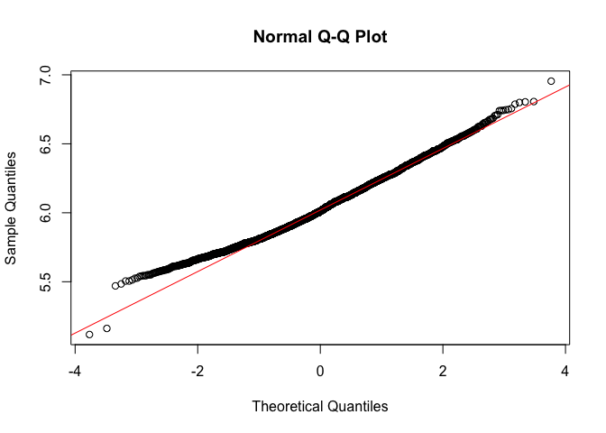
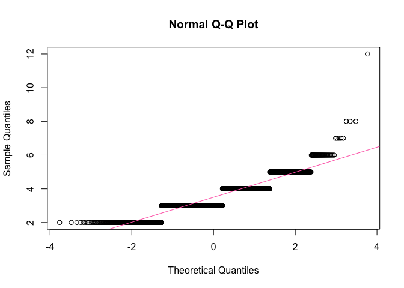
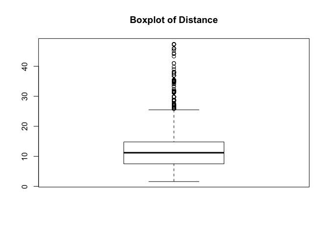
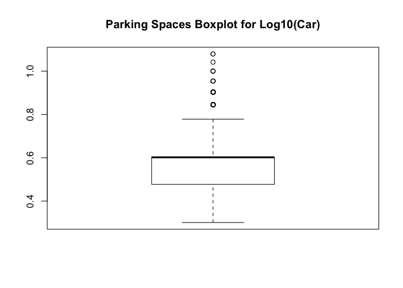
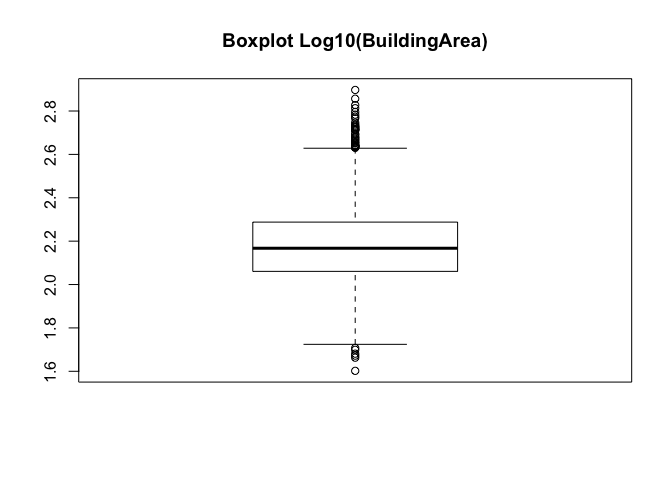
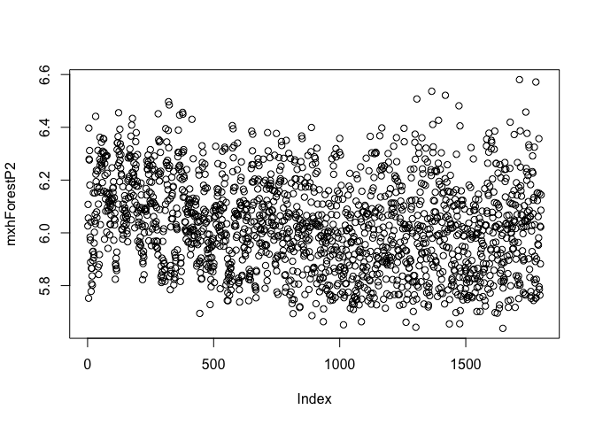

MelbourseHouseData
================

R Markdown
----------

This is an R Markdown document. Markdown is a simple formatting syntax for authoring HTML, PDF, and MS Word documents. For more details on using R Markdown see <http://rmarkdown.rstudio.com>.

When you click the **Knit** button a document will be generated that includes both content as well as the output of any embedded R code chunks within the document. You can embed an R code chunk like this:

``` r
melHouseStart <- read.csv("~/Desktop/Melbourne data project/melbourne-housing-market/Melbourne_housing_FULL.csv")


library(tidyverse)
```

    ## ── Attaching packages ────────────────────────────────────────────── tidyverse 1.2.1 ──

    ## ✔ ggplot2 2.2.1     ✔ purrr   0.2.4
    ## ✔ tibble  1.4.2     ✔ dplyr   0.7.4
    ## ✔ tidyr   0.8.0     ✔ stringr 1.2.0
    ## ✔ readr   1.1.1     ✔ forcats 0.3.0

    ## ── Conflicts ───────────────────────────────────────────────── tidyverse_conflicts() ──
    ## ✖ dplyr::filter() masks stats::filter()
    ## ✖ dplyr::lag()    masks stats::lag()

``` r
#----------------

melHouseStart <- as.tibble(melHouseStart)

# check the structure
str(melHouseStart)
```

    ## Classes 'tbl_df', 'tbl' and 'data.frame':    34857 obs. of  21 variables:
    ##  $ Suburb       : Factor w/ 351 levels "Abbotsford","Aberfeldie",..: 1 1 1 1 1 1 1 1 1 1 ...
    ##  $ Address      : Factor w/ 34009 levels "1 Abercrombie St",..: 29459 32513 15390 9769 25129 23201 27095 8333 26797 33959 ...
    ##  $ Rooms        : int  2 2 2 3 3 3 4 4 2 2 ...
    ##  $ Type         : Factor w/ 3 levels "h","t","u": 1 1 1 3 1 1 1 1 1 1 ...
    ##  $ Price        : int  NA 1480000 1035000 NA 1465000 850000 1600000 NA NA NA ...
    ##  $ Method       : Factor w/ 9 levels "PI","PN","S",..: 7 3 3 8 6 1 8 5 3 3 ...
    ##  $ SellerG      : Factor w/ 388 levels "@Realty","A",..: 171 34 34 313 34 34 246 246 34 76 ...
    ##  $ Date         : Factor w/ 78 levels "1/07/2017","10/02/2018",..: 59 61 64 64 65 65 66 70 70 70 ...
    ##  $ Distance     : Factor w/ 216 levels "#N/A","0","0.7",..: 82 82 82 82 82 82 82 82 82 82 ...
    ##  $ Postcode     : Factor w/ 212 levels "#N/A","3000",..: 55 55 55 55 55 55 55 55 55 55 ...
    ##  $ Bedroom2     : int  2 2 2 3 3 3 3 3 4 3 ...
    ##  $ Bathroom     : int  1 1 1 2 2 2 1 2 1 2 ...
    ##  $ Car          : int  1 1 0 1 0 1 2 2 2 1 ...
    ##  $ Landsize     : int  126 202 156 0 134 94 120 400 201 202 ...
    ##  $ BuildingArea : num  NA NA 79 NA 150 NA 142 220 NA NA ...
    ##  $ YearBuilt    : int  NA NA 1900 NA 1900 NA 2014 2006 1900 1900 ...
    ##  $ CouncilArea  : Factor w/ 34 levels "#N/A","Banyule City Council",..: 33 33 33 33 33 33 33 33 33 33 ...
    ##  $ Lattitude    : num  -37.8 -37.8 -37.8 -37.8 -37.8 ...
    ##  $ Longtitude   : num  145 145 145 145 145 ...
    ##  $ Regionname   : Factor w/ 9 levels "#N/A","Eastern Metropolitan",..: 4 4 4 4 4 4 4 4 4 4 ...
    ##  $ Propertycount: Factor w/ 343 levels "#N/A","1008",..: 191 191 191 191 191 191 191 191 191 191 ...

Including Plots
---------------

You can also embed plots, for example:

``` r
# Fix data types
# changing Distance to numeric, Propertycount to numeric, Date to date /d/m/y date format


melHouseStart$Distance <- as.numeric(as.character(melHouseStart$Distance))
```

    ## Warning: NAs introduced by coercion

``` r
melHouseStart$Propertycount <- as.numeric(as.character(melHouseStart$Propertycount))
```

    ## Warning: NAs introduced by coercion

``` r
melHouseStart$Date <- as.Date(melHouseStart$Date, "%d/%m/%Y")

#confirming the changes
glimpse(melHouseStart)
```

    ## Observations: 34,857
    ## Variables: 21
    ## $ Suburb        <fct> Abbotsford, Abbotsford, Abbotsford, Abbotsford, ...
    ## $ Address       <fct> 68 Studley St, 85 Turner St, 25 Bloomburg St, 18...
    ## $ Rooms         <int> 2, 2, 2, 3, 3, 3, 4, 4, 2, 2, 2, 3, 2, 4, 2, 3, ...
    ## $ Type          <fct> h, h, h, u, h, h, h, h, h, h, h, h, u, h, h, h, ...
    ## $ Price         <int> NA, 1480000, 1035000, NA, 1465000, 850000, 16000...
    ## $ Method        <fct> SS, S, S, VB, SP, PI, VB, SN, S, S, S, S, PI, W,...
    ## $ SellerG       <fct> Jellis, Biggin, Biggin, Rounds, Biggin, Biggin, ...
    ## $ Date          <date> 2016-09-03, 2016-12-03, 2016-02-04, 2016-02-04,...
    ## $ Distance      <dbl> 2.5, 2.5, 2.5, 2.5, 2.5, 2.5, 2.5, 2.5, 2.5, 2.5...
    ## $ Postcode      <fct> 3067, 3067, 3067, 3067, 3067, 3067, 3067, 3067, ...
    ## $ Bedroom2      <int> 2, 2, 2, 3, 3, 3, 3, 3, 4, 3, 2, 4, 2, 6, 2, NA,...
    ## $ Bathroom      <int> 1, 1, 1, 2, 2, 2, 1, 2, 1, 2, 1, 2, 2, 2, 1, NA,...
    ## $ Car           <int> 1, 1, 0, 1, 0, 1, 2, 2, 2, 1, 0, 0, 1, 0, 2, NA,...
    ## $ Landsize      <int> 126, 202, 156, 0, 134, 94, 120, 400, 201, 202, 1...
    ## $ BuildingArea  <dbl> NA, NA, 79, NA, 150, NA, 142, 220, NA, NA, NA, 2...
    ## $ YearBuilt     <int> NA, NA, 1900, NA, 1900, NA, 2014, 2006, 1900, 19...
    ## $ CouncilArea   <fct> Yarra City Council, Yarra City Council, Yarra Ci...
    ## $ Lattitude     <dbl> -37.8014, -37.7996, -37.8079, -37.8114, -37.8093...
    ## $ Longtitude    <dbl> 144.9958, 144.9984, 144.9934, 145.0116, 144.9944...
    ## $ Regionname    <fct> Northern Metropolitan, Northern Metropolitan, No...
    ## $ Propertycount <dbl> 4019, 4019, 4019, 4019, 4019, 4019, 4019, 4019, ...

Note that the `echo = FALSE` parameter was added to the code chunk to prevent printing of the R code that generated the plot.

``` r
# Adding month and year to the columns & correcting spelling on 

melHouse <- melHouseStart %>%
  mutate(Month = as.factor(strftime(Date, "%m")),
         Year = as.factor(strftime(Date, "%y"))) %>%
  rename("Lat" = "Lattitude", "Long" = "Longtitude", "Region" = "Regionname", "PropertyCount" = "Propertycount")

glimpse(melHouse) # verifying that the columns were created and renamed
```

    ## Observations: 34,857
    ## Variables: 23
    ## $ Suburb        <fct> Abbotsford, Abbotsford, Abbotsford, Abbotsford, ...
    ## $ Address       <fct> 68 Studley St, 85 Turner St, 25 Bloomburg St, 18...
    ## $ Rooms         <int> 2, 2, 2, 3, 3, 3, 4, 4, 2, 2, 2, 3, 2, 4, 2, 3, ...
    ## $ Type          <fct> h, h, h, u, h, h, h, h, h, h, h, h, u, h, h, h, ...
    ## $ Price         <int> NA, 1480000, 1035000, NA, 1465000, 850000, 16000...
    ## $ Method        <fct> SS, S, S, VB, SP, PI, VB, SN, S, S, S, S, PI, W,...
    ## $ SellerG       <fct> Jellis, Biggin, Biggin, Rounds, Biggin, Biggin, ...
    ## $ Date          <date> 2016-09-03, 2016-12-03, 2016-02-04, 2016-02-04,...
    ## $ Distance      <dbl> 2.5, 2.5, 2.5, 2.5, 2.5, 2.5, 2.5, 2.5, 2.5, 2.5...
    ## $ Postcode      <fct> 3067, 3067, 3067, 3067, 3067, 3067, 3067, 3067, ...
    ## $ Bedroom2      <int> 2, 2, 2, 3, 3, 3, 3, 3, 4, 3, 2, 4, 2, 6, 2, NA,...
    ## $ Bathroom      <int> 1, 1, 1, 2, 2, 2, 1, 2, 1, 2, 1, 2, 2, 2, 1, NA,...
    ## $ Car           <int> 1, 1, 0, 1, 0, 1, 2, 2, 2, 1, 0, 0, 1, 0, 2, NA,...
    ## $ Landsize      <int> 126, 202, 156, 0, 134, 94, 120, 400, 201, 202, 1...
    ## $ BuildingArea  <dbl> NA, NA, 79, NA, 150, NA, 142, 220, NA, NA, NA, 2...
    ## $ YearBuilt     <int> NA, NA, 1900, NA, 1900, NA, 2014, 2006, 1900, 19...
    ## $ CouncilArea   <fct> Yarra City Council, Yarra City Council, Yarra Ci...
    ## $ Lat           <dbl> -37.8014, -37.7996, -37.8079, -37.8114, -37.8093...
    ## $ Long          <dbl> 144.9958, 144.9984, 144.9934, 145.0116, 144.9944...
    ## $ Region        <fct> Northern Metropolitan, Northern Metropolitan, No...
    ## $ PropertyCount <dbl> 4019, 4019, 4019, 4019, 4019, 4019, 4019, 4019, ...
    ## $ Month         <fct> 09, 12, 02, 02, 03, 03, 06, 08, 08, 08, 05, 05, ...
    ## $ Year          <fct> 16, 16, 16, 16, 17, 17, 16, 16, 16, 16, 16, 16, ...

``` r
# Finding the descriptive statistics

summary(melHouse) # descriptive statistics with out standard deviation
```

    ##             Suburb                  Address          Rooms       
    ##  Reservoir     :  844   5 Charles St    :    6   Min.   : 1.000  
    ##  Bentleigh East:  583   25 William St   :    4   1st Qu.: 2.000  
    ##  Richmond      :  552   1 Bruce St      :    3   Median : 3.000  
    ##  Glen Iris     :  491   1 Daisy St      :    3   Mean   : 3.031  
    ##  Preston       :  485   1/1 Clarendon St:    3   3rd Qu.: 4.000  
    ##  Kew           :  467   1088 Toorak Rd  :    3   Max.   :16.000  
    ##  (Other)       :31435   (Other)         :34835                   
    ##  Type          Price              Method               SellerG     
    ##  h:23980   Min.   :   85000   S      :19744   Jellis       : 3359  
    ##  t: 3580   1st Qu.:  635000   SP     : 5095   Nelson       : 3236  
    ##  u: 7297   Median :  870000   PI     : 4850   Barry        : 3235  
    ##            Mean   : 1050173   VB     : 3108   hockingstuart: 2623  
    ##            3rd Qu.: 1295000   SN     : 1317   Marshall     : 2027  
    ##            Max.   :11200000   PN     :  308   Ray          : 1950  
    ##            NA's   :7610       (Other):  435   (Other)      :18427  
    ##       Date               Distance        Postcode        Bedroom2     
    ##  Min.   :2016-01-28   Min.   : 0.00   3073   :  844   Min.   : 0.000  
    ##  1st Qu.:2016-11-19   1st Qu.: 6.40   3046   :  638   1st Qu.: 2.000  
    ##  Median :2017-07-08   Median :10.30   3020   :  617   Median : 3.000  
    ##  Mean   :2017-05-23   Mean   :11.18   3121   :  612   Mean   : 3.085  
    ##  3rd Qu.:2017-10-28   3rd Qu.:14.00   3165   :  583   3rd Qu.: 4.000  
    ##  Max.   :2018-03-17   Max.   :48.10   3058   :  556   Max.   :30.000  
    ##                       NA's   :1       (Other):31007   NA's   :8217    
    ##     Bathroom           Car            Landsize         BuildingArea    
    ##  Min.   : 0.000   Min.   : 0.000   Min.   :     0.0   Min.   :    0.0  
    ##  1st Qu.: 1.000   1st Qu.: 1.000   1st Qu.:   224.0   1st Qu.:  102.0  
    ##  Median : 2.000   Median : 2.000   Median :   521.0   Median :  136.0  
    ##  Mean   : 1.625   Mean   : 1.729   Mean   :   593.6   Mean   :  160.3  
    ##  3rd Qu.: 2.000   3rd Qu.: 2.000   3rd Qu.:   670.0   3rd Qu.:  188.0  
    ##  Max.   :12.000   Max.   :26.000   Max.   :433014.0   Max.   :44515.0  
    ##  NA's   :8226     NA's   :8728     NA's   :11810      NA's   :21115    
    ##    YearBuilt                      CouncilArea         Lat        
    ##  Min.   :1196    Boroondara City Council: 3675   Min.   :-38.19  
    ##  1st Qu.:1940    Darebin City Council   : 2851   1st Qu.:-37.86  
    ##  Median :1970    Moreland City Council  : 2122   Median :-37.81  
    ##  Mean   :1965    Glen Eira City Council : 2006   Mean   :-37.81  
    ##  3rd Qu.:2000    Melbourne City Council : 1952   3rd Qu.:-37.75  
    ##  Max.   :2106    Banyule City Council   : 1861   Max.   :-37.39  
    ##  NA's   :19306   (Other)                :20390   NA's   :7976    
    ##       Long                              Region      PropertyCount  
    ##  Min.   :144.4   Southern Metropolitan     :11836   Min.   :   83  
    ##  1st Qu.:144.9   Northern Metropolitan     : 9557   1st Qu.: 4385  
    ##  Median :145.0   Western Metropolitan      : 6799   Median : 6763  
    ##  Mean   :145.0   Eastern Metropolitan      : 4377   Mean   : 7573  
    ##  3rd Qu.:145.1   South-Eastern Metropolitan: 1739   3rd Qu.:10412  
    ##  Max.   :145.5   Eastern Victoria          :  228   Max.   :21650  
    ##  NA's   :7976    (Other)                   :  321   NA's   :3      
    ##      Month       Year      
    ##  11     : 4387   16:10292  
    ##  09     : 4128   17:19852  
    ##  10     : 3900   18: 4713  
    ##  05     : 3416             
    ##  06     : 3175             
    ##  03     : 3094             
    ##  (Other):12757

``` r
# getting standard deviation for each variable

melHouseSD <- melHouse %>%
  summarise_all(funs(sd(., na.rm=TRUE)))
```

    ## Warning in var(if (is.vector(x) || is.factor(x)) x else as.double(x), na.rm = na.rm): Calling var(x) on a factor x is deprecated and will become an error.
    ##   Use something like 'all(duplicated(x)[-1L])' to test for a constant vector.

    ## Warning in var(if (is.vector(x) || is.factor(x)) x else as.double(x), na.rm = na.rm): Calling var(x) on a factor x is deprecated and will become an error.
    ##   Use something like 'all(duplicated(x)[-1L])' to test for a constant vector.

    ## Warning in var(if (is.vector(x) || is.factor(x)) x else as.double(x), na.rm = na.rm): Calling var(x) on a factor x is deprecated and will become an error.
    ##   Use something like 'all(duplicated(x)[-1L])' to test for a constant vector.

    ## Warning in var(if (is.vector(x) || is.factor(x)) x else as.double(x), na.rm = na.rm): Calling var(x) on a factor x is deprecated and will become an error.
    ##   Use something like 'all(duplicated(x)[-1L])' to test for a constant vector.

    ## Warning in var(if (is.vector(x) || is.factor(x)) x else as.double(x), na.rm = na.rm): Calling var(x) on a factor x is deprecated and will become an error.
    ##   Use something like 'all(duplicated(x)[-1L])' to test for a constant vector.

    ## Warning in var(if (is.vector(x) || is.factor(x)) x else as.double(x), na.rm = na.rm): Calling var(x) on a factor x is deprecated and will become an error.
    ##   Use something like 'all(duplicated(x)[-1L])' to test for a constant vector.

    ## Warning in var(if (is.vector(x) || is.factor(x)) x else as.double(x), na.rm = na.rm): Calling var(x) on a factor x is deprecated and will become an error.
    ##   Use something like 'all(duplicated(x)[-1L])' to test for a constant vector.

    ## Warning in var(if (is.vector(x) || is.factor(x)) x else as.double(x), na.rm = na.rm): Calling var(x) on a factor x is deprecated and will become an error.
    ##   Use something like 'all(duplicated(x)[-1L])' to test for a constant vector.

    ## Warning in var(if (is.vector(x) || is.factor(x)) x else as.double(x), na.rm = na.rm): Calling var(x) on a factor x is deprecated and will become an error.
    ##   Use something like 'all(duplicated(x)[-1L])' to test for a constant vector.

    ## Warning in var(if (is.vector(x) || is.factor(x)) x else as.double(x), na.rm = na.rm): Calling var(x) on a factor x is deprecated and will become an error.
    ##   Use something like 'all(duplicated(x)[-1L])' to test for a constant vector.

``` r
glimpse(melHouseSD) # getting a clean print out of the SD values
```

    ## Observations: 1
    ## Variables: 23
    ## $ Suburb        <dbl> 100.9935
    ## $ Address       <dbl> 9812.989
    ## $ Rooms         <dbl> 0.9699329
    ## $ Type          <dbl> 0.8174618
    ## $ Price         <dbl> 641467.1
    ## $ Method        <dbl> 1.988551
    ## $ SellerG       <dbl> 103.9511
    ## $ Date          <date> 1970-07-22
    ## $ Distance      <dbl> 6.788892
    ## $ Postcode      <dbl> 51.63254
    ## $ Bedroom2      <dbl> 0.9806897
    ## $ Bathroom      <dbl> 0.724212
    ## $ Car           <dbl> 1.010771
    ## $ Landsize      <dbl> 3398.842
    ## $ BuildingArea  <dbl> 401.2671
    ## $ YearBuilt     <dbl> 37.32818
    ## $ CouncilArea   <dbl> 9.936106
    ## $ Lat           <dbl> 0.0902789
    ## $ Long          <dbl> 0.1201688
    ## $ Region        <dbl> 2.051519
    ## $ PropertyCount <dbl> 4428.09
    ## $ Month         <dbl> 3.158799
    ## $ Year          <dbl> 0.6362919

``` r
# checking NA values

library(Amelia)
```

    ## Loading required package: Rcpp

    ## ## 
    ## ## Amelia II: Multiple Imputation
    ## ## (Version 1.7.4, built: 2015-12-05)
    ## ## Copyright (C) 2005-2018 James Honaker, Gary King and Matthew Blackwell
    ## ## Refer to http://gking.harvard.edu/amelia/ for more information
    ## ##

``` r
missmap(melHouse) # visualise missing values
```

    ## Warning in if (class(obj) == "amelia") {: the condition has length > 1 and
    ## only the first element will be used

    ## Warning: Unknown or uninitialised column: 'arguments'.

    ## Warning: Unknown or uninitialised column: 'arguments'.

    ## Warning: Unknown or uninitialised column: 'imputations'.


``` r
# Actual NA values followed by percentage of NA values

colSums(is.na(melHouse))
```

    ##        Suburb       Address         Rooms          Type         Price 
    ##             0             0             0             0          7610 
    ##        Method       SellerG          Date      Distance      Postcode 
    ##             0             0             0             1             0 
    ##      Bedroom2      Bathroom           Car      Landsize  BuildingArea 
    ##          8217          8226          8728         11810         21115 
    ##     YearBuilt   CouncilArea           Lat          Long        Region 
    ##         19306             0          7976          7976             0 
    ## PropertyCount         Month          Year 
    ##             3             0             0

``` r
# Finding the percentage of NA values per variable

colMeans(is.na(melHouse))*100
```

    ##        Suburb       Address         Rooms          Type         Price 
    ##   0.000000000   0.000000000   0.000000000   0.000000000  21.832056689 
    ##        Method       SellerG          Date      Distance      Postcode 
    ##   0.000000000   0.000000000   0.000000000   0.002868864   0.000000000 
    ##      Bedroom2      Bathroom           Car      Landsize  BuildingArea 
    ##  23.573457268  23.599277046  25.039446883  33.881286399  60.576067935 
    ##     YearBuilt   CouncilArea           Lat          Long        Region 
    ##  55.386292567   0.000000000  22.882060992  22.882060992   0.000000000 
    ## PropertyCount         Month          Year 
    ##   0.008606593   0.000000000   0.000000000

``` r
# inspecting rooms vs bedroom2 as Bedroom2 was scraped from a different source

melHouse %>%
  select(Rooms, Bedroom2)
```

    ## # A tibble: 34,857 x 2
    ##    Rooms Bedroom2
    ##    <int>    <int>
    ##  1     2        2
    ##  2     2        2
    ##  3     2        2
    ##  4     3        3
    ##  5     3        3
    ##  6     3        3
    ##  7     4        3
    ##  8     4        3
    ##  9     2        4
    ## 10     2        3
    ## # ... with 34,847 more rows

``` r
# inspecting the rows that are not equal to each other
melHouse %>%
  select(Rooms, Bedroom2) %>%
  filter(Rooms != Bedroom2)
```

    ## # A tibble: 948 x 2
    ##    Rooms Bedroom2
    ##    <int>    <int>
    ##  1     4        3
    ##  2     4        3
    ##  3     2        4
    ##  4     2        3
    ##  5     3        4
    ##  6     4        6
    ##  7     2        3
    ##  8     3        2
    ##  9     3        2
    ## 10     3        2
    ## # ... with 938 more rows

``` r
# getting a count of how many rows contain the same values
melHouse %>%
  select(Rooms, Bedroom2) %>%
  count(Rooms == Bedroom2)
```

    ## # A tibble: 3 x 2
    ##   `Rooms == Bedroom2`     n
    ##   <lgl>               <int>
    ## 1 F                     948
    ## 2 T                   25692
    ## 3 NA                   8217

``` r
# checking the correlation
cor.test(melHouse$Rooms, melHouse$Bedroom2)
```

    ## 
    ##  Pearson's product-moment correlation
    ## 
    ## data:  melHouse$Rooms and melHouse$Bedroom2
    ## t = 479.95, df = 26638, p-value < 2.2e-16
    ## alternative hypothesis: true correlation is not equal to 0
    ## 95 percent confidence interval:
    ##  0.9454956 0.9479854
    ## sample estimates:
    ##       cor 
    ## 0.9467546

``` r
# Drop Bedroom2 due to multicolinearity issues
```

``` r
(melExtended <- select(melHouse, - SellerG, - Lat, - Long, 
                           - Method, - Suburb, -Postcode, -Address, 
                           - PropertyCount, - CouncilArea, - Bedroom2, - Date))
```

    ## # A tibble: 34,857 x 12
    ##    Rooms Type    Price Distance Bathroom   Car Landsize BuildingArea
    ##    <int> <fct>   <int>    <dbl>    <int> <int>    <int>        <dbl>
    ##  1     2 h          NA     2.50        1     1      126         NA  
    ##  2     2 h     1480000     2.50        1     1      202         NA  
    ##  3     2 h     1035000     2.50        1     0      156         79.0
    ##  4     3 u          NA     2.50        2     1        0         NA  
    ##  5     3 h     1465000     2.50        2     0      134        150  
    ##  6     3 h      850000     2.50        2     1       94         NA  
    ##  7     4 h     1600000     2.50        1     2      120        142  
    ##  8     4 h          NA     2.50        2     2      400        220  
    ##  9     2 h          NA     2.50        1     2      201         NA  
    ## 10     2 h          NA     2.50        2     1      202         NA  
    ## # ... with 34,847 more rows, and 4 more variables: YearBuilt <int>,
    ## #   Region <fct>, Month <fct>, Year <fct>

``` r
# Getting rid of any NA values

melExtended <- na.omit(melExtended)
str(melExtended)
```

    ## Classes 'tbl_df', 'tbl' and 'data.frame':    8895 obs. of  12 variables:
    ##  $ Rooms       : int  2 3 4 3 2 2 3 2 2 3 ...
    ##  $ Type        : Factor w/ 3 levels "h","t","u": 1 1 1 1 1 1 1 3 1 1 ...
    ##  $ Price       : int  1035000 1465000 1600000 1876000 1636000 1097000 1350000 750000 1310000 1200000 ...
    ##  $ Distance    : num  2.5 2.5 2.5 2.5 2.5 2.5 2.5 2.5 2.5 2.5 ...
    ##  $ Bathroom    : int  1 2 1 2 1 1 2 2 1 2 ...
    ##  $ Car         : int  0 0 2 0 2 2 2 1 2 1 ...
    ##  $ Landsize    : int  156 134 120 245 256 220 214 0 238 113 ...
    ##  $ BuildingArea: num  79 150 142 210 107 75 190 94 97 110 ...
    ##  $ YearBuilt   : int  1900 1900 2014 1910 1890 1900 2005 2009 1890 1880 ...
    ##  $ Region      : Factor w/ 9 levels "#N/A","Eastern Metropolitan",..: 4 4 4 4 4 4 4 4 4 4 ...
    ##  $ Month       : Factor w/ 12 levels "01","02","03",..: 2 3 6 5 10 10 11 11 10 7 ...
    ##  $ Year        : Factor w/ 3 levels "16","17","18": 1 2 1 1 1 1 1 1 1 1 ...
    ##  - attr(*, "na.action")=Class 'omit'  Named int [1:25962] 1 2 4 6 8 9 10 11 13 14 ...
    ##   .. ..- attr(*, "names")= chr [1:25962] "1" "2" "4" "6" ...

``` r
summary(melExtended)
```

    ##      Rooms        Type         Price            Distance   
    ##  Min.   : 1.000   h:6628   Min.   : 131000   Min.   : 0.0  
    ##  1st Qu.: 2.000   t: 726   1st Qu.: 640500   1st Qu.: 6.4  
    ##  Median : 3.000   u:1541   Median : 900000   Median :10.2  
    ##  Mean   : 3.099            Mean   :1092524   Mean   :11.2  
    ##  3rd Qu.: 4.000            3rd Qu.:1345000   3rd Qu.:13.9  
    ##  Max.   :12.000            Max.   :9000000   Max.   :47.4  
    ##                                                            
    ##     Bathroom          Car            Landsize        BuildingArea   
    ##  Min.   :1.000   Min.   : 0.000   Min.   :    0.0   Min.   :   0.0  
    ##  1st Qu.:1.000   1st Qu.: 1.000   1st Qu.:  212.0   1st Qu.: 100.0  
    ##  Median :2.000   Median : 2.000   Median :  478.0   Median : 132.0  
    ##  Mean   :1.647   Mean   : 1.693   Mean   :  523.4   Mean   : 149.3  
    ##  3rd Qu.:2.000   3rd Qu.: 2.000   3rd Qu.:  652.0   3rd Qu.: 180.0  
    ##  Max.   :9.000   Max.   :10.000   Max.   :42800.0   Max.   :3112.0  
    ##                                                                     
    ##    YearBuilt                           Region         Month      Year     
    ##  Min.   :1196   Southern Metropolitan     :2707   07     : 996   16:3484  
    ##  1st Qu.:1945   Northern Metropolitan     :2618   05     : 984   17:4379  
    ##  Median :1970   Western Metropolitan      :2060   09     : 930   18:1032  
    ##  Mean   :1966   Eastern Metropolitan      : 982   11     : 913            
    ##  3rd Qu.:2000   South-Eastern Metropolitan: 372   06     : 882            
    ##  Max.   :2019   Northern Victoria         :  62   10     : 875            
    ##                 (Other)                   :  94   (Other):3315

``` r
# YearBuilt 2019 does not exist yet, might be a presale, but will be removed

# seeing how many homes claim to be built after 2018 & deleting anything greater than 2018

melExtended %>%
  select(YearBuilt) %>%
  filter(YearBuilt > 2018)
```

    ## # A tibble: 1 x 1
    ##   YearBuilt
    ##       <int>
    ## 1      2019

``` r
melExtended <- melExtended %>%
  filter(YearBuilt <= 2018)

summary(melExtended$YearBuilt) # veridying max is no greater than 2018
```

    ##    Min. 1st Qu.  Median    Mean 3rd Qu.    Max. 
    ##    1196    1945    1970    1966    2000    2018

``` r
# checking for homes built before 1800

melExtended %>%
  select(YearBuilt) %>%
  filter(YearBuilt < 1800)
```

    ## # A tibble: 1 x 1
    ##   YearBuilt
    ##       <int>
    ## 1      1196

``` r
# unsure of anything built in 1196, therefore it is being removed

melExtended <- melExtended %>%
  filter(YearBuilt > 1800)

summary(melExtended$YearBuilt)
```

    ##    Min. 1st Qu.  Median    Mean 3rd Qu.    Max. 
    ##    1830    1945    1970    1966    2000    2018

``` r
# Turning YearBuilt into a range of factors
# 1 = 1800 -1899
# 2 = 1900 - 1949
# 3 = 1950 - 1999
# 4 = 1999 - 2018


# adding column BuildYear for range of years built
melExtended$BuildYear  = 0

melExtended$BuildYear[melExtended$YearBuilt <= 1899] = 1
melExtended$BuildYear[melExtended$YearBuilt >= 1900 & melExtended$YearBuilt<= 1949] = 2
melExtended$BuildYear[melExtended$YearBuilt >= 1950 & melExtended$YearBuilt<= 1999] = 3
melExtended$BuildYear[melExtended$YearBuilt >= 2000 & melExtended$YearBuilt<= 2018] = 4

glimpse(melExtended) #verifying BuildYear is created
```

    ## Observations: 8,893
    ## Variables: 13
    ## $ Rooms        <int> 2, 3, 4, 3, 2, 2, 3, 2, 2, 3, 3, 2, 4, 2, 2, 2, 3...
    ## $ Type         <fct> h, h, h, h, h, h, h, u, h, h, h, h, h, u, h, h, h...
    ## $ Price        <int> 1035000, 1465000, 1600000, 1876000, 1636000, 1097...
    ## $ Distance     <dbl> 2.5, 2.5, 2.5, 2.5, 2.5, 2.5, 2.5, 2.5, 2.5, 2.5,...
    ## $ Bathroom     <int> 1, 2, 1, 2, 1, 1, 2, 2, 1, 2, 1, 1, 2, 1, 2, 1, 3...
    ## $ Car          <int> 0, 0, 2, 0, 2, 2, 2, 1, 2, 1, 1, 1, 2, 1, 1, 0, 1...
    ## $ Landsize     <int> 156, 134, 120, 245, 256, 220, 214, 0, 238, 113, 1...
    ## $ BuildingArea <dbl> 79, 150, 142, 210, 107, 75, 190, 94, 97, 110, 105...
    ## $ YearBuilt    <int> 1900, 1900, 2014, 1910, 1890, 1900, 2005, 2009, 1...
    ## $ Region       <fct> Northern Metropolitan, Northern Metropolitan, Nor...
    ## $ Month        <fct> 02, 03, 06, 05, 10, 10, 11, 11, 10, 07, 07, 09, 0...
    ## $ Year         <fct> 16, 17, 16, 16, 16, 16, 16, 16, 16, 16, 16, 16, 1...
    ## $ BuildYear    <dbl> 2, 2, 4, 2, 1, 2, 4, 4, 1, 1, 1, 3, 2, 3, 4, 2, 4...

``` r
# turn BuildYear into a factor
melExtended$BuildYear <- as.factor(melExtended$BuildYear)

# drop year built

melExtended <- melExtended %>%
  select(- YearBuilt)

glimpse(melExtended)
```

    ## Observations: 8,893
    ## Variables: 12
    ## $ Rooms        <int> 2, 3, 4, 3, 2, 2, 3, 2, 2, 3, 3, 2, 4, 2, 2, 2, 3...
    ## $ Type         <fct> h, h, h, h, h, h, h, u, h, h, h, h, h, u, h, h, h...
    ## $ Price        <int> 1035000, 1465000, 1600000, 1876000, 1636000, 1097...
    ## $ Distance     <dbl> 2.5, 2.5, 2.5, 2.5, 2.5, 2.5, 2.5, 2.5, 2.5, 2.5,...
    ## $ Bathroom     <int> 1, 2, 1, 2, 1, 1, 2, 2, 1, 2, 1, 1, 2, 1, 2, 1, 3...
    ## $ Car          <int> 0, 0, 2, 0, 2, 2, 2, 1, 2, 1, 1, 1, 2, 1, 1, 0, 1...
    ## $ Landsize     <int> 156, 134, 120, 245, 256, 220, 214, 0, 238, 113, 1...
    ## $ BuildingArea <dbl> 79, 150, 142, 210, 107, 75, 190, 94, 97, 110, 105...
    ## $ Region       <fct> Northern Metropolitan, Northern Metropolitan, Nor...
    ## $ Month        <fct> 02, 03, 06, 05, 10, 10, 11, 11, 10, 07, 07, 09, 0...
    ## $ Year         <fct> 16, 17, 16, 16, 16, 16, 16, 16, 16, 16, 16, 16, 1...
    ## $ BuildYear    <fct> 2, 2, 4, 2, 1, 2, 4, 4, 1, 1, 1, 3, 2, 3, 4, 2, 4...

``` r
# Eliminate any home where it is claimed it has more bathrooms than rooms

melExtended <- melExtended %>%
    filter(Bathroom < Rooms)

# Elinimate any home claiming to have 0 bathrooms or more and 5 (Reason to believe more than 5 is a building of units sold as a whole in most cases)
melExtended <- melExtended %>%
  filter(Bathroom > 0 & Bathroom <= 5)

# Eliminate any home with 0 Landsize
melExtended<- melExtended %>%
    filter(Landsize > 0)

# using this link https://www.smh.com.au/business/melbournes-apartment-sizes-face-more-scrutiny-20150414-1mkuj4.html
# setting a lowest value of 40, this 10 square meters lower than 2002 requirements

melExtended <- melExtended %>%
    filter(Landsize >= 40)


# eliminating any lot over 1500

melExtended <- melExtended %>%
  filter(Landsize < 1500)

melExtended <- melExtended %>%
  filter(BuildingArea >= 40) # same as above with relation to landsize

summary(melExtended)
```

    ##      Rooms        Type         Price            Distance    
    ##  Min.   : 2.000   h:6192   Min.   : 131000   Min.   : 0.00  
    ##  1st Qu.: 3.000   t: 519   1st Qu.: 702000   1st Qu.: 7.45  
    ##  Median : 3.000   u: 476   Median : 970000   Median :11.20  
    ##  Mean   : 3.302            Mean   :1154151   Mean   :12.02  
    ##  3rd Qu.: 4.000            3rd Qu.:1410000   3rd Qu.:14.70  
    ##  Max.   :12.000            Max.   :9000000   Max.   :47.40  
    ##                                                             
    ##     Bathroom          Car           Landsize       BuildingArea 
    ##  Min.   :1.000   Min.   : 0.00   Min.   :  43.0   Min.   :  40  
    ##  1st Qu.:1.000   1st Qu.: 1.00   1st Qu.: 300.0   1st Qu.: 111  
    ##  Median :2.000   Median : 2.00   Median : 536.0   Median : 141  
    ##  Mean   :1.656   Mean   : 1.78   Mean   : 502.3   Mean   : 161  
    ##  3rd Qu.:2.000   3rd Qu.: 2.00   3rd Qu.: 660.0   3rd Qu.: 189  
    ##  Max.   :5.000   Max.   :10.00   Max.   :1491.0   Max.   :3112  
    ##                                                                 
    ##                         Region         Month      Year      BuildYear
    ##  Northern Metropolitan     :2068   07     : 786   16:2587   1: 337   
    ##  Southern Metropolitan     :1949   05     : 773   17:3625   2:1687   
    ##  Western Metropolitan      :1775   10     : 772   18: 975   3:3592   
    ##  Eastern Metropolitan      : 902   09     : 762             4:1571   
    ##  South-Eastern Metropolitan: 350   11     : 734                      
    ##  Northern Victoria         :  58   06     : 670                      
    ##  (Other)                   :  85   (Other):2690

``` r
# Eliminate any property where building area is > land size

melExtended <- melExtended %>%
  filter(BuildingArea < Landsize)

summary(melExtended)
```

    ##      Rooms        Type         Price            Distance    
    ##  Min.   : 2.000   h:6036   Min.   : 131000   Min.   : 0.00  
    ##  1st Qu.: 3.000   t: 451   1st Qu.: 700000   1st Qu.: 7.50  
    ##  Median : 3.000   u: 454   Median : 965000   Median :11.20  
    ##  Mean   : 3.313            Mean   :1152489   Mean   :12.21  
    ##  3rd Qu.: 4.000            3rd Qu.:1405000   3rd Qu.:14.70  
    ##  Max.   :12.000            Max.   :9000000   Max.   :47.40  
    ##                                                             
    ##     Bathroom          Car            Landsize       BuildingArea  
    ##  Min.   :1.000   Min.   : 0.000   Min.   :  69.0   Min.   : 40.0  
    ##  1st Qu.:1.000   1st Qu.: 1.000   1st Qu.: 316.0   1st Qu.:111.0  
    ##  Median :2.000   Median : 2.000   Median : 544.0   Median :141.0  
    ##  Mean   :1.654   Mean   : 1.796   Mean   : 513.4   Mean   :158.4  
    ##  3rd Qu.:2.000   3rd Qu.: 2.000   3rd Qu.: 665.0   3rd Qu.:188.0  
    ##  Max.   :5.000   Max.   :10.000   Max.   :1491.0   Max.   :789.0  
    ##                                                                   
    ##                         Region         Month      Year      BuildYear
    ##  Northern Metropolitan     :1971   10     : 758   16:2461   1: 301   
    ##  Southern Metropolitan     :1857   07     : 756   17:3520   2:1659   
    ##  Western Metropolitan      :1729   05     : 744   18: 960   3:3512   
    ##  Eastern Metropolitan      : 895   09     : 732             4:1469   
    ##  South-Eastern Metropolitan: 347   11     : 703                      
    ##  Northern Victoria         :  58   06     : 643                      
    ##  (Other)                   :  84   (Other):2605

``` r
# remove categorical to get numeric only

melExCorr <- melExtended %>%
   select(- Type, - Month, - Year, - Region, - BuildYear)

library(corrplot)
```

    ## corrplot 0.84 loaded

``` r
corrplot(cor(melExCorr), method = 'number')
```


``` r
# Nothing as of now will be dropped as there is no correlation above 80
```

``` r
#separate into 4 groups, all, house, unit, townhouse (h/u/t) while dropping 'Type'


mxapartment <- melExtended %>%
   filter(Type == 'u') %>%
   select(- Type)

mxhouse <- melExtended %>%
    filter(Type == 'h') %>%
    select(- Type)

mxtownhouse <- melExtended %>%
    filter(Type == 't') %>%
    select( - Type)

# the forth group will remain using melExtended
```

``` r
# checking strength of variables & models adjusted R-squared prior to inspecting and normalizing variables

# note these models are useless if they do not meet the assumptions

set.seed(99)

(summary(lm(Price ~., data = mxapartment))) 
```

    ## 
    ## Call:
    ## lm(formula = Price ~ ., data = mxapartment)
    ## 
    ## Residuals:
    ##     Min      1Q  Median      3Q     Max 
    ## -397294  -76715   -7248   67302  624462 
    ## 
    ## Coefficients:
    ##                                    Estimate Std. Error t value Pr(>|t|)
    ## (Intercept)                       279215.41  142934.88   1.953  0.05142
    ## Rooms                              56092.54   19115.61   2.934  0.00352
    ## Distance                          -13390.91    1935.36  -6.919 1.68e-11
    ## Bathroom                           59918.60   24233.27   2.473  0.01380
    ## Car                                31828.64   11837.34   2.689  0.00745
    ## Landsize                            -111.95      21.65  -5.171 3.58e-07
    ## BuildingArea                        2551.77     339.17   7.524 3.19e-13
    ## RegionEastern Victoria             84422.22  142550.70   0.592  0.55401
    ## RegionNorthern Metropolitan      -167218.47   23411.27  -7.143 3.99e-12
    ## RegionNorthern Victoria          -134113.67  151266.18  -0.887  0.37579
    ## RegionSouth-Eastern Metropolitan   47225.34   47745.22   0.989  0.32317
    ## RegionSouthern Metropolitan        65917.96   21803.22   3.023  0.00265
    ## RegionWestern Metropolitan       -162822.63   24357.11  -6.685 7.27e-11
    ## Month03                            31551.81   39832.88   0.792  0.42874
    ## Month04                            66432.86   39397.51   1.686  0.09249
    ## Month05                            80574.28   34432.16   2.340  0.01974
    ## Month06                            74751.85   36471.45   2.050  0.04102
    ## Month07                            60798.95   35059.53   1.734  0.08361
    ## Month08                           121271.88   38184.91   3.176  0.00160
    ## Month09                           103316.51   39454.77   2.619  0.00914
    ## Month10                           126902.35   43002.71   2.951  0.00334
    ## Month11                           107904.33   39865.51   2.707  0.00707
    ## Month12                            83252.59   44679.66   1.863  0.06310
    ## Year17                             74522.27   16583.44   4.494 9.03e-06
    ## Year18                            106767.75   71700.14   1.489  0.13720
    ## BuildYear2                         14442.55  135080.83   0.107  0.91490
    ## BuildYear3                          5173.47  131865.06   0.039  0.96872
    ## BuildYear4                        -29316.93  132461.13  -0.221  0.82495
    ##                                     
    ## (Intercept)                      .  
    ## Rooms                            ** 
    ## Distance                         ***
    ## Bathroom                         *  
    ## Car                              ** 
    ## Landsize                         ***
    ## BuildingArea                     ***
    ## RegionEastern Victoria              
    ## RegionNorthern Metropolitan      ***
    ## RegionNorthern Victoria             
    ## RegionSouth-Eastern Metropolitan    
    ## RegionSouthern Metropolitan      ** 
    ## RegionWestern Metropolitan       ***
    ## Month03                             
    ## Month04                          .  
    ## Month05                          *  
    ## Month06                          *  
    ## Month07                          .  
    ## Month08                          ** 
    ## Month09                          ** 
    ## Month10                          ** 
    ## Month11                          ** 
    ## Month12                          .  
    ## Year17                           ***
    ## Year18                              
    ## BuildYear2                          
    ## BuildYear3                          
    ## BuildYear4                          
    ## ---
    ## Signif. codes:  0 '***' 0.001 '**' 0.01 '*' 0.05 '.' 0.1 ' ' 1
    ## 
    ## Residual standard error: 130500 on 426 degrees of freedom
    ## Multiple R-squared:  0.6058, Adjusted R-squared:  0.5809 
    ## F-statistic: 24.25 on 27 and 426 DF,  p-value: < 2.2e-16

``` r
(summary(lm(Price ~., data = mxtownhouse))) 
```

    ## 
    ## Call:
    ## lm(formula = Price ~ ., data = mxtownhouse)
    ## 
    ## Residuals:
    ##     Min      1Q  Median      3Q     Max 
    ## -659493 -114265  -13400   84159 1668719 
    ## 
    ## Coefficients:
    ##                                    Estimate Std. Error t value Pr(>|t|)
    ## (Intercept)                       801336.32  199208.17   4.023 6.81e-05
    ## Rooms                              -4600.37   25329.29  -0.182    0.856
    ## Distance                          -29263.42    2804.14 -10.436  < 2e-16
    ## Bathroom                           27332.74   26883.40   1.017    0.310
    ## Car                                 6153.15   20880.57   0.295    0.768
    ## Landsize                             -14.67      68.07  -0.216    0.829
    ## BuildingArea                        4426.99     334.35  13.241  < 2e-16
    ## RegionNorthern Metropolitan      -189723.37   36579.08  -5.187 3.32e-07
    ## RegionSouth-Eastern Metropolitan  314827.91   69966.95   4.500 8.80e-06
    ## RegionSouthern Metropolitan       184756.52   34577.73   5.343 1.49e-07
    ## RegionWestern Metropolitan       -250986.78   36818.70  -6.817 3.21e-11
    ## Month02                           -63126.62  112446.49  -0.561    0.575
    ## Month03                          -116009.57  113720.14  -1.020    0.308
    ## Month04                          -154257.26  125089.04  -1.233    0.218
    ## Month05                          -175232.73  119511.38  -1.466    0.143
    ## Month06                           -76541.40  120335.92  -0.636    0.525
    ## Month07                          -165779.10  118676.26  -1.397    0.163
    ## Month08                          -131327.49  120699.03  -1.088    0.277
    ## Month09                           -99881.92  121345.19  -0.823    0.411
    ## Month10                           -65330.02  122300.40  -0.534    0.593
    ## Month11                           -60967.73  122374.77  -0.498    0.619
    ## Month12                          -122782.14  130375.09  -0.942    0.347
    ## Year17                            104815.93   24494.72   4.279 2.32e-05
    ## Year18                             21764.18   54345.33   0.400    0.689
    ## BuildYear2                         92952.46  185447.37   0.501    0.616
    ## BuildYear3                       -162197.33  154237.17  -1.052    0.294
    ## BuildYear4                       -163312.01  154234.10  -1.059    0.290
    ##                                     
    ## (Intercept)                      ***
    ## Rooms                               
    ## Distance                         ***
    ## Bathroom                            
    ## Car                                 
    ## Landsize                            
    ## BuildingArea                     ***
    ## RegionNorthern Metropolitan      ***
    ## RegionSouth-Eastern Metropolitan ***
    ## RegionSouthern Metropolitan      ***
    ## RegionWestern Metropolitan       ***
    ## Month02                             
    ## Month03                             
    ## Month04                             
    ## Month05                             
    ## Month06                             
    ## Month07                             
    ## Month08                             
    ## Month09                             
    ## Month10                             
    ## Month11                             
    ## Month12                             
    ## Year17                           ***
    ## Year18                              
    ## BuildYear2                          
    ## BuildYear3                          
    ## BuildYear4                          
    ## ---
    ## Signif. codes:  0 '***' 0.001 '**' 0.01 '*' 0.05 '.' 0.1 ' ' 1
    ## 
    ## Residual standard error: 209600 on 424 degrees of freedom
    ## Multiple R-squared:  0.7227, Adjusted R-squared:  0.7057 
    ## F-statistic:  42.5 on 26 and 424 DF,  p-value: < 2.2e-16

``` r
(summary(lm(Price ~., data = mxhouse))) 
```

    ## 
    ## Call:
    ## lm(formula = Price ~ ., data = mxhouse)
    ## 
    ## Residuals:
    ##      Min       1Q   Median       3Q      Max 
    ## -1713538  -199232   -32554   143841  7935762 
    ## 
    ## Coefficients:
    ##                                   Estimate Std. Error t value Pr(>|t|)    
    ## (Intercept)                      1002242.4    55734.7  17.982  < 2e-16 ***
    ## Rooms                              13793.1     8886.9   1.552 0.120697    
    ## Distance                          -45842.3     1139.8 -40.221  < 2e-16 ***
    ## Bathroom                          106912.4    10780.6   9.917  < 2e-16 ***
    ## Car                                 8324.4     5269.5   1.580 0.114222    
    ## Landsize                             660.8       32.0  20.647  < 2e-16 ***
    ## BuildingArea                        2776.1      109.5  25.364  < 2e-16 ***
    ## RegionEastern Victoria            408269.2    62664.0   6.515 7.85e-11 ***
    ## RegionNorthern Metropolitan      -210193.6    17468.2 -12.033  < 2e-16 ***
    ## RegionNorthern Victoria           160020.1    54746.4   2.923 0.003480 ** 
    ## RegionSouth-Eastern Metropolitan  319803.5    27545.9  11.610  < 2e-16 ***
    ## RegionSouthern Metropolitan       383238.5    17861.6  21.456  < 2e-16 ***
    ## RegionWestern Metropolitan       -271063.2    17506.0 -15.484  < 2e-16 ***
    ## RegionWestern Victoria            120725.7    63474.2   1.902 0.057223 .  
    ## Month02                             1775.2    38896.4   0.046 0.963600    
    ## Month03                            41442.1    38623.7   1.073 0.283328    
    ## Month04                           -10870.4    49327.4  -0.220 0.825589    
    ## Month05                             5182.9    46422.2   0.112 0.911107    
    ## Month06                            -1463.3    46679.4  -0.031 0.974993    
    ## Month07                             -903.1    46229.0  -0.020 0.984415    
    ## Month08                            22192.2    46764.1   0.475 0.635120    
    ## Month09                            33781.2    46237.0   0.731 0.465046    
    ## Month10                            30293.5    45879.2   0.660 0.509094    
    ## Month11                            81351.4    46567.7   1.747 0.080697 .  
    ## Month12                            58637.5    48612.0   1.206 0.227774    
    ## Year17                            100534.7    12001.6   8.377  < 2e-16 ***
    ## Year18                            114749.9    29918.9   3.835 0.000127 ***
    ## BuildYear2                       -188158.4    24150.2  -7.791 7.77e-15 ***
    ## BuildYear3                       -468655.1    25491.5 -18.385  < 2e-16 ***
    ## BuildYear4                       -425665.6    27537.5 -15.458  < 2e-16 ***
    ## ---
    ## Signif. codes:  0 '***' 0.001 '**' 0.01 '*' 0.05 '.' 0.1 ' ' 1
    ## 
    ## Residual standard error: 376200 on 6006 degrees of freedom
    ## Multiple R-squared:  0.6947, Adjusted R-squared:  0.6932 
    ## F-statistic: 471.3 on 29 and 6006 DF,  p-value: < 2.2e-16

``` r
# applying Log10 to variables in need for houses only preparing for regressions
# loading packeages needed

library(caret)
```

    ## Loading required package: lattice

    ## 
    ## Attaching package: 'caret'

    ## The following object is masked from 'package:purrr':
    ## 
    ##     lift

``` r
library(psych)
```

    ## 
    ## Attaching package: 'psych'

    ## The following objects are masked from 'package:ggplot2':
    ## 
    ##     %+%, alpha

``` r
library(glmnet)
```

    ## Warning: package 'glmnet' was built under R version 3.4.4

    ## Loading required package: Matrix

    ## 
    ## Attaching package: 'Matrix'

    ## The following object is masked from 'package:tidyr':
    ## 
    ##     expand

    ## Loading required package: foreach

    ## 
    ## Attaching package: 'foreach'

    ## The following objects are masked from 'package:purrr':
    ## 
    ##     accumulate, when

    ## Loaded glmnet 2.0-16

``` r
library(mlbench)
```

``` r
# inpspecting Price variable and applying log10 transformation

# price
hist(mxhouse$Price, main = 'Histogram of Price', col = 'springgreen2')
```


``` r
#testing for normalit distribution using Anderson-Darling test, kurtosis, skewness
# using 0.05 for shapiro, and a range of -2,2 for kurtosis and skewness

library(e1071)
library(nortest)

#Anderson Darling Test
# Ho: Data follows the normal distribution
# Ha: Data does not follow the normal distribution

ad.test(mxhouse$Price)
```

    ## 
    ##  Anderson-Darling normality test
    ## 
    ## data:  mxhouse$Price
    ## A = 213.36, p-value < 2.2e-16

``` r
kurtosis(mxhouse$Price) # far exceeds the limits
```

    ## [1] 9.232772

``` r
skewness(mxhouse$Price) # exceeds limits
```

    ## [1] 2.191249

``` r
qqnorm(mxhouse$Price)
qqline(mxhouse$Price, col = 'red')
```


``` r
plot(mxhouse$Price)
```


``` r
# price

mxp1 <- log10(mxhouse$Price)
hist(mxp1, main = 'Histogram of Log10(Price)', xlab = 'Log10(Price)', col = 'springgreen4')
```


``` r
boxplot(mxp1, main = 'Boxplot of Log10(Price)')
```


``` r
ad.test(mxp1) # might be getting thrown off
```

    ## 
    ##  Anderson-Darling normality test
    ## 
    ## data:  mxp1
    ## A = 14.287, p-value < 2.2e-16

``` r
kurtosis(mxp1) # within range
```

    ## [1] -0.06884473

``` r
skewness(mxp1) # within range
```

    ## [1] 0.3362386

``` r
qqnorm(mxp1)
qqline(mxp1, col = 'red')
```



``` r
# price
plot(mxp1)
```


``` r
# Rooms
summary(mxhouse$Rooms) #min is 2 no need to add 1 for log10 if needed
```

    ##    Min. 1st Qu.  Median    Mean 3rd Qu.    Max. 
    ##   2.000   3.000   3.000   3.408   4.000  12.000

``` r
boxplot(mxhouse$Rooms, main = 'Boxplot of Rooms')
```


``` r
ad.test(mxhouse$Rooms)
```

    ## 
    ##  Anderson-Darling normality test
    ## 
    ## data:  mxhouse$Rooms
    ## A = 408.94, p-value < 2.2e-16

``` r
kurtosis(mxhouse$Rooms) # 2.6, just over range
```

    ## [1] 2.603679

``` r
skewness(mxhouse$Rooms) # within range
```

    ## [1] 0.677329

``` r
# mean and median are close, should be okay

hist(mxhouse$Rooms, main = 'Histogram of Rooms', col = 'hotpink') 
```


``` r
qqnorm(mxhouse$Rooms)
qqline(mxhouse$Rooms, col = 'hotpink')
```



``` r
mxr1 <- log10(mxhouse$Rooms)
hist(mxr1, main = 'Histogram of log10(Rooms)', xlab = 'log10 Rooms', col = 'orchid4') # not much of a difference
```


``` r
boxplot(mxr1, main = 'Boxplot of Log10(Rooms)')
```


``` r
ad.test(mxr1)
```

    ## 
    ##  Anderson-Darling normality test
    ## 
    ## data:  mxr1
    ## A = 417.22, p-value < 2.2e-16

``` r
kurtosis(mxr1) # fine, comes within range
```

    ## [1] 0.2129941

``` r
skewness(mxr1) # fine
```

    ## [1] -0.2396587

``` r
# will use original for now
```

``` r
# Distance

hist(mxhouse$Distance, main = 'Histogram of Distance', col = 'gray88') #skewed
```


``` r
boxplot(mxhouse$Distance, main = 'Boxplot of Distance')
```



``` r
ad.test(mxhouse$Distance)
```

    ## 
    ##  Anderson-Darling normality test
    ## 
    ## data:  mxhouse$Distance
    ## A = 138.41, p-value < 2.2e-16

``` r
kurtosis(mxhouse$Distance) #  exceeds the limits
```

    ## [1] 2.880139

``` r
skewness(mxhouse$Distance) # near limits
```

    ## [1] 1.44157

``` r
qqnorm(mxhouse$Distance)
qqline(mxhouse$Distance, col = 'gold')
```


``` r
# inspecting the summary of just the houses
summary(mxhouse)
```

    ##      Rooms            Price            Distance        Bathroom   
    ##  Min.   : 2.000   Min.   : 131000   Min.   : 1.60   Min.   :1.00  
    ##  1st Qu.: 3.000   1st Qu.: 740000   1st Qu.: 7.50   1st Qu.:1.00  
    ##  Median : 3.000   Median :1025000   Median :11.20   Median :2.00  
    ##  Mean   : 3.408   Mean   :1209252   Mean   :12.39   Mean   :1.68  
    ##  3rd Qu.: 4.000   3rd Qu.:1479250   3rd Qu.:14.80   3rd Qu.:2.00  
    ##  Max.   :12.000   Max.   :9000000   Max.   :47.40   Max.   :5.00  
    ##                                                                   
    ##       Car            Landsize     BuildingArea  
    ##  Min.   : 0.000   Min.   :  71   Min.   : 40.0  
    ##  1st Qu.: 1.000   1st Qu.: 382   1st Qu.:115.0  
    ##  Median : 2.000   Median : 570   Median :147.0  
    ##  Mean   : 1.849   Mean   : 542   Mean   :164.2  
    ##  3rd Qu.: 2.000   3rd Qu.: 674   3rd Qu.:194.0  
    ##  Max.   :10.000   Max.   :1491   Max.   :789.0  
    ##                                                 
    ##                         Region         Month      Year      BuildYear
    ##  Northern Metropolitan     :1737   10     : 701   16:2049   1: 298   
    ##  Western Metropolitan      :1542   09     : 653   17:3076   2:1637   
    ##  Southern Metropolitan     :1512   11     : 625   18: 911   3:3105   
    ##  Eastern Metropolitan      : 784   07     : 616             4: 996   
    ##  South-Eastern Metropolitan: 321   05     : 606                      
    ##  Northern Victoria         :  57   03     : 552                      
    ##  (Other)                   :  83   (Other):2283

``` r
mxd1 <- mxhouse$Distance # adding 1 so the log10 has no 0 values
mxd2 <- log10(mxd1)
hist(mxd2, main = 'Histogram of Log10(Distance)', col = 'gray56')
```


``` r
boxplot(mxd2, main = 'Boxplot of log10(Distance)')
```


``` r
ad.test(mxd2)
```

    ## 
    ##  Anderson-Darling normality test
    ## 
    ## data:  mxd2
    ## A = 17.281, p-value < 2.2e-16

``` r
kurtosis(mxd2) # within range
```

    ## [1] 0.2977717

``` r
skewness(mxd2) # within range
```

    ## [1] -0.3502761

``` r
qqnorm(mxd2) # improvement
qqline(mxd2, col = 'gold')
```


``` r
summary(mxd2) # ensuring there are no 0 values
```

    ##    Min. 1st Qu.  Median    Mean 3rd Qu.    Max. 
    ##  0.2041  0.8751  1.0492  1.0254  1.1703  1.6758

``` r
plot(mxd2)
```


``` r
# Bathrooms

hist(mxhouse$Bathroom, main = 'Histogram of Bathrooms', col = 'cornsilk2')
```


``` r
boxplot(mxhouse$Bathroom, main = 'Boxplot of Bathrooms')
```


``` r
ad.test(mxhouse$Bathroom)
```

    ## 
    ##  Anderson-Darling normality test
    ## 
    ## data:  mxhouse$Bathroom
    ## A = 597.68, p-value < 2.2e-16

``` r
kurtosis(mxhouse$Bathroom) # within range
```

    ## [1] 0.107494

``` r
skewness(mxhouse$Bathroom) # within range
```

    ## [1] 0.6701109

``` r
qqnorm(mxhouse$Bathroom)
qqline(mxhouse$Bathroom, col = 'sandybrown')
```


``` r
# Parking spots
hist(mxhouse$Car, main = 'Histogram for Parking Spaces', col = 'cyan') 
```


``` r
boxplot(mxhouse$Car, main = 'Boxplot for Parking Spaces')
```


``` r
ad.test(mxhouse$Car)
```

    ## 
    ##  Anderson-Darling normality test
    ## 
    ## data:  mxhouse$Car
    ## A = 400.63, p-value < 2.2e-16

``` r
kurtosis(mxhouse$Car) # far exceeds the limits
```

    ## [1] 4.350314

``` r
skewness(mxhouse$Car) # within range
```

    ## [1] 1.176194

``` r
qqnorm(mxhouse$Car)
qqline(mxhouse$Car, col = 'blue' )
```


``` r
mxc1 <- mxhouse$Car + 2
mxc2 <- log10(mxc1)
hist(mxc2, main = 'Histogram of Log10(Car)', xlab = 'Log10(Car)', col = 'lightsteelblue1') 
```


``` r
boxplot(mxc2, main = 'Parking Spaces Boxplot for Log10(Car)' )
```



``` r
ad.test(mxc2)
```

    ## 
    ##  Anderson-Darling normality test
    ## 
    ## data:  mxc2
    ## A = 396.67, p-value < 2.2e-16

``` r
kurtosis(mxc2) # within range
```

    ## [1] 1.052336

``` r
skewness(mxc2) # withing range
```

    ## [1] -0.215954

``` r
qqnorm(mxc2)
qqline(mxc2, col = 'blue')
```


``` r
# will use original for now
```

``` r
# LandSize

hist(mxhouse$Landsize, main = 'Histogram of Land Size', col = 'darkolivegreen3') 
```


``` r
boxplot(mxhouse$Landsize, main = 'Boxplot of Land Size')
```


``` r
ad.test(mxhouse$Landsize)
```

    ## 
    ##  Anderson-Darling normality test
    ## 
    ## data:  mxhouse$Landsize
    ## A = 33.964, p-value < 2.2e-16

``` r
kurtosis(mxhouse$Landsize) # within range
```

    ## [1] 0.4077239

``` r
skewness(mxhouse$Landsize) # within range
```

    ## [1] 0.2080139

``` r
qqnorm(mxhouse$Landsize)
qqline(mxhouse$Landsize, col = 'green')
```


``` r
#builing Area
hist(mxhouse$BuildingArea, main = 'Histogram of Building Area', col = 'firebrick2')
```


``` r
boxplot(mxhouse$BuildingArea, main = 'Boxplot of Building Area')
```


``` r
ad.test(mxhouse$BuildingArea)
```

    ## 
    ##  Anderson-Darling normality test
    ## 
    ## data:  mxhouse$BuildingArea
    ## A = 182.97, p-value < 2.2e-16

``` r
kurtosis(mxhouse$BuildingArea) # highly out of range
```

    ## [1] 5.795752

``` r
skewness(mxhouse$BuildingArea) # just within range
```

    ## [1] 1.803866

``` r
qqnorm(mxhouse$BuildingArea)
qqline(mxhouse$BuildingArea, col = 'orangered')
```


``` r
mxba <- log10(mxhouse$BuildingArea)
hist(mxba, main = 'Histogram Log10(BuildingArea)', col = 'tomato') 
```


``` r
boxplot(mxba, main = 'Boxplot Log10(BuildingArea)')
```



``` r
ad.test(mxba)
```

    ## 
    ##  Anderson-Darling normality test
    ## 
    ## data:  mxba
    ## A = 23.448, p-value < 2.2e-16

``` r
kurtosis(mxba) # within range
```

    ## [1] 0.09846228

``` r
skewness(mxba) # within range
```

    ## [1] 0.4400197

``` r
qqnorm(mxba)
qqline(mxba, col = 'orangered')
```


``` r
# will use this version for now
```

``` r
#correlation, scatterplots, histograms
pairs.panels(mxhouse) # prior to setting anything to log10
```


``` r
# pretesting simple regression with log10 variables, just to get an idea of the best fitting model
# before separating into folds for training and testing

set.seed(99)
# only price is logged

mxtrial <- lm(log10(Price) ~., data = mxhouse)
summary(mxtrial) 
```

    ## 
    ## Call:
    ## lm(formula = log10(Price) ~ ., data = mxhouse)
    ## 
    ## Residuals:
    ##      Min       1Q   Median       3Q      Max 
    ## -1.12939 -0.06280 -0.00349  0.05924  0.95895 
    ## 
    ## Coefficients:
    ##                                    Estimate Std. Error t value Pr(>|t|)
    ## (Intercept)                       6.055e+00  1.474e-02 410.669  < 2e-16
    ## Rooms                             1.033e-02  2.351e-03   4.392 1.14e-05
    ## Distance                         -1.768e-02  3.015e-04 -58.631  < 2e-16
    ## Bathroom                          3.169e-02  2.852e-03  11.111  < 2e-16
    ## Car                               4.020e-03  1.394e-03   2.884 0.003944
    ## Landsize                          1.957e-04  8.466e-06  23.114  < 2e-16
    ## BuildingArea                      7.274e-04  2.895e-05  25.124  < 2e-16
    ## RegionEastern Victoria            1.216e-01  1.658e-02   7.336 2.49e-13
    ## RegionNorthern Metropolitan      -1.185e-01  4.621e-03 -25.636  < 2e-16
    ## RegionNorthern Victoria          -1.129e-02  1.448e-02  -0.779 0.435838
    ## RegionSouth-Eastern Metropolitan  1.020e-01  7.287e-03  14.000  < 2e-16
    ## RegionSouthern Metropolitan       7.042e-02  4.725e-03  14.903  < 2e-16
    ## RegionWestern Metropolitan       -1.371e-01  4.631e-03 -29.594  < 2e-16
    ## RegionWestern Victoria           -9.919e-02  1.679e-02  -5.907 3.67e-09
    ## Month02                          -6.347e-03  1.029e-02  -0.617 0.537391
    ## Month03                           6.910e-03  1.022e-02   0.676 0.498892
    ## Month04                          -1.035e-02  1.305e-02  -0.793 0.427772
    ## Month05                          -9.726e-03  1.228e-02  -0.792 0.428405
    ## Month06                          -1.313e-02  1.235e-02  -1.063 0.287769
    ## Month07                          -2.000e-02  1.223e-02  -1.635 0.102044
    ## Month08                          -3.498e-03  1.237e-02  -0.283 0.777391
    ## Month09                           3.554e-03  1.223e-02   0.291 0.771428
    ## Month10                           1.063e-03  1.214e-02   0.088 0.930235
    ## Month11                           8.521e-03  1.232e-02   0.692 0.489164
    ## Month12                           6.626e-03  1.286e-02   0.515 0.606405
    ## Year17                            2.780e-02  3.175e-03   8.757  < 2e-16
    ## Year18                            2.706e-02  7.915e-03   3.419 0.000634
    ## BuildYear2                       -3.428e-02  6.389e-03  -5.366 8.36e-08
    ## BuildYear3                       -1.345e-01  6.744e-03 -19.950  < 2e-16
    ## BuildYear4                       -1.224e-01  7.285e-03 -16.797  < 2e-16
    ##                                     
    ## (Intercept)                      ***
    ## Rooms                            ***
    ## Distance                         ***
    ## Bathroom                         ***
    ## Car                              ** 
    ## Landsize                         ***
    ## BuildingArea                     ***
    ## RegionEastern Victoria           ***
    ## RegionNorthern Metropolitan      ***
    ## RegionNorthern Victoria             
    ## RegionSouth-Eastern Metropolitan ***
    ## RegionSouthern Metropolitan      ***
    ## RegionWestern Metropolitan       ***
    ## RegionWestern Victoria           ***
    ## Month02                             
    ## Month03                             
    ## Month04                             
    ## Month05                             
    ## Month06                             
    ## Month07                             
    ## Month08                             
    ## Month09                             
    ## Month10                             
    ## Month11                             
    ## Month12                             
    ## Year17                           ***
    ## Year18                           ***
    ## BuildYear2                       ***
    ## BuildYear3                       ***
    ## BuildYear4                       ***
    ## ---
    ## Signif. codes:  0 '***' 0.001 '**' 0.01 '*' 0.05 '.' 0.1 ' ' 1
    ## 
    ## Residual standard error: 0.09952 on 6006 degrees of freedom
    ## Multiple R-squared:  0.7818, Adjusted R-squared:  0.7808 
    ## F-statistic: 742.2 on 29 and 6006 DF,  p-value: < 2.2e-16

``` r
# using a log10 on Price and Distance

mxhdata <- mxhouse
mxhdata$Distance <- mxhouse$Distance 
mxhdata$Distance <- log10(mxhdata$Distance)

mxtrial2 <- lm(log10(Price) ~., data = mxhdata)
summary(mxtrial2) # improves on above model
```

    ## 
    ## Call:
    ## lm(formula = log10(Price) ~ ., data = mxhdata)
    ## 
    ## Residuals:
    ##      Min       1Q   Median       3Q      Max 
    ## -1.11325 -0.05895 -0.00141  0.05873  1.01179 
    ## 
    ## Coefficients:
    ##                                    Estimate Std. Error t value Pr(>|t|)
    ## (Intercept)                       6.278e+00  1.501e-02 418.153  < 2e-16
    ## Rooms                             1.295e-02  2.283e-03   5.671 1.48e-08
    ## Distance                         -5.086e-01  8.024e-03 -63.387  < 2e-16
    ## Bathroom                          2.846e-02  2.768e-03  10.280  < 2e-16
    ## Car                               6.598e-03  1.354e-03   4.874 1.12e-06
    ## Landsize                          2.419e-04  8.410e-06  28.763  < 2e-16
    ## BuildingArea                      7.093e-04  2.812e-05  25.227  < 2e-16
    ## RegionEastern Victoria           -4.305e-02  1.540e-02  -2.796  0.00518
    ## RegionNorthern Metropolitan      -1.299e-01  4.505e-03 -28.839  < 2e-16
    ## RegionNorthern Victoria          -1.371e-01  1.356e-02 -10.115  < 2e-16
    ## RegionSouth-Eastern Metropolitan  3.945e-02  6.701e-03   5.887 4.13e-09
    ## RegionSouthern Metropolitan       7.599e-02  4.573e-03  16.619  < 2e-16
    ## RegionWestern Metropolitan       -1.332e-01  4.486e-03 -29.699  < 2e-16
    ## RegionWestern Victoria           -2.109e-01  1.591e-02 -13.259  < 2e-16
    ## Month02                           4.645e-03  9.981e-03   0.465  0.64168
    ## Month03                           1.840e-02  9.910e-03   1.857  0.06335
    ## Month04                           5.674e-04  1.266e-02   0.045  0.96426
    ## Month05                          -6.133e-03  1.192e-02  -0.515  0.60689
    ## Month06                          -8.399e-03  1.199e-02  -0.701  0.48353
    ## Month07                          -1.726e-02  1.187e-02  -1.454  0.14596
    ## Month08                           1.693e-03  1.201e-02   0.141  0.88788
    ## Month09                           3.708e-03  1.187e-02   0.312  0.75478
    ## Month10                           3.503e-03  1.178e-02   0.297  0.76623
    ## Month11                           1.026e-02  1.196e-02   0.858  0.39113
    ## Month12                           6.896e-03  1.248e-02   0.553  0.58062
    ## Year17                            2.068e-02  3.059e-03   6.760 1.51e-11
    ## Year18                            1.297e-02  7.642e-03   1.697  0.08971
    ## BuildYear2                        9.668e-03  6.283e-03   1.539  0.12393
    ## BuildYear3                       -6.754e-02  6.836e-03  -9.880  < 2e-16
    ## BuildYear4                       -5.575e-02  7.423e-03  -7.511 6.75e-14
    ##                                     
    ## (Intercept)                      ***
    ## Rooms                            ***
    ## Distance                         ***
    ## Bathroom                         ***
    ## Car                              ***
    ## Landsize                         ***
    ## BuildingArea                     ***
    ## RegionEastern Victoria           ** 
    ## RegionNorthern Metropolitan      ***
    ## RegionNorthern Victoria          ***
    ## RegionSouth-Eastern Metropolitan ***
    ## RegionSouthern Metropolitan      ***
    ## RegionWestern Metropolitan       ***
    ## RegionWestern Victoria           ***
    ## Month02                             
    ## Month03                          .  
    ## Month04                             
    ## Month05                             
    ## Month06                             
    ## Month07                             
    ## Month08                             
    ## Month09                             
    ## Month10                             
    ## Month11                             
    ## Month12                             
    ## Year17                           ***
    ## Year18                           .  
    ## BuildYear2                          
    ## BuildYear3                       ***
    ## BuildYear4                       ***
    ## ---
    ## Signif. codes:  0 '***' 0.001 '**' 0.01 '*' 0.05 '.' 0.1 ' ' 1
    ## 
    ## Residual standard error: 0.0966 on 6006 degrees of freedom
    ## Multiple R-squared:  0.7945, Adjusted R-squared:  0.7935 
    ## F-statistic: 800.5 on 29 and 6006 DF,  p-value: < 2.2e-16

``` r
mxhdata2 <- mxhdata
mxhdata2$BuildingArea <- log10(mxhdata2$BuildingArea)

mxtrial2 <- lm(log10(Price)~., data = mxhdata2) #changing mxtrial2 from above
summary(mxtrial2)
```

    ## 
    ## Call:
    ## lm(formula = log10(Price) ~ ., data = mxhdata2)
    ## 
    ## Residuals:
    ##      Min       1Q   Median       3Q      Max 
    ## -1.11972 -0.05887 -0.00199  0.05836  1.01425 
    ## 
    ## Coefficients:
    ##                                    Estimate Std. Error t value Pr(>|t|)
    ## (Intercept)                       5.634e+00  2.691e-02 209.382  < 2e-16
    ## Rooms                             5.017e-03  2.315e-03   2.167   0.0303
    ## Distance                         -5.161e-01  7.860e-03 -65.657  < 2e-16
    ## Bathroom                          2.325e-02  2.751e-03   8.452  < 2e-16
    ## Car                               5.593e-03  1.334e-03   4.191 2.81e-05
    ## Landsize                          2.316e-04  8.304e-06  27.894  < 2e-16
    ## BuildingArea                      3.715e-01  1.278e-02  29.069  < 2e-16
    ## RegionEastern Victoria           -3.699e-02  1.516e-02  -2.440   0.0147
    ## RegionNorthern Metropolitan      -1.286e-01  4.436e-03 -28.998  < 2e-16
    ## RegionNorthern Victoria          -1.334e-01  1.335e-02  -9.989  < 2e-16
    ## RegionSouth-Eastern Metropolitan  4.018e-02  6.598e-03   6.089 1.21e-09
    ## RegionSouthern Metropolitan       7.459e-02  4.504e-03  16.562  < 2e-16
    ## RegionWestern Metropolitan       -1.342e-01  4.415e-03 -30.400  < 2e-16
    ## RegionWestern Victoria           -2.011e-01  1.568e-02 -12.829  < 2e-16
    ## Month02                           3.948e-03  9.828e-03   0.402   0.6879
    ## Month03                           1.758e-02  9.758e-03   1.802   0.0716
    ## Month04                           6.313e-04  1.247e-02   0.051   0.9596
    ## Month05                          -6.310e-03  1.174e-02  -0.538   0.5909
    ## Month06                          -8.783e-03  1.180e-02  -0.744   0.4568
    ## Month07                          -1.786e-02  1.169e-02  -1.528   0.1267
    ## Month08                          -6.795e-05  1.182e-02  -0.006   0.9954
    ## Month09                           1.964e-03  1.169e-02   0.168   0.8666
    ## Month10                           3.243e-03  1.160e-02   0.280   0.7798
    ## Month11                           1.021e-02  1.177e-02   0.867   0.3858
    ## Month12                           6.605e-03  1.229e-02   0.537   0.5910
    ## Year17                            2.057e-02  3.012e-03   6.829 9.37e-12
    ## Year18                            1.154e-02  7.525e-03   1.534   0.1251
    ## BuildYear2                        1.056e-02  6.187e-03   1.707   0.0878
    ## BuildYear3                       -6.338e-02  6.737e-03  -9.408  < 2e-16
    ## BuildYear4                       -5.598e-02  7.297e-03  -7.671 1.97e-14
    ##                                     
    ## (Intercept)                      ***
    ## Rooms                            *  
    ## Distance                         ***
    ## Bathroom                         ***
    ## Car                              ***
    ## Landsize                         ***
    ## BuildingArea                     ***
    ## RegionEastern Victoria           *  
    ## RegionNorthern Metropolitan      ***
    ## RegionNorthern Victoria          ***
    ## RegionSouth-Eastern Metropolitan ***
    ## RegionSouthern Metropolitan      ***
    ## RegionWestern Metropolitan       ***
    ## RegionWestern Victoria           ***
    ## Month02                             
    ## Month03                          .  
    ## Month04                             
    ## Month05                             
    ## Month06                             
    ## Month07                             
    ## Month08                             
    ## Month09                             
    ## Month10                             
    ## Month11                             
    ## Month12                             
    ## Year17                           ***
    ## Year18                              
    ## BuildYear2                       .  
    ## BuildYear3                       ***
    ## BuildYear4                       ***
    ## ---
    ## Signif. codes:  0 '***' 0.001 '**' 0.01 '*' 0.05 '.' 0.1 ' ' 1
    ## 
    ## Residual standard error: 0.09512 on 6006 degrees of freedom
    ## Multiple R-squared:  0.8007, Adjusted R-squared:  0.7998 
    ## F-statistic: 832.2 on 29 and 6006 DF,  p-value: < 2.2e-16

``` r
library(lmtest)
```

    ## Loading required package: zoo

    ## 
    ## Attaching package: 'zoo'

    ## The following objects are masked from 'package:base':
    ## 
    ##     as.Date, as.Date.numeric

``` r
bptest(mxtrial2) #very small
```

    ## 
    ##  studentized Breusch-Pagan test
    ## 
    ## data:  mxtrial2
    ## BP = 103.16, df = 29, p-value = 3.034e-10

``` r
plot(mxtrial2)
```


``` r
# Residuals vs Fitted
# does not seem to bad related to heteroscedasticity, contrary to the BPtest p-value
# will need to follow up on this
```

``` r
# testing selection methods

# backwards selection
summary(step(mxtrial2, direction = 'backward', trace = 0)) 
```

    ## 
    ## Call:
    ## lm(formula = log10(Price) ~ Rooms + Distance + Bathroom + Car + 
    ##     Landsize + BuildingArea + Region + Month + Year + BuildYear, 
    ##     data = mxhdata2)
    ## 
    ## Residuals:
    ##      Min       1Q   Median       3Q      Max 
    ## -1.11972 -0.05887 -0.00199  0.05836  1.01425 
    ## 
    ## Coefficients:
    ##                                    Estimate Std. Error t value Pr(>|t|)
    ## (Intercept)                       5.634e+00  2.691e-02 209.382  < 2e-16
    ## Rooms                             5.017e-03  2.315e-03   2.167   0.0303
    ## Distance                         -5.161e-01  7.860e-03 -65.657  < 2e-16
    ## Bathroom                          2.325e-02  2.751e-03   8.452  < 2e-16
    ## Car                               5.593e-03  1.334e-03   4.191 2.81e-05
    ## Landsize                          2.316e-04  8.304e-06  27.894  < 2e-16
    ## BuildingArea                      3.715e-01  1.278e-02  29.069  < 2e-16
    ## RegionEastern Victoria           -3.699e-02  1.516e-02  -2.440   0.0147
    ## RegionNorthern Metropolitan      -1.286e-01  4.436e-03 -28.998  < 2e-16
    ## RegionNorthern Victoria          -1.334e-01  1.335e-02  -9.989  < 2e-16
    ## RegionSouth-Eastern Metropolitan  4.018e-02  6.598e-03   6.089 1.21e-09
    ## RegionSouthern Metropolitan       7.459e-02  4.504e-03  16.562  < 2e-16
    ## RegionWestern Metropolitan       -1.342e-01  4.415e-03 -30.400  < 2e-16
    ## RegionWestern Victoria           -2.011e-01  1.568e-02 -12.829  < 2e-16
    ## Month02                           3.948e-03  9.828e-03   0.402   0.6879
    ## Month03                           1.758e-02  9.758e-03   1.802   0.0716
    ## Month04                           6.313e-04  1.247e-02   0.051   0.9596
    ## Month05                          -6.310e-03  1.174e-02  -0.538   0.5909
    ## Month06                          -8.783e-03  1.180e-02  -0.744   0.4568
    ## Month07                          -1.786e-02  1.169e-02  -1.528   0.1267
    ## Month08                          -6.795e-05  1.182e-02  -0.006   0.9954
    ## Month09                           1.964e-03  1.169e-02   0.168   0.8666
    ## Month10                           3.243e-03  1.160e-02   0.280   0.7798
    ## Month11                           1.021e-02  1.177e-02   0.867   0.3858
    ## Month12                           6.605e-03  1.229e-02   0.537   0.5910
    ## Year17                            2.057e-02  3.012e-03   6.829 9.37e-12
    ## Year18                            1.154e-02  7.525e-03   1.534   0.1251
    ## BuildYear2                        1.056e-02  6.187e-03   1.707   0.0878
    ## BuildYear3                       -6.338e-02  6.737e-03  -9.408  < 2e-16
    ## BuildYear4                       -5.598e-02  7.297e-03  -7.671 1.97e-14
    ##                                     
    ## (Intercept)                      ***
    ## Rooms                            *  
    ## Distance                         ***
    ## Bathroom                         ***
    ## Car                              ***
    ## Landsize                         ***
    ## BuildingArea                     ***
    ## RegionEastern Victoria           *  
    ## RegionNorthern Metropolitan      ***
    ## RegionNorthern Victoria          ***
    ## RegionSouth-Eastern Metropolitan ***
    ## RegionSouthern Metropolitan      ***
    ## RegionWestern Metropolitan       ***
    ## RegionWestern Victoria           ***
    ## Month02                             
    ## Month03                          .  
    ## Month04                             
    ## Month05                             
    ## Month06                             
    ## Month07                             
    ## Month08                             
    ## Month09                             
    ## Month10                             
    ## Month11                             
    ## Month12                             
    ## Year17                           ***
    ## Year18                              
    ## BuildYear2                       .  
    ## BuildYear3                       ***
    ## BuildYear4                       ***
    ## ---
    ## Signif. codes:  0 '***' 0.001 '**' 0.01 '*' 0.05 '.' 0.1 ' ' 1
    ## 
    ## Residual standard error: 0.09512 on 6006 degrees of freedom
    ## Multiple R-squared:  0.8007, Adjusted R-squared:  0.7998 
    ## F-statistic: 832.2 on 29 and 6006 DF,  p-value: < 2.2e-16

``` r
# forwards selection
summary(step(mxtrial2, direction = 'forward', trace = 0)) 
```

    ## 
    ## Call:
    ## lm(formula = log10(Price) ~ Rooms + Distance + Bathroom + Car + 
    ##     Landsize + BuildingArea + Region + Month + Year + BuildYear, 
    ##     data = mxhdata2)
    ## 
    ## Residuals:
    ##      Min       1Q   Median       3Q      Max 
    ## -1.11972 -0.05887 -0.00199  0.05836  1.01425 
    ## 
    ## Coefficients:
    ##                                    Estimate Std. Error t value Pr(>|t|)
    ## (Intercept)                       5.634e+00  2.691e-02 209.382  < 2e-16
    ## Rooms                             5.017e-03  2.315e-03   2.167   0.0303
    ## Distance                         -5.161e-01  7.860e-03 -65.657  < 2e-16
    ## Bathroom                          2.325e-02  2.751e-03   8.452  < 2e-16
    ## Car                               5.593e-03  1.334e-03   4.191 2.81e-05
    ## Landsize                          2.316e-04  8.304e-06  27.894  < 2e-16
    ## BuildingArea                      3.715e-01  1.278e-02  29.069  < 2e-16
    ## RegionEastern Victoria           -3.699e-02  1.516e-02  -2.440   0.0147
    ## RegionNorthern Metropolitan      -1.286e-01  4.436e-03 -28.998  < 2e-16
    ## RegionNorthern Victoria          -1.334e-01  1.335e-02  -9.989  < 2e-16
    ## RegionSouth-Eastern Metropolitan  4.018e-02  6.598e-03   6.089 1.21e-09
    ## RegionSouthern Metropolitan       7.459e-02  4.504e-03  16.562  < 2e-16
    ## RegionWestern Metropolitan       -1.342e-01  4.415e-03 -30.400  < 2e-16
    ## RegionWestern Victoria           -2.011e-01  1.568e-02 -12.829  < 2e-16
    ## Month02                           3.948e-03  9.828e-03   0.402   0.6879
    ## Month03                           1.758e-02  9.758e-03   1.802   0.0716
    ## Month04                           6.313e-04  1.247e-02   0.051   0.9596
    ## Month05                          -6.310e-03  1.174e-02  -0.538   0.5909
    ## Month06                          -8.783e-03  1.180e-02  -0.744   0.4568
    ## Month07                          -1.786e-02  1.169e-02  -1.528   0.1267
    ## Month08                          -6.795e-05  1.182e-02  -0.006   0.9954
    ## Month09                           1.964e-03  1.169e-02   0.168   0.8666
    ## Month10                           3.243e-03  1.160e-02   0.280   0.7798
    ## Month11                           1.021e-02  1.177e-02   0.867   0.3858
    ## Month12                           6.605e-03  1.229e-02   0.537   0.5910
    ## Year17                            2.057e-02  3.012e-03   6.829 9.37e-12
    ## Year18                            1.154e-02  7.525e-03   1.534   0.1251
    ## BuildYear2                        1.056e-02  6.187e-03   1.707   0.0878
    ## BuildYear3                       -6.338e-02  6.737e-03  -9.408  < 2e-16
    ## BuildYear4                       -5.598e-02  7.297e-03  -7.671 1.97e-14
    ##                                     
    ## (Intercept)                      ***
    ## Rooms                            *  
    ## Distance                         ***
    ## Bathroom                         ***
    ## Car                              ***
    ## Landsize                         ***
    ## BuildingArea                     ***
    ## RegionEastern Victoria           *  
    ## RegionNorthern Metropolitan      ***
    ## RegionNorthern Victoria          ***
    ## RegionSouth-Eastern Metropolitan ***
    ## RegionSouthern Metropolitan      ***
    ## RegionWestern Metropolitan       ***
    ## RegionWestern Victoria           ***
    ## Month02                             
    ## Month03                          .  
    ## Month04                             
    ## Month05                             
    ## Month06                             
    ## Month07                             
    ## Month08                             
    ## Month09                             
    ## Month10                             
    ## Month11                             
    ## Month12                             
    ## Year17                           ***
    ## Year18                              
    ## BuildYear2                       .  
    ## BuildYear3                       ***
    ## BuildYear4                       ***
    ## ---
    ## Signif. codes:  0 '***' 0.001 '**' 0.01 '*' 0.05 '.' 0.1 ' ' 1
    ## 
    ## Residual standard error: 0.09512 on 6006 degrees of freedom
    ## Multiple R-squared:  0.8007, Adjusted R-squared:  0.7998 
    ## F-statistic: 832.2 on 29 and 6006 DF,  p-value: < 2.2e-16

``` r
# stepwise selection (both)
summary(step(mxtrial2, direction = 'both', trace = 0))
```

    ## 
    ## Call:
    ## lm(formula = log10(Price) ~ Rooms + Distance + Bathroom + Car + 
    ##     Landsize + BuildingArea + Region + Month + Year + BuildYear, 
    ##     data = mxhdata2)
    ## 
    ## Residuals:
    ##      Min       1Q   Median       3Q      Max 
    ## -1.11972 -0.05887 -0.00199  0.05836  1.01425 
    ## 
    ## Coefficients:
    ##                                    Estimate Std. Error t value Pr(>|t|)
    ## (Intercept)                       5.634e+00  2.691e-02 209.382  < 2e-16
    ## Rooms                             5.017e-03  2.315e-03   2.167   0.0303
    ## Distance                         -5.161e-01  7.860e-03 -65.657  < 2e-16
    ## Bathroom                          2.325e-02  2.751e-03   8.452  < 2e-16
    ## Car                               5.593e-03  1.334e-03   4.191 2.81e-05
    ## Landsize                          2.316e-04  8.304e-06  27.894  < 2e-16
    ## BuildingArea                      3.715e-01  1.278e-02  29.069  < 2e-16
    ## RegionEastern Victoria           -3.699e-02  1.516e-02  -2.440   0.0147
    ## RegionNorthern Metropolitan      -1.286e-01  4.436e-03 -28.998  < 2e-16
    ## RegionNorthern Victoria          -1.334e-01  1.335e-02  -9.989  < 2e-16
    ## RegionSouth-Eastern Metropolitan  4.018e-02  6.598e-03   6.089 1.21e-09
    ## RegionSouthern Metropolitan       7.459e-02  4.504e-03  16.562  < 2e-16
    ## RegionWestern Metropolitan       -1.342e-01  4.415e-03 -30.400  < 2e-16
    ## RegionWestern Victoria           -2.011e-01  1.568e-02 -12.829  < 2e-16
    ## Month02                           3.948e-03  9.828e-03   0.402   0.6879
    ## Month03                           1.758e-02  9.758e-03   1.802   0.0716
    ## Month04                           6.313e-04  1.247e-02   0.051   0.9596
    ## Month05                          -6.310e-03  1.174e-02  -0.538   0.5909
    ## Month06                          -8.783e-03  1.180e-02  -0.744   0.4568
    ## Month07                          -1.786e-02  1.169e-02  -1.528   0.1267
    ## Month08                          -6.795e-05  1.182e-02  -0.006   0.9954
    ## Month09                           1.964e-03  1.169e-02   0.168   0.8666
    ## Month10                           3.243e-03  1.160e-02   0.280   0.7798
    ## Month11                           1.021e-02  1.177e-02   0.867   0.3858
    ## Month12                           6.605e-03  1.229e-02   0.537   0.5910
    ## Year17                            2.057e-02  3.012e-03   6.829 9.37e-12
    ## Year18                            1.154e-02  7.525e-03   1.534   0.1251
    ## BuildYear2                        1.056e-02  6.187e-03   1.707   0.0878
    ## BuildYear3                       -6.338e-02  6.737e-03  -9.408  < 2e-16
    ## BuildYear4                       -5.598e-02  7.297e-03  -7.671 1.97e-14
    ##                                     
    ## (Intercept)                      ***
    ## Rooms                            *  
    ## Distance                         ***
    ## Bathroom                         ***
    ## Car                              ***
    ## Landsize                         ***
    ## BuildingArea                     ***
    ## RegionEastern Victoria           *  
    ## RegionNorthern Metropolitan      ***
    ## RegionNorthern Victoria          ***
    ## RegionSouth-Eastern Metropolitan ***
    ## RegionSouthern Metropolitan      ***
    ## RegionWestern Metropolitan       ***
    ## RegionWestern Victoria           ***
    ## Month02                             
    ## Month03                          .  
    ## Month04                             
    ## Month05                             
    ## Month06                             
    ## Month07                             
    ## Month08                             
    ## Month09                             
    ## Month10                             
    ## Month11                             
    ## Month12                             
    ## Year17                           ***
    ## Year18                              
    ## BuildYear2                       .  
    ## BuildYear3                       ***
    ## BuildYear4                       ***
    ## ---
    ## Signif. codes:  0 '***' 0.001 '**' 0.01 '*' 0.05 '.' 0.1 ' ' 1
    ## 
    ## Residual standard error: 0.09512 on 6006 degrees of freedom
    ## Multiple R-squared:  0.8007, Adjusted R-squared:  0.7998 
    ## F-statistic: 832.2 on 29 and 6006 DF,  p-value: < 2.2e-16

``` r
# forward/backwards/stepwise all produce the same results
```

``` r
# Log10 of Price into data prior to setting training and testing sets

# log10 to Price

mxhdata2$Price <- log10(mxhdata2$Price)
glimpse(mxhdata2) # verifying it was logged
```

    ## Observations: 6,036
    ## Variables: 11
    ## $ Rooms        <int> 2, 3, 2, 2, 3, 2, 3, 3, 2, 4, 2, 3, 2, 2, 2, 2, 3...
    ## $ Price        <dbl> 6.014940, 6.273233, 6.213783, 6.040207, 6.130334,...
    ## $ Distance     <dbl> 0.397940, 0.397940, 0.397940, 0.397940, 0.397940,...
    ## $ Bathroom     <int> 1, 2, 1, 1, 2, 1, 2, 1, 1, 2, 1, 1, 1, 1, 1, 1, 1...
    ## $ Car          <int> 0, 0, 2, 2, 2, 2, 1, 1, 1, 2, 0, 1, 0, 0, 1, 1, 1...
    ## $ Landsize     <int> 156, 245, 256, 220, 214, 238, 113, 138, 150, 780,...
    ## $ BuildingArea <dbl> 1.897627, 2.322219, 2.029384, 1.875061, 2.278754,...
    ## $ Region       <fct> Northern Metropolitan, Northern Metropolitan, Nor...
    ## $ Month        <fct> 02, 05, 10, 10, 11, 10, 07, 07, 09, 03, 11, 02, 1...
    ## $ Year         <fct> 16, 16, 16, 16, 16, 16, 16, 16, 16, 17, 16, 17, 1...
    ## $ BuildYear    <fct> 2, 2, 1, 2, 4, 1, 1, 1, 3, 2, 2, 3, 2, 2, 2, 3, 3...

``` r
#correlation with log10 features

pairs.panels(mxhdata2, cex.cor = 2) # with log10 data, cex.cor =2 makes correlation #'s larger
```


``` r
# setting up training and test sets

set.seed(99)

# creating the index for the split to occur
mxIndex <- sample(2, nrow(mxhdata2), replace = T, prob = c(0.7, 0.3))


mxTrain <- mxhdata2[mxIndex == 1, ] # create training set, 70%
mxTest <- mxhdata2[mxIndex == 2, ] # create test set, 30%

library(caret)

# creating cross validation, 10 fold, ran 5 times
# control parameters

mxControls <- trainControl(method = 'repeatedcv', number = 10,  repeats = 5, verboseIter = F)
```

``` r
# Linear Regression

mxLinTrain <- train(Price ~., mxTrain, method = 'lm', trControl = mxControls)
```

    ## Warning in predict.lm(modelFit, newdata): prediction from a rank-deficient
    ## fit may be misleading

    ## Warning in predict.lm(modelFit, newdata): prediction from a rank-deficient
    ## fit may be misleading

    ## Warning in predict.lm(modelFit, newdata): prediction from a rank-deficient
    ## fit may be misleading

    ## Warning in predict.lm(modelFit, newdata): prediction from a rank-deficient
    ## fit may be misleading

    ## Warning in predict.lm(modelFit, newdata): prediction from a rank-deficient
    ## fit may be misleading

    ## Warning in predict.lm(modelFit, newdata): prediction from a rank-deficient
    ## fit may be misleading

    ## Warning in predict.lm(modelFit, newdata): prediction from a rank-deficient
    ## fit may be misleading

    ## Warning in predict.lm(modelFit, newdata): prediction from a rank-deficient
    ## fit may be misleading

    ## Warning in predict.lm(modelFit, newdata): prediction from a rank-deficient
    ## fit may be misleading

    ## Warning in predict.lm(modelFit, newdata): prediction from a rank-deficient
    ## fit may be misleading

    ## Warning in predict.lm(modelFit, newdata): prediction from a rank-deficient
    ## fit may be misleading

    ## Warning in predict.lm(modelFit, newdata): prediction from a rank-deficient
    ## fit may be misleading

    ## Warning in predict.lm(modelFit, newdata): prediction from a rank-deficient
    ## fit may be misleading

    ## Warning in predict.lm(modelFit, newdata): prediction from a rank-deficient
    ## fit may be misleading

    ## Warning in predict.lm(modelFit, newdata): prediction from a rank-deficient
    ## fit may be misleading

    ## Warning in predict.lm(modelFit, newdata): prediction from a rank-deficient
    ## fit may be misleading

    ## Warning in predict.lm(modelFit, newdata): prediction from a rank-deficient
    ## fit may be misleading

    ## Warning in predict.lm(modelFit, newdata): prediction from a rank-deficient
    ## fit may be misleading

    ## Warning in predict.lm(modelFit, newdata): prediction from a rank-deficient
    ## fit may be misleading

    ## Warning in predict.lm(modelFit, newdata): prediction from a rank-deficient
    ## fit may be misleading

    ## Warning in predict.lm(modelFit, newdata): prediction from a rank-deficient
    ## fit may be misleading

    ## Warning in predict.lm(modelFit, newdata): prediction from a rank-deficient
    ## fit may be misleading

    ## Warning in predict.lm(modelFit, newdata): prediction from a rank-deficient
    ## fit may be misleading

    ## Warning in predict.lm(modelFit, newdata): prediction from a rank-deficient
    ## fit may be misleading

    ## Warning in predict.lm(modelFit, newdata): prediction from a rank-deficient
    ## fit may be misleading

    ## Warning in predict.lm(modelFit, newdata): prediction from a rank-deficient
    ## fit may be misleading

    ## Warning in predict.lm(modelFit, newdata): prediction from a rank-deficient
    ## fit may be misleading

    ## Warning in predict.lm(modelFit, newdata): prediction from a rank-deficient
    ## fit may be misleading

    ## Warning in predict.lm(modelFit, newdata): prediction from a rank-deficient
    ## fit may be misleading

    ## Warning in predict.lm(modelFit, newdata): prediction from a rank-deficient
    ## fit may be misleading

    ## Warning in predict.lm(modelFit, newdata): prediction from a rank-deficient
    ## fit may be misleading

    ## Warning in predict.lm(modelFit, newdata): prediction from a rank-deficient
    ## fit may be misleading

    ## Warning in predict.lm(modelFit, newdata): prediction from a rank-deficient
    ## fit may be misleading

    ## Warning in predict.lm(modelFit, newdata): prediction from a rank-deficient
    ## fit may be misleading

    ## Warning in predict.lm(modelFit, newdata): prediction from a rank-deficient
    ## fit may be misleading

    ## Warning in predict.lm(modelFit, newdata): prediction from a rank-deficient
    ## fit may be misleading

    ## Warning in predict.lm(modelFit, newdata): prediction from a rank-deficient
    ## fit may be misleading

    ## Warning in predict.lm(modelFit, newdata): prediction from a rank-deficient
    ## fit may be misleading

    ## Warning in predict.lm(modelFit, newdata): prediction from a rank-deficient
    ## fit may be misleading

    ## Warning in predict.lm(modelFit, newdata): prediction from a rank-deficient
    ## fit may be misleading

    ## Warning in predict.lm(modelFit, newdata): prediction from a rank-deficient
    ## fit may be misleading

    ## Warning in predict.lm(modelFit, newdata): prediction from a rank-deficient
    ## fit may be misleading

    ## Warning in predict.lm(modelFit, newdata): prediction from a rank-deficient
    ## fit may be misleading

    ## Warning in predict.lm(modelFit, newdata): prediction from a rank-deficient
    ## fit may be misleading

    ## Warning in predict.lm(modelFit, newdata): prediction from a rank-deficient
    ## fit may be misleading

    ## Warning in predict.lm(modelFit, newdata): prediction from a rank-deficient
    ## fit may be misleading

    ## Warning in predict.lm(modelFit, newdata): prediction from a rank-deficient
    ## fit may be misleading

    ## Warning in predict.lm(modelFit, newdata): prediction from a rank-deficient
    ## fit may be misleading

    ## Warning in predict.lm(modelFit, newdata): prediction from a rank-deficient
    ## fit may be misleading

    ## Warning in predict.lm(modelFit, newdata): prediction from a rank-deficient
    ## fit may be misleading

``` r
mxLinTrain$results
```

    ##   intercept      RMSE  Rsquared        MAE      RMSESD RsquaredSD
    ## 1      TRUE 0.0930598 0.8109488 0.07135784 0.004930481 0.01876581
    ##        MAESD
    ## 1 0.00241552

``` r
summary(mxLinTrain)
```

    ## 
    ## Call:
    ## lm(formula = .outcome ~ ., data = dat)
    ## 
    ## Residuals:
    ##      Min       1Q   Median       3Q      Max 
    ## -0.87001 -0.05782 -0.00258  0.05801  1.01478 
    ## 
    ## Coefficients: (1 not defined because of singularities)
    ##                                      Estimate Std. Error t value Pr(>|t|)
    ## (Intercept)                         5.444e+00  3.535e-02 153.995  < 2e-16
    ## Rooms                               3.776e-03  2.697e-03   1.400 0.161589
    ## Distance                           -5.151e-01  9.061e-03 -56.844  < 2e-16
    ## Bathroom                            2.407e-02  3.226e-03   7.462 1.03e-13
    ## Car                                 6.828e-03  1.568e-03   4.354 1.37e-05
    ## Landsize                            2.307e-04  9.515e-06  24.243  < 2e-16
    ## BuildingArea                        3.719e-01  1.501e-02  24.779  < 2e-16
    ## `RegionEastern Metropolitan`        1.898e-01  1.772e-02  10.712  < 2e-16
    ## `RegionEastern Victoria`            1.513e-01  2.389e-02   6.335 2.63e-10
    ## `RegionNorthern Metropolitan`       6.420e-02  1.765e-02   3.638 0.000278
    ## `RegionNorthern Victoria`           6.315e-02  2.281e-02   2.769 0.005650
    ## `RegionSouth-Eastern Metropolitan`  2.332e-01  1.821e-02  12.806  < 2e-16
    ## `RegionSouthern Metropolitan`       2.713e-01  1.781e-02  15.237  < 2e-16
    ## `RegionWestern Metropolitan`        6.102e-02  1.764e-02   3.459 0.000547
    ## `RegionWestern Victoria`                   NA         NA      NA       NA
    ## Month02                            -1.780e-03  1.124e-02  -0.158 0.874215
    ## Month03                             1.533e-02  1.117e-02   1.372 0.170114
    ## Month04                            -4.038e-03  1.432e-02  -0.282 0.778020
    ## Month05                            -1.306e-02  1.352e-02  -0.966 0.334303
    ## Month06                            -1.843e-02  1.354e-02  -1.362 0.173427
    ## Month07                            -2.499e-02  1.343e-02  -1.860 0.062961
    ## Month08                            -2.377e-03  1.360e-02  -0.175 0.861307
    ## Month09                             1.318e-03  1.343e-02   0.098 0.921849
    ## Month10                            -1.846e-03  1.333e-02  -0.138 0.889872
    ## Month11                             2.098e-03  1.353e-02   0.155 0.876815
    ## Month12                             4.900e-03  1.414e-02   0.347 0.728954
    ## Year17                              2.390e-02  3.530e-03   6.771 1.46e-11
    ## Year18                              9.233e-03  8.758e-03   1.054 0.291854
    ## BuildYear2                          8.250e-03  7.208e-03   1.145 0.252460
    ## BuildYear3                         -6.293e-02  7.828e-03  -8.039 1.17e-15
    ## BuildYear4                         -5.933e-02  8.491e-03  -6.987 3.24e-12
    ##                                       
    ## (Intercept)                        ***
    ## Rooms                                 
    ## Distance                           ***
    ## Bathroom                           ***
    ## Car                                ***
    ## Landsize                           ***
    ## BuildingArea                       ***
    ## `RegionEastern Metropolitan`       ***
    ## `RegionEastern Victoria`           ***
    ## `RegionNorthern Metropolitan`      ***
    ## `RegionNorthern Victoria`          ** 
    ## `RegionSouth-Eastern Metropolitan` ***
    ## `RegionSouthern Metropolitan`      ***
    ## `RegionWestern Metropolitan`       ***
    ## `RegionWestern Victoria`              
    ## Month02                               
    ## Month03                               
    ## Month04                               
    ## Month05                               
    ## Month06                               
    ## Month07                            .  
    ## Month08                               
    ## Month09                               
    ## Month10                               
    ## Month11                               
    ## Month12                               
    ## Year17                             ***
    ## Year18                                
    ## BuildYear2                            
    ## BuildYear3                         ***
    ## BuildYear4                         ***
    ## ---
    ## Signif. codes:  0 '***' 0.001 '**' 0.01 '*' 0.05 '.' 0.1 ' ' 1
    ## 
    ## Residual standard error: 0.09281 on 4207 degrees of freedom
    ## Multiple R-squared:  0.8131, Adjusted R-squared:  0.8118 
    ## F-statistic: 630.9 on 29 and 4207 DF,  p-value: < 2.2e-16

``` r
plot(mxLinTrain$finalModel)
```


``` r
set.seed(99)


library(glmnet) 
# Setting up Ridge regression

mxhRidge <- train(Price ~., 
                  mxTrain, 
                  method = 'glmnet', 
                  tuneGrid = expand.grid(alpha = 0,
                                         lambda = seq(0.0001, 1, length = 5)),
                  trControl = mxControls)
```

``` r
plot(mxhRidge) # Showing RMSE responding to increase in Lambda values
```


``` r
print(mxhRidge)
```

    ## glmnet 
    ## 
    ## 4237 samples
    ##   10 predictor
    ## 
    ## No pre-processing
    ## Resampling: Cross-Validated (10 fold, repeated 5 times) 
    ## Summary of sample sizes: 3815, 3813, 3813, 3813, 3814, 3812, ... 
    ## Resampling results across tuning parameters:
    ## 
    ##   lambda    RMSE        Rsquared   MAE       
    ##   0.000100  0.09377737  0.8092500  0.07217242
    ##   0.250075  0.12647072  0.7575706  0.10067658
    ##   0.500050  0.14674366  0.7381653  0.11800173
    ##   0.750025  0.15949495  0.7281499  0.12886764
    ##   1.000000  0.16820168  0.7219403  0.13624551
    ## 
    ## Tuning parameter 'alpha' was held constant at a value of 0
    ## RMSE was used to select the optimal model using the smallest value.
    ## The final values used for the model were alpha = 0 and lambda = 1e-04.

``` r
# plot showing importance of variables for Ridge Regression

plot(varImp(mxhRidge, scale = F)) 
```


``` r
# Lasso Regression

set.seed(99)

mxhLasso <- train(Price ~., 
                         mxTrain, 
                         method = 'glmnet', 
                         tuneGrid = expand.grid(alpha = 1,
                                                lambda = seq(0.0001, 1, length = 5)),
                         trControl = mxControls)
```

    ## Warning in nominalTrainWorkflow(x = x, y = y, wts = weights, info =
    ## trainInfo, : There were missing values in resampled performance measures.

``` r
plot(mxhLasso) # lowest lambda is best for lasso as well
```


``` r
plot(varImp(mxhLasso, scale = F)) # importance level of variables for Lasso
```


``` r
plot(mxhLasso$finalModel, xvar = 'dev', label = T) # 3 variables explain 60%
```


``` r
# Elastic Net

set.seed(99)

mxhElastic <- train(Price ~., 
                         mxTrain, 
                         method = 'glmnet', 
                         tuneGrid = expand.grid(alpha = seq(0, 1, length =10),
                                                lambda = seq(0.0001, 1, length = 5)),
                         trControl = mxControls)
```

    ## Warning in nominalTrainWorkflow(x = x, y = y, wts = weights, info =
    ## trainInfo, : There were missing values in resampled performance measures.

``` r
# best fit for Lamba and Alpha graph

plot(mxhElastic) #lambda is coloured lines, alpha along bottom, run again with length 3 for alpha for clarity
```


``` r
mxhElastic$bestTune #finding optimal lambda & alpha values in a separate way
```

    ##    alpha lambda
    ## 46     1  1e-04

``` r
# Comparing models - MAE, RMSE, Rsquared

mxhModelList <- list(Linear = mxLinTrain, Ridge = mxhRidge, Lasso = mxhLasso, Elastic = mxhElastic)
mxhResample <- resamples(mxhModelList)
summary(mxhResample)
```

    ## 
    ## Call:
    ## summary.resamples(object = mxhResample)
    ## 
    ## Models: Linear, Ridge, Lasso, Elastic 
    ## Number of resamples: 50 
    ## 
    ## MAE 
    ##               Min.    1st Qu.     Median       Mean    3rd Qu.       Max.
    ## Linear  0.06546061 0.06983049 0.07116965 0.07135784 0.07307445 0.07580414
    ## Ridge   0.06462121 0.07040636 0.07216344 0.07217242 0.07409837 0.07739663
    ## Lasso   0.06379239 0.06971260 0.07155291 0.07137919 0.07332397 0.07642209
    ## Elastic 0.06379239 0.06971260 0.07155291 0.07137919 0.07332397 0.07642209
    ##         NA's
    ## Linear     0
    ## Ridge      0
    ## Lasso      0
    ## Elastic    0
    ## 
    ## RMSE 
    ##               Min.    1st Qu.     Median       Mean    3rd Qu.      Max.
    ## Linear  0.08221322 0.09008364 0.09252865 0.09305980 0.09554133 0.1023936
    ## Ridge   0.08242491 0.08992059 0.09289415 0.09377737 0.09650705 0.1111307
    ## Lasso   0.08154621 0.08891374 0.09237370 0.09301627 0.09541087 0.1094494
    ## Elastic 0.08154621 0.08891374 0.09237370 0.09301627 0.09541087 0.1094494
    ##         NA's
    ## Linear     0
    ## Ridge      0
    ## Lasso      0
    ## Elastic    0
    ## 
    ## Rsquared 
    ##              Min.   1st Qu.    Median      Mean   3rd Qu.      Max. NA's
    ## Linear  0.7706349 0.7990697 0.8114020 0.8109488 0.8250189 0.8625996    0
    ## Ridge   0.7401774 0.7916356 0.8133812 0.8092500 0.8262143 0.8540455    0
    ## Lasso   0.7460766 0.7928747 0.8146122 0.8109483 0.8265985 0.8542862    0
    ## Elastic 0.7460766 0.7928747 0.8146122 0.8109483 0.8265985 0.8542862    0

``` r
# Predictions with Training & Test data
# all models performed closely however the Lassoregression has lowest mean RMSE
# So Lasso will be used in the final, as RMSE is the main measure of this study


# training data prediction & RMSE
mxhP1 <- predict(mxhRidge, mxTrain)
sqrt(mean((mxTrain$Price - mxhP1)^2)) # RMSE - lower the better
```

    ## [1] 0.0932934

``` r
mxLassoP1 <- predict(mxhLasso, mxTrain)
sqrt(mean((mxTrain$Price - mxLassoP1)^2)) # RMSE - lower the better
```

    ## [1] 0.0924942

``` r
mxEP1 <- predict(mxhElastic, mxTrain)
sqrt(mean((mxTrain$Price - mxEP1)^2)) # RMSE - lower the better
```

    ## [1] 0.0924942

``` r
# Test data prediction RMSE
mxhP2 <- predict(mxhRidge, mxTest)
(RidgeRMSE <- sqrt(mean((mxTest$Price - mxhP2)^2)))
```

    ## [1] 0.1012231

``` r
mxLassoP2 <- predict(mxhLasso, mxTest)
(LassoRMSE <- sqrt(mean((mxTest$Price - mxLassoP2)^2))) # RMSE - lower the better
```

    ## [1] 0.1006141

``` r
mxEP2 <- predict(mxhElastic, mxTest)
(ElasticRMSE <- sqrt(mean((mxTest$Price - mxEP2)^2)))
```

    ## [1] 0.1006141

``` r
# The test model RMSE remains very close to the Training model
```

``` r
# comparing accuracy

#comparing actual vs predicted values 
mxhCompareRidge <- cbind(actual = mxTest$Price, mxhP2) # combining actual and predicted


mxhCompareLasso <- cbind(actual = mxTest$Price, mxLassoP2)

mxhCompareElastic <- cbind(actual = mxTest$Price, mxEP2)

head(mxhCompareLasso)
```

    ##     actual mxLassoP2
    ## 1 6.040207  6.102921
    ## 2 6.117271  6.137887
    ## 3 5.888179  6.024278
    ## 4 5.835691  5.788421
    ## 5 6.454845  6.445633
    ## 6 6.330414  6.343895

``` r
# calculating accuracy
mean (apply(mxhCompareRidge, 1, min)/apply(mxhCompareRidge, 1, max))
```

    ## [1] 0.9875523

``` r
mean (apply(mxhCompareLasso, 1, min)/apply(mxhCompareLasso, 1, max))
```

    ## [1] 0.9876884

``` r
mean (apply(mxhCompareElastic, 1, min)/apply(mxhCompareElastic, 1, max))
```

    ## [1] 0.9876884

``` r
# The models are very accurate
```

``` r
# For the Log10(Distance variable) the percent increase is computed as follows

# (Distance1/ Distance2) ^ Distance Coefficient
```

``` r
# Decision Tree

library(rpart)
set.seed(99)

mxhTree <- rpart(Price ~., data = mxTrain, method = "anova")
summary(mxhTree)
```

    ## Call:
    ## rpart(formula = Price ~ ., data = mxTrain, method = "anova")
    ##   n= 4237 
    ## 
    ##            CP nsplit rel error    xerror       xstd
    ## 1  0.35218454      0 1.0000000 1.0003934 0.02133683
    ## 2  0.11953131      1 0.6478155 0.6487783 0.01466377
    ## 3  0.08007613      2 0.5282841 0.5292705 0.01401461
    ## 4  0.05178242      3 0.4482080 0.4525456 0.01300739
    ## 5  0.02976331      4 0.3964256 0.4031104 0.01203606
    ## 6  0.02381745      5 0.3666623 0.3733985 0.01196628
    ## 7  0.02273861      6 0.3428448 0.3519311 0.01173932
    ## 8  0.01079031      7 0.3201062 0.3303076 0.01157581
    ## 9  0.01035073      8 0.3093159 0.3178937 0.01087770
    ## 10 0.01000000      9 0.2989652 0.3132149 0.01078573
    ## 
    ## Variable importance
    ##       Region     Distance BuildingArea    BuildYear     Landsize 
    ##           43           18           10            9            6 
    ##        Rooms     Bathroom         Year          Car 
    ##            6            4            2            1 
    ## 
    ## Node number 1: 4237 observations,    complexity param=0.3521845
    ##   mean=6.027546, MSE=0.04575049 
    ##   left son=2 (3203 obs) right son=3 (1034 obs)
    ##   Primary splits:
    ##       Region       splits as  -LLLLLRLL, improve=0.3521845, (0 missing)
    ##       Distance     < 1.075532  to the right, improve=0.2401122, (0 missing)
    ##       BuildingArea < 2.306424  to the left,  improve=0.1883054, (0 missing)
    ##       BuildYear    splits as  RRLL, improve=0.1683084, (0 missing)
    ##       Bathroom     < 2.5       to the left,  improve=0.1173545, (0 missing)
    ##   Surrogate splits:
    ##       BuildingArea < 2.487845  to the left,  agree=0.761, adj=0.022, (0 split)
    ##       Bathroom     < 3.5       to the left,  agree=0.759, adj=0.015, (0 split)
    ##       Landsize     < 1221.5    to the left,  agree=0.756, adj=0.002, (0 split)
    ## 
    ## Node number 2: 3203 observations,    complexity param=0.1195313
    ##   mean=5.955424, MSE=0.03007727 
    ##   left son=4 (2099 obs) right son=5 (1104 obs)
    ##   Primary splits:
    ##       Distance     < 0.9614146 to the right, improve=0.24051410, (0 missing)
    ##       BuildYear    splits as  RRLL, improve=0.17045810, (0 missing)
    ##       BuildingArea < 2.306424  to the left,  improve=0.10839430, (0 missing)
    ##       Bathroom     < 2.5       to the left,  improve=0.07643789, (0 missing)
    ##       Region       splits as  -RLLLL-LL, improve=0.06758654, (0 missing)
    ##   Surrogate splits:
    ##       BuildYear splits as  RRLL, agree=0.859, adj=0.590, (0 split)
    ##       Landsize  < 497.5     to the right, agree=0.769, adj=0.331, (0 split)
    ##       Rooms     < 2.5       to the right, agree=0.697, adj=0.121, (0 split)
    ##       Car       < 0.5       to the right, agree=0.687, adj=0.093, (0 split)
    ##       Year      splits as  RLL, agree=0.682, adj=0.079, (0 split)
    ## 
    ## Node number 3: 1034 observations,    complexity param=0.05178242
    ##   mean=6.250955, MSE=0.02827677 
    ##   left son=6 (650 obs) right son=7 (384 obs)
    ##   Primary splits:
    ##       BuildingArea < 2.304274  to the left,  improve=0.3433099, (0 missing)
    ##       Rooms        < 3.5       to the left,  improve=0.2687758, (0 missing)
    ##       Bathroom     < 1.5       to the left,  improve=0.1984727, (0 missing)
    ##       Distance     < 1.053061  to the right, improve=0.1760382, (0 missing)
    ##       Landsize     < 633.5     to the left,  improve=0.1450739, (0 missing)
    ##   Surrogate splits:
    ##       Rooms     < 3.5       to the left,  agree=0.812, adj=0.495, (0 split)
    ##       Bathroom  < 2.5       to the left,  agree=0.769, adj=0.378, (0 split)
    ##       BuildYear splits as  LLLR, agree=0.692, adj=0.172, (0 split)
    ##       Landsize  < 626.5     to the left,  agree=0.686, adj=0.154, (0 split)
    ##       Car       < 3.5       to the left,  agree=0.645, adj=0.044, (0 split)
    ## 
    ## Node number 4: 2099 observations,    complexity param=0.08007613
    ##   mean=5.893741, MSE=0.02472061 
    ##   left son=8 (1379 obs) right son=9 (720 obs)
    ##   Primary splits:
    ##       Region       splits as  -RLLLR-LL, improve=0.2991477, (0 missing)
    ##       BuildingArea < 2.368286  to the left,  improve=0.1582629, (0 missing)
    ##       Landsize     < 616.5     to the left,  improve=0.1341491, (0 missing)
    ##       Rooms        < 3.5       to the left,  improve=0.1154571, (0 missing)
    ##       Bathroom     < 2.5       to the left,  improve=0.1063181, (0 missing)
    ##   Surrogate splits:
    ##       Distance     < 1.315965  to the left,  agree=0.697, adj=0.115, (0 split)
    ##       Landsize     < 716.5     to the left,  agree=0.688, adj=0.092, (0 split)
    ##       Rooms        < 4.5       to the left,  agree=0.670, adj=0.038, (0 split)
    ##       Bathroom     < 2.5       to the left,  agree=0.669, adj=0.035, (0 split)
    ##       BuildingArea < 2.438542  to the left,  agree=0.663, adj=0.018, (0 split)
    ## 
    ## Node number 5: 1104 observations,    complexity param=0.02976331
    ##   mean=6.072701, MSE=0.01927393 
    ##   left son=10 (718 obs) right son=11 (386 obs)
    ##   Primary splits:
    ##       BuildingArea < 2.18041   to the left,  improve=0.27114160, (0 missing)
    ##       Bathroom     < 1.5       to the left,  improve=0.19412760, (0 missing)
    ##       Rooms        < 3.5       to the left,  improve=0.17440850, (0 missing)
    ##       Landsize     < 559.5     to the left,  improve=0.09608814, (0 missing)
    ##       Distance     < 0.76714   to the right, improve=0.03888154, (0 missing)
    ##   Surrogate splits:
    ##       Rooms     < 3.5       to the left,  agree=0.806, adj=0.446, (0 split)
    ##       Bathroom  < 1.5       to the left,  agree=0.791, adj=0.402, (0 split)
    ##       Landsize  < 557.5     to the left,  agree=0.697, adj=0.135, (0 split)
    ##       BuildYear splits as  LLLR, agree=0.697, adj=0.135, (0 split)
    ##       Car       < 2.5       to the left,  agree=0.665, adj=0.041, (0 split)
    ## 
    ## Node number 6: 650 observations,    complexity param=0.01079031
    ##   mean=6.175225, MSE=0.01812558 
    ##   left son=12 (214 obs) right son=13 (436 obs)
    ##   Primary splits:
    ##       Distance     < 1.053061  to the right, improve=0.17753460, (0 missing)
    ##       BuildingArea < 2.062578  to the left,  improve=0.16724940, (0 missing)
    ##       BuildYear    splits as  RRLL, improve=0.08685600, (0 missing)
    ##       Bathroom     < 1.5       to the left,  improve=0.07776526, (0 missing)
    ##       Rooms        < 3.5       to the left,  improve=0.07687937, (0 missing)
    ##   Surrogate splits:
    ##       BuildYear splits as  RRLR, agree=0.743, adj=0.220, (0 split)
    ##       Car       < 3.5       to the right, agree=0.674, adj=0.009, (0 split)
    ##       Landsize  < 519.5     to the right, agree=0.672, adj=0.005, (0 split)
    ## 
    ## Node number 7: 384 observations
    ##   mean=6.379143, MSE=0.01931978 
    ## 
    ## Node number 8: 1379 observations,    complexity param=0.02381745
    ##   mean=5.831603, MSE=0.01431812 
    ##   left son=16 (823 obs) right son=17 (556 obs)
    ##   Primary splits:
    ##       Distance     < 1.127093  to the right, improve=0.23382950, (0 missing)
    ##       BuildingArea < 2.388278  to the left,  improve=0.14889290, (0 missing)
    ##       Landsize     < 611.5     to the left,  improve=0.07485179, (0 missing)
    ##       Rooms        < 3.5       to the left,  improve=0.07225226, (0 missing)
    ##       Bathroom     < 2.5       to the left,  improve=0.07185204, (0 missing)
    ##   Surrogate splits:
    ##       Year      splits as  RLL, agree=0.711, adj=0.282, (0 split)
    ##       Month     splits as  LLLRRLLLLLLR, agree=0.632, adj=0.088, (0 split)
    ##       Bathroom  < 1.5       to the right, agree=0.628, adj=0.077, (0 split)
    ##       BuildYear splits as  -RLL, agree=0.623, adj=0.065, (0 split)
    ##       Rooms     < 2.5       to the right, agree=0.617, adj=0.050, (0 split)
    ## 
    ## Node number 9: 720 observations,    complexity param=0.02273861
    ##   mean=6.012752, MSE=0.02308546 
    ##   left son=18 (191 obs) right son=19 (529 obs)
    ##   Primary splits:
    ##       Distance     < 1.351189  to the right, improve=0.2651839, (0 missing)
    ##       BuildingArea < 2.311749  to the left,  improve=0.2078600, (0 missing)
    ##       Rooms        < 3.5       to the left,  improve=0.1563966, (0 missing)
    ##       Bathroom     < 2.5       to the left,  improve=0.1111801, (0 missing)
    ##       Landsize     < 645       to the left,  improve=0.1059716, (0 missing)
    ##   Surrogate splits:
    ##       Region       splits as  -R---L---, agree=0.767, adj=0.120, (0 split)
    ##       Month        splits as  LRRRRRRRRRRR, agree=0.740, adj=0.021, (0 split)
    ##       Car          < 6.5       to the right, agree=0.738, adj=0.010, (0 split)
    ##       BuildingArea < 2.708708  to the right, agree=0.736, adj=0.005, (0 split)
    ## 
    ## Node number 10: 718 observations
    ##   mean=6.019696, MSE=0.01193436 
    ## 
    ## Node number 11: 386 observations
    ##   mean=6.171295, MSE=0.01797949 
    ## 
    ## Node number 12: 214 observations
    ##   mean=6.094255, MSE=0.01295133 
    ## 
    ## Node number 13: 436 observations
    ##   mean=6.214967, MSE=0.01586788 
    ## 
    ## Node number 16: 823 observations
    ##   mean=5.784044, MSE=0.01008522 
    ## 
    ## Node number 17: 556 observations
    ##   mean=5.902, MSE=0.01227997 
    ## 
    ## Node number 18: 191 observations
    ##   mean=5.882539, MSE=0.01012514 
    ## 
    ## Node number 19: 529 observations,    complexity param=0.01035073
    ##   mean=6.059767, MSE=0.01943264 
    ##   left son=38 (390 obs) right son=39 (139 obs)
    ##   Primary splits:
    ##       BuildingArea < 2.321183  to the left,  improve=0.1951810, (0 missing)
    ##       Rooms        < 3.5       to the left,  improve=0.1624536, (0 missing)
    ##       Landsize     < 644.5     to the left,  improve=0.1210399, (0 missing)
    ##       Bathroom     < 1.5       to the left,  improve=0.1018465, (0 missing)
    ##       Distance     < 0.9931619 to the left,  improve=0.1000904, (0 missing)
    ##   Surrogate splits:
    ##       Bathroom  < 2.5       to the left,  agree=0.815, adj=0.295, (0 split)
    ##       Rooms     < 4.5       to the left,  agree=0.800, adj=0.237, (0 split)
    ##       BuildYear splits as  LLLR, agree=0.769, adj=0.122, (0 split)
    ##       Landsize  < 935.5     to the left,  agree=0.750, adj=0.050, (0 split)
    ## 
    ## Node number 38: 390 observations
    ##   mean=6.022999, MSE=0.01623623 
    ## 
    ## Node number 39: 139 observations
    ##   mean=6.162926, MSE=0.0139662

``` r
#RMSE for Decision Tree Training set

mxTreeP1 <- predict(mxhTree, mxTrain )
RMSE(mxTreeP1, mxTrain$Price)
```

    ## [1] 0.1169521

``` r
# done on test data

mxTreeP2 <- predict(mxhTree, mxTest )
(DtreeRMSE <-RMSE(mxTreeP2, mxTest$Price))
```

    ## [1] 0.1211253

``` r
# Using random forest

library(randomForest)
```

    ## Warning: package 'randomForest' was built under R version 3.4.4

    ## randomForest 4.6-14

    ## Type rfNews() to see new features/changes/bug fixes.

    ## 
    ## Attaching package: 'randomForest'

    ## The following object is masked from 'package:psych':
    ## 
    ##     outlier

    ## The following object is masked from 'package:dplyr':
    ## 
    ##     combine

    ## The following object is masked from 'package:ggplot2':
    ## 
    ##     margin

``` r
set.seed(99)

ForestTry <- randomForest(Price~., data = mxTrain)
attributes(ForestTry) # gives a list of attributes that can go after $
```

    ## $names
    ##  [1] "call"            "type"            "predicted"      
    ##  [4] "mse"             "rsq"             "oob.times"      
    ##  [7] "importance"      "importanceSD"    "localImportance"
    ## [10] "proximity"       "ntree"           "mtry"           
    ## [13] "forest"          "coefs"           "y"              
    ## [16] "test"            "inbag"           "terms"          
    ## 
    ## $class
    ## [1] "randomForest.formula" "randomForest"

``` r
ForestTry$importance # gives importance of each variable
```

    ##              IncNodePurity
    ## Rooms             6.855081
    ## Distance         45.613324
    ## Bathroom          8.269330
    ## Car               2.665486
    ## Landsize         13.046066
    ## BuildingArea     31.603739
    ## Region           57.371389
    ## Month             7.898728
    ## Year              1.926124
    ## BuildYear        13.563744

``` r
ForestTry$type # regression
```

    ## [1] "regression"

``` r
plot(ForestTry) # graph on error as it reduces and becomes constant for number of trees
```


``` r
# histogram of the number of nodes per tree
hist(treesize(ForestTry),
     main = '# of Nodes per Tree',
     col = 'coral')
```


``` r
# roughly 100 trees with 1390 nodes
```

``` r
# graphical display of ForestTry$importance
varImpPlot(ForestTry, main = 'Variable Importance', col = 'darkmagenta') 
```


``` r
# Number of times a variable appeared in random forest, printed in relation to the variable column number
varUsed(ForestTry)
```

    ##  [1]  32748 113242  25517  53084 123544 121794  36510 110268  38929  29708

``` r
# print out of ForestTry and results
ForestTry
```

    ## 
    ## Call:
    ##  randomForest(formula = Price ~ ., data = mxTrain) 
    ##                Type of random forest: regression
    ##                      Number of trees: 500
    ## No. of variables tried at each split: 3
    ## 
    ##           Mean of squared residuals: 0.007302776
    ##                     % Var explained: 84.04

``` r
# Predictino for RMSE on Train data

PreTry <- predict(ForestTry, mxTrain) # default
(RMSE(PreTry, mxTrain$Price))       # default
```

    ## [1] 0.04118538

``` r
# prediction RMSE for Test data

PreTest <- predict(ForestTry, mxTest)  
(RMSE(PreTest, mxTest$Price))
```

    ## [1] 0.09031465

``` r
# attempting to tune the Random Forest, finding best mtry and oob error

tuneForest<- tuneRF(y = mxTrain$Price, x = mxTrain[,-1], 
                    mtryStart = 3, #using default, same as above to start
                    ntreeTry = 300, # on plot error seems to stabilize a 300
                    stepFactor = 1,
                    improve = 0.05,
                    trace = T,
                    plot = T,
                    doBest = T)
```

    ## mtry = 3  OOB error = 0.0005752959 
    ## Searching left ...
    ## Searching right ...


``` r
MxhForest <- randomForest(Price ~., data = mxTrain,
                          ntree = 500,
                           # default for regression
                          importance = T)

MxhForest
```

    ## 
    ## Call:
    ##  randomForest(formula = Price ~ ., data = mxTrain, ntree = 500,      importance = T) 
    ##                Type of random forest: regression
    ##                      Number of trees: 500
    ## No. of variables tried at each split: 3
    ## 
    ##           Mean of squared residuals: 0.007329011
    ##                     % Var explained: 83.98

``` r
plot(MxhForest)
```


``` r
# getting RMSE for training data

mxhForestP1 <- predict(MxhForest, mxTrain)

plot(mxhForestP1)
```


``` r
# RMSE for training data

RMSE(mxhForestP1, mxTrain$Price)
```

    ## [1] 0.04120562

``` r
# plot for Test data

mxhForestP2 <- predict(MxhForest, mxTest)
plot(mxhForestP2)
```



``` r
# RMSE for Test data
(ForestRMSE <-RMSE(mxhForestP2, mxTest$Price))
```

    ## [1] 0.09062684

``` r
#Comparison of RMSE by models


RidgeRMSE
```

    ## [1] 0.1012231

``` r
LassoRMSE
```

    ## [1] 0.1006141

``` r
ElasticRMSE
```

    ## [1] 0.1006141

``` r
DtreeRMSE
```

    ## [1] 0.1211253

``` r
ForestRMSE # the best RMSE and preferred model with the above normality issues for the parametric regressions
```

    ## [1] 0.09062684
